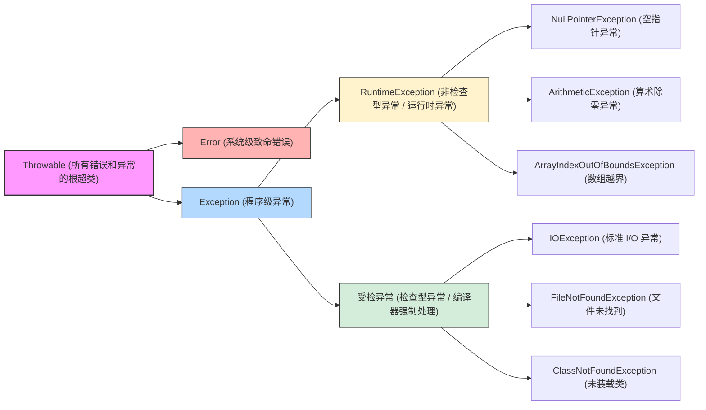
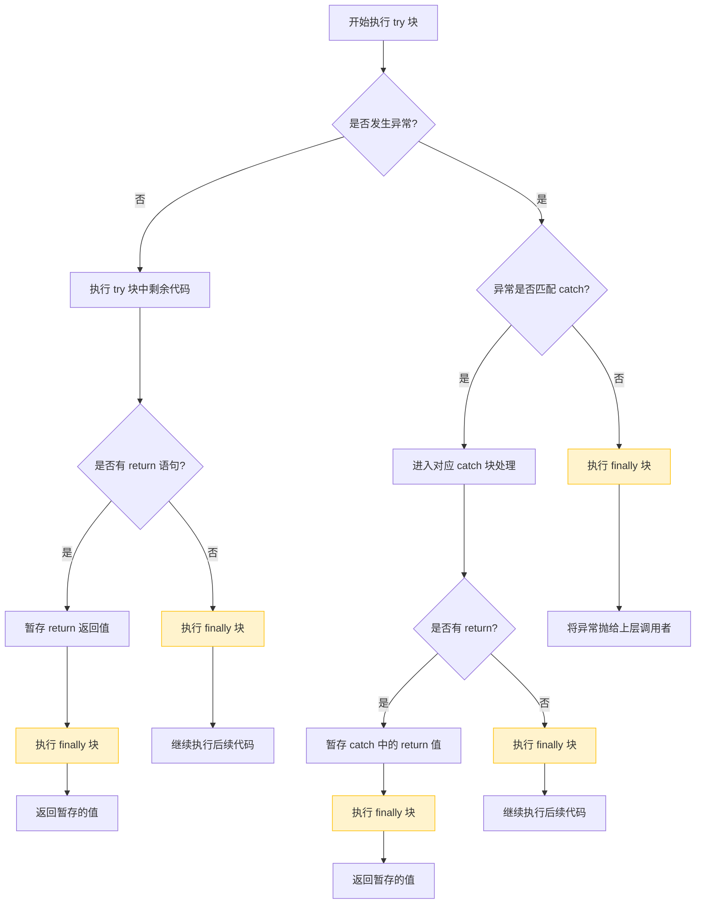
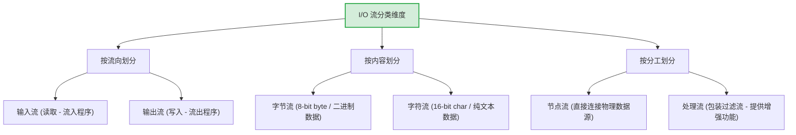

# Java复习通关冲刺宝典（合订本）

## 前言与多端显示指南

本冲刺宝典为 Java 面向对象程序设计课程复习合订本，全面收录了第一章至第五章的全部重点概念、秒杀考卡与综合设计题。

> [!IMPORTANT]
> **💡 备考黄金建议：强烈推荐直接使用 Typora 或 Obsidian 阅读本 Markdown (.md) 源码文档！**
> 
> * **【黄金推荐】直接阅读核心要点原文件**：
>   * 为了帮您获得 100% 完美的公式高精度渲染与最极致的排版视觉，**强烈推荐您直接在原生 Markdown 编辑器中查看本 `.md` 文档**！本宝典专为 Markdown 原生高精渲染深度重构，能为您提供极高信息密度且最流畅的备考体验。
> * **如何开启完美高精公式渲染**：
>   * **Typora**：请在「偏好设置」->「Markdown」->「Markdown 扩展语法」中勾选**「内联公式」**，即可瞬间获得高保真极精美数学公式显示。
>   * **Obsidian**：原生 100% 完美支持本宝典的所有高阶公式排版、流程图 and 高精插图。
>   * **VS Code**：推荐安装 `Markdown All in One` 和 `Markdown Preview Enhanced` 插件以获得完美排版。

---

## Java复习冲刺宝典：第一章 Java语言基础知识

### 🚨 核心要点：第一章核心要点卡片 🚨

| 核心考点与语法要素 | 标准代数与Java代码格式 | 极速解题核心步骤与口诀 | 易错避坑与常规雷区 |
| :--- | :--- | :--- | :--- |
| **Java 标识符命名规则** | 首字符：字母、`_` 或 `$`<br>后续字符：首字符条件 + 数字 | **“字母下划美元符，<br>数字千万莫开头”**：<br>不能使用Java保留关键字，大小写敏感。 | ⚠️ **避坑指南**：Java中可以使用美元符号 `$` 作为标识符的开头或中间，但在考试中千万别把带有 `$` 的变量误判为非法！ |
| **数值类型自动提升** | `byte`, `short`, `char` 参与运算时，会自动提升为 `int`。 | **“小类型相加，皆化为 int”**：<br>例如 `byte a=1, b=2; a+b` 的结果类型是 `int`，不能直接赋给 `byte`。 | ⚠️ **致命雷区**：`short s1 = 1; s1 = s1 + 1;` 会编译报错（右侧为 `int`）；而复合赋值 `s1 += 1;` 相当于 `s1 = (short)(s1 + 1)`，能**自动执行强转**，安全编译！这是核心考点的绝对核心陷阱！ |
| **文字常量与浮点类型** | 整型字面量默认为 `int`<br>浮点字面量默认为 `double` | **“浮点默认双精度，单精度必带 F/f”**：<br>例如 `float f = 3.14;` 会编译报错，必须写成 `float f = 3.14F;`。 | ⚠️ **计算细节**：`1 / 2` 的结果是整除 `0`，而 `1.0 / 2` 或 `1 / 2.0` 的结果才是 `0.5`。 |
| **一维数组声明与创建** | 声明：`int[] arr;`（不分配内存）<br>创建：`arr = new int[5];` | **“先声明引用，再 new 分内存”**：<br>声明时千万**不能指定大小**，如 `int a[5];` 是严重的语法错误！ | ⚠️ **致命雷区**：数组下标从 `0` 开始计数，最大下标是 `length - 1`。超出范围会抛出经典的运行时异常：`ArrayIndexOutOfBoundsException`。 |
| **switch 分支表达式限制** | `switch(expr)` 中的 `expr` 类型限制 | **“整形字符与字符创，<br>浮点布尔莫入内”**：<br>仅支持 `byte`, `short`, `int`, `char`，以及JDK 7起支持的 `String` 和 `enum`。**不支持 `float`, `double`, `boolean`**！ | ⚠️ **避坑指南**：每个 `case` 分支末尾若漏写 `break`，程序会产生“穿透效应”（Fall-through），无条件继续执行下一个 `case` 的语句，直到遇到 `break` 或 switch 结束。 |

### 一, Java与面向对象程序设计简介（1.1 - 1.2）

#### 1. 面向对象程序设计核心思想
* **对象 (Object)**：客观世界的具体实体，具有**状态（成员变量）**和**行为（成员方法）**。
* **类 (Class)**：类是同一种类对象的抽象模板，定义了该类对象所共同拥有的状态和行为。
* **面向对象三大特征**：
  1. **抽象与封装 (Abstraction & Encapsulation)**：将具体事物的特性抽象为属性和方法，并通过访问权限控制（如 `private`）隐藏内部实现细节，仅对外暴露安全接口。
  2. **继承 (Inheritance)**：子类继承父类的属性和方法，实现代码的高效重用与扩展。
  3. **多态 (Polymorphism)**：同一消息被不同对象接收时产生不同的行为（“一个接口，多种实现”）。

#### 2. 最简 Java 程序的结构分析
```java
// 类名 HelloJava 必须与文件名 HelloJava.java 完全一致！
public class HelloJava {
    // 程序的入口方法，核心四要素：public, static, void, main，缺一不可！
    public static void main(String[] args) {
        // 向控制台输出文本并换行
        System.out.println("Hello Java!");
    }
}
```

---

### 二, 基本数据类型与表达式（1.3）

#### 1. 标识符命名规范
* **组成规则**：必须由**字母（大写或小写）**、**下划线 `_`**、**美元符号 `$`** 或 **数字（0-9）** 组成。
* **核心限制**：
  * 首字符**绝对不能是数字**！
  * **大小写敏感**：`var` 与 `Var` 是两个完全不同的变量。
  * **禁止使用关键字**：不能使用如 `class`, `public`, `int`, `static` 等 Java 保留关键字。

#### 2. 八大基本数据类型核心考点
* **整型常量默认值**：在 Java 中，直接写出的整数文字量（如 `100`）默认是 `int` 类型。若要表示 `long` 类型，必须在末尾加上 `L` 或 `l`（如 `10000000000L`）。
* **浮点型常量默认值**：直接写出的小数文字量（如 `3.14`）默认是双精度 `double` 类型。若要将其赋值给单精度 `float`，必须在末尾加上 `F` 或 `f`（如 `3.14F`），否则会报**窄化类型转换编译错误**。
* **字符型 (char)**：使用 **16 位 Unicode 字符集**进行编码，占 **2 字节** 内存。支持通过单引号表示单字符（如 `'a'`）或转义序列（如 `'\n'` 表示换行，`'\t'` 表示制表符）。
* **String 字符串**：`String` **不是基本数据类型**！它是一个内置类，代表常量字符串类型。字符串一旦创建并初始化，其内容是**不可改变（Immutable）**的。

#### 3. 类型转换黄金规则
在 Java 中，当不同类型的操作数混合运算时，会发生数据类型转换：

##### (1) 自动类型转换（扩展转换 / 隐式转换）
* **规则**：目标类型的范围大于源类型时自动发生。转换方向为：
  $$
  \text{byte} \to \text{short} / \text{char} \to \text{int} \to \text{long} \to \text{float} \to \text{double}
  $$
* **精度风险**：整型向 `float` 或 `double` 转换时，由于浮点数的表示机制，可能会产生微小的**精度丢失**。

##### (2) 强制类型转换（窄化转换 / 显式转换）
* **规则**：目标类型的范围小于源类型时，必须使用括号强转，如 `(int)3.14`，转换过程中可能会导致**高位截断**和**精度丢失**。
* **特殊语法特征（核心考点）**：
  对于复合赋值运算符 `op=`（如 `+=`, `-=`, `*=`, `/=` 等），Java 编译器会自动插入显式强制转换。
  $$
  E_1 \text{ op}= E_2 \quad \text{等效于} \quad E_1 = (T)((E_1) \text{ op} (E_2)) \quad (\text{其中 } T \text{ 是 } E_1 \text{ 的类型})
  $$

---

#### 💡 【🔥 难点突破·即时例题】

##### 📌 例题 1（读程序说出编译运行结果——类型转换大坑）
分析并判断以下代码段的编译或运行情况，写出结果或指明错误原因：
```java
short s1 = 10;
s1 = s1 + 5;        // 语句 1
s1 += 5;            // 语句 2
```

* **解析步骤**：
  1. **分析语句 1**：
     `s1` 是 `short` 类型，而文字量 `5` 默认为 `int` 类型。
     在计算 `s1 + 5` 时，由于存在 `int` 操作数，`short` 类型的 `s1` 会自动提升为 `int` 进行算术运算。
     运算结果是一个 `int` 类型。将一个 `int` 赋给 `short` 变量 `s1` 属于**窄化转换**，需要显式强转，否则**编译报错**。正解应为：`s1 = (short)(s1 + 5);`。
  2. **分析语句 2**：
     复合赋值运算 `s1 += 5;` 具有特殊的类型代换规则。编译器在底层会自动将其展开并进行强制类型转换，等效于 `s1 = (short)(s1 + 5);`。
     所以，语句 2 可以**正常编译并正确执行**，运行后 `s1` 的值为 `15`。

---

### 三, 数组（1.4）

#### 1. 数组的核心性质与规则
* **数组是对象**：在 Java 中，任何数组（无论是基本类型数组还是对象数组）都是一个**引用类型的对象**，可以赋值给 `Object` 类型的变量，并能调用 `Object` 类的所有方法。
* **数组成员变量 `length`**：每个数组对象都有一个由 `public final` 修饰的成员变量 `length`，代表数组所包含的元素个数。
* **数组声明不分配内存**：声明数组时（例如 `int[] a;`），仅仅创建了一个引用变量，并没有分配存储元素的内存，所以**不能在声明中指定数组大小**，如 `int a[5];` 会直接触发**编译报错**！

#### 2. 数组的创建与默认初始化值
数组必须通过 `new` 关键字进行实例化创建，从而在堆内存中开辟连续的存储空间。
* **静态初始化**（在声明时直接给出初始值）：
  ```java
  int[] a = {10, 20, 30, 40}; // 自动根据初始值个数分配空间
  ```
* **动态创建与默认初始值**（如果仅指定长度，元素会被赋予系统默认值）：
  * **整型数值 (byte, short, int, long)**：默认初始值为 `0`。
  * **浮点型数值 (float, double)**：默认初始值为 `0.0`。
  * **字符型 (char)**：默认初始值为 `'\u0000'`（Unicode 的空字符）。
  * **布尔型 (boolean)**：默认初始值为 `false`。
  * **引用类型 (Object, String 等)**：默认初始值为 `null`。

#### 3. 多维数组与“非对称二维数组”（Ragged Array）
在 Java 中，多维数组的本质是**“数组的数组”**。
* **非对称二维数组**：二维数组中，每一行的列数（长度）可以互不相同。其声明与构造步骤如下：
  ```java
  // 1. 声明并指定行数为 3，列数先保持空缺
  int[][] uneven = new int[3][];
  // 2. 分别为每一行分配不同大小的内存空间
  uneven[0] = new int[3]; // 第一行有 3 个元素
  uneven[1] = new int[2]; // 第二行有 2 个元素
  uneven[2] = new int[5]; // 第三行有 5 个元素
  ```
  此时，`uneven.length` 的值为行数 `3`。而 `uneven[0].length` 为 `3`， `uneven[1].length` 为 `2`。

---

#### 💡 【🔥 难点突破·即时例题】

##### 📌 例题 2（读程序写运行结果——数组引用地址传递）
请写出以下 Java 代码在运行后的控制台输出结果：
```java
public class ArrayTest {
    public static void main(String[] args) { 
        int[] a1 = { 1, 2, 3, 4, 5 }; 
        int[] a2; 
        a2 = a1; 
        for(int i = 0; i < a2.length; i++) {
            a2[i]++; 
        }
        for(int i = 0; i < a1.length; i++) {
            System.out.print(a1[i] + " "); 
        }
    } 
}
```

* **解析步骤**：
  1. **分析数组引用的赋值**：
     `int[] a1 = { 1, 2, 3, 4, 5 };` 在堆中创建了一个包含 5 个整数的数组对象，由引用 `a1` 指向该内存块。
     `a2 = a1;` 属于**引用传递**（将 `a1` 存储的数组堆内存地址赋给了 `a2`）。因此，`a1` 和 `a2` **共同指向堆中的同一个数组对象**。
  2. **分析修改操作**：
     当执行 `a2[i]++` 遍历时，实际上是通过 `a2` 的引用修改了堆中该唯一数组的元素值。数组内容变为 `{ 2, 3, 4, 5, 6 }`。
  3. **分析输出**：
     因为指向同一个对象，打印 `a1` 中每个元素的值，实际上反映的也是这块被修改后的堆内存。
* **运行结果**：
  ```text
  2 3 4 5 6 
  ```

---

### 四, 算法的流程控制（1.5）

#### 1. switch 分支结构的选择条件限制
`switch(expression)` 的表达式计算结果类型受到严格限制，只允许使用以下几类：
* 基本类型中的**整型或字符型**：`byte`, `short`, `char`, `int`。（**不支持 float, double！**）
* 逻辑布尔型：**不支持 boolean！**
* JDK 7 引入的新支持：**`String`** 字符串类。
* 面向对象类型：**`enum`** 枚举类型。

#### 2. 增强型 for 循环 (for-each)
专门用于对**数组**或**集合**进行只读式的完全遍历。
* **语法格式**：
  ```java
  for (Type element : arrayName) {
      // 循环体中使用 element 变量读取当前元素的值
  }
  ```
* **特点**：不需要使用下标，自动遍历数组的全部元素，安全且无数组越界风险。

#### 3. 带标号的 break 与 continue 跳转技巧（压轴难点）
在 Java 中，传统的 `break` 和 `continue` 只能作用于它们所在的最内层循环。若要对嵌套的外层循环进行操作，需要配合**标号（Label）**使用：

* **不带标号的 break / continue**：
  * `break`：直接跳出并终止当前最内层循环。
  * `continue`：终止当前最内层循环的本次迭代，直接回到内层循环头部开始下一次迭代。
* **带标号的 break / continue**：
  * **带标号的 `break label;`**：直接跳出并终止由该标号标明的外层循环体。
  * **带标号的 `continue label;`**：直接终止该标号标明的外层循环的当前一轮迭代，使程序流程直接跳转回该外层循环的头部，开始外层循环的下一次迭代。

---

#### 💡 【🔥 难点突破·即时例题】

##### 📌 例题 3（读程序写运行结果——带标号的循环跳转）
请写出以下包含标号跳转的 Java 程序的控制台输出结果：
```java
public class LabelTest {
    public static void main(String[] args) {
        outer:
        for (int i = 1; i <= 3; i++) {
            for (int j = 1; j <= 3; j++) {
                if (i == 2 && j == 2) {
                    continue outer; // 跨层跳转！
                }
                System.out.print(i + "" + j + " ");
            }
        }
    }
}
```

* **解析步骤**：
  1. **第一轮外层迭代 ($i = 1$)**：
     * $j = 1$：不满足条件，打印 `11`。
     * $j = 2$：不满足条件，打印 `12`。
     * $j = 3$：不满足条件，打印 `13`。
  2. **第二轮外层迭代 ($i = 2$)**：
     * $j = 1$：不满足条件，打印 `21`。
     * $j = 2$：此时满足条件 `i == 2 && j == 2`。执行 `continue outer;`。
       **程序直接终止了外层循环 `outer` 对应的第二轮 ($i=2$) 迭代！** 剩余的内层循环 $j=3$ 彻底被跳过，流程直接跳转到外层循环的头部开始下一轮迭代（即 $i = 3$）。
  3. **第三轮外层迭代 ($i = 3$)**：
     * $j = 1$：不满足条件，打印 `31`。
     * $j = 2$：不满足条件，打印 `32`。
     * $j = 3$：不满足条件，打印 `33`。
* **运行结果**：
  ```text
  11 12 13 21 31 32 33 
  ```

<div style="page-break-after: always;"></div>

## Java复习冲刺宝典：第二章 类与对象

### 🚨 核心要点：第二章核心要点卡片 🚨

| 核心考点与语法要素 | 标准Java代码/内存模型格式 | 极速解题核心步骤与口诀 | 易错避坑与常规雷区 |
| :--- | :--- | :--- | :--- |
| **对象声明 vs 对象创建** | 声明：`Clock a;`（分配在栈，值为 `null`）<br>创建：`a = new Clock();`（分配在堆） | **“声明只给引用，<br>new 才是真造对象”**：<br>仅声明引用时没有对象存在。 | ⚠️ **致命雷区**：`Clock[] arr = new Clock[3];` 只创建了能容纳 3 个引用的数组对象，**每个元素依然是 `null`**！直接访问 `arr[0].showTime()` 会抛出经典的运行时异常：`NullPointerException`。这是综合例题是常见的经典陷阱！ |
| **实例变量 vs 类变量 (static)** | 实例变量：每个对象独占一份<br>类变量：`static`修饰，类和对象共享 | **“static 归类共享，<br>实例变量各有不同”**：<br>静态成员可通过 `类名.成员` 直接访问。 | ⚠️ **致命雷区**：**静态方法中绝对不能直接访问非静态的实例变量或调用非静态的实例方法**（因为静态方法执行时，可能还没有任何具体的实例对象存在）！在静态方法中也不能使用 `this` 关键字。 |
| **方法参数传递方式** | 基本类型：**值传递**（传数值副本）<br>引用类型：**值传递**（传地址副本） | **“传基本只改副本，<br>传对象改内部属性，<br>重新 new 不影响原引用”**：<br>这是判断程序运行结果的最核心依据。 | ⚠️ **避坑指南**：在方法内给对象形参赋新对象（如 `obj = new Circle();`）不会改变调用者外面的对象引用；但在方法内调用 `obj.radius = 10;` 会彻底改变调用者引用的对象状态！ |
| **构造方法调用限制** | 隐含生成：若无自定义，默认生成无参<br>显式调用：只能在构造方法内首行通过 `this(...)` | **“自定义一出，默认即刻消失；<br>this 调构造，必须排首行”**：<br>重载的构造方法可通过 `this` 互相调用。 | ⚠️ **致命雷区**：一旦声明了任何有参构造方法，编译器将**不再自动生成**默认无参构造方法。此时若执行 `new MyClass()` 就会发生**编译报错**，除非手动显式补写无参构造方法！ |
| **final 变量初始化时机** | 实例 final：定义时赋初值，或在每个构造方法结束前赋值<br>静态 final：声明的同时必须初始化 | **“final 一旦赋初值，<br>终身只读不可改”**：<br>实例 final 变量可在不同的构造方法中赋不同的值。 | ⚠️ **避坑指南**：如果 final 实例变量没有在定义时赋值，就**必须在所有的构造方法中对其赋值**！只要有一个构造方法漏写，就会报编译错误。 |
| **访问权限控制边界** | `private` < `default` < `protected` < `public` | **“private 自家独占，<br>default 同包分享，<br>protected 跨包子类，<br>public 普天同庆”**。 | ⚠️ **致命雷区**：`default` 是指不加任何访问修饰符，此时称为“包存取权限”，只有在**同一个包**下的其他类才能访问，跨包的子类也无法访问！ |
| **枚举 (enum) 核心特征** | 隐式继承 `java.lang.Enum`<br>构造方法隐式为 `private` | **“单继承不能丢，<br>构造方法 private，<br>values() 遍历最常用”**：<br>枚举常量会在类加载时自动创建。 | ⚠️ **避坑指南**：不能对枚举类型使用 `new` 关键字实例化；枚举值可以直接参与 `switch` 语句进行匹配；其 `ordinal()` 方法返回从 `0` 开始的索引位置。 |

### 一、 面向对象程序设计方法概述（2.1）

课件中指出，面向对象方法是面向现实世界、以**对象**为中心建立系统模型的方法。其核心特性包括以下四个方面：

#### 1. 抽象 (Abstraction)
* **概念**：忽略问题中与当前目标无关的方面，只关注与当前目标有关的方面。
* **双重属性**：
  * **过程抽象**：关注行为的步骤，例如排序、查找最大值等，不考虑具体实现细节。
  * **数据抽象**：关注实体的状态和结构，通过**抽象数据类型 (ADT)** 描述对象的属性与基本运算（例如泛型顺序表 `SqListClassT<E>`）。

#### 2. 封装 (Encapsulation)
* **概念**：利用类将数据（属性）和基于数据的操作（方法）封装在一起。
* **边界原则**：用户只能看到对象的**封装界面信息**（公共接口），而对象的内部细节（实现代码和私有属性）对用户是**隐蔽**的。
* **核心目的**：将对象的使用者和设计者分开，使代码内部变更不会影响外部调用，提高软件安全性和可维护性。

#### 3. 继承 (Inheritance)
* **概念**：基于已有类产生新类的机制，子类获得已有超类（基类或父类）的属性和行为。
* **单继承限制**：**Java 语言仅支持类的单继承**（一个子类只能有一个直接超类），这保证了类关系的清晰性，防止多继承冲突。

#### 4. 多态 (Polymorphism)
* **概念**：超类及其不同子类的对象可以响应同名的消息，具体的实现方法却不同。
* **实现机制**：在 Java 中，多态主要通过**子类对父类方法的覆盖 (Override)** 以及接口机制来实现。（详见第四章内容）。

---

### 二、 类与对象基础（2.2）

#### 1. 类的声明语法
```java
[public] [abstract | final] class 类名称 [extends 父类名称] [implements 接口名称列表] {  
    // 1. 数据成员声明及初始化（变量/属性）
    // 2. 方法成员声明及方法体（行为/功能）
}
```

#### 2. 实例变量 vs 类变量（静态变量）
在类体内声明的数据成员根据有无 `static` 修饰，分为两类：

* **实例变量 (Instance Variables)**：
  * 没有 `static` 修饰的变量。
  * **生命周期**：随着对象的创建而被分配内存并初始化，存放在**堆内存**中，随着对象被回收而销毁。
  * **访问权限**：必须通过具体的对象实例进行访问：`<实例引用>.<实例变量名>`。
  * 每个对象都拥有一份独立的实例变量拷贝，互不干扰。
* **类变量 / 静态变量 (Class Variables / Static Variables)**：
  * 用 `static` 修饰的变量。
  * **生命周期**：在**类加载（Class Loading）**时就被分配内存并赋值，独立于任何对象存在。
  * **共享性**：为该类的所有对象实例**所共享**，在内存中**只有唯一一份拷贝**。
  * **访问方式**：可以通过类名直接访问（推荐），也可以通过实例对象访问：
    ```java
    Circle.PI = 3.14159265; // 推荐：通过类名直接访问静态变量
    Circle c1 = new Circle();
    System.out.println(c1.PI); // 不推荐：通过实例访问静态变量
    ```

---

#### 💡 【🔥 重点突破·即时例题】

##### 📌 例题 1（读程序写结果——实例属性 vs 静态属性的状态变迁）
分析并判断以下代码运行后的输出结果：
```java
class Circle { 
    static double PI = 3.14; 
    int radius; 
}
public class VariableTester { 
    public static void main(String args[]) { 
        Circle c1 = new Circle(); 
        Circle c2 = new Circle(); 
        c1.radius = 10;
        c2.radius = 20;
        c1.PI = 3.14159; // 通过实例 c1 修改静态类变量
        
        System.out.println("c1.radius = " + c1.radius);
        System.out.println("c2.radius = " + c2.radius);
        System.out.println("c2.PI = " + c2.PI);
        System.out.println("Circle.PI = " + Circle.PI);
    } 
}
```
* **核心解析**：
  1. `radius` 是**实例变量**，所以 `c1` 和 `c2` 各有独立的 `radius` 拷贝，分别输出 `10` 和 `20`。
  2. `PI` 被声明为 `static` 变量，属于**类变量**。虽然是通过 `c1.PI = 3.14159;` 进行赋值，但实际上修改的是被所有实例共享的、在类体中的唯一静态变量。
  3. 因此，无论是通过 `c2.PI` 还是直接通过类名 `Circle.PI` 访问，其值均已被彻底改变。
* **运行结果**：
  ```text
  c1.radius = 10
  c2.radius = 20
  c2.PI = 3.14159
  Circle.PI = 3.14159
  ```

---

#### 3. 实例方法 vs 类方法（静态方法）
* **实例方法 (Instance Methods)**：
  * 声明时前面**不加 `static`**。
  * 表示特定对象的行为，必须在对象实例化后通过对象名调用：`<对象引用>.<方法名>(参数列表)`。
  * **注意**：实例方法体内**可以直接访问本类中的实例变量和静态变量**，可以直接使用 `this` 关键字。
* **类方法 / 静态方法 (Class Methods / Static Methods)**：
  * 用 `static` 修饰的方法。
  * **调用方式**：可通过类名直接调用（如 `Math.sqrt(4)`），也可以通过对象引用调用。
  * **三大禁忌（核心考点核心规则）**：
    1. 静态方法体内**绝对不能直接访问非静态的成员变量或调用非静态的方法**！只能通过传入具体对象引用的方式访问。
    2. 静态方法体内**绝对不能使用 `this` 关键字**！因为静态方法独立于对象存在，执行时可能没有任何当前对象。
    3. 静态方法**不能被声明为抽象的 (abstract)**。

---

#### 💡 【🔥 重点突破·即时例题】

##### 📌 例题 2（读程序判断对错——静态上下文与非静态引用的冲突）
以下代码段在编译时，哪一行会报错？并说明原因。
```java
public class MethodTest {
    int count = 10;          // 实例变量
    static int num = 20;     // 静态变量

    public void display() {
        System.out.println(count + " " + num); // 语句 1
    }

    public static void printInfo() {
        System.out.println(count);  // 语句 2
        System.out.println(num);    // 语句 3
        display();                  // 语句 4
    }
}
```
* **核心解析**：
  * **语句 1** 正常编译。`display()` 是实例方法，可以直接访问实例变量 `count` 和静态变量 `num`。
  * **语句 2** **编译报错**。`printInfo()` 是被 `static` 修饰的静态方法。而在静态方法中，不能直接访问非静态的实例变量 `count`（报错原因：*Cannot make a static reference to the non-static field count*）。
  * **语句 3** 正常编译。静态方法可以直接访问静态变量 `num`。
  * **语句 4** **编译报错**。静态方法不能直接调用非静态方法 `display()`（报错原因：*Cannot make a static reference to the non-static method display() from the type MethodTest*）。

---

#### 4. Java 中的参数传递机制
在方法调用时，实参向形参传递数据。Java **仅支持值传递**（Pass by Value），但对于不同数据类型，表现不同：

* **基本数据类型传递**：
  * 传递的是基本变量的**数值副本**。
  * 在方法体内部对形参的任何修改，**绝对不会影响**方法外部实参原变量的值。
* **对象与数组（引用类型）传递**：
  * 传递的是引用变量存储的**内存地址副本**。
  * 此时，方法内的形参与外部实参指向**堆内存中的同一个对象实例**。
  * 因此，在方法体内通过形参修改对象的属性（如 `obj.radius = 10;`），**会彻底改变**外部实参对象的状态。
  * **但是**，如果直接在方法体内将形参指向一个新分配的对象（如 `obj = new Circle();`），只是改变了形参的指向地址，**并不会改变**外部实参的指向！

---

#### 5. 可变长参数 (Varargs)
* **声明格式**：`数据类型 ... 参数名`（例如 `Rectangle... varRec`）。
* **实质**：可变长参数在 Java 底层**被完全编译为数组**。
* **规则**：
  * 传递实参时，可以传入零个到多个对应类型的对象，甚至直接传入该类型的数组。
  * **位置限制**：可变长参数必须放在方法形参列表的**最后一个位置**。

---

### 三、 包与访问控制（2.2）

#### 1. 包声明与引入
* **包的作用**：将相关的源代码文件组织在一起，通过包名划分**独立的命名空间**，彻底避免类名命名冲突，并提供包一级的访问控制权限。
* **编译单元**：一个独立的 `.java` 源文件就是一个编译单元，它由三部分组成：
  1. `package <包名>;` （必须是文件的**第一行非空非注释代码**）。
  2. `import` 声明（用于导入其他包中的类）。
  3. 类和接口声明（**一个源文件中最多只能有一个 public 类**，且该类名必须与文件名完全一致）。
* **静态引入 (static import)**：
  * 自 JDK 5 起支持，用于直接导入某个类中的静态成员变量或静态方法。
  * 格式：
    ```java
    import static java.lang.Math.PI; // 单一引入静态变量
    import static java.lang.Math.*;  // 全体引入静态成员
    ```
  * 引入后，在代码中可以直接使用 `PI`，而不需要写成繁琐的 `Math.PI`。

#### 2. 类成员的访问控制权限
Java 提供了四种权限级别，修饰属性 and 方法：
1. **private (私有访问权限)**：
   * 仅能被**本类内部**的方法访问，对其余任何类完全隐蔽。
   * 是封装特性的最直接体现，通常用来修饰类中的实例变量。
2. **default (包访问权限 / 缺省修饰符)**：
   * 不写任何修饰符时的默认状态。
   * 仅允许**同一个包**内的其他类进行访问，对于同包外的类（包括外部包的子类）完全不可见。
3. **protected (受保护访问权限)**：
   * 允许**本包内的所有类**访问。
   * 允许**跨包的子类**访问（在外部包的子类方法体内部，通过 `super` 或继承的属性来访问）。
4. **public (公有访问权限)**：
   * 对所有包中的所有类完全开放，拥有最高访问权限。

---

### 四、 对象初始化与回收（2.3）

#### 1. 构造方法 (Constructor)
系统在生成对象时会为对象在堆中分配内存空间，并**自动调用且仅调用一次**构造方法完成对象的初始化工作。

* **核心语法特征（核心概念选择题）**：
  1. **方法名必须与类名完全相同**。
  2. **绝对不能声明任何返回类型，包括 `void` 也不行**（如果写了 `public void MyClass()`，它将被编译器判定为一个普通的实例方法，而不再是构造方法！）。
  3. 构造方法一般被声明为 `public`。如果声明为 `private`，则代表不允许外部类通过 `new` 直接创建实例（例如单例模式或静态工厂方法）。
  4. 构造方法**不能被 `static`, `final`, `abstract`, `native` 等修饰符修饰**。
  5. **默认构造方法 (Default Constructor)**：若类中未显式声明任何构造方法，Java 编译器会自动隐含生成一个无参数、方法体为空的默认构造方法。

---

#### 2. 构造方法重载与 this(...) 链式调用
* **构造方法重载**：同一个类中可以声明多个构造方法，只要它们的**参数列表不同（参数个数、类型或排列顺序不同）**即可。
* **this(...) 链式调用**：
  * 初始化逻辑相同但参数不同的多个重载构造方法中，可以使用 `this(参数列表);` 语句在当前构造方法中调用本类的其他重载构造方法。
  * **两条黄金铁律（编译报错常见易错点）**：
    1. **`this(...)` 调用语句必须是该构造方法体内的第一条可执行语句**！
    2. 在构造方法中，**不能进行递归式的循环调用**，例如 A 调 B，B 又调 A，这会导致编译报错。

---

#### 💡 【🔥 重点突破·即时例题】

##### 📌 例题 3（读程序写结果——this(...) 链式构造方法的调用轨迹）
请写出以下 Java 程序运行后的控制台输出结果：
```java
class BankAccount {
    String ownerName;
    int accountNumber;
    float balance;

    public BankAccount() {
        this("DefaultUser", 9999); // 语句 1
        System.out.println("Calling No-arg Constructor");
    }

    public BankAccount(String name, int accNum) {
        this(name, accNum, 0.0f);   // 语句 2
        System.out.println("Calling Two-arg Constructor");
    }

    public BankAccount(String name, int accNum, float bal) {
        this.ownerName = name;
        this.accountNumber = accNum;
        this.balance = bal;
        System.out.println("Calling Three-arg Constructor");
    }
}
public class BankTester {
    public static void main(String[] args) {
        BankAccount acc = new BankAccount();
    }
}
```
* **核心解析**：
  1. `main` 方法中执行 `new BankAccount()`，首先进入无参构造方法。
  2. 进入无参构造方法后，第一行遇到 `this("DefaultUser", 9999);`，程序流立即跳转到两参数构造方法。
  3. 进入两参数构造方法后，第一行又遇到 `this(name, accNum, 0.0f);`，程序流再次跳转到三参数构造方法。
  4. 三参数构造方法完成赋值，并首先打印 `"Calling Three-arg Constructor"`。
  5. 三参数构造方法执行完毕，返回两参数构造方法，继续执行其第一行之后的语句，打印 `"Calling Two-arg Constructor"`。
  6. 两参数构造方法执行完毕，返回无参构造方法，继续执行其第一行之后的语句，打印 `"Calling No-arg Constructor"`。
* **运行结果**：
  ```text
  Calling Three-arg Constructor
  Calling Two-arg Constructor
  Calling No-arg Constructor
  ```

---

#### 3. final 实例变量初始化时机
如果将类中的变量修饰为 `final`，则该变量一旦被初始化，其值将绝对不能被修改。

* **final 类变量 (static final)**：**必须在声明的同时显式初始化**。
* **final 实例变量**：其赋值时机有且仅有以下两个地方（必须选择其一，否则编译报错）：
  1. 在**声明变量的同时**给出初始值。
  2. 在类的**每一个构造方法结束之前**完成初始化（即在所有构造方法的执行路径中都必须对其进行赋值）。

---

### 五、 枚举类型（2.4）

#### 1. 枚举类声明与核心特征
在 Java 中，当一个变量的可取范围是可列举的特定有限集合时（例如账户等级 VIP/General，成绩优秀/及格/不及格），使用枚举类型声明最为安全：
```java
[public] enum 枚举类型名称 {  
     枚举常值1, 枚举常值2, ... ;
     // 也可以声明属性、方法以及构造方法
}
```

* **核心考点核心底层特征**：
  1. **所有枚举类都隐含继承自 `java.lang.Enum`**。由于 Java 仅支持单继承，因此**枚举类不能再继承其他任何类**（但可以实现接口）。
  2. 枚举类型的构造方法**必须是包内私有（default）或私有（private）的**，绝不能是 `public`。
  3. 定义在枚举开头的常值会被系统在类加载时自动创建，**不能显式地使用 `new` 关键字去调用枚举的构造方法**。

#### 2. 枚举默认的核心方法
每个枚举类型都在底层自动继承并获得了以下几个极其重要的方法：
* **`values()` (静态方法)**：获得包含该枚举类型所有枚举常值的数组。常用于 `for-each` 遍历。
* **`valueOf(String name)` (静态方法)**：将传入的字符串精确转换为对应的枚举常值对象。如果找不到，会抛出 `IllegalArgumentException`。
* **`toString()`**：返回该枚举常值对应的字符串名称。
* **`ordinal()`**：返回该枚举常值在声明中的索引位置（从 `0` 开始）。

---

#### 💡 【🔥 重点突破·即时例题】

##### 📌 例题 4（读程序写结果——含自定义属性与构造的复杂枚举）
请写出以下枚举测试程序的控制台输出结果：
```java
enum NumericScore {
    EXCELLENT(90, 100), 
    QUALIFIED(60, 89), 
    FAILED(0, 59);

    private final int min;
    private final int max;

    // 枚举类的构造方法，隐式为 private
    NumericScore(int min, int max) {
        this.min = min;
        this.max = max;
    }

    public boolean isMatch(int score) {
        return (score >= min) && (score <= max);
    }
}
public class EnumTester {
    public static void main(String[] args) {
        for (NumericScore ns : NumericScore.values()) {
            System.out.print(ns + "(" + ns.ordinal() + ") ");
        }
        System.out.println();
        System.out.println("95 is EXCELLENT: " + NumericScore.EXCELLENT.isMatch(95));
        System.out.println("59 is QUALIFIED: " + NumericScore.QUALIFIED.isMatch(59));
    }
}
```
* **核心解析**：
  1. `NumericScore.values()` 返回包含三个常值的数组：`[EXCELLENT, QUALIFIED, FAILED]`。
  2. 遍历该数组，`ns` 的 `toString()` 返回对应名称。它们的 `ordinal()` 索引位置分别为 `EXCELLENT -> 0`，`QUALIFIED -> 1`，`FAILED -> 2`。第一行输出：`EXCELLENT(0) QUALIFIED(1) FAILED(2) `。
  3. `NumericScore.EXCELLENT.isMatch(95)`：`95` 在 `[90, 100]` 区间内，输出 `true`。
  4. `NumericScore.QUALIFIED.isMatch(59)`：`59` 不在 `[60, 89]` 区间内，输出 `false`。
* **运行结果**：
  ```text
  EXCELLENT(0) QUALIFIED(1) FAILED(2) 
  95 is EXCELLENT: true
  59 is QUALIFIED: false
  ```

---

### 💡 【🔥 难点突破·即时例题】

下面我们为你精心提炼了 **5 道极其逼真、紧扣复习备考大纲的程序填空与程序读程序写结果真题**。通过细致入微的跟踪拆解，助你在计算题上斩获满分！

#### 📌 真题 1（读程序写结果——对象数组初始化陷阱与空指针）
请给出以下 Java 程序在控制台输出的结果，如果程序出现编译或运行错误，请指明错误行和原因：
```java
class Student {
    String name;
    public Student(String name) {
        this.name = name;
    }
}
public class ArrayTester {
    public static void main(String[] args) {
        Student[] list = new Student[3];
        list[0] = new Student("Alice");
        list[2] = new Student("Bob");
        
        for (int i = 0; i < list.length; i++) {
            if (list[i] != null) {
                System.out.print(list[i].name + " ");
            } else {
                System.out.print("null ");
            }
        }
    }
}
```
* **跟踪拆解**：
  1. `Student[] list = new Student[3];` 在堆中创建了一个长度为 3 的数组对象。但此时，数组的每一个槽位（元素）都仅仅被赋予了对象的默认初始值——`null`。
  2. 执行 `list[0] = new Student("Alice");`，此时第 0 个槽位指向了一个真实的 Student 对象。
  3. 执行 `list[2] = new Student("Bob");`，此时第 2 个槽位指向了 Student 对象。
  4. 第 1 个槽位 `list[1]` **依然保持为 `null`**。
  5. 循环遍历：
     - $i = 0$：`list[0]` 不为空，输出 `"Alice "`。
     - $i = 1$：`list[1]` 为空，输出 `"null "`。
     - $i = 2$：`list[2]` 不为空，输出 `"Bob "`。
* **运行结果**：
  ```text
  Alice null Bob 
  ```

---

#### 📌 真题 2（读程序写结果——参数传递中的“移花接木”陷阱）
分析并判断以下代码执行后的最终打印结果：
```java
class Point {
    int x;
    int y;
    public Point(int x, int y) {
        this.x = x;
        this.y = y;
    }
}
public class PassTester {
    public static void modifyPoint(Point p1, Point p2, int val) {
        p1.x = 99;      // 语句 1
        p2 = new Point(88, 88); // 语句 2
        val = 77;       // 语句 3
    }
    public static void main(String[] args) {
        Point pA = new Point(10, 10);
        Point pB = new Point(20, 20);
        int number = 30;

        modifyPoint(pA, pB, number);

        System.out.println("pA: (" + pA.x + "," + pA.y + ")");
        System.out.println("pB: (" + pB.x + "," + pB.y + ")");
        System.out.println("number = " + number);
    }
}
```
* **跟踪拆解**：
  1. 调用 `modifyPoint(pA, pB, number)`，Java 将 `pA` 指向的地址副本传给形参 `p1`；将 `pB` 指向的地址副本传给形参 `p2`；将 `number` 的数值 `30` 传给形参 `val`。
  2. **语句 1 (`p1.x = 99;`)**：由于 `p1` 与外部的 `pA` 指向堆中同一个 `Point` 对象，此时修改 `p1.x` 导致堆中该对象的 `x` 值变为 `99`。这会**直接影响** `pA` 的打印结果。
  3. **语句 2 (`p2 = new Point(88, 88);`)**：形参 `p2` 被赋予了一个全新创建的 `Point` 对象地址。这仅仅改变了局部变量 `p2` 的指向，而外部实参 `pB` **依然牢牢指向原来坐标为 (20,20) 的对象**！所以 `pB` 没有任何变化。
  4. **语句 3 (`val = 77;`)**：基本类型值传递，对形参 `val` 的修改完全不会影响外部的实参变量 `number`。
* **运行结果**：
  ```text
  pA: (99,10)
  pB: (20,20)
  number = 30
  ```

---

#### 📌 真题 3（读程序写结果——静态初始化与构造方法的执行次序）
写出以下包含静态代码块、实例代码块和构造方法的 Java 程序运行后的输出结果：
```java
public class SequenceTest {
    static int num = 100;
    
    static {
        System.out.println("Static Block 1: num = " + num);
        num = 200;
    }
    
    int val = 10;
    
    {
        System.out.println("Instance Block: val = " + val);
        val = 20;
    }
    
    public SequenceTest() {
        System.out.println("Constructor: val = " + val);
    }
    
    public static void main(String[] args) {
        System.out.println("main Started");
        SequenceTest t1 = new SequenceTest();
        System.out.println("num = " + num);
    }
}
```
* **跟踪拆解**：
  1. **类加载阶段**：JVM 首次加载 `SequenceTest` 类时，首先初始化静态域。静态变量 `num` 初始化为 `100`，接着按照代码顺序执行静态代码块 `static {}`。打印 `"Static Block 1: num = 100"`，随后将 `num` 修改为 `200`。
  2. **程序入口点**：类加载完成后，执行 `main` 方法第一行，打印 `"main Started"`。
  3. **对象实例化阶段 (`new SequenceTest()`)**：
     - 首先隐式完成成员变量 `val` 的定义及初始化赋值为 `10`。
     - 接着按照顺序执行非静态实例初始化块 `{}`。打印 `"Instance Block: val = 10"`，随后将 `val` 修改为 `20`。
     - 最后，执行构造方法体。打印 `"Constructor: val = 20"`。
  4. **程序扫尾**：回到 `main` 方法，打印最后一句话 `"num = 200"`。
* **运行结果**：
  ```text
  Static Block 1: num = 100
  main Started
  Instance Block: val = 10
  Constructor: val = 20
  num = 200
  ```

---

#### 📌 真题 4（编译检错题——构造方法显式调用的语法死穴）
阅读以下代码，判断其在编译时会在哪一行报错，并分析具体原因。
```java
class Employee {
    String name;
    double salary;

    public Employee(String name) {
        this.name = name;
        this.salary = 3000;
    }

    public Employee(String name, double salary) {
        System.out.println("Creating Employee"); // 行 11
        this(name); // 行 12
        this.salary = salary;
    }
}
```
* **核心解析**：
  * 该程序会在 **行 12** **编译报错**（报错原因：*Constructor call must be the first statement in a constructor*）。
  * 语法规则规定，通过 `this(...)` 或 `super(...)` 调用重载的构造方法时，该调用语句**必须放在本构造方法体的第一行位置**。而在上面的两参数构造方法中，第一行（行 11）执行了输出语句，导致第二行的 `this(name);` 违背了这一黄金法则，直接引起编译报错。

<div style="page-break-after: always;"></div>

## Java复习冲刺宝典：第三章 类的重用

### 🚨 核心要点：第三章核心要点卡片 🚨

| 核心考点与语法要素 | 标准Java代码/重用模型格式 | 极速解题核心步骤与口诀 | 易错避坑与常规雷区 |
| :--- | :--- | :--- | :--- |
| **属性隐藏 vs 方法覆盖** | 隐藏：子类重名属性（不覆盖）<br>覆盖：子类重名方法（完全替换） | **“属性看引用类型，<br>方法看实际对象”**：<br>属性是静态绑定的，方法是动态绑定的。 | ⚠️ **致命雷区**：子类继承超类时，若重写了同名属性 `x`，子类对象中实际上**同时存在两个 `x`**！若通过超类引用调用超类中的方法访问 `x`，访问的依然是超类的 `x`！这是读程序写结果最核心的隐藏大坑！ |
| **方法覆盖权限限制** | 超类：`protected void play()`时<br>子类：只能是 `protected` 或 `public` | **“方法覆盖，权限只能宽不能窄”**：<br>子类的访问修饰符权限必须 $\ge$ 超类。 | ⚠️ **致命雷区**：如果超类方法是 `protected`，子类若将其写成 `default`（不加修饰符）或 `private`，会直接引发**编译报错**！此外，被 `static` 和 `final` 修饰的方法绝对不能被子类覆盖。 |
| **有继承的构造执行顺序** | 继承与组合结合时的通用模型<br>顺序：基类 $\to$ 成员对象 $\to$ 子类 | **“先爸爸后客人，<br>成员按照声明走，<br>自己身体留在最后”**。 | ⚠️ **避坑指南**：在实例化子类对象时，会**先递归调用最顶层基类的构造方法**，接着按照**声明顺序**调用本类中组合成员对象的构造方法，最后才执行子类本身的构造方法体！这在综合例题中几乎必出！ |
| **== 与 equals() 的判别** | `==`：比较内存地址是否相同<br>`equals()`：比较对象内容是否相等 | **“双等号判同一，<br>equals 判相等，<br>Object 默认同双等号”**。 | ⚠️ **致命雷区**：在覆盖 `equals(Object obj)` 方法时，形参类型**必须是 `Object`**！如果写成了 `equals(Apple apple)`，这属于重载而非覆盖，无法实现多态绑定！ |
### 一、 类的继承（3.1）

#### 1. 继承的基本语法与单继承限制
* **语法格式**：
  ```java
  [ClassModifier] class SubClassName extends SuperClassName { 
      // 子类类体：继承超类的所有属性和方法，并可定义自己特有的属性和方法
  }
  ```
* **单继承限制**：**Java 语言仅支持单继承**（即一个类只能有一个直接超类），这保证了类关系的清晰和安全。但 Java 支持**多层继承**（如 `Manager extends Employee`，`Employee extends Person`），子类继承了所有祖先类的状态和行为。
* **访问限制**：子类继承了超类的所有成员，但**子类不能直接访问超类中声明为 `private` 的属性和方法**！子类必须通过超类提供的公共/保护接口（如 public/protected 的 getter 方法）来间接访问这些私有成员。

#### 2. 属性的隐藏 (Field Hiding)
* **概念**：如果子类中声明了与超类中**同名**的成员变量，无论其类型是否相同，超类中的该变量在子类中都将被**隐藏 (Hidden)**。
* **内存特征**：此时，子类实例化出的对象内存中**同时保存了两个相同名字的变量**：一个继承自超类，一个由自己声明。
* **绑定机制（综合例题最常考）**：
  * 当调用**子类自己声明的方法**时，操作的是**子类声明**的变量。
  * 当调用**从超类继承来的方法**时，操作的是**超类声明**的变量。
  * **显式访问**：在子类中，如果想强行访问超类中被隐藏的实例属性，必须配合关键字使用：`super.属性名`。

---

#### 💡 【🔥 重点突破·即时例题】

##### 📌 例题 1（读程序写结果——属性隐藏的动态状态跟踪）
仔细分析以下代码，写出控制台最终的输出结果：
```java
class Parent {
    int x = 10;
    public void printX() {
        System.out.println("Parent printX: x = " + x);
    }
}
class Child extends Parent {
    int x = 100; // 属性隐藏
    public void printChildX() {
        System.out.println("Child x = " + x + ", Parent x = " + super.x);
    }
}
public class HidingTester {
    public static void main(String[] args) {
        Child c = new Child();
        c.printChildX();
        c.printX();      // 调用从父类继承的方法
        c.x = 200;       // 修改子类的 x
        c.printChildX();
        c.printX();
    }
}
```
* **跟踪拆解**：
  1. `c.printChildX()` 打印子类本身的 `x` (即 `100`) 和被隐藏的父类 `super.x` (即 `10`)。第一行输出：`Child x = 100, Parent x = 10`。
  2. `c.printX()` 调用的是从 `Parent` 继承的方法 `printX()`。由于该方法声明在 `Parent` 类中，它在编译期就与 `Parent` 类中的属性 `x` 进行了绑定，因此打印的是父类中的 `x`。第二行输出：`Parent printX: x = 10`。
  3. `c.x = 200;` 仅仅修改了子类自己的属性 `x`。被隐藏的超类属性 `super.x` 依然是 `10`。
  4. `c.printChildX()` 打印修改后的子类 `x` (即 `200`) 与父类 `x` (即 `10`)。第三行输出：`Child x = 200, Parent x = 10`。
  5. `c.printX()` 依然访问父类属性 `x`，第四行输出：`Parent printX: x = 10`。
* **运行结果**：
  ```text
  Child x = 100, Parent x = 10
  Parent printX: x = 10
  Child x = 200, Parent x = 10
  Parent printX: x = 10
  ```

---

#### 3. 方法的覆盖 (Method Overriding)
* **概念**：如果子类声明了与超类中**完全相同**的方法原型，则子类方法会**覆盖 (Override)** 从超类继承来的方法。
* **覆盖的三大黄金法则（选择与判断核心考点）**：
  1. **签名必须一致**：子类方法的**返回类型、方法名称、形参个数及类型**必须与被覆盖的超类方法**一模一样**！
  2. **权限不能变窄**：子类覆盖方法的访问控制权限可以比超类被覆盖方法更宽松，但**绝对不能比超类更严格**！
     - *例如*：如果超类方法是 `protected`，子类覆盖时必须是 `protected` 或 `public`，若写成 `default` 或 `private` 将直接引发**编译报错**。
  3. **禁止覆盖的边界**：
     - 超类中声明为 `final` 的终结方法**绝对不能**被子类覆盖！
     - 超类中声明为 `static` 的静态方法**绝对不能**被子类覆盖！
* **调用超类被覆盖方法**：在子类中如果想调用超类中被覆盖的方法，可以使用 `super.被覆盖方法名(参数列表)`。

#### 4. 有继承时的构造方法执行规则
由于**子类不能从超类继承构造方法**，为了保证对象中超类部分的正确初始化，Java 规定了以下构造机制：
* **显式调用**：在子类的构造方法体中，可以使用 `super(形参列表);` 显式调用超类的某个构造方法。并且，**该语句必须是子类构造方法体的第一行可执行语句**！
* **隐式调用**：如果子类的构造方法体中**没有显式调用**任何超类构造方法，Java 编译器会在编译时**自动在第一行插入 `super();`**，去调用超类的默认无参构造方法。
* **致命雷区（核心编译报错点）**：
  如果超类中**只声明了有参构造方法**（导致编译器不再自动生成无参构造方法），而子类的构造方法中又没有用 `super(...)` 显式调用超类的有参构造方法，编译器会因为在超类中找不到无参构造方法 `super()` 而**直接报错**！

---


#### 5. 有继承和组合的对象构造执行顺序三部曲 (极简版)

当一个类同时包含**继承**（`extends 父类`）和**组合**（`本类中包含其他类对象作为属性`）时，实例化该类对象，其构造方法的执行顺序严格遵循以下 **“三部曲”** 规律：

##### 🌟 第一步：父类优先 (Base Class First)
* 递归调用父类的构造方法（从最顶层的“老祖先”父类开始，自上而下依次执行）。
* **核心口诀**：**“先辈优先，自上而下”**。

##### 🌟 第二步：成员优先 (Member Objects Second)
* 按照成员对象在代码中的**声明（定义）顺序**，依次执行各个组合成员对象的构造方法。
* ⚠️ **易错避坑雷区**：只看成员变量在代码里**声明的物理顺序**，与它们在构造函数里初始化的书写位置完全无关！
* **核心口诀**：**“成员优先，声明决定”**。

##### 🌟 第三步：自己垫后 (Subclass Body Last)
* 当所有的父类部分和本类组合对象全部构造就位后，最后才会执行**子类自身的构造方法大括号 `{}` 内的语句**。
* **核心口诀**：**“自己垫后，最后扫尾”**。

##### 💡 终极记背口诀：**“先辈 ── 成员 ── 自己”**

### 二、 Object 类与 equals() 覆盖（3.2）

在 Java 中，`java.lang.Object` 类是所有类的**直接或间接超类**，处在类层次结构的最顶端。它定义了所有类都具备的基本公共行为。

#### 1. 对象的“相等” (Equality) vs “同一” (Identity)
复习备考最常考查对“ == ”与 `equals()` 的概念判别：
* **同一 (Identical)**：
  * 指两个引用变量指向的是**堆内存中的同一个对象实例**（即它们的内存首地址完全相同）。
  * 比较符 **`==` 用于判断两个引用是否同一**。
  * 两个同一的对象，内容必然相等。
* **相等 (Equal)**：
  * 指两个对象具有相同的类型，并且它们所包含的**属性域（数据内容）完全相同**。
  * 两个相等的对象，它们在内存中的地址可以不同（即不是同一个对象）。
* **Object.equals() 的缺省行为**：
  在 `Object` 类中，`equals()` 方法的默认实现依然是使用 `==` 判定：
  ```java
  public boolean equals(Object x) { 
      return this == x; // 默认依然是判定同一性！
  }
  ```
  因此，如果不覆盖 `equals()` 方法，直接调用 `a.equals(b)`，只有当它们指向同一个对象时才会返回 `true`。

#### 2. 标准 equals() 方法覆盖的黄金模板（综合例题必背）
为了能够判别对象的内容相等，我们必须在类中对 `equals()` 进行覆盖。下面是工业级、综合例题满分的标准覆盖步骤（以 `Apple` 类为例）：

```java
public class Apple { 
    private String color;     
    private boolean ripe;  

    public Apple(String aColor, boolean isRipe) {
        this.color = aColor; 
        this.ripe = isRipe;
    }
    
    public String getColor() { return color; }
    public boolean getRipe() { return ripe; }

    // 💡 必须以 Object 作为形参类型，且使用 @Override 注解进行覆盖声明
    @Override
    public boolean equals(Object obj) { 
        // 步骤 1: 判断两个引用是否同一（地址相同直接返回 true，极其高效）
        if (this == obj) {
            return true;
        }
        
        // 步骤 2: 判断传入的对象是否为空，或者两者的类型是否不一致
        if (obj == null || this.getClass() != obj.getClass()) {
            return false;
        }
        
        // 步骤 3: 类型强转为当前类类型
        Apple other = (Apple) obj; 
        
        // 步骤 4: 逐一比较所有核心属性域
        // 字符串（引用类型）比较使用 equals()，并防止空指针异常；基本类型直接使用 == 比较
        return (this.ripe == other.getRipe() && 
                (this.color == null ? other.getColor() == null : this.color.equals(other.getColor())));
    }
}
```

---

### 三、 final 类与 final 方法（3.3）

在 Java 中，为了防止类的继承滥用或防止核心方法被恶意篡改，可以使用 `final` 关键字进行修饰：

#### 1. 终结类 (final class)
* **概念**：用 `final` 修饰的类**绝对不能被继承**（即不能有任何子类）。
* *例如*：Java 中最常用的类 `java.lang.String`、`java.lang.Math` 在系统底层都是被声明为 `final class` 的。
* 如果尝试写一个类去继承 `final` 类，编译器会直接输出：`Can't subclass final classes` 编译报错。

#### 2. 终结方法 (final method)
* **概念**：被 `final` 修饰的方法**绝对不能被子类覆盖 (Override)**。
* *目的*：确保该方法的行为在继承体系中保持绝对一致，防止子类修改其算法实现。
* **注意**：类的构造方法不能声明为 `final`。

---

### 四、 抽象类 (Abstract Class)（3.4）

#### 1. 抽象类的声明与核心特性
当一个类代表一个抽象概念，且规定了整个类家族所必须具备的公共接口，但在当前类中尚无法实现其具体行为时，应当使用抽象类：
```java
[public] abstract class 类名称 {  
    // 可以声明属性
    // 可以拥有普通的、已经实现了的非抽象方法
    // 可以拥有没有方法体的抽象方法
}
```
* **三大死语法边界（核心考点）**：
  1. **抽象类绝对不能使用 `new` 关键字进行实例化**！如果尝试 `new Number();`，编译器会直接报错。它只能作为超类被继承。
  2. 抽象类中**可以包含构造方法**！虽然抽象类本身不能 new，但它的构造方法会在子类对象实例化、调用子类构造方法时被递归调用，用于初始化抽象类中定义的属性。
  3. 抽象类不能被声明为 `final`！因为 `final` 阻止继承，而 `abstract` 的唯一出路就是被继承，两者语法天生互斥！

#### 2. 抽象方法 (Abstract Method)
* **声明格式**：
  ```java
  public abstract float calculateMonthlyPayment(); // 仅有原型，没有方法体，以分号 ; 结束！
  ```
* **规则**：
  * **只有抽象类才能声明抽象方法**。普通类绝对不能包含任何抽象方法。
  * **实现责任**：继承自抽象类的第一个非抽象子类（具体类），**必须强制性地实现超类中的所有抽象方法**（即必须给出具体的方法体），否则该子类自己也必须声明为 `abstract`。

---

### 五、 泛型（Generics）（3.4）

泛型的本质是**“参数化类型”**，即把所操作的数据类型指定为一个参数，在具体声明和创建对象时再传入真实的类型。

#### 1. 泛型类的声明与使用
通过 `<T>` 等占位符来声明泛型类，这极大提高了类代码的重用性与**类型安全性**：

```java
// 泛型类声明，Type 为占位类型参数
class GeneralType<T> {
    private T object;
    
    public GeneralType(T object) {
        this.object = object;
    }
    
    public T getObj() {
        return this.object;
    }
}
```
* **类型安全优势**：
  在非泛型时代，只能用 `Object` 接收所有类型，强转时极易发生运行期的 `ClassCastException`。
  而使用泛型创建对象：`GeneralType<Integer> i = new GeneralType<>(2);`。
  如果在代码中强行给它传入字符串，在**编译期**就会直接报错，将类型错误消灭在开发阶段！

#### 2. 限制性泛型 (Bounded Generics)
* **概念**：在参数 `T` 后面使用 `extends` 关键字并指定类或接口，限制传入的实际类型必须是该类本身或其子类（如果是接口，则是实现了该接口的类）。
* **语法特征**：**即使限制条件是接口，在泛型声明中也必须使用 `extends` 关键字**，而绝不能使用 `implements`！
```java
// 限制 T 必须是 Number 类或其子类（如 Integer, Double 等）
class GeneralType5 <T extends Number> {
    private T object;
    public GeneralType5(T object) { this.object = object; }
}
```

#### 3. 通配符泛型 (Wildcards)
* 符号 `<?>` 代表未知类型，称为通配符。
* 它可以使方法能够处理各种参数类型的泛型类对象，增强程序的扩展性：
  ```java
  class ShowType {
      // 允许接收 GeneralType4<Integer>、GeneralType4<String> 等任意泛型对象
      public static void showType(GeneralType4<?> o) {
          System.out.println(o.getObj().getClass().getName());
      }
  }
  ```

---

### 六、 类的组合（3.5）

#### 1. 组合的语法
类的组合是指在一个新类中，将已存在类的对象作为其成员变量。
```java
class Point {
    private int x, y;
    public Point(int x, int y) { this.x = x; this.y = y; }
}

class Line { // 线段类由两个点类组合而成
    private Point p1; // 组合成员
    private Point p2; // 组合成员

    public Line(Point a, Point b) {
        this.p1 = new Point(a.GetX(), a.GetY());
        this.p2 = new Point(b.GetX(), b.GetY());
    }
}
```

#### 2. 🔥 组合与继承结合的构造方法执行顺序（压轴核心考点）
当我们将继承与组合技术结合在一起创建复杂的类（例如 `PlaceSetting` 餐桌布置类）时，实例化一个子类对象，其内部各部分的**构造方法执行顺序**极其严格：

##### 🌟 核心执行顺序三部曲：
1. **第一步**：按照继承的辈分，**递归调用超类（基类）的构造方法**（最底层的“老祖先”最先被执行）。
2. **第二步**：**按成员变量在类体中的声明顺序**，依次执行子类中各组合成员对象的构造方法。
   - *注意*：调用执行顺序**仅仅与成员在代码中的声明（定义）顺序有关**，与它们在构造方法体中的初始化书写顺序完全无关！
3. **第三步**：最后执行**子类本身的构造方法体**。

---

### 💡 【🔥 难点突破·即时例题】

下面我们为你精心提炼了 **4 道极其逼真、紧扣复习备考大纲的程序分析写结果真题**。通过细致入微的跟踪拆解，助你在综合例题上斩获满分！

#### 📌 真题 1（读程序写结果——类的继承与多态动态调度分析）
请给出以下 Java 程序在控制台输出的结果，并详细说明其方法调度原理：
```java
class SuperClass {
    public void printName() {
        System.out.println("SuperClass printName");
    }
    public void execute() {
        System.out.println("SuperClass execute");
        printName(); // 动态绑定点！
    }
}
class SubClass extends SuperClass {
    @Override
    public void printName() {
        System.out.println("SubClass printName");
    }
    public void subMethod() {
        System.out.println("SubClass unique method");
    }
}
public class DispatchTester {
    public static void main(String[] args) {
        SuperClass obj = new SubClass(); // 向上转型
        obj.execute();
    }
}
```
* **跟踪拆解**：
  1. `SuperClass obj = new SubClass();` 创建了一个子类 `SubClass` 的对象，并将其赋值给超类 `SuperClass` 的引用变量 `obj`。
  2. 执行 `obj.execute();`。由于子类 `SubClass` 中并没有覆盖 `execute()` 方法，因此程序流直接执行从 `SuperClass` 继承来的 `execute()` 方法。
  3. 执行 `execute()` 方法内部第一句，控制台首先输出 `"SuperClass execute"`。
  4. 接下来执行 `printName();`（相当于 `this.printName();`）。**此处发生多态的动态方法调度！** 虽然当前代码在 `SuperClass` 类体中执行，但实际的调用主体 `this` 指向的是在堆中创建的具体子类对象 `SubClass`。而子类 `SubClass` 已经覆盖了 `printName()`。
  5. 因此，JVM 会在运行期绑定并执行子类的 `printName()` 方法。第二行输出 `"SubClass printName"`。
* **运行结果**：
  ```text
  SuperClass execute
  SubClass printName
  ```

---

#### 📌 真题 2（读程序写结果——组合与继承结合下的终极构造调用链）
请写出以下包含复杂继承与组合关系的程序运行后的控制台输出结果：
```java
class Component {
    public Component(String name) {
        System.out.println("Component constructor: " + name);
    }
}
class Father {
    public Father() {
        System.out.println("Father Constructor");
    }
}
class Son extends Father {
    // 组合成员变量的定义与声明顺序！
    Component c1 = new Component("Member 1"); 
    Component c2 = new Component("Member 2"); 

    public Son() {
        // 隐式调用 super();
        System.out.println("Son Constructor");
    }
}
public class ConstructorChainTester {
    public static void main(String[] args) {
        Son s = new Son();
    }
}
```
* **跟踪拆解**：
  当我们执行 `new Son()` 时，JVM 严格按照以下顺序进行初始化：
  1. **执行直接超类的构造方法**：首先调用父类无参构造方法 `Father()`。控制台首先输出 `"Father Constructor"`。
  2. **初始化子类自身的非静态实例成员变量（类的组合）**：
     - 按照声明顺序，首先初始化第一个成员变量 `c1`：执行 `new Component("Member 1")`。控制台第二行输出 `"Component constructor: Member 1"`。
     - 接着初始化第二个成员变量 `c2`：执行 `new Component("Member 2")`。控制台第三行输出 `"Component constructor: Member 2"`。
  3. **最后执行子类本身的构造方法体**：执行 `Son()` 构造方法内的代码。控制台第四行输出 `"Son Constructor"`。
* **运行结果**：
  ```text
  Father Constructor
  Component constructor: Member 1
  Component constructor: Member 2
  Son Constructor
  ```

---

#### 📌 真题 3（读程序写结果——多层继承与隐含 super 调用陷阱）
分析并给出以下多层继承代码执行后的控制台输出结果：
```java
class GrandParent {
    public GrandParent() {
        System.out.println("GrandParent No-arg");
    }
}
class Parent extends GrandParent {
    public Parent() {
        System.out.println("Parent No-arg");
    }
    public Parent(String msg) {
        // 隐含调用 super();
        System.out.println("Parent With-arg: " + msg);
    }
}
class Child extends Parent {
    public Child() {
        super("Hello"); // 显式调用有参构造
        System.out.println("Child No-arg");
    }
}
public class InheritTester {
    public static void main(String[] args) {
        new Child();
    }
}
```
* **跟踪拆解**：
  1. 执行 `new Child()`，进入 `Child()` 构造方法。其第一行显式写着 `super("Hello");`，程序流跳转至 `Parent(String msg)` 构造方法。
  2. 进入 `Parent(String msg)` 后，由于第一行没有显式写 `super(...)`，编译器会自动在其首行隐式插入 `super();`，程序流进一步递归跳转至最顶层基类 `GrandParent()` 构造方法。
  3. 执行 `GrandParent()`，输出 `"GrandParent No-arg"`。
  4. `GrandParent()` 执行完毕返回，继续执行 `Parent(String msg)` 中剩下的语句，输出 `"Parent With-arg: Hello"`。
  5. `Parent(String msg)` 执行完毕返回，继续执行 `Child()` 构造方法中剩下的语句，输出 `"Child No-arg"`。
* **运行结果**：
  ```text
  GrandParent No-arg
  Parent With-arg: Hello
  Child No-arg
  ```

---

#### 📌 真题 4（类编写与设计题——Object 类标准 equals 方法的覆盖）
**题目**：假设有一个代表教职工的类 `Teacher`，包含三个属性：工号 `id` (int)，姓名 `name` (String)，工资 `salary` (double)。请编写完整的 `Teacher` 类定义，要求：
1. 提供包含三个属性的构造方法。
2. 规范地覆盖 `Object` 类中的 `equals()` 方法，使当两个 `Teacher` 对象的工号、姓名、工资完全一致时被判定为相等。

**标准规范解答**：
```java
public class Teacher {
    private int id;
    private String name;
    private double salary;

    public Teacher(int id, String name, double salary) {
        this.id = id;
        this.name = name;
        this.salary = salary;
    }

    public int getId() { return id; }
    public String getName() { return name; }
    public double getSalary() { return salary; }

    @Override
    public boolean equals(Object obj) {
        // 1. 地址相同直接相等
        if (this == obj) {
            return true;
        }
        // 2. 空引用或类型不符直接不相等
        if (obj == null || this.getClass() != obj.getClass()) {
            return false;
        }
        // 3. 强转为相同类型
        Teacher other = (Teacher) obj;
        
        // 4. 浮点数、整型比较使用 ==；String 比较需防止 null 导致空指针
        if (this.id != other.id) {
            return false;
        }
        if (Double.doubleToLongBits(this.salary) != Double.doubleToLongBits(other.salary)) {
            return false;
        }
        if (this.name == null) {
            if (other.name != null) {
                return false;
            }
        } else if (!this.name.equals(other.name)) {
            return false;
        }
        
        return true;
    }
}
```

<div style="page-break-after: always;"></div>

## Java复习冲刺宝典：第四章 接口与多态

### 🚨 核心要点：第四章核心要点卡片 🚨

| 核心考点与语法要素 | 标准Java代码/核心模型格式 | 极速解题核心步骤与口诀 | 易错避坑与常规雷区 |
| :--- | :--- | :--- | :--- |
| **接口数据成员的隐含修饰符** | `interface Shape2D { double pi = 3.14; }` | **“接口变量，默认为公静态常量”**：<br>隐含修饰符为 `public static final`。 | ⚠️ **致命雷区**：接口中的成员变量**必须且只能在声明时赋予初值**！一旦赋值不可更改。如果试图在实现类中重新给接口的变量赋值，会导致**编译报错**。 |
| **接口方法的隐含修饰符与重写权限** | `interface Shape2D { double area(); }` | **“接口方法默认公抽，<br>重写必须显式 public”**：<br>方法隐含为 `public abstract`。 | ⚠️ **致命雷区**：子类实现接口方法时，**必须显式写出 `public` 关键字**！如果省略 `public`（变成了包访问权限），由于子类重写的方法权限变窄，编译器会直接报**编译错误**！这是编写类代码时最容易忽略的地方！ |
| **JDK 8/9 接口方法大扩展** | 默认方法：`default void run() {}`<br>静态方法：`static void show() {}`<br>私有方法：`private void log() {}` | **“默认方法可有体，<br>静态方法接口提，<br>私有方法内重用”**。 | ⚠️ **避坑指南**：`default` 默认方法只能定义在接口中，目的在于在不破坏已有实现类的前提下扩展接口行为，子类**不需要强制重写**默认方法。`static` 静态方法必须通过 `接口名.方法名()` 调用。 |
| **向上转型与向下转型** | 向上：`Super s = new Sub();`<br>向下：`Sub sub = (Sub) s;` | **“向上转型自动走，只能访问父方法；<br>向下转型显式转，instanceof 保平安”**。 | ⚠️ **致命雷区**：向上转型后，引用变量**无法直接访问子类特有的方法**，除非通过强转（向下转型）变回子类。但在向下转型前，**必须使用 `instanceof` 进行类型检查**，否则若实际指向的不是该子类对象，运行时会抛出 `ClassCastException` 异常。 |
| **属性隐藏与方法覆盖的动态绑定** | 父类引用指向子类对象：<br>`Parent p = new Child();` | **“属性看引用类型（静态绑定），<br>方法看实际对象（动态绑定）”**。 | ⚠️ **核心易错点**：若子类重写了父类方法且隐藏了父类同名属性，通过父类引用 `p` 调用方法时执行的是**子类重写的方法**；但是直接访问 `p.x` 得到的是**父类声明的属性**！这是“分析程序运行结果”题型的核心考点。 |
| **多态高级应用：二次分发** | `driver.drives(vehicle);` | **“一次分发看司机，<br>二次分发看坐骑，<br>双重动态绑定解耦”**。 | ⚠️ **考点解析**：通过将两个动态变化的对象结合（如 `FemaleDriver`/`MaleDriver` 配合 `Car`/`Bus`），经过两次方法调用（`drives` 内部调用 `v.drivedByFemaleDriver()`），利用动态绑定彻底消除了繁琐的 `if-else` 或 `instanceof` 判断。 |
| **有继承的构造执行顺序** | 继承与组合结合时的构造顺序 | **“先辈优先，自上而下；<br>成员垫后，声明决定；<br>自己身体，留在最后”**。 | ⚠️ **核心考点**：当实例化子类对象时，子类构造方法会首先隐式或显式调用 `super()` 向上递归，完成父类部分的构造；然后按照**声明顺序**初始化本类的非静态成员属性；最后执行当前子类本身的构造方法体 `{}`。 |

### 一、 接口语法与应用 (4.1)

#### 1. 接口的声明与实现
* **接口的定义**：
  接口是抽象方法和常量的集合，是一种比抽象类更加纯粹的“契约”和“协议”。它规定了实现类“能做什么”（can-do），但不关心“怎么做”。
  ```java
  [接口修饰符] interface 接口名称 [extends 父接口名1, 父接口名2...] {
      // 1. 数据成员（隐含为 public static final）
      double PI = 3.14159; 
      
      // 2. 抽象方法（隐含为 public abstract）
      double area(); 
  }
  ```
* **隐含修饰符规则（核心填空要点）**：
  * 接口中的**数据成员**：必须进行初始化赋值，且隐含修饰符为 `public static final`。即使你只写 `double pi = 3.14;`，编译器也会自动将其视为 `public static final double pi = 3.14;`。
  * 接口中的**抽象方法**：不能有方法体，隐含修饰符为 `public abstract`。即使你只写 `double area();`，编译器也会自动补全为 `public abstract double area();`。
* **实现接口的限制**：
  使用 `implements` 关键字来实现接口。
  ```java
  public class Circle implements Shape2D {
      private double radius;
      public Circle(double r) { this.radius = r; }
      
      @Override
      public double area() { // 💡 必须显式加上 public 关键字！
          return PI * radius * radius;
      }
  }
  ```
  > [!IMPORTANT]
  > **实现接口的两大铁律**：
  > 1. **实现类必须实现接口中声明的所有抽象方法**。否则，该实现类本身必须声明为**抽象类**（`abstract class`）。
  > 2. **重写的方法必须显式声明为 `public`**。Java 规定方法覆盖时访问权限不能变窄。因为接口方法隐式为 `public`，所以实现类在实现该方法时，如果不写 `public`（即缺省 default），权限变窄，会直接导致**编译错误**。

---

#### 2. JDK 8/9 对接口特性的重大增强
自 JDK 8 起，接口不再是只能包含纯抽象方法的“纯净”协议，而是引入了以下非抽象方法：

```
+--------------------------------------------------------+
|                      JDK 9+ 接口                       |
+--------------------------------------------------------+
|  1. 静态常量: [public static final] double PI = 3.14;  |
|  2. 抽象方法: [public abstract] double area();          |
|  3. 默认方法: default void log() { ... }               |  <- JDK 8 引入，有方法体
|  4. 静态方法: static void setup() { ... }              |  <- JDK 8 引入，有方法体
|  5. 私有方法: private void helper() { ... }            |  <- JDK 9 引入，有方法体，内部重用
+--------------------------------------------------------+
```

* **默认方法 (Default Method)**：
  * 用 `default` 关键字修饰，可以在接口中提供**具体的方法体实现**。
  * **作用**：解决接口的升级问题。当往接口中添加新方法时，不需要强迫修改所有现有的实现类，实现类可以直接继承默认方法，也可以选择重写。
  * **调用**：由实现类的对象实例调用（与普通实例方法一致）。
* **静态方法 (Static Method)**：
  * 用 `static` 关键字修饰，可以在接口中提供**具体的方法体实现**。
  * **调用**：静态方法是属于接口本身的方法，**必须**通过 `接口名.静态方法名(...)` 调用，实现类的实例对象无法继承也无法直接调用接口的静态方法。
* **私有方法 (Private Method - JDK 9+)**：
  * 用 `private` 关键字修饰，具有具体方法体。
  * **作用**：仅供接口内部的其他默认方法（`default`）或私有方法共享和重复调用，避免代码冗余。私有方法在接口外部是完全不可见的。

---

#### 3. 接口的扩展与多继承
* **接口多继承**：
  虽然 Java 的**类只支持单继承**，但是**接口支持多继承**！一个接口可以使用 `extends` 关键字同时继承多个父接口，多个父接口之间用逗号 `,` 隔开。
  ```java
  interface Shape { void draw(); }
  interface Colorable { void fill(String color); }
  
  // 子接口同时继承了两个父接口
  interface Shape2D extends Shape, Colorable {
      double area();
  }
  ```
* **实现要求**：
  当一个类实现 `Shape2D` 接口时，它不仅要实现 `area()` 方法，还必须实现其继承自 `Shape` 和 `Colorable` 的所有祖先方法（即 `draw()` 和 `fill()`）。

---

#### 4. 核心对比：抽象类 vs 接口
这是复习备考概念题、多选题中**出镜率高达 100%** 的黄金考点。请务必将下表熟记于心：

| 比较维度 | 抽象类 (Abstract Class) | 接口 (Interface - JDK 9+) |
| :--- | :--- | :--- |
| **语义关系** | **is-a** 关系（是一种/是什么），表达类本质的分类。 | **can-do** 关系（能做什么/行为协议），表达类具备的特征。 |
| **继承限制** | 一个子类**只能继承一个**直接抽象类（单继承）。 | 一个类**可以实现多个**不同的接口（多实现）。 |
| **成员变量** | 可以声明各种类型的变量，包括普通实例变量、常量等。 | 所有变量默认为且只能是 **`public static final`** 的静态常量。 |
| **成员方法** | 可以包含抽象方法、具体实例方法、静态方法等。 | 可以包含抽象方法（默认）、默认方法、静态方法、私有方法。 |
| **构造方法** | **可以有构造方法**，供子类在初始化时通过 `super()` 调用。 | **绝对没有构造方法**，无法实例化。 |
| **方法修饰符** | 方法的访问控制符可以是 `public`、`protected`、`default`、`private`。 | 抽象方法只能是 `public`（默认隐式），不能是其他权限。 |

---

### 二、 函数式接口与 Lambda 表达式 (4.1)

#### 1. 函数式接口 (Functional Interface) 的定义
* **概念**：**只包含一个抽象方法**的接口被称为函数式接口。
* **Object 覆盖特例（高频考点）**：
  如果一个接口覆盖了 `java.lang.Object` 的公共方法（例如 `equals(Object)`、`hashCode()`、`toString()`），并把它们声明为接口的抽象方法，**这些方法不被算作该函数式接口的唯一抽象方法**。
  > [!NOTE]
  > **原因**：因为任何接口的实现类都必定会继承来自 `java.lang.Object` 的这些公共方法的具体实现，所以这些抽象方法并不会增加实现类的编写负担。
* **注解指示**：
  可以使用 `@FunctionalInterface` 注解显式标注，编译器会强制检查该接口是否只含有一个抽象方法。

```java
@FunctionalInterface
interface FunctionalInterfaceExample {
    void theOnlyAbstractMethod(); // 唯一的抽象方法
    
    default void defaultMethod() {
        System.out.println("这是一个默认方法，不算入抽象方法计数");
    }
    
    @Override
    int hashCode(); // 覆盖了Object的方法，不算入抽象方法计数
}
```

---

#### 2. Lambda 表达式的语法结构
Lambda 表达式是对函数式接口的极简实现方式。它使得我们可以将“函数”作为参数传递，大大减少了模板代码的编写。
* **语法格式**：
  ```text
  ( 参数列表 ) -> { 表达式体 }
  ```
  1. **参数表**：因为参数类型已经由接口定义，所以通常可以省略参数类型（即类型推导）。如果只有一个参数，甚至可以省略小括号 `()`。若没有参数，则保留空括号 `()`。
  2. **箭头操作符**：`->`。
  3. **表达式体**：可以是一行核心语句，也可以是多行代码块。如果只有一行且带返回值，可以省略大括号 `{}` 和 `return` 关键字。

---

#### 3. 函数式接口实例化的四种武功秘籍
对于同一个函数式接口，Java 提供了四种实现并实例化它的优雅手段。我们以接口 `FunctionalInterfaceExample` 打印 `"Hello!"` 为例进行全场景展示：

##### ① 传统类实现方式（最原始）
```java
class TraditionalImpl implements FunctionalInterfaceExample {
    @Override
    public void theOnlyAbstractMethod() {
        System.out.println("Hello!");
    }
}
// 实例化：
FunctionalInterfaceExample impl1 = new TraditionalImpl();
```

##### ② Lambda 表达式实现方式（最常用）
```java
FunctionalInterfaceExample impl2 = () -> System.out.println("Hello!");
```

##### ③ 静态方法/实例方法引用（Method Reference）
当 Lambda 表达式的表达式体仅仅是调用另一个已经存在的方法时，可以用方法引用缩写。格式为 `类名::静态方法名` 或 `实例名::实例方法名`。
```java
class StaticMethodExample {
    public static void referencedMethod() {
        System.out.println("Hello!");
    }
}
// 使用静态方法引用实例化：
FunctionalInterfaceExample impl3 = StaticMethodExample::referencedMethod;
```

##### ④ 构造方法引用 (Constructor Reference)
当 Lambda 表达式只是创建一个新对象，即形如 `() -> new ClassName()` 时，可以使用 `ClassName::new`。
```java
class ConstructorExample {
    public ConstructorExample() {
        System.out.println("Hello!");
    }
}
// 使用构造方法引用实例化：
FunctionalInterfaceExample impl4 = ConstructorExample::new;
```

---

### 三、 类型转换与 instanceof 运算符 (4.2)

在引用变量的类型转换中，一定要切记：**类型转换并不改变对象本身在堆内存中的物理类型，它改变的仅仅是程序员通过引用变量观察该对象的“视口”（即访问范围）**。

#### 1. 向上转型 (Upcasting) —— 自动且安全
* **方向**：子类引用转换为超类（父类）引用，或者实现类引用转换为接口引用。
* **特点**：**隐式自动转换**，安全可靠。
* **视口缩减效应**：
  向上转型之后，通过该超类引用**只能访问超类中已经声明过的方法和变量**，子类自己新增定义的方法和属性由于在超类中不存在，因此**无法通过超类引用直接访问**（编译期类型检查报错）。
  ```java
  class Person { void eat() {} }
  class Student extends Person { void study() {} }
  
  Person p = new Student(); // 向上转型，自动进行
  p.eat();    // 正确：Person 中有 eat 方法
  // p.study(); // ❌ 编译报错：Person 引用无法访问 Student 特有方法！
  ```

---

#### 2. 向下转型 (Downcasting) —— 显式且有风险
* **方向**：超类引用强制转换为子类引用。
* **特点**：**显式强制转换**。语法形如 `(子类名) 引用变量`。
* **唯一成功的物理前提**：
  该超类引用变量**实际在堆内存中指向的对象**，必须是目标子类的实例，或者目标子类后代类的实例。
  ```java
  Person p = new Student(); 
  Student s = (Student) p; // 向下转型成功！因为 p 确实指向一个 Student 对象
  s.study(); // 现在可以顺利访问子类特有方法了！
  
  Person p2 = new Person();
  // Student s2 = (Student) p2; // ❌ 运行时抛出 ClassCastException 崩溃！因为 p2 实际上是 Person 对象，不能强转为子类
  ```

---

#### 3. 安全检测：instanceof 运算符
为避免强转发生 `ClassCastException` 崩溃，在进行向下转型前，**必须**使用 `instanceof` 进行类型判定。
* **语法**：`引用变量 instanceof 类名` -> 返回布尔值 `true`/`false`。
* **标准避坑范式**：
  ```java
  if (p instanceof Student) {
      Student s = (Student) p;
      s.study();
  }
  ```
* **JDK 16+ 模式匹配模式（Pattern Matching - 了解即可，极力推荐在代码中展现专业度）**：
  ```java
  if (p instanceof Student s) { // 一步到位：判断并自动定义强转后的局部变量 s
      s.study();
  }
  ```

---

### 四、 多态与动态绑定机制 (4.3)

多态（Polymorphism）指不同类型的对象可以响应相同的消息，但表现出各自特有的行为。

#### 1. 编译时多态 vs 运行时多态
Java 中的多态机制主要分为以下两类：
* **编译时多态（静态多态）**：
  * 主要体现为**方法重载 (Overload)**。
  * **原理**：在编译期间，编译器根据方法调用传入的参数列表（个数、类型、顺序），就能够确定具体调用的是哪一个同名重载方法。
* **运行时多态（动态多态）**：
  * 主要体现为**方法覆盖 (Override) + 向上转型（父类引用指向子类对象）**。
  * **原理**：在编译期间无法知道具体调用哪个类的方法，只有在程序运行期间，根据引用变量实际指向的堆内存中具体对象的类类型，动态决定调用哪个子类的覆盖方法。

---

#### 2. 核心机制：早期绑定 vs 动态绑定 (Late Binding)
方法调用与方法体代码块的连接称为“绑定”。

##### 💡 核心秘籍：“属性看引用类型（早期绑定），方法看实际对象（动态绑定）”
* **早期绑定（静态绑定）**：
  在程序运行之前（编译期）就已经完成了绑定。
  * **适用对象**：**所有的成员属性（域变量）**、被 `static` 修饰的静态方法、被 `private` 修饰的私有方法、被 `final` 修饰的终结方法。
  * **解题核心**：不论是用什么子类对象，只要是用父类引用访问属性，或者访问 static 方法，**永远都只拿到父类定义的属性/方法**！
* **后期绑定（动态绑定 / 运行期绑定）**：
  基于堆内存中对象的实际类别，在程序运行时执行绑定。
  * **适用对象**：所有非 `static`、非 `private`、非 `final` 的普通实例方法。
  * **解题核心**：只要父类引用指向了子类对象，且子类重写了该实例方法，那么调用该方法时，**必定执行子类覆盖后的方法体**！

---

### 五、 多态高级应用：二次分发 (Double Dispatching) (4.4)

在面向对象设计中，当一个行为的执行结果不仅取决于**发送消息的对象**（第一分发），还取决于**接收参数的对象**（第二分发）时，传统的单重动态绑定将面临挑战。为了消除冗余的 `if-else` 或 `instanceof` 类型判断，Java 经典采用了**二次分发 (Double Dispatching)** 技术。

#### 1. 经典应用模型：司机驾驶交通工具
* **需求**：
  * 司机分为：`FemaleDriver` (女司机)、`MaleDriver` (男司机)。
  * 交通工具分为：`Car` (小汽车)、`Bus` (大客车)。
  * 我们希望实现 `driver.drives(vehicle)` 自动输出最具体的匹配结果：
    * 女司机开小汽车 -> `"A Female driver drives a car."`
    * 男司机开大客车 -> `"A male driver drives a bus."`

---

#### 2. 二次分发架构设计与方法调用流向
二次分发的核心在于：**“双向交错调用”**。它通过两次连续的方法动态绑定来锁定具体的类：

```
第一步分发：通过多态定位具体 Driver
Driver a = new FemaleDriver();
a.drives(vehicle) -----[动态绑定锁定: FemaleDriver.drives]-----> 进入 FemaleDriver 内

第二步分发：在 drives 内部通过多态定位具体 Vehicle
Inside drives(Vehicle v):
v.drivedByFemaleDriver() -----[动态绑定锁定: Car.drivedByFemaleDriver]-----> 输出结果
```

##### 📌 极简精炼源码结构：

##### ① 交通工具 `Vehicle` 体系：
```java
public abstract class Vehicle {
    // 抽象方法：接收女司机和男司机的反向回调
    public abstract void drivedByFemaleDriver();
    public abstract void drivedByMaleDriver();
}

public class Car extends Vehicle {
    @Override
    public void drivedByFemaleDriver() {
        System.out.println("A Female driver drives a car.");
    }
    @Override
    public void drivedByMaleDriver() {
        System.out.println("A Male driver drives a car.");
    }
}

public class Bus extends Vehicle {
    @Override
    public void drivedByFemaleDriver() {
        System.out.println("A female driver drives a bus.");
    }
    @Override
    public void drivedByMaleDriver() {
        System.out.println("A male driver drives a bus.");
    }
}
```

##### ② 司机 `Driver` 体系：
```java
public abstract class Driver {
    public abstract void drives(Vehicle v);
}

public class FemaleDriver extends Driver {
    @Override
    public void drives(Vehicle v) {
        // 💡 关键：将当前女司机实例反向传入交通工具
        v.drivedByFemaleDriver(); 
    }
}

public class MaleDriver extends Driver {
    @Override
    public void drives(Vehicle v) {
        // 💡 关键：将当前男司机实例反向传入交通工具
        v.drivedByMaleDriver(); 
    }
}
```

##### ③ 运行测试：
```java
public class DriverTest {
    public static void main(String[] args) {
        Driver a = new FemaleDriver();
        Driver b = new MaleDriver();
        Vehicle x = new Car();
        Vehicle y = new Bus();
        
        a.drives(x); // 输出: A Female driver drives a car.
        b.drives(y); // 输出: A male driver drives a bus.
    }
}
```

---

### 六、 构造方法与多态 (4.5)

#### 1. 构造方法不具备多态性
构造方法非常特殊，它只在创建对象时被调用，且方法名与类名一致，因此**构造方法没有覆盖（Overriding）和多态的概念**。但是，理解在创建子类对象时构造方法的链式调用逻辑是必须掌握的核心要点。

---

#### 2. 有继承的对象构造执行的物理全过程
在 Java 中，一个派生类对象的构建执行顺序包含以下核心步骤：
1. **第一阶段：超类递归调用**：
   从子类的构造方法入口开始，第一行会隐式或显式地调用父类的构造方法。这个步骤会自底向上一直追溯到 `java.lang.Object`，然后**从最顶层的父类构造方法开始向下依次执行**。
2. **第二阶段：本类成员的声明初始化**：
   在父类构造方法执行完毕且返回后，程序回到子类中，**首先按照成员变量在子类类体中的“声明顺序”**依次执行实例成员属性的初始化模块（如果成员变量是组合对象，会在此处触发该成员对象的构造逻辑）。
3. **第三阶段：子类自身构造体执行**：
   当父类部分和本类声明的所有属性全部初始化就位后，最后才会**回头执行子类自身的构造方法体大括号 `{}` 内的剩余业务语句**。

##### 📌 执行流顺序可视化分析（以 MovingBall 为例）：
```
 MovingBall mb = new MovingBall(10, 20, 40, "green", 25);
 
 链式递归调用路径（由底向上）：
 MovingBall(构造) ──[调用super]──> Ball(4参数构造) ──[调用this]──> Ball(3参数构造) 
                                                                    │ (本类内部调用)
                                                                    ▼
                                                            Point(2参数构造) (Ball的成员对象初始化)
 
 实际方法体执行路径（由顶向下）：
 1. 执行 Point(double x, double y) 构造方法体 (创建中心点)
 2. 执行 Ball(double xValue, double yValue, double r) 构造方法体 (初始化半径)
 3. 执行 Ball(double xValue, double yValue, double r, String c) 构造方法体 (初始化颜色)
 4. 执行 MovingBall 自身构造方法体，给 speed 赋值 (speed = 25)
```

---

### ✍️ 核心通关演练（读程序写结果与代码设计）

#### 📝 演练 1：类型转换、方法覆盖与隐藏属性综合大坑
仔细分析以下 Java 代码，写出控制台最终的输出结果。若某行代码存在编译错误，请指出并说明原因，同时写出屏蔽该编译错误后的输出。

```java
class Super {
    int val = 10;
    
    public void show() {
        System.out.println("Super show: val = " + val);
    }
    
    public static void staticMethod() {
        System.out.println("Super Static");
    }
}

class Sub extends Super {
    int val = 100; // 属性隐藏
    
    @Override
    public void show() {
        System.out.println("Sub show: val = " + val + ", Super val = " + super.val);
    }
    
    public void subOnly() {
        System.out.println("Sub Only Method!");
    }
    
    public static void staticMethod() { // 静态方法隐藏，不属于多态覆盖
        System.out.println("Sub Static");
    }
}

public class PolymorphismTester {
    public static void main(String[] args) {
        Super s = new Sub(); // 向上转型
        
        System.out.println("1. s.val = " + s.val);
        s.show();
        s.staticMethod();
        
        // s.subOnly(); // 💡 这行能成功运行吗？
        
        if (s instanceof Sub) {
            Sub sub = (Sub) s; // 向下转型
            System.out.println("2. sub.val = " + sub.val);
            sub.subOnly();
        }
    }
}
```

##### 🔍 独家核心拆解：
1. **分析语句 `Super s = new Sub();`**：
   * 引用 `s` 的编译时类型是 `Super`，运行时实际对象是 `Sub`。
2. **第一处：`s.val`**：
   * 成员变量是**静态绑定（早期绑定）**的。访问属性看编译时类型（即左边的 `Super`）。
   * 因此 `s.val` 访问的是 `Super` 中的 `val`，输出 `10`。
3. **第二处：`s.show()`**：
   * `show()` 方法是普通实例方法，属于**动态绑定（后期绑定）**。访问方法看运行时实际对象（即右边的 `Sub`）。
   * 因此 `s.show()` 调用的是 `Sub` 中重写后的 `show()` 方法。
   * 在 `Sub.show()` 中，直接读取的 `val` 默认为本类隐藏后的 `100`，`super.val` 为 `10`。
   * 因此输出：`Sub show: val = 100, Super val = 10`。
4. **第三处：`s.staticMethod()`**：
   * 静态方法不支持动态多态，它是**静态绑定**的。访问它看左边的编译时引用类型 `Super`。
   * 因此输出：`Super Static`。
5. **第四处：`s.subOnly()`**：
   * **编译期会直接报错**！因为引用变量 `s` 的声明类型是 `Super`，而在 `Super` 类中并没有定义 `subOnly()` 这个方法。编译器只检查编译时引用类型，找不到该方法即报错。
6. **向下转型 `Sub sub = (Sub) s;` 之后**：
   * 引用 `sub` 声明类型变为了 `Sub`，因此 `sub.val` 静态绑定为 `Sub` 的属性，输出 `100`。
   * `sub.subOnly()` 可以顺利通过编译并正常调用，输出 `Sub Only Method!`。

##### 🎯 满分标准答案：
* **编译报错行**：`s.subOnly();` 编译失败，因为在父类 `Super` 中未定义 `subOnly` 方法。
* **屏蔽该报错行后的控制台输出结果**：
  ```text
  1. s.val = 10
  Sub show: val = 100, Super val = 10
  Super Static
  2. sub.val = 100
  Sub Only Method!
  ```

---

#### 📝 演练 2：接口多继承与强制转换多态综合设计题
阅读以下代码，完成控制台输出的填写。

```java
interface Reader { void read(); }
interface Writer { void write(); }
interface Copier extends Reader, Writer { void copy(); }

class OfficeWorker implements Copier {
    @Override
    public void read() { System.out.println("Worker reading..."); }
    @Override
    public void write() { System.out.println("Worker writing..."); }
    @Override
    public void copy() { System.out.println("Worker copying..."); }
}

public class InterfaceInheritTester {
    public static void main(String[] args) {
        Copier copier = new OfficeWorker();
        copier.read();
        copier.copy();
        
        Reader r = copier; // 向上转型为接口 Reader
        r.read();
        // r.write(); // 💡 能通过编译吗？
        
        if (r instanceof Writer) {
            Writer w = (Writer) r; // 跨接口向下强转！
            w.write();
        }
    }
}
```

##### 🔍 独家核心拆解：
1. `copier.read()` 和 `copier.copy()` 均为正常多态方法执行，输出：`Worker reading...` 和 `Worker copying...`。
2. `Reader r = copier;` 进行了向上转型。虽然 `copier` 实际指向的依然是 `OfficeWorker`，但由于引用 `r` 的声明类型是 `Reader`，因此只能访问 `Reader` 中有的 `read()` 方法。调用 `r.write()` 会因为 `Reader` 接口中无该方法而导致**编译报错**。
3. `if (r instanceof Writer)`：`instanceof` 检查引用 `r` 指向的具体对象（即 `OfficeWorker` 的实例）是否实现了 `Writer` 接口。因为 `OfficeWorker` 实现了 `Copier`，而 `Copier` 继承了 `Writer`，故该对象确实实现了 `Writer`，返回 `true`。
4. `Writer w = (Writer) r;` 进行向下接口强转，并在随后成功调用 `w.write()`。输出 `Worker writing...`。

##### 🎯 满分标准答案：
* **编译报错行**：`r.write();` 编译失败，接口 `Reader` 中不包含 `write` 方法声明。
* **屏蔽该报错行后的控制台输出结果**：
  ```text
  Worker reading...
  Worker copying...
  Worker reading...
  Worker writing...
  ```

---

#### 📝 演练 3：经典的二次分发（Double Dispatching）综合设计实战
假设某复习备考出题如下：
有两款软件产品：`Word` (文字排版软件) 和 `Excel` (表格统计软件)。
有两类打印机：`InkjetPrinter` (喷墨打印机) 和 `LaserPrinter` (激光打印机)。
请使用**二次分发**设计模式编写出完整的 Java 类和接口结构，要求运行 `document.printOn(printer)` 时可以动态分发出如下打印匹配效果：
* Word 文档在喷墨打印机上打印 -> 输出 `"Printing Word document with high-quality Inkjet colors."`
* Excel 表格在激光打印机上打印 -> 输出 `"Printing Excel sheet with fast Laser monochrome."`

##### 🎯 满分标准源码设计：

```java
// 1. 声明 Printer 抽象父类
public abstract class Printer {
    public abstract void printWord(Word word);
    public abstract void printExcel(Excel excel);
}

// 2. 实现具体的喷墨打印机和激光打印机
class InkjetPrinter extends Printer {
    @Override
    public void printWord(Word word) {
        System.out.println("Printing Word document with high-quality Inkjet colors.");
    }
    @Override
    public void printExcel(Excel excel) {
        System.out.println("Printing Excel sheet with vibrant Inkjet colors.");
    }
}

class LaserPrinter extends Printer {
    @Override
    public void printWord(Word word) {
        System.out.println("Printing Word document with speedy Laser monochrome.");
    }
    @Override
    public void printExcel(Excel excel) {
        System.out.println("Printing Excel sheet with fast Laser monochrome.");
    }
}

// 3. 声明 Document 抽象父类
abstract class Document {
    public abstract void printOn(Printer printer);
}

// 4. 实现具体的 Word 和 Excel 文档类
class Word extends Document {
    @Override
    public void printOn(Printer printer) {
        // 第一重动态绑定：锁定 printer 实例
        // 第二重动态绑定：将 Word 自身反向派发给 printer，锁定 printWord 方法
        printer.printWord(this); 
    }
}

class Excel extends Document {
    @Override
    public void printOn(Printer printer) {
        printer.printExcel(this);
    }
}

// 5. 运行测试测试类
public class DoubleDispatchingTester {
    public static void main(String[] args) {
        Document word = new Word();
        Document excel = new Excel();
        
        Printer inkjet = new InkjetPrinter();
        Printer laser = new LaserPrinter();
        
        word.printOn(inkjet); // Word 遇上 喷墨
        excel.printOn(laser);  // Excel 遇上 激光
    }
}
```

---

#### 📝 演练 4：函数式接口实例化与 Lambda 经典编写设计题
定义一个名为 `StringTransformer` 的函数式接口，包含唯一的抽象方法 `String transform(String input)`。请分别使用：
1. **匿名内部类方式**（传统的实现类缩写形式）
2. **Lambda 表达式方式**
3. **方法引用方式**（使用 `String` 的内建方法将字符串转换为大写）
来实例化该接口，并对输入字符串 `"java"` 进行转换并输出结果。

##### 🎯 满分标准答案设计：

```java
@FunctionalInterface
interface StringTransformer {
    String transform(String input);
}

public class LambdaExercise {
    public static void main(String[] args) {
        String testStr = "java";
        
        // 1. 匿名内部类方式
        StringTransformer t1 = new StringTransformer() {
            @Override
            public String transform(String input) {
                return input + "_anonymous";
            }
        };
        System.out.println("1. Anonymous: " + t1.transform(testStr));
        
        // 2. Lambda 表达式方式 (拼接字符串并加上后缀)
        StringTransformer t2 = (input) -> input + "_lambda";
        System.out.println("2. Lambda: " + t2.transform(testStr));
        
        // 3. 方法引用方式 (转换为大写 - 直接引用已存在的实例方法 String::toUpperCase)
        StringTransformer t3 = String::toUpperCase;
        System.out.println("3. Method Reference: " + t3.transform(testStr));
    }
}
```
* **控制台预期输出**：
  ```text
  1. Anonymous: java_anonymous
  2. Lambda: java_lambda
  3. Method Reference: JAVA
  ```

<div style="page-break-after: always;"></div>

## Java复习冲刺宝典：第五章 异常处理与输入输出流

### 🚨 核心要点：第五章核心要点卡片 🚨

| 核心考点 | 核心代码与模型 | 极速解题核心步骤与口诀 | 易错避坑雷区 |
| :--- | :--- | :--- | :--- |
| **受检与非受检异常** | RuntimeException及其子类为非受检，其余Exception为受检。 | **“非受检运行时不查；受检型不捕获就抛”**。 | ⚠️ 受检异常（如 `IOException`）必须 `try-catch` 或 `throws` 声明，否则直接编译报错。非受检异常（如 `NullPointerException`）不强制处理。 |
| **finally 与 return** | `try { return x; } finally { x = 200; }` | **“return 准备好，finally 必定跑；基本类值被改不影响”**。 | ⚠️ 若 `try` 块中有 `return`，执行流程在返回前**必定执行 `finally` 块**。在 `finally` 中修改基本类型变量值**不影响已准备好的返回值**。若执行了 `System.exit(0)`，`finally` 块不执行。 |
| **自动资源释放** | `try (BufferedReader br = new BufferedReader(...)) { ... }` | **“括号声明，自动关闭，省去 finally”**。 | ⚠️ 括号内资源类必须实现 `AutoCloseable` 接口，在 `try` 结束时自动隐式调用 `close()`。 |
| **字节流 vs 字符流** | 字节：`InputStream/OutputStream`<br>字符：`Reader/Writer` | **“纯文本字符防乱码，多媒体二进制选字节”**。 | ⚠️ 文本文件读写不要直接用裸字节流，否则由于多字节（如汉字）可能被截断导致乱码，首选 `Reader/Writer` 体系。 |
| **二进制 EOF 判定** | `try { while(true) sum += in.readInt(); } catch(EOFException e) {}` | **“无限循环读数据，捕获 EOF 判定尾”**。 | ⚠️ `DataInputStream.readInt()` 读到文件尾时**不会返回 -1**，而是直接抛出 `EOFException`。 |
| **对象序列化** | `class Student implements Serializable`<br>`transient String pwd;` | **“序列化空接口，static/transient不参与”**。 | ⚠️ 被 `transient` 或 `static` 修饰的变量在序列化时**不保存**，反序列化后还原为默认缺省值（如 `null` 或 `0`）。 |
| **随机文件读写** | `ra.seek(n * 20);` | **“seek 寻址按字节，读写同时在一身”**。 | ⚠️ `seek(long pos)` 参数以字节为单位。Unicode 汉字与英文字符均占 **2 字节**。 |

---

### 一、 异常处理机制 (5.1-5.2)

#### 1. 异常定义与层次结构
* **异常 (Exception)**：程序运行期间发生的可识别的、阻止程序正常运行的运行错误对象。继承自 `java.lang.Throwable`。



* **Error (错误)**：致命底层错误，程序无法捕获与恢复（如 `OutOfMemoryError`）。
* **Exception (异常)**：非致命错误，可编写程序进行捕获与处理。

#### 2. Try-Catch-Finally 的捕获流向与 return 暂存大坑
* **多个 catch 并列**：子类异常（小范围，如 `NullPointerException`）必须放在父类异常（大范围，如 `Exception`）的前面，否则会导致编译报错（无法到达的代码）。

##### 📌 Try-Catch-Finally 执行逻辑流向图：


#### 3. Try-Catch-Finally 的语法机制与核心理论
Java 使用 `try-catch-finally` 块来进行异常的捕获与处理，其核心理论在以下代码块中进行了详细拆解和注释说明：

```java
try {
    // 1. 监控区：包含可能抛出受检或非受检异常的程序代码。
    // 一旦此块内某行发生异常，该行后续代码不再执行，程序立即跳转匹配的 catch 块。
} catch (SpecificSubException e) {
    // 2. 特化捕获区：捕获并处理特定的子类异常（如 NullPointerException）。
    // 💡 核心诊断方法 1：e.getMessage() -> 返回发生该异常的简短描述字符串。
    // 💡 核心诊断方法 2：e.printStackTrace() -> 在控制台输出完整的方法调用堆栈序列，直指异常源头。
} catch (GeneralParentException e) {
    // 3. 通用捕获区：捕获范围更宽泛的父类异常（如 Exception）。
    // 🚨 避坑铁律：当有多个 catch 块并列时，必须遵循“先特殊（子类）、后一般（父类）”的顺序，否则编译报错。
} finally {
    // 4. 终结扫尾区：不论 try 块内是否发生异常，本代码块都必定会百分之百执行。
    // 🚨 核心功能：主要用于在此处关闭并释放内存以外的其他物理系统资源（如流关闭、网络套接字释放等）。
    // ⚠️ 避坑大坑：若 try/catch 中包含 return 语句，JVM 会先暂存返回值并执行本 finally 块，执行完毕后再最终返回。
    // ⚠️ exit 特例：若 try 中执行了 System.exit(0)，JVM 进程终止，则 finally 块不会被执行。
}
```

* **无 catch 特例**：`try` 块后面可以没有 `catch` 块而直接跟 `finally` 块。这种语法常用于在当前方法内只做资源的强制释放（`finally` 内调用 `close()`），而不就地处理异常，将发生的异常继续向外（上层调用者）传播。

#### 4. 自定义异常模板
自定义异常必须继承自 `Exception`（受检异常）或 `RuntimeException`（非受检异常）。
```java
public class MyException extends Exception {
    public MyException() { super(); }
    public MyException(String msg) { super(msg); }
}
```

---

### 二、 Java I/O 流的分类与概念 (5.3)

#### 1. I/O 流的三大分类维度



* **节点流**：直接连接物理数据源（如 `FileInputStream` / `FileReader`）。
* **处理流**：套在已存在流的外层，提供缓冲、数据转换等功能（如 `BufferedInputStream` / `BufferedReader`）。

#### 2. 四大 I/O 抽象基类

| 流向 / 内容 | 面向字节的流 (Byte) | 面向字符的流 (Char) |
| :--- | :--- | :--- |
| **输入流 (Input)** | **`java.io.InputStream`** | **`java.io.Reader`** |
| **输出流 (Output)** | **`java.io.OutputStream`** | **`java.io.Writer`** |

---

### 三、 文本文件读写与标准 I/O 重定向 (5.4)

#### 1. 文本高效复制模板 (BufferedReader & BufferedWriter)
利用 `try-with-resources` 自动关闭流，`readLine()` 读到文件尾返回 `null`，`newLine()` 提供跨平台换行。
```java
try (BufferedReader br = new BufferedReader(new FileReader("source.txt"));
     BufferedWriter bw = new BufferedWriter(new FileWriter("target.txt"))) {
    String line;
    while ((line = br.readLine()) != null) {
        bw.write(line);
        bw.newLine(); // 平台无关的换行
    }
} catch (IOException e) {
    e.printStackTrace();
}
```

#### 2. 标准 I/O 重定向
`System.in` / `System.out` 的默认输入输出方向可以通过重定向进行更改：
```java
// 标准输入重定向到文件读取，标准输出重定向到文件写入
try (InputStream in = new BufferedInputStream(new FileInputStream("in.txt"));
     PrintStream out = new PrintStream(new BufferedOutputStream(new FileOutputStream("out.txt")))) {
    System.setIn(in);
    System.setOut(out);
    System.setErr(out);
} catch (IOException e) {
    e.printStackTrace();
}
```

---

### 四、 二进制流与数据流读写 (5.4)

#### 1. 强类型读写与 EOF 判定
`DataOutputStream` 写入强类型二进制数据；`DataInputStream` 读取强类型二进制数据。
`DataInputStream` 的 `readInt()` 等方法读取到文件尾时**不返回 -1，而是直接抛出 `EOFException`**，必须以此捕获循环终止。
```java
// 1. 二进制数据写入
try (DataOutputStream out = new DataOutputStream(new FileOutputStream("data.dat"))) {
    out.writeInt(100);
    out.writeDouble(99.5);
} catch (IOException e) { e.printStackTrace(); }

// 2. 二进制数据读取求和
double sum = 0;
try (DataInputStream in = new DataInputStream(new FileInputStream("data.dat"))) {
    try {
        while (true) { // 无限循环读取，依靠 EOFException 退出
            int val = in.readInt();
            double d = in.readDouble();
            sum += (val + d);
        }
    } catch (EOFException e) {
        System.out.println("End of file. Sum = " + sum);
    }
} catch (IOException e) { e.printStackTrace(); }
```

#### 2. readByte() vs readUnsignedByte()
* `readByte()`：返回 `[-128, 127]` 的有符号 `byte`（转换为 `int` 会进行符号位扩展，`0xFF` 变为 `-1`）。
* `readUnsignedByte()`：返回 `[0, 255]` 的无符号字节（高位补0零扩展，`0xFF` 变为 `255`）。

---

### 五、 File 类、压缩流与对象序列化 (5.4)

#### 1. File 类
用于表示磁盘路径。
```java
File file = new File("test.txt");
if (file.exists() && file.isFile()) {
    file.delete(); // 如果是常规文件且存在，则删除
} else {
    file.createNewFile(); // 否则创建新空文件
}
```

#### 2. 压缩流 (java.util.zip)
* 单个文件 GZIP 压缩：`GZIPOutputStream` 和 `GZIPInputStream`。
* 多文件/目录 ZIP 压缩：使用 `ZipOutputStream` 写入 `ZipEntry`。
```java
// 写入 zip 入口模板
try (ZipOutputStream zos = new ZipOutputStream(new FileOutputStream("test.zip"))) {
    zos.putNextEntry(new ZipEntry("hello.txt"));
    // 写入字节内容...
    zos.closeEntry();
} catch (IOException e) { e.printStackTrace(); }
```

#### 3. 对象序列化与 transient 关键字
类必须实现空接口 `Serializable`。被 `static` 和 `transient` 修饰的变量不参与序列化。
```java
class User implements Serializable {
    int id;
    transient String password; // 瞬态变量，不序列化
}

// 1. 序列化写入
try (ObjectOutputStream oos = new ObjectOutputStream(new FileOutputStream("user.obj"))) {
    oos.writeObject(new User());
} catch (IOException e) { e.printStackTrace(); }

// 2. 反序列化读取
try (ObjectInputStream ois = new ObjectInputStream(new FileInputStream("user.obj"))) {
    User u = (User) ois.readObject();
    // u.password 将为 null
} catch (Exception e) { e.printStackTrace(); }
```

---

### 六、 随机文件读写 RandomAccessFile (5.4)

* **核心特点**：兼具输入和输出功能，内置文件指针，支持任意位置读写。
* **主要 API**：
  * `seek(long pos)`：跳转到字节偏移位置 `pos`。
  * `getFilePointer()`：获取当前指针位置。
* **等宽记录文件操作 (如每条记录固定20字节)**：
```java
try (RandomAccessFile ra = new RandomAccessFile("db.dat", "rw")) {
    int index = 1; // 读写第 2 条记录 (索引 1)
    ra.seek(index * 20); // 寻址定位
    
    // 读写数据...
    char[] buf = new char[8];
    for(int i=0; i<8; i++) buf[i] = ra.readChar(); // 16字节
    int age = ra.readInt(); // 4字节，正好20字节
} catch (Exception e) { e.printStackTrace(); }
```

---

### ✍️ 核心通关演练（读程序写结果与代码设计）

#### 📝 演练 1：try-catch-finally 执行流与 return 暂存计算
写出控制台最终的输出结果。
```java
public class ExceptionTrapTester {
    private static int value = 5;
    public static int testMethod(int x) {
        try {
            System.out.print("A ");
            value += x;
            int result = 50 / (value - 10);
            System.out.print("B ");
            return result;
        } catch (ArithmeticException e) {
            System.out.print("C ");
            value = 100;
            return value; 
        } finally {
            System.out.print("D ");
            value = 200; 
            System.out.print("val=" + value + " ");
        }
    }
    public static void main(String[] args) {
        System.out.println("Ret1=" + testMethod(0)); // 1. 传入 0
        System.out.println("-----------------");
        System.out.println("Ret2=" + testMethod(5)); // 2. 传入 5
    }
}
```
* **跟踪拆解**：
  1. `testMethod(0)`：`value` 为 5，计算 `50 / (5-10) = -10`。输出 `"A B "`，暂存返回值 `-10`。随后执行 `finally` 打印 `"D val=200 "` 并将 `value` 改为 200。方法最终返回暂存的 `-10`。
  2. `testMethod(5)`：全局 `value` 为 200，`value += 5` 为 205，计算 `50 / (205-10) = 0`。输出 `"A B "`，暂存返回值 `0`。执行 `finally` 打印 `"D val=200 "`。最终返回 `0`。
* **运行结果**：
  ```text
  A B D val=200 Ret1=-10
  -----------------
  A B D val=200 Ret2=0
  ```

---

#### 📝 演练 2：检查型异常继承覆盖约束
判定以下代码是否能通过编译，若不能，指出具体报错行并说明原因。
```java
import java.io.*;
class Parent {
    public void readFile(String path) throws FileNotFoundException {
        System.out.println("Parent reading " + path);
    }
}
class Child extends Parent {
    @Override
    public void readFile(String path) throws IOException { // 💡 报错行
        System.out.println("Child reading " + path);
        throw new IOException("I/O failed");
    }
}
```
* **答案及解析**：
  **无法通过编译**。报错位于子类 `Child` 中的 `readFile` 方法重写签名声明（`throws IOException`）。因为 Java 规定方法重写时，**子类覆盖方法所抛出的受检异常范围不能大于父类方法**。`IOException` 是 `FileNotFoundException` 的父类，范围扩大了，因此报错。

---

#### 📝 演练 3：try-with-resources 文本处理与自动释放
手写一个完整的 `main` 方法，读取当前路径下的文本文件 `source.txt`，在每行开头拼接行号（如 `"1: 第一行"`），然后写入到目标文件 `target.txt` 中。
* **满分源码**：
```java
import java.io.*;
public class TextProcessor {
    public static void main(String[] args) {
        File src = new File("source.txt");
        if (!src.exists()) return;
        try (BufferedReader br = new BufferedReader(new FileReader(src));
             BufferedWriter bw = new BufferedWriter(new FileWriter("target.txt"))) {
            String line;
            int count = 1;
            while ((line = br.readLine()) != null) {
                bw.write(count + ": " + line);
                bw.newLine();
                count++;
            }
        } catch (IOException e) {
            System.out.println("I/O Error: " + e.getMessage());
        }
    }
}
```

---

#### 📝 演练 4：RandomAccessFile 成绩修改
学生成绩库 `students.dat` 采用固定 32 字节等宽记录保存（ID 占 4 字节，Name 占 20 字节，Score 占 8 字节）。请编写代码，定位并修改第 2 条学生记录（索引 1）的成绩 `Score` 为 `98.5`。
* **满分源码**：
```java
import java.io.*;
public class ScoreModifier {
    public static void main(String[] args) {
        File db = new File("students.dat");
        if (!db.exists()) return;
        // 使用 rw 模式读写
        try (RandomAccessFile ra = new RandomAccessFile(db, "rw")) {
            int targetIndex = 1; // 第 2 条记录
            int recordSize = 32;
            // 计算 Score 在第 2 条记录内部的偏移量（跳过 ID=4 和 Name=20）
            long scorePos = targetIndex * recordSize + 24;
            
            ra.seek(scorePos); // 寻址
            ra.writeDouble(98.5); // 改写
        } catch (IOException e) {
            e.printStackTrace();
        }
    }
}
```
