# 数电期末复习通关冲刺宝典（合订本）

## 前言与多端显示指南

本通关冲刺宝典为数字电子技术基础期末复习合订本，全面收录了第一章（数字逻辑基础）、第三章（组合逻辑电路）、第四章（触发器）与第五章（时序逻辑电路）的终极核心考点、秒杀考卡与历年压轴大题。

> [!IMPORTANT]
> **💡 终极阅读与多端显示指南 (🌟 强烈推荐使用 .md 源文件)**
> 
> * **【黄金推荐】直接阅读 Markdown (.md) 源码文档**：
>   * 为了帮您获得 100% 完美的公式高精度渲染与最极致的排版视觉，**强烈推荐您直接在原生 Markdown 编辑器（首选 [Typora](https://typora.io/) 或 [Obsidian](https://obsidian.md/)）中查看本 `.md` 文档**！本宝典专为 Markdown 原生排版深度重构，能为您提供极高信息密度且最流畅的备考视觉体验。
> * **如何开启完美高精公式渲染**：
>   * **Typora**：请在「偏好设置」->「Markdown」->「Markdown 扩展语法」中勾选**「内联公式」**与**「上标、下标」**，即可瞬间获得出版物级的高保真极精美数学公式显示。
>   * **Obsidian**：无须任何额外配置，原生 100% 完美支持本宝典的所有高阶公式排版、流程图和高精插图。
>   * **VS Code**：推荐安装 `Markdown All in One` 和 `Markdown Preview Enhanced` 插件以获得完美排版。

---
## 数电期末复习冲刺宝典：第一章 数字逻辑基础

> [!IMPORTANT]
> ### 🎯 第一章期末备考与必做重点清单
> * 📌 **教材必做练习**：课本 **1.4 逻辑代数基本定律与三大规则** 涉及到的例题与自行练习；课本 **1.6 逻辑函数的化简** 涉及到的自行练习 `1.4`、`1.6`、`1.8`、`1.9`、`1.13`、`1.16`、`1.17` 中的例题。
> * 📌 **期末核心考点**：逻辑代数证明与化简大题（熟练运用吸收律、包含律/Consensus定律和配项法进行逻辑函数的代数化简）；卡诺图化简大题（3变量、4变量卡诺图化简，特别是包含无关项/约束项的卡诺图化简，圈圈时合理利用 X 扩大包围圈）；反演规则求反函数（注意长非号和优先级的处理，必须补齐括号）。
> * 📌 **强化训练与课件**：雨课堂课堂对应练习与课后题，以及课件例题。
本复习宝典完全基于**任课老师课堂课件（1.1 至 1.6 节）**的核心考点与期末教学大纲提炼整理。第一章是整个数字电子技术课程的数学支柱，期末考试中的基础选择题、填空题、布尔代数化简大题及卡诺图化简必考大题均以此为核心。

---

### 一、 常见编码（码制）（1.2）

在数字系统中，用二进制数码表示各种文字、符号及数值的过程称为**编码**。

```
十进制数 ──(编码规则)──> BCD码 / 格雷码 / 奇偶校验码
```

1. **二─十进制码（BCD 码）**：用 4 位二进制码表示 0~9 这十个十进制数字。
   * **有权码**：每一位有固定的权值。
     * **8421 码**：各位权值依次为 8、4、2、1，是最常用、最基础的 BCD 码。
     * **2421 码**：各位权值依次为 2、4、2、1。大于等于 5 的十进制数，其最高位必须为 1（如十进制 5 编码为 1011 而非 0101，具有自互补性）。
     * **5421 码**：各位权值依次为 5、4、2、1。
   * **无权码**：每一位没有固定的位权。
     * **余 3 码**：由 8421 码直接加上二进制数 $3$（即 $(0011)_2$）获得。它也具有自互补性质。
2. **格雷码（Gray Code）**：
   * **特点**：任意两个相邻的代码（包括首尾两项）之间**仅有一位取值不同**。
   * **应用**：在计数器和轴编码器中，可以有效防止多位状态同时跃变引起的瞬态毛刺，大幅提高系统可靠性。
3. **奇偶校验码**：
   * **原理**：由信息位和 1 位校验位组成。
     * **奇校验**：确保编码组中信息位与校验位中 **1 的总个数为奇数**。
     * **偶校验**：确保编码组中信息位与校验位中 **1 的总个数为偶数**。
   * **检错能力**：只能发现单个（或奇数个）数据出错，**不能纠正错误，也无法定位错误位置**。

---

### 二、 三种基本逻辑运算与常用复合逻辑（1.3）

逻辑代数是分析和设计数字电路的数学工具。它的变量称为逻辑变量，取值仅有 `0` 和 `1`，代表两种对立的逻辑状态，而不代表数值大小。

---

#### 1. 三种基本逻辑运算

三种基本逻辑运算分别是：**与（AND）**、**或（OR）**、**非（NOT）**。它们是一切复杂数字系统的基石。

#### 📌 与运算 (AND)
* **定义与公式**：只有当所有输入都为 1 时，输出才为 1。公式记为 $L = A \cdot B$（或简写为 $L = AB$）。
* **逻辑口诀**：**“有 0 出 0，全 1 出 1”**。
* **真值表与逻辑符号**：
<table style="border: none; border-collapse: collapse; margin: 15px 0;">
  <tr style="border: none;">
    <td style="border: none; vertical-align: middle; padding-right: 20px;">
      <table style="width: 100%; min-width: 180px; text-align: center; border-collapse: collapse; border: 1px solid #ddd;">
        <thead>
          <tr style="background-color: rgba(0,0,0,0.03);">
            <th style="padding: 6px; border: 1px solid #ddd; font-family: system-ui, sans-serif; font-size: 13px;">输入 A</th>
            <th style="padding: 6px; border: 1px solid #ddd; font-family: system-ui, sans-serif; font-size: 13px;">输入 B</th>
            <th style="padding: 6px; border: 1px solid #ddd; font-family: system-ui, sans-serif; font-size: 13px;">输出 L</th>
          </tr>
        </thead>
        <tbody>
          <tr><td style="padding: 6px; border: 1px solid #ddd; font-family: system-ui, sans-serif; font-size: 13px;">0</td><td style="padding: 6px; border: 1px solid #ddd; font-family: system-ui, sans-serif; font-size: 13px;">0</td><td style="padding: 6px; border: 1px solid #ddd; font-family: system-ui, sans-serif; font-size: 13px; font-weight: bold;">0</td></tr>
          <tr><td style="padding: 6px; border: 1px solid #ddd; font-family: system-ui, sans-serif; font-size: 13px;">0</td><td style="padding: 6px; border: 1px solid #ddd; font-family: system-ui, sans-serif; font-size: 13px;">1</td><td style="padding: 6px; border: 1px solid #ddd; font-family: system-ui, sans-serif; font-size: 13px; font-weight: bold;">0</td></tr>
          <tr><td style="padding: 6px; border: 1px solid #ddd; font-family: system-ui, sans-serif; font-size: 13px;">1</td><td style="padding: 6px; border: 1px solid #ddd; font-family: system-ui, sans-serif; font-size: 13px;">0</td><td style="padding: 6px; border: 1px solid #ddd; font-family: system-ui, sans-serif; font-size: 13px; font-weight: bold;">0</td></tr>
          <tr><td style="padding: 6px; border: 1px solid #ddd; font-family: system-ui, sans-serif; font-size: 13px;">1</td><td style="padding: 6px; border: 1px solid #ddd; font-family: system-ui, sans-serif; font-size: 13px;">1</td><td style="padding: 6px; border: 1px solid #ddd; font-family: system-ui, sans-serif; font-size: 13px; font-weight: bold;">1</td></tr>
        </tbody>
      </table>
    </td>
    <td style="border: none; vertical-align: middle;">
      <svg viewBox="0 0 280 100" width="280" height="100" xmlns="http://www.w3.org/2000/svg" style="background: rgba(0,0,0,0.02); border-radius: 8px; border: 1px solid rgba(0,0,0,0.05); max-width: 100%; display: block;">
        <path d="M 0 10 L 280 10 M 0 30 L 280 30 M 0 50 L 280 50 M 0 70 L 280 70 M 0 90 L 280 90 M 25 0 L 25 100 M 75 0 L 75 100 M 125 0 L 125 100 M 175 0 L 175 100 M 225 0 L 225 100 M 275 0 L 275 100" stroke="currentColor" stroke-opacity="0.03" stroke-width="1" />
        <line x1="25" y1="35" x2="80" y2="35" stroke="currentColor" stroke-width="2" stroke-linecap="round" />
        <line x1="25" y1="65" x2="80" y2="65" stroke="currentColor" stroke-width="2" stroke-linecap="round" />
        <path d="M 80 20 L 110 20 A 30 30 0 0 1 110 80 L 80 80 Z" fill="currentColor" fill-opacity="0.05" stroke="#3b82f6" stroke-width="2.5" stroke-linejoin="round" />
        <line x1="140" y1="50" x2="195" y2="50" stroke="currentColor" stroke-width="2" stroke-linecap="round" />
        <text x="10" y="39" font-family="system-ui, sans-serif" font-weight="600" font-size="14" fill="currentColor">A</text>
        <text x="10" y="69" font-family="system-ui, sans-serif" font-weight="600" font-size="14" fill="currentColor">B</text>
        <text x="205" y="55" font-family="system-ui, sans-serif" font-weight="600" font-size="14" fill="currentColor">L = A · B</text>
      </svg>
    </td>
  </tr>
</table>

---

#### 📌 或运算 (OR)
* **定义与公式**：只要有任一个输入为 1，输出就为 1。公式记为 $L = A + B$。
* **逻辑口诀**：**“有 1 出 1，全 0 出 0”**。
* **真值表与逻辑符号**：
<table style="border: none; border-collapse: collapse; margin: 15px 0;">
  <tr style="border: none;">
    <td style="border: none; vertical-align: middle; padding-right: 20px;">
      <table style="width: 100%; min-width: 180px; text-align: center; border-collapse: collapse; border: 1px solid #ddd;">
        <thead>
          <tr style="background-color: rgba(0,0,0,0.03);">
            <th style="padding: 6px; border: 1px solid #ddd; font-family: system-ui, sans-serif; font-size: 13px;">输入 A</th>
            <th style="padding: 6px; border: 1px solid #ddd; font-family: system-ui, sans-serif; font-size: 13px;">输入 B</th>
            <th style="padding: 6px; border: 1px solid #ddd; font-family: system-ui, sans-serif; font-size: 13px;">输出 L</th>
          </tr>
        </thead>
        <tbody>
          <tr><td style="padding: 6px; border: 1px solid #ddd; font-family: system-ui, sans-serif; font-size: 13px;">0</td><td style="padding: 6px; border: 1px solid #ddd; font-family: system-ui, sans-serif; font-size: 13px;">0</td><td style="padding: 6px; border: 1px solid #ddd; font-family: system-ui, sans-serif; font-size: 13px; font-weight: bold;">0</td></tr>
          <tr><td style="padding: 6px; border: 1px solid #ddd; font-family: system-ui, sans-serif; font-size: 13px;">0</td><td style="padding: 6px; border: 1px solid #ddd; font-family: system-ui, sans-serif; font-size: 13px;">1</td><td style="padding: 6px; border: 1px solid #ddd; font-family: system-ui, sans-serif; font-size: 13px; font-weight: bold;">1</td></tr>
          <tr><td style="padding: 6px; border: 1px solid #ddd; font-family: system-ui, sans-serif; font-size: 13px;">1</td><td style="padding: 6px; border: 1px solid #ddd; font-family: system-ui, sans-serif; font-size: 13px;">0</td><td style="padding: 6px; border: 1px solid #ddd; font-family: system-ui, sans-serif; font-size: 13px; font-weight: bold;">1</td></tr>
          <tr><td style="padding: 6px; border: 1px solid #ddd; font-family: system-ui, sans-serif; font-size: 13px;">1</td><td style="padding: 6px; border: 1px solid #ddd; font-family: system-ui, sans-serif; font-size: 13px;">1</td><td style="padding: 6px; border: 1px solid #ddd; font-family: system-ui, sans-serif; font-size: 13px; font-weight: bold;">1</td></tr>
        </tbody>
      </table>
    </td>
    <td style="border: none; vertical-align: middle;">
      <svg viewBox="0 0 280 100" width="280" height="100" xmlns="http://www.w3.org/2000/svg" style="background: rgba(0,0,0,0.02); border-radius: 8px; border: 1px solid rgba(0,0,0,0.05); max-width: 100%; display: block;">
        <path d="M 0 10 L 280 10 M 0 30 L 280 30 M 0 50 L 280 50 M 0 70 L 280 70 M 0 90 L 280 90 M 25 0 L 25 100 M 75 0 L 75 100 M 125 0 L 125 100 M 175 0 L 175 100 M 225 0 L 225 100 M 275 0 L 275 100" stroke="currentColor" stroke-opacity="0.03" stroke-width="1" />
        <line x1="25" y1="35" x2="82" y2="35" stroke="currentColor" stroke-width="2" stroke-linecap="round" />
        <line x1="25" y1="65" x2="82" y2="65" stroke="currentColor" stroke-width="2" stroke-linecap="round" />
        <path d="M 75 20 C 87 32 87 68 75 80 C 95 80 125 65 140 50 C 125 35 95 20 75 20 Z" fill="currentColor" fill-opacity="0.05" stroke="#f97316" stroke-width="2.5" stroke-linejoin="round" />
        <line x1="140" y1="50" x2="195" y2="50" stroke="currentColor" stroke-width="2" stroke-linecap="round" />
        <text x="10" y="39" font-family="system-ui, sans-serif" font-weight="600" font-size="14" fill="currentColor">A</text>
        <text x="10" y="69" font-family="system-ui, sans-serif" font-weight="600" font-size="14" fill="currentColor">B</text>
        <text x="205" y="55" font-family="system-ui, sans-serif" font-weight="600" font-size="14" fill="currentColor">L = A + B</text>
      </svg>
    </td>
  </tr>
</table>

---

#### 📌 非运算 (NOT)
* **定义与公式**：输出状态始终与输入相反。公式记为 $L = \bar{A}$（或 $L = A'$）。
* **逻辑口诀**：**“0 变 1，1 变 0”**。
* **真值表与逻辑符号**：
<table style="border: none; border-collapse: collapse; margin: 15px 0;">
  <tr style="border: none;">
    <td style="border: none; vertical-align: middle; padding-right: 20px;">
      <table style="width: 100%; min-width: 180px; text-align: center; border-collapse: collapse; border: 1px solid #ddd;">
        <thead>
          <tr style="background-color: rgba(0,0,0,0.03);">
            <th style="padding: 6px; border: 1px solid #ddd; font-family: system-ui, sans-serif; font-size: 13px;">输入 A</th>
            <th style="padding: 6px; border: 1px solid #ddd; font-family: system-ui, sans-serif; font-size: 13px;">输出 L</th>
          </tr>
        </thead>
        <tbody>
          <tr><td style="padding: 6px; border: 1px solid #ddd; font-family: system-ui, sans-serif; font-size: 13px;">0</td><td style="padding: 6px; border: 1px solid #ddd; font-family: system-ui, sans-serif; font-size: 13px; font-weight: bold;">1</td></tr>
          <tr><td style="padding: 6px; border: 1px solid #ddd; font-family: system-ui, sans-serif; font-size: 13px;">1</td><td style="padding: 6px; border: 1px solid #ddd; font-family: system-ui, sans-serif; font-size: 13px; font-weight: bold;">0</td></tr>
        </tbody>
      </table>
    </td>
    <td style="border: none; vertical-align: middle;">
      <svg viewBox="0 0 280 100" width="280" height="100" xmlns="http://www.w3.org/2000/svg" style="background: rgba(0,0,0,0.02); border-radius: 8px; border: 1px solid rgba(0,0,0,0.05); max-width: 100%; display: block;">
        <path d="M 0 10 L 280 10 M 0 30 L 280 30 M 0 50 L 280 50 M 0 70 L 280 70 M 0 90 L 280 90 M 25 0 L 25 100 M 75 0 L 75 100 M 125 0 L 125 100 M 175 0 L 175 100 M 225 0 L 225 100 M 275 0 L 275 100" stroke="currentColor" stroke-opacity="0.03" stroke-width="1" />
        <line x1="25" y1="50" x2="75" y2="50" stroke="currentColor" stroke-width="2" stroke-linecap="round" />
        <polygon points="75,20 75,80 125,50" fill="currentColor" fill-opacity="0.05" stroke="#06b6d4" stroke-width="2.5" stroke-linejoin="round" />
        <circle cx="131" cy="50" r="6" fill="none" stroke="#06b6d4" stroke-width="2.5" />
        <line x1="137" y1="50" x2="195" y2="50" stroke="currentColor" stroke-width="2" stroke-linecap="round" />
        <text x="10" y="54" font-family="system-ui, sans-serif" font-weight="600" font-size="14" fill="currentColor">A</text>
        <text x="205" y="54" font-family="system-ui, sans-serif" font-weight="600" font-size="14" fill="currentColor">L = A̅</text>
      </svg>
    </td>
  </tr>
</table>

---

#### 2. 常用复合逻辑运算

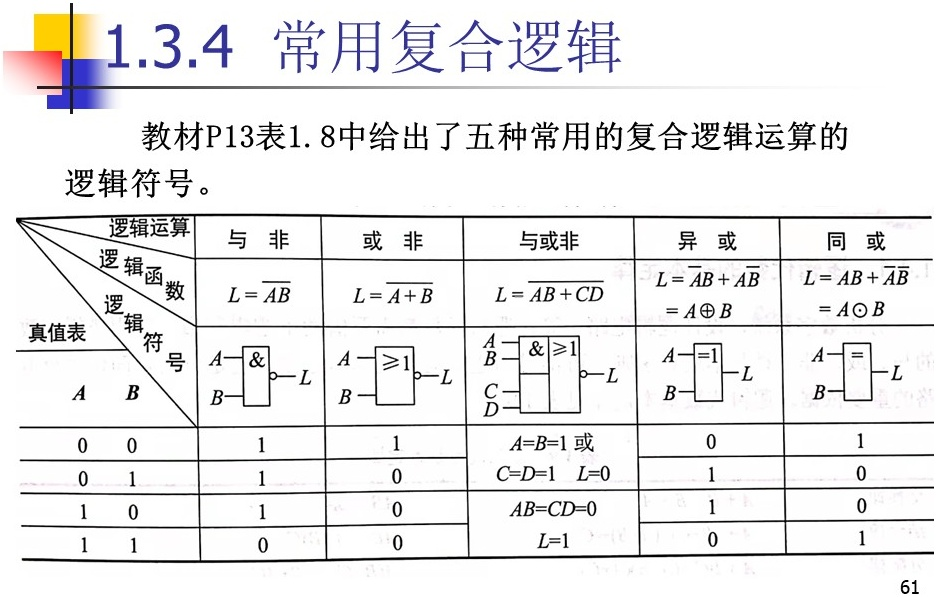

在实际电路设计中，通常会将基本运算进行复合。期末考试中常见的五种复合逻辑运算（与非 NAND、或非 NOR、异或 XOR、同或 XNOR、与或非 AND-OR-INVERT）的逻辑符号、真值表以及逻辑表达式对照，请直接参考以上课件汇总大图。

### 三、 逻辑代数基本定律与三大规则（1.4）

#### 1. 逻辑代数基本定律

* **逻辑代数基本定律汇总对照表（课件插图）**：

| 定律名称 | 与形式式子 | 或形式式子 | 备考秘籍与证明要点 |
| :--- | :--- | :--- | :--- |
| **交换律** | $A \cdot B = B \cdot A$ | $A + B = B + A$ | 变量顺序可任意调整。 |
| **结合律** | $A \cdot (B \cdot C) = (A \cdot B) \cdot C$ | $A + (B + C) = (A + B) + C$ | 括号内的结合方式可任意更改。 |
| **分配律** | $A(B + C) = AB + AC$ | $A + BC = (A + B)(A + C)$ | ⚠️ **特别注意：或形式分配律**在初等代数中不存在，是数数化简的超级高频大招！ |
| **0 律 与 1 律** | $A \cdot 0 = 0$，$A \cdot 1 = A$ | $A + 1 = 1$，$A + 0 = A$ | 极其基础但最常用的化简常数项公式。 |
| **重叠律** | $A \cdot A = A$ | $A + A = A$ | 用于并项，或者在一项后面重写自身（如将 $A$ 写成 $A+A$）以利于与其他项合并。 |
| **互补律** | $A \cdot \bar{A} = 0$ | $A + \bar{A} = 1$ | 制造 0 和 1 的源泉。 |
| **否否律** | $\overline{\overline{A}} = A$ | 双重否定等于肯定。长非号成对消去。 |
| **吸收律 (1)** | $A(A + B) = A$ | $A + AB = A$ | 包含大变量的项被小变量完全吸收。 |
| **吸收律 (2)** | $A(\bar{A} + B) = AB$ | $A + \bar{A}B = A + B$ | ⚠️ **高频化简公式**：反变量被直接消去。 |
| **反演律 (De Morgan)**| $\overline{A \cdot B \cdot C} = \bar{A} + \bar{B} + \bar{C}$ | $\overline{A + B + C} = \bar{A} \cdot \bar{B} \cdot \bar{C}$ | 拆长非号的唯一黄金法宝。 |
| **包含律 (Consensus)**| $(A+B)(\bar{A}+C)(B+C) = (A+B)(\bar{A}+C)$ | $AB + \bar{A}C + BC = AB + \bar{A}C$ | 🌟 **期末大题化简利器**。口诀：两项分别含有 $A$ 与 $\bar{A}$，第三项是由其余变量组成的乘积项，则第三项多余，可直接消去。 |

> [!IMPORTANT]
> **包含律（Consensus 定律）的代数严格证明**：
> 
> 
> 
> **包含律（消项/添项公式）的严格证明推导（课件插图）**：
> 
> 证明：$AB + \bar{A}C + BC = AB + \bar{A}C$
> 
> $$\text{左边} = AB + \bar{A}C + BC \cdot 1$$
> 利用互补律，将 $1$ 写为 $(A + \bar{A})$，展开：
> $$= AB + \bar{A}C + BC(A + \bar{A}) = AB + \bar{A}C + ABC + \bar{A}BC$$
> 分配律提取同类项：
> $$= AB(1 + C) + \bar{A}C(1 + B)$$
> 利用 1 律，$1 + C = 1$，$1 + B = 1$：
> $$= AB \cdot 1 + \bar{A}C \cdot 1 = AB + \bar{A}C = \text{右边} \quad \text{(证毕)}$$

#### 2. 逻辑代数三大规则

逻辑代数中，**代入规则**、**对偶规则**和**反演规则**是极其重要的方法。许多考试大题中的公式证明和求反函数均以此为依据。

#### 📊 三大规则课件核心要义与指南（课件插图）：

---

#### 📌 规则一：代入规则

* **定义**：任何一个逻辑等式中，如果**所有的**变量 $A$ 都用同一个逻辑函数 $Z$ 来代替，则等式依然成立。
* **实战案例**：
  已知基本公式 $A + \bar{A}B = A + B$。
  我们将式子中所有的 $B$ 替换为逻辑函数 $CD$，代入后可直接推广得到：
  $$A + \bar{A}(CD) = A + CD$$

---

#### 📌 规则二：对偶规则

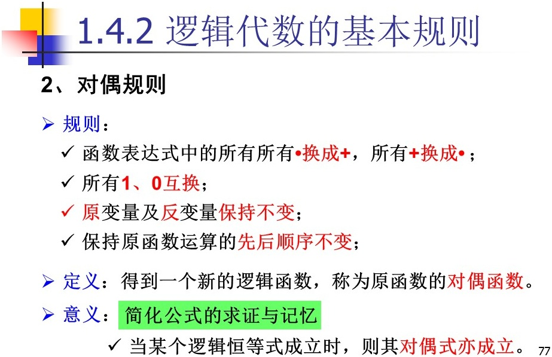

有关对偶规则的定义、求对偶式 $L'$ 的三步法指南、以及必须加括号的注意事项与例题，请直接参考以上课件大图。

---

#### 📌 规则三：反演规则 (求反函数的终极法宝)

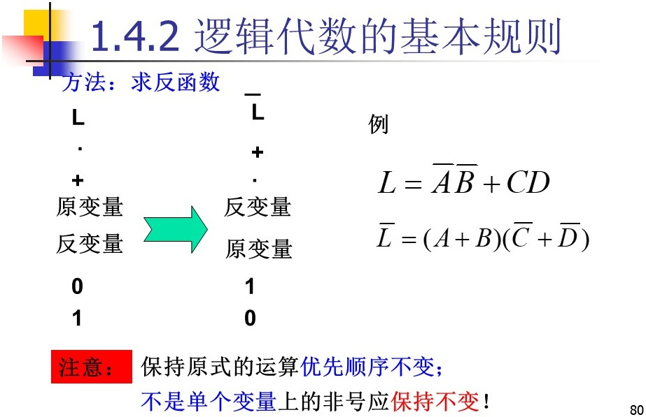

有关反演规则的定义、求反函数 $\bar{L}$ 的三步法指南、以及求反函数时的经典避坑雷区警告与课件实例，请直接参考以上课件大图。

---

#### 💡 极其形象：同源三叉分步演示案例

为了让您彻底分清对偶和反演的异同，下面以同一个复杂函数为例，展示其分步变换流程：

> [!WARNING]
> ⚠️ **对偶/反演规则的“长非号”黄金定律**：
> 1. **长非号整体看作一个变量**：如果式子中出现不是单个变量上方的长非号（如整个式子 $\overline{AB+CD}$），在进行对偶或反演规则变换时，**必须保持长非号内的运算结构和整体性不变**，只对长非号整体看作一个变量进行转换。
> 2. **推荐先用摩根定律拆长非号**：为了万无一失，强烈推荐在变换前，**先使用摩根定律把长非号完全拆开**，变成只有单个变量上有非号（如 $\bar{A}, \bar{B}$）的形式，然后再套用对偶或反演变换规则。这样绝对不会出错！

---

### 四、 逻辑函数及其表示方法（1.5）

#### 1. 逻辑函数的定义
如果对于输入逻辑变量 $A, B, C, \dots$ 的每一组确定的二进制值组合，输出逻辑变量 $L$ 就有唯一确定的逻辑值（0 或 1），则称 $L$ 是输入变量的**逻辑函数**，记为：
$$L = F(A, B, C, \dots)$$

#### 2. 五种表示方法及相互转换
1. **真值表**：用表格列出输入变量所有可能的组合及其对应的输出函数值。
   * **特点**：最直观、最能直接反映逻辑本质，**具有唯一性**。
2. **逻辑表达式**：用逻辑运算符号组成的数学表达式。
   * **特点**：便于公式化简和推导，**形式不唯一**。
3. **逻辑图**：采用逻辑门电路符号以及相互连线表示的图形。
   * **特点**：与实际硬件电路实现最为接近。
4. **波形图（时序图）**：输入和输出逻辑电平随时间变化的图形。
   * **特点**：在仪器测试和数字仿真中应用最广。
5. **卡诺图**：将最小项排成特定矩阵的几何图形。
   * **特点**：图形化化简的强力工具。

#### 3. 核心概念：最小项（Minterm）与最小项表达式

“最小项”和“标准与或式”是逻辑代数中最基础也是期末考试中必考的核心名词。许多学生在这里容易被公式绕晕，我们用最通俗易懂的物理视角来为您解剖它。

#### (1) 什么是最小项？———— “逻辑世界的专属指纹锁”

* **课件基本定义与性质（课件插图）**：

* **通俗本质（为什么叫“最小项”？）**：
  * **“项大”**：在 $n$ 个变量的逻辑函数中，一个最小项必须把**全部 $n$ 个变量都包含进来**，而且每一个变量要么以原变量（如 $A$）形式出现，要么以反变量（如 $\bar{A}$）形式出现，且仅出现一次。它没有缺席变量，可以说是“五脏俱全的大项”。
  * **“空间小（最小）”**：正因为要把所有变量都包含进来，它的限制就极度严苛。这就像一个 **“全员指纹锁”**，要求每一位评委都必须按下正确的指纹。在输入变量的所有 $2^n$ 种二进制组合中，**有且仅有一种特定的输入组合**能够满足它，让它的值等于 1。在其他所有的 $2^n - 1$ 种组合中，它全都是 0！因为它的逻辑空间只有这 $2^n$ 分之一，所以被称为“最小项”。

---

#### (2) 最小项的下标 $i$ 是怎么算出来的？（$m_0, m_1, m_2$ 的奥秘）

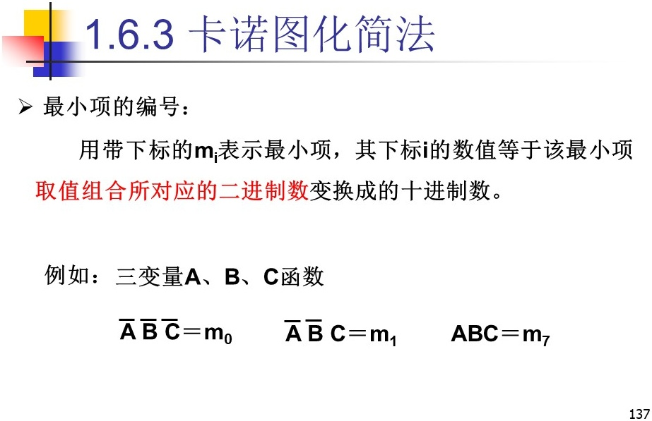

对于任意一个最小项，我们用一个**十进制下标 $i$** 来进行编号命名，记作 $m_i$：
1. **看作二进制**：观察最小项的乘积项，凡是**原变量**（如 $A$）记为二进制的 `1`，凡是**反变量**（如 $\bar{A}$）记为二进制的 `0`。
2. **转为十进制**：按变量的字母排列顺序（如 $A, B, C$）拼成一个二进制数。
3. **确定下标**：将这个二进制数转换为十进制数，所得的数值就是下标 $i$。

#### 💡 3 变量最小项 $m_0 \sim m_7$ 全景对照表 (期末必考)

下面以 3 变量 $A, B, C$ 为例，展示全部 8 个最小项的对应关系与二进制 valuation 逻辑：

| 最小项编号 | 变量 $A$ 状态 | 变量 $B$ 状态 | 变量 $C$ 状态 | 对应二进制值 | 最小项代数表达式 | 让该项为 1 的唯一输入 |
| :---: | :---: | :---: | :---: | :---: | :---: | :--- |
| $m_0$ | 反变量 (0) | 反变量 (0) | 反变量 (0) | $000$ | $m_0 = \bar{A}\bar{B}\bar{C}$ | 只有当输入 $A=0, B=0, C=0$ 时，该项才为 1 |
| $m_1$ | 反变量 (0) | 反变量 (0) | 原变量 (1) | $001$ | $m_1 = \bar{A}\bar{B}C$ | 只有当输入 $A=0, B=0, C=1$ 时，该项才为 1 |
| $m_2$ | 反变量 (0) | 原变量 (1) | 反变量 (0) | $010$ | $m_2 = \bar{A}B\bar{C}$ | 只有当输入 $A=0, B=1, C=0$ 时，该项才为 1 |
| $m_3$ | 反变量 (0) | 原变量 (1) | 原变量 (1) | $011$ | $m_3 = \bar{A}BC$ | 只有当输入 $A=0, B=1, C=1$ 时，该项才为 1 |
| $m_4$ | 原变量 (1) | 反变量 (0) | 反变量 (0) | $100$ | $m_4 = A\bar{B}\bar{C}$ | 只有当输入 $A=1, B=0, C=0$ 时，该项才为 1 |
| $m_5$ | 原变量 (1) | 反变量 (0) | 原变量 (1) | $101$ | $m_5 = A\bar{B}C$ | 只有当输入 $A=1, B=0, C=1$ 时，该项才为 1 |
| $m_6$ | 原变量 (1) | 原变量 (1) | 反变量 (0) | $110$ | $m_6 = AB\bar{C}$ | 只有当输入 $A=1, B=1, C=0$ 时，该项才为 1 |
| $m_7$ | 原变量 (1) | 原变量 (1) | 原变量 (1) | $111$ | $m_7 = ABC$ | 只有当输入 $A=1, B=1, C=1$ 时，该项才为 1 |

---

#### (3) 最小项的性质 (期末填空题超级考点)
1. **独占性**：在输入变量的任何一组取值组合下，**有且仅有一个最小项的值为 1**，其余的都为 0。
2. **正交性**：任意两个不同的最小项之积恒为 0（即 $m_i \cdot m_j = 0, \ i \neq j$）。*比如：$m_0 \cdot m_1 = (\bar{A}\bar{B}\bar{C})(\bar{A}\bar{B}C) = \bar{A}\bar{B}(\bar{C}C) = 0$*。
3. **完备性**：全体 $2^n$ 个最小项之和恒等于 1（即 $\sum_{i=0}^{2^n-1} m_i = 1$）。

* **课件代数展开最小项经典例题（课件插图）**：

#### (4) 唯一性定理与标准与或式

任何一个逻辑函数都可以表示为唯一的最小项之和的形式，这被称为**最小项表达式**（或**标准与或式**，SOP）。它与逻辑函数真值表中**输出为 1 的那些行一一对应**。
* *示例*：一个逻辑函数的真值表显示，当输入为 $000$、 $010$、 $111$ 时输出为 1，则它的最小项表达式为：
  $$L = \bar{A}\bar{B}\bar{C} + \bar{A}B\bar{C} + ABC = m_0 + m_2 + m_7 = \sum m(0, 2, 7)$$

---

#### (5) 卡诺图坐标排布与“折叠缠绕相邻”几何本质 (1.6 延伸)

既然最小项是逻辑空间的基本单位，那么卡诺图就是把这些最小项拼在平面网格里进行化简的工具。

#### 📍 3 变量与 4 变量标准卡诺图方格坐标映射图
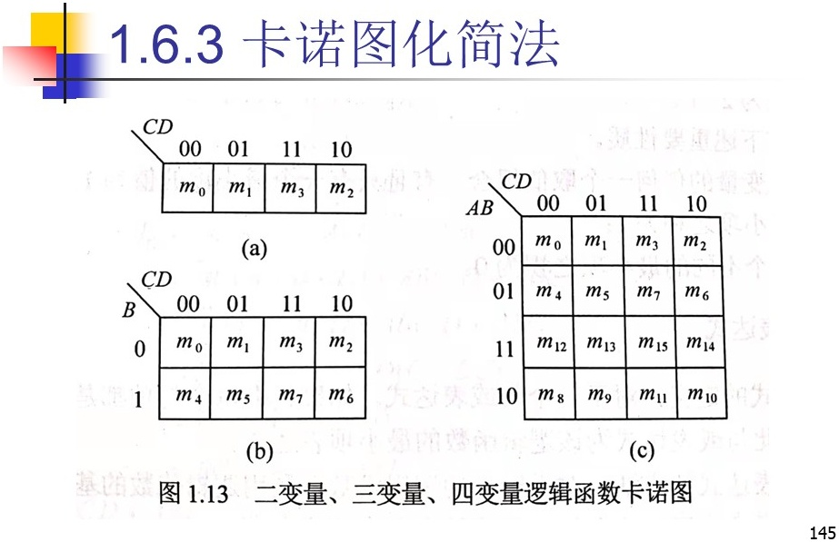

标准二变量、三变量、四变量卡诺图的方格坐标、最小项编号以及格雷码映射排布，请直接参考以上课件大图。

#### ❓ 为什么坐标是 00 ──► 01 ──► 11 ──► 10，把 11 和 10 调换了位置？

* **原因**：卡诺图是基于**格雷码（相邻仅变 1 位）**排列的。
  如果按常规 00 $\to$ 01 $\to$ 10 $\to$ 11 排列，那么第二列（01）与第三列（10）之间，**有两位发生了跃变（0 变 1 且 1 变 0）**！
  调换位置后，任意相邻两列（包含最左列和最右列）之间，**永远都只有一位二进制变动**。
  这确保了：**几何上相邻的格子，在逻辑上也绝对相邻**，可以用并项公式 $X + \bar{X} = 1$ 合并消去该变量！

#### 🪐 核心考点：什么是“折叠缠绕相邻”？（卡诺圈必须懂的折合空间）
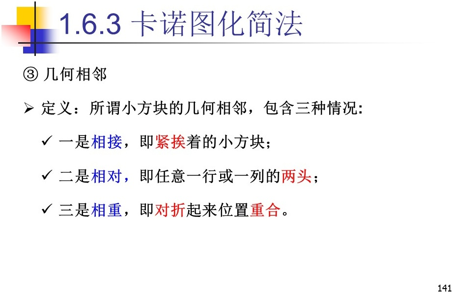

* **卡诺图几何相邻的物理本质：相接、相对、相重（课件插图）**：

很多同学画卡诺圈时漏掉最左边和最右边，或者四个角。因为他们把卡诺图看成了普通的“平铺纸张”。
实际上，**卡诺图是一个三维的圆环面（甜甜圈）！**

1. **左右缠绕相邻（卷成圆筒）**：
   卡诺图的最左边界和最右边界是紧紧相连的。如果你把平面图向后对折卷起来，最左列的 $m_0$ 将会直接贴在最右列 of $m_2$ 旁边！它们逻辑上是相邻的（$\bar{A}\bar{B}\bar{C}$ 与 $\bar{A}B\bar{C}$ 仅 $B$ 不同，相加直接化简为 $\bar{A}\bar{C}$）。

2. **上下缠绕相邻**：
   对于 4 变量卡诺图，不仅最左和最右可以卷起来，**最上行和最下行**也可以向下弯曲连在一起。
3. **终极考点：四角相邻**：
   正因为上下、左右均可折叠贴合，4 变量卡诺图的**四个顶角格**：
   $$\{m_0, m_2, m_8, m_{10}\}$$
   在空间几何上其实是**相互紧挨在一起的**！所以当四角均为 1 时，它们可以合并成一个完美的 **4 格圈**，直接消去两个变量，化简为 $\bar{B}\bar{D}$！

---

### 五、 逻辑函数的化简（1.6）

#### 1. 化简的意义与最简目标
在设计实际电路时，更简化的逻辑表达式可以转换为更简化的物理电路，从而**降低生产成本、提高系统运行的可靠性**。
* **与或表达式的最简标准**：
  1. 与项（乘积项）的个数最少（决定了所需**与门**的个数最少）；
  2. 每个与项中包含的变量个数最少（决定了每个与门**输入端**的数量最少）。

#### 2. 代数化简法
代数化简法是通过反复使用逻辑代数的基本定律和常用公式，消去多余的项和因子，常用以下五种招式：
1. **并项法**：利用公式 $AB + A\bar{B} = A$，将两项合并，消去一个因子。
2. **吸收法**：利用公式 $A + AB = A$ 和 $A + \bar{A}B = A + B$，消去多余的项或因子。
3. **消项法（包含律）**：利用包含律公式 $AB + \bar{A}C + BC = AB + \bar{A}C$，直接消去多余项 $BC$。
4. **配项法**：利用公式 $A = A(B + \bar{B}) = AB + A\bar{B}$，将某一项乘以 1 拆成两项，再与其他项进行合并化简。
5. **消因子法**：利用公式 $A + \bar{A} = 1$ 进行展开提公因子消去多余变量。

#### 3. 卡诺图化简法

<mark>**卡诺图化简法重点：练习课本的自行练习 1.4、1.6、1.8、1.9、1.13、1.16、1.17 中的例题，以及雨课堂的习题和练习。**</mark>
卡诺图化简法不需要高超的代数技巧，只需按照简单的几何连线规律即可在 30 秒内求出最简逻辑结果，特别适合 3 到 5 变量逻辑函数的化简。

#### (1) 几何相邻与逻辑相邻一致性
卡诺图通过调换 10 和 11 的位置，使得在**几何图形上相邻（相接、相对、相重）**的两个方格，其代表的最小项在**逻辑上也必然相邻**（只有一个变量的形式不同）。

* **相接**：上下左右紧邻的小方格。
* **相对**：行或列的两个端点（如最左端 and 最右端、最上端 and 最下端可绕球般相邻）。
* **相重**：对折后重合的位置（例如 4 变量卡诺图的四个角格 $m_0, m_2, m_8, m_{10}$ 彼此完全逻辑相邻，可以圈在一起）。

#### (2) 4变量标准空卡诺图排布（考试画图模板，必背）

| AB \ CD | 00 | 01 | 11 | 10 |
| :---: | :---: | :---: | :---: | :---: |
| **00** | $m_0$ | $m_1$ | $m_3$ | $m_2$ |
| **01** | $m_4$ | $m_5$ | $m_7$ | $m_6$ |
| **11** | $m_{12}$ | $m_{13}$ | $m_{15}$ | $m_{14}$ |
| **10** | $m_8$ | $m_9$ | $m_{11}$ | $m_{10}$ |

> [!CAUTION]
> ⚠️ **画图坐标红线**：
> 注意 CD 行标和 AB 列标的顺序是 **00 $\to$ 01 $\to$ 11 $\to$ 10**！第 3 列和第 4 列、第 3 行和第 4 行发生了互换，千万不要按 00, 01, 10, 11 顺序画！

#### (3) 卡诺图化简的核心规则（画卡诺圈的法则）

用卡诺图化简逻辑函数的关键在于**如何科学、合理地画卡诺圈（包围圈）**。因为这部分规则比较抽象，为了让您最直观、轻松地掌握，请结合以下课件中的**画圈规则总结图解**、**化简例题图画法**以及**三种不同画圈方式的化简最简效果对比案例**进行学习：

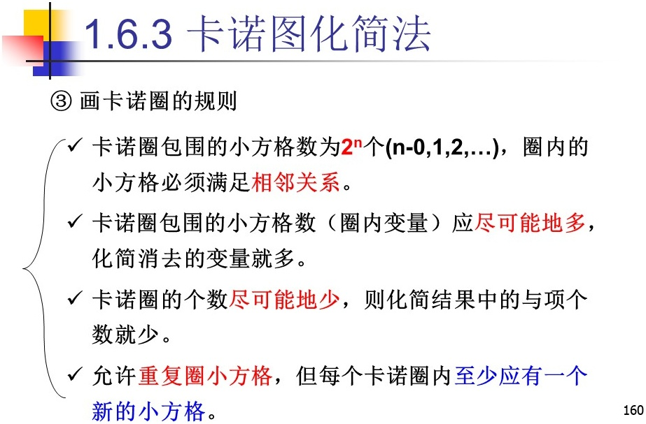

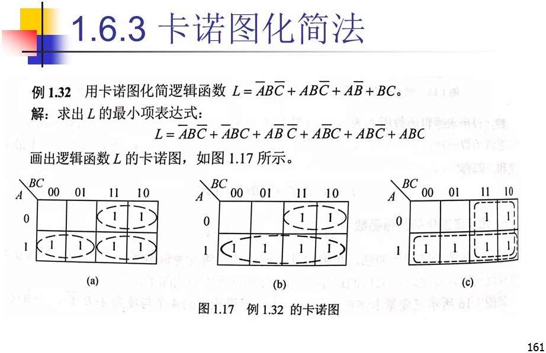

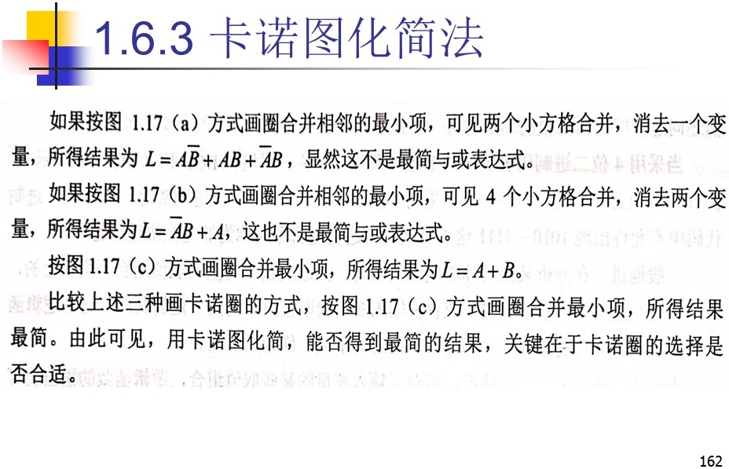

#### 💡 画卡诺圈黄金规则精要提炼：
1. **包围圈的大小必须是 $2^k$**：只能包围 1, 2, 4, 8, 16 个填 1 的相邻方格，决不能圈出 3 个或 6 个的奇葩圈。
2. **包围圈要尽可能地大**：圈划得越大，能够消去的变量就越多，最后得到的乘积项也就越简短。
3. **包围圈的数量要尽可能地少**：圈越少，最后与或表达式相加求和的与项个数就越少。
4. **每个包围圈内至少必须包含一个未被圈过的新“1”**：这是为了防止画出完全多余的冗余圈。
5. **消元法则**：合并 $2^n$ 个相邻方格可以消去 $n$ 个不同的变量。化简时，**保留在整个圈内状态保持不变的变量，直接消去状态发生改变的变量**。

#### (4) 约束项（无关项）在化简中的应用

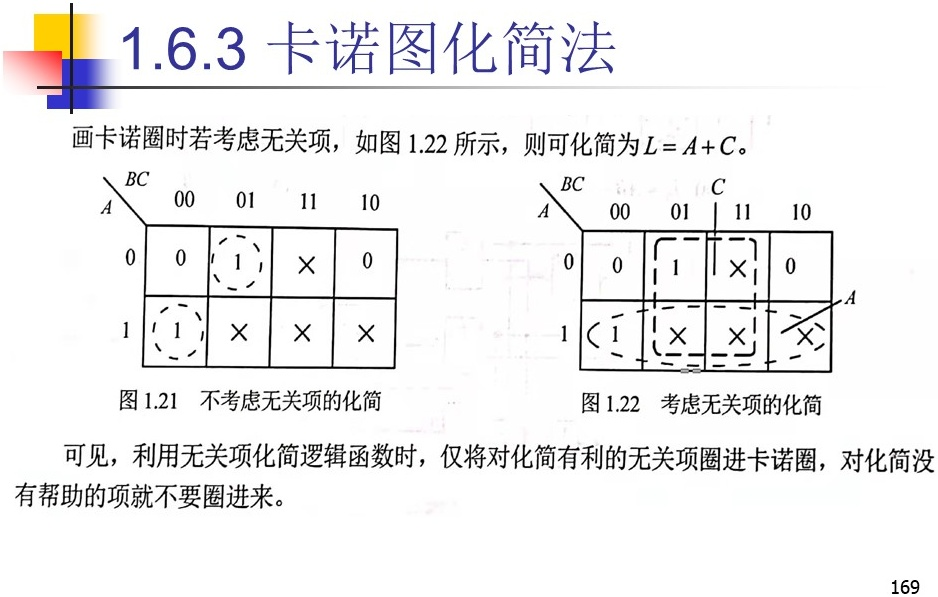

* **约束项与任意项（无关项）定义（课件插图）**：
在许多实际逻辑设计中，由于输入信号受到制约，某些输入变量的取值组合是不可能出现的（约束项），或者这些取值下输出是 0 是 1 完全无所谓（任意项）。它们统称为**无关项**，在卡诺图中用符号“$\times$”（或简记作“$d$”）表示。
* **化简妙法**：
  * 因为 $\times$ 可以看作 1 也可以看作 0，在画卡诺圈时，**如果圈入 $\times$ 能够使当前的圈变得更大，或者能减少圈的总个数，就将其看作 1 圈进来**；
  * **如果圈入 $\times$ 对扩大圈或减少圈数没有任何帮助，就直接将其当作 0 抛弃在圈外**，不需理会。

* **利用无关项进行化简的卡诺圈对照与经典例题（课件插图）**：

#### (5) 多输出逻辑函数的整体化简原则
对于一个电路有多个输出端的情况（如 $L_1$ and $L_2$），如果对各个函数分别独立进行化简，虽然能得到各自的最简与或式，但整体电路所需要的总门电路数不一定是最少的。
* **联合化简原则**：应该统一考虑各个函数，**尽可能多地寻找和利用公共的乘积项**。在实现公共项时可以共用相同的与门，从而显著减少电路中所需的总门数和引脚数。

---

### 典型期末真题及详解

#### 【真题 1：反演规则求反逻辑函数】（简答题，5分）
**题目**：已知逻辑函数表达式如下，求其反函数 $\bar{L}$：
$$L = A \cdot \bar{B} + C \cdot (\bar{D} + E \cdot \bar{F})$$

**解析**：
根据反演规则，求 $\bar{L}$ 的步骤为：将所有的“$\cdot$”换成“$+$”，“$+$”换成“$\cdot$”，常数 `0` 与 `1` 互换，所有变量取反（$A \leftrightarrow \bar{A}$）。
⚠️ **雷区预防**：在转换乘积项和加项时，必须通过合理补充括号来严格保持原式的优先级顺序。原式中 $A \cdot \bar{B}$ 是一项， $C \cdot (\bar{D} + E \cdot \bar{F})$ 是一项，它们之间是或运算（$+$）。因此，转换成与运算（$\cdot$）后，这两大部分必须各自被括号括起来。

1. 原式中 $A \cdot \bar{B}$ 转换为：$(\bar{A} + B)$ ；
2. 原式中 $C \cdot (\bar{D} + E \cdot \bar{F})$ 部分：
   * $C$ 转换为 $\bar{C}$；
   * 括号内 $(\bar{D} + E \cdot \bar{F})$ 转换为：$(D \cdot (\bar{E} + F))$；
   * 二者相与（原式为相与，转换后为相或），该部分转换为：$\bar{C} + (D \cdot (\bar{E} + F))$；
3. 将两大部分进行逻辑相与（原式为逻辑相或），补齐总的大括号，得到反函数：
   $$\bar{L} = (\bar{A} + B) \cdot [ \bar{C} + D \cdot (\bar{E} + F) ]$$

---

#### 【真题 2：用代数化简法求最简与或式】（期末化简大题，8分）
**题目**：用代数化简法将下列逻辑函数化简为最简与或表达式：
$$L = A\bar{B}\bar{C} + A\bar{B}C + ABC + \bar{A}BC + \bar{A}\bar{B}\bar{C}$$

**解析**：
对于项数较多的逻辑函数，最快捷的代数化简策略是**“局部合并”与“配项吸收”**。

1. **第一步：局部两两合并（利用公式 $XY + X\bar{Y} = X$）**
   * 合并第一项与第二项，提取 $A\bar{B}$：
     $$A\bar{B}\bar{C} + A\bar{B}C = A\bar{B}(\bar{C} + C) = A\bar{B}$$
   * 合并第三项与第四项，提取 $BC$：
     $$ABC + \bar{A}BC = (A + \bar{A})BC = BC$$
   * 将上述合并结果代回原式（保留尚未参与合并的第五项 $\bar{A}\bar{B}\bar{C}$）：
     $$L = A\bar{B} + BC + \bar{A}\bar{B}\bar{C}$$

2. **第二步：配项化简（利用吸收律二 $X + \bar{X}Y = X + Y$）**
   * 调整顺序，将含有相同因子 $\bar{B}$ 的第一项与第三项放在一起：
     $$L = (A\bar{B} + \bar{A}\bar{B}\bar{C}) + BC$$
   * 提取公因子 $\bar{B}$：
     $$L = \bar{B}(A + \bar{A}\bar{C}) + BC$$
   * 对括号内应用吸收律二（$\bar{A}$ 被前项 $A$ 吸收消除）：
     $$A + \bar{A}\bar{C} = A + \bar{C}$$
   * 展开并整理：
     $$L = \bar{B}(A + \bar{C}) + BC = A\bar{B} + \bar{B}\bar{C} + BC$$

3. **第三步：得出结论**
   最简与或表达式为：
   $$L = A\bar{B} + \bar{B}\bar{C} + BC$$
   *(注：根据合并时的不同选择，结果写为 $AC + \bar{B}\bar{C} + BC$ 亦完全正确且等价，两者的乘积项数和变量数完全相同。)*

---

#### 【真题 3：包含约束项的卡诺图化简大题】（期末大题，10分）

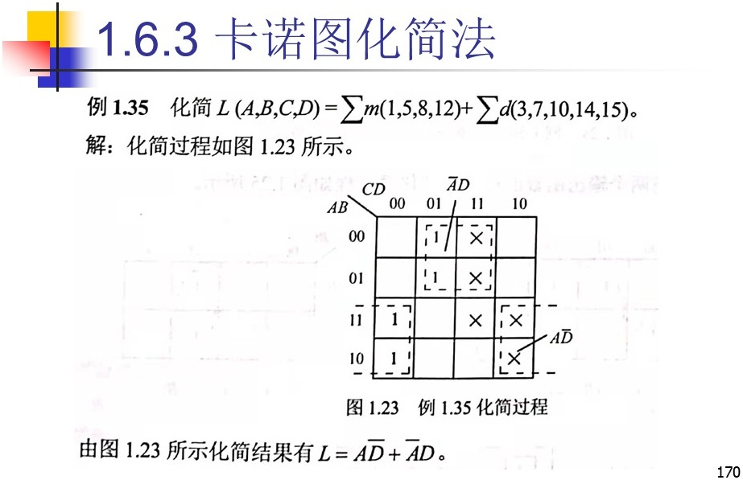

**题目**：已知某 4 变量逻辑函数其最小项表达式与约束条件如下，试用卡诺图法求最简与或表达式：
$$L(A,B,C,D) = \sum m(1, 5, 8, 12)$$
$$\text{约束条件 (无关项)：} d(A,B,C,D) = \sum d(3, 7, 10, 14, 15)$$

**解析**：
用卡诺图化简包含约束项的逻辑函数，核心思想是：**“X 可看作 1 亦可看作 0，怎么有利于画出更大的圈就怎么用，但不必圈入所有 X”**。

1. **第一步：绘制卡诺图并填值**
   在卡诺图中，将最小项 $m_i$ 的格填入 `1`，约束项 $d_i$ 的格填入 `X`，其余填 `0`：

| AB \ CD | 00 | 01 | 11 | 10 |
| :---: | :---: | :---: | :---: | :---: |
| **00** | 0 | 1 ($m_1$) | X ($m_3$) | 0 |
| **01** | 0 | 1 ($m_5$) | X ($m_7$) | 0 |
| **11** | 1 ($m_{12}$) | 0 | X ($m_{15}$) | X ($m_{14}$) |
| **10** | 1 ($m_8$) | 0 | 0 | X ($m_{10}$) |

2. **第二步：画圈合并（寻找最大 $2^k$ 包围圈）**
   We 观察 `1` 的分布，并合理利用 `X` 来扩大包围圈：
   * **圈 1（包围 $m_1, m_5$）**：
     我们发现，可以将 $m_1(1)$ 和 $m_5(1)$ 与相邻的约束项 $m_3(X)$ 和 $m_7(X)$ 合并，在卡诺图右上角组成一个 **2x2 的 4 格大圈**。
     * 对应变量状态：行中 $AB$ 从 $00 \to 01$，$A$ 不变且为 0，$B$ 改变；列中 $CD$ 从 $01 \to 11$，$D$ 不变且为 1，$C$ 改变。
     * 消去改变的变量 $B, C$，保留状态不变的变量，合并结果为：**$\bar{A}D$**。
   * **圈 2（包围 $m_8, m_{12}$）**：
     同理，可以将 $m_8(1)$ 和 $m_{12}(1)$ 与相邻的约束项 $m_{10}(X)$ 和 $m_{14}(X)$ 合并，组成另一个 **2x2 的 4 格大圈**。
     * 对应变量状态：行中 $AB$ 从 $10 \to 11$，$A$ 不变且为 1，$B$ 改变；列中 $CD$ 从 $00 \to 10$，$D$ 不变且为 0，$C$ 改变。
     * 消去改变的变量 $B, C$，保留状态不变 of 变量，合并结果为：**$A\bar{D}$**。

3. **第三步：得出最简与或表达式**
   卡诺图中的所有 `1`（$m_1, m_5, m_8, m_{12}$）均已被圈入，未被利用的约束项（如 $m_{15}$）看作 0 抛弃即可。
   最简与或表达式为：
   $$L = \bar{A}D + A\bar{D}$$

## 数电第三章《组合逻辑电路》快速提分复习指南

> [!IMPORTANT]
> ### 🎯 第三章期末备考与必做重点清单
> * 📌 **教材必做练习**：课本 **3.2 编码器与译码器** 与 **3.3 数据选择器** 中涉及的课后习题 `3.12`；课本 **3.4 竞争与冒险** 中的例题 `3.18`、`3.19 (1)(2)`、`3.20`。
> * 📌 **期末核心考点**：
>   * **译码器与数据选择器芯片设计（必考大题）**：使用 3-8 译码器 74LS138 和与非门设计多输出逻辑函数及四变量函数（对应课后习题 `3.12` 经典真题）；使用 8选1 数据选择器（如 74LS151 MUX）设计逻辑电路，以及级联扩展方法。
>   * **竞争与冒险（高频核心）**：分析竞争-冒险的产生原因与图形判别法（卡诺图相切判定法，相切处通过补加冗余项/冗余圈消除冒险，对应例题 `3.18`、`3.19 (1)(2)`、`3.20`）；代数判别法；修改逻辑设计（增加多余项）、滤波电容、选通脉冲消除冒险的方法。
> * 📌 **强化训练与课件**：雨课堂课堂对应练习与课后题，以及课件 74LS138 / 74LS151 相关设计与接线图。
### 3.1 组合逻辑电路的特点与分析设计步骤（极简精要）

#### 3.1.1 组合逻辑电路的特点

* **逻辑功能**：任何时刻电路的输出状态仅取决于该时刻的各输入状态的组合，与电路原来的状态无关（即**无记忆功能**）。

* **结构特点**：电路由各种基本逻辑门电路构成，电路中**不存在反馈环路**。

#### 3.1.2 组合逻辑电路的分析与设计步骤


```mermaid

graph TD

    subgraph 分析步骤

    A[已知逻辑电路图] --> B[由图写出输出端的逻辑表达式]

    B --> C[对逻辑表达式进行化简和变换]

    C --> D[列出真值表]

    D --> E[分析并概括逻辑功能]

    end

    subgraph 设计步骤

    F[实际逻辑要求] --> G[定义输入/输出变量并列真值表★关键]

    G --> H[由真值表写出逻辑表达式]

    H --> I[化简并变换表达式]

    I --> J[画出逻辑电路图]

    end

```

---

### 3.2 编码器与译码器（记住核心功能即可）

编码与译码是互为逆过程的两类组合逻辑功能。

* **编码器 (Encoder)**：
  * **核心功能**：将特定的输入信号（如按键、数字或文字符号）转换成对应的二进制代码输出（即“输入信号 $\to$ 二进制代码”）。
  * **典型芯片**：**74LS148**（8 线-3 线优先编码器）。优先编码器的特点是允许同时输入多个信号，但只对其中优先级最高的输入进行编码。
* **译码器 (Decoder)**：
  * **核心功能**：编码的逆过程，将输入的二进制代码翻译成对应的输出控制信号（即“二进制代码 $\to$ 唯一有效的输出端”）。
  * **典型芯片**：**74LS138**（3 线-8 线二进制译码器，常用作通道分配或电路片选）。当输入一个 3 位二进制代码时，对应的 8 个输出引脚中只有一个变为有效电平。


### 3.2.1 74LS138 译码器逻辑设计实战（★ 经典必做题 3.12，课本第 138 页 ★）

> [!IMPORTANT]
> **💡 【极速秒杀核心规律】用 3-8 译码器 74LS138 实现逻辑函数的方法：**
> 1. **化为最小项**：将逻辑函数化为**最小项之和**的形式（如 $F = \sum m(i, j, k)$）。
> 2. **变量对齐**：将输入变量按高低位对齐接入 74LS138 的地址输入引脚（令 $A_2 = A, A_1 = B, A_0 = C$）。
> 3. **与非门级联**：利用 74LS138 输出端低电平有效（$Y_i = \overline{m_i}$）的特点，根据摩根定律，直接将所需最小项对应的输出端 $Y_i, Y_j, Y_k$ 接入一个**与非门（NAND Gate）**的输入端，与非门的输出即为逻辑函数：
>    $$F = m_i + m_j + m_k = \overline{ \overline{m_i} \cdot \overline{m_j} \cdot \overline{m_k} } = \overline{ Y_i Y_j Y_k }$$

#### ✍️ 【课后必做题 3.12】试用译码器 74LS138 和与非门实现下列逻辑函数：

#### 📌 （1）实现多输出逻辑函数组：
$$L_1 = AB + A\overline{B}C$$
$$L_2 = AC + \overline{A} + \overline{B}$$
$$L_3 = AB \cdot \overline{AC}$$

---

#### 📌 （2）实现四变量逻辑函数：
$$L(A,B,C,D) = \sum m(0, 2, 6, 8)$$

### 3.3 数据选择器与数据分配器（MUX / DEMUX）

数据选择器（MUX）与数据分配器（DEMUX）在组合逻辑中是一对**互逆**的核心器件。

| 器件名称 | 逻辑功能描述 (极速记忆口诀) | 典型应用芯片 |
| :--- | :--- | :--- |
| **数据选择器 (MUX)** | **“多路输入，单路输出”**：在选择控制变量作用下，从多个输入通道中选出某一个传送到唯一的输出端（相当于**多路开关**）。 | **74LS151** (八选一)<br>**74LS153** (双四选一) |
| **数据分配器 (DEMUX)** | **“单路输入，多路输出”**：在通道选择地址变量作用下，将一路数据分发到多个输出通道中的某一个（与 MUX 互为逆过程）。 | 常用 **74LS138** (3-8译码器) 兼任实现 |

---

#### 3.3.1 核心功能与大考做题要领

#### 1. 数据选择器（MUX）设计逻辑电路
用数据选择器（如 74LS151）设计组合逻辑电路是必考大题。常用方法有两种：
* **比较系数法（自变量数与地址端数相同）**：直接对比待实现代数式与 MUX 逻辑输出公式，确定每个输入端 $D_i$ 应接 `0` 还是 `1`。
* **卡诺图法（自变量数多于地址端数）**：将部分变量接 MUX 的地址端，剩余变量在卡诺图内分区化简，确定输入端 $D_i$ 接入的变量或反变量。

#### 2. 译码器用作数据分配器（DEMUX）的实现
常用 **3-8译码器 74LS138** 来实现数据分配功能：
* **通道地址**：将通道选择变量接译码器的地址选择端 $A_2, A_1, A_0$。
* **数据输入**：将单路数据信号 $D$ 接至译码器低电平有效的使能端（如 $\overline{S_2} = D$），其余使能端固定接有效工作电平。
* **分发结果**：被选中的通道输出将完全跟踪并输出 $D$ 的状态，其余通道输出恒为 `1`。

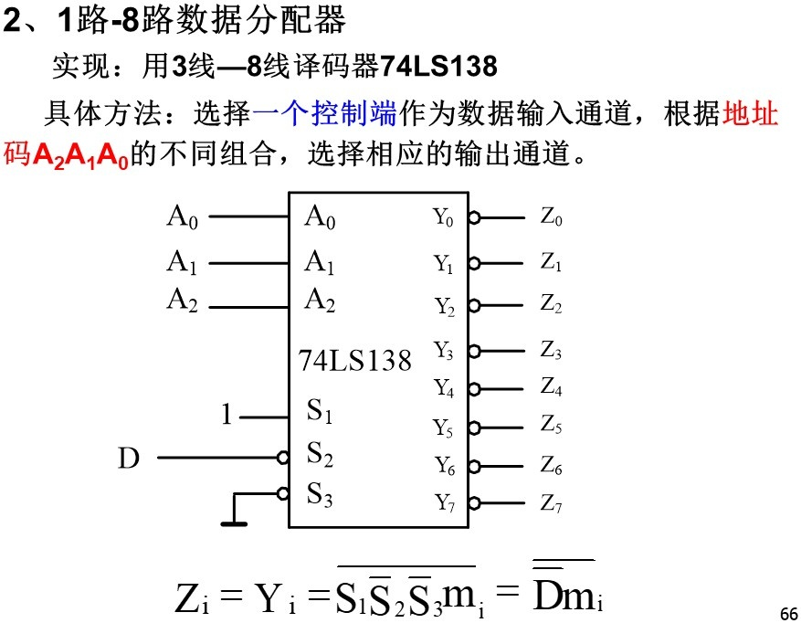

#### 3. 数据选择器的级联扩展（Slide 73, 74）🌟🌟🌟
当单个数据选择器的输入通道数不足时，可以通过**使能端扩展**的方式将多个低阶选择器级联为高阶选择器。

#### 🔍 典型案例：用两片 4选1 MUX 扩展为 8选1 MUX
* **选择变量分配**：
  八选一数据选择器需要 3 个地址变量 $A_2, A_1, A_0$。
  * 将两个低位的地址变量 $A_1, A_0$ 同时接至两片 4选1 MUX 的地址输入端。
  * 将高位的地址变量 $A_2$ 用作**片选控制信号**，分别连接两片 MUX 的使能端（通常为低电平有效）。

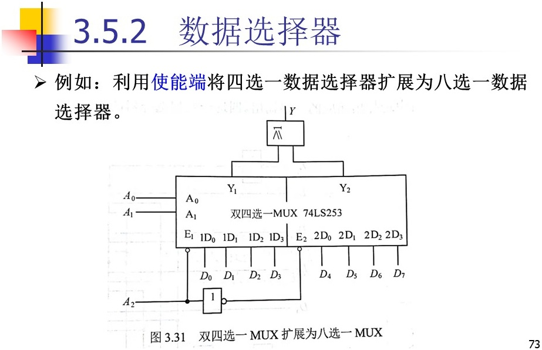

* **级联工作原理分析**：
  * **当 $A_2 = 0$ 时**：使能信号控制第一片 MUX 工作（$E_1 = 0$），而第二片 MUX 被禁止工作（$E_2 = 1$），输出恒为 $Y_2 = 0$。总输出 $Y = Y_1 + Y_2 = Y_1$，此时从 $D_0 \sim D_3$ 中选择一路输出。
  * **当 $A_2 = 1$ 时**：使能信号控制第二片 MUX 工作（$E_2 = 0$），而第一片 MUX 被禁止工作（$E_1 = 1$），输出恒为 $Y_1 = 0$。总输出 $Y = Y_1 + Y_2 = Y_2$，此时从 $D_4 \sim D_7$ 中选择一路输出。
  * **输出合并方式**：两片 MUX 的输出 $Y_1$ and $Y_2$ 接入一个 **或门**，即可获得级联后的八选一总输出 $Y = Y_1 + Y_2$。

---


#### 3.3.2 🌟 核心真题精析（数据选择器 MUX 唯一必考型）

<mark>**特别提示：这部分可能会出一道大题，也只能从这里出，对应有例题 3.12，以及雨课堂课堂对应练习。**</mark>


#### ✍️ 【例 3.12】八选一数据选择器设计函数——真值表映射法（Slide 80, 81, 82）

**【题目】** 已知一逻辑函数 $F(A, B, C)$ 的真值表，试利用八选一数据选择器 74LS151 实现此逻辑电路。

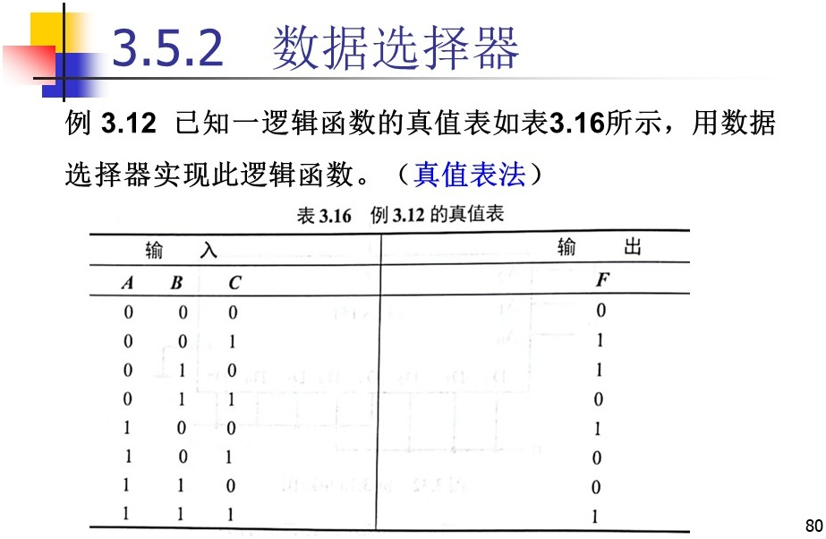

**【解析步骤】**

1. **地址映射与使能设定**：
   选用八选一数据选择器 74LS151，将使能端 $\overline{G}$ 接入低电平 `0` 使其正常工作。令选择器的地址输入变量与逻辑函数的输入变量一一对应，即：
   $$A_2 = A, \quad A_1 = B, \quad A_0 = C$$

2. **比较表达式系数**：
   74LS151 的逻辑输出关系式为：
   $$Y = \sum_{i=0}^7 m_i D_i = D_0 m_0 + D_1 m_1 + D_2 m_2 + D_3 m_3 + D_4 m_4 + D_5 m_5 + D_6 m_6 + D_7 m_7$$
   为使 $F = Y$，只需将真值表中输出为 `1` 的最小项对应的输入通道 $D_i$ 接入高电平 `1`，输出为 `0` 的通道接入低电平 `0`。

3. **确定输入接线**：

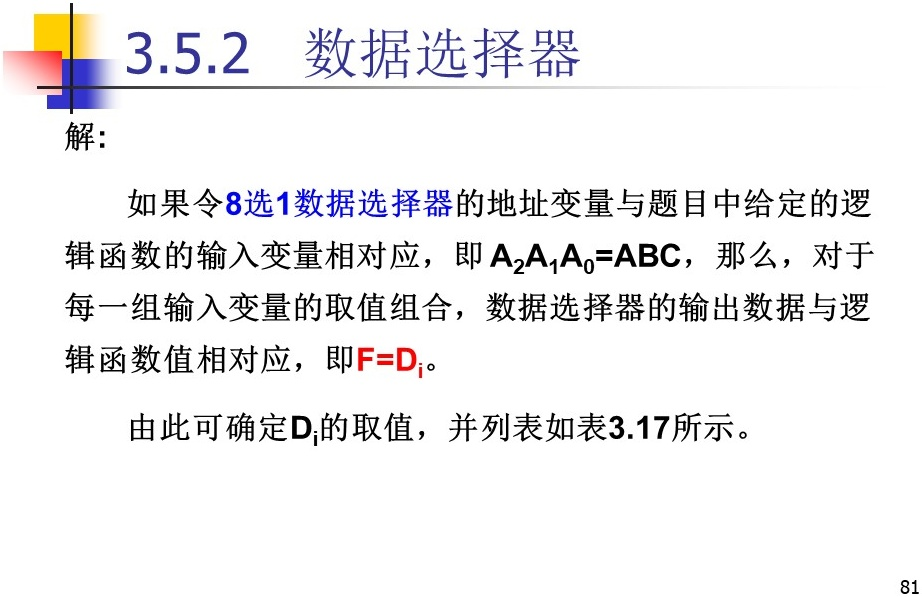

4. **电路接线结论**：
   * **地址输入端**：$A_2 \to A, A_1 \to B, A_0 \to C$（高位对高位，低位对低位）。
   * **使能控制端**：$\overline{G} \to 0$。
   * **数据输入端**：$D_0 = D_1 = D_2 = D_6 = 0$（统一接 GND）；$D_3 = D_4 = D_5 = D_7 = 1$（统一接高电平 $V_{CC}$）。

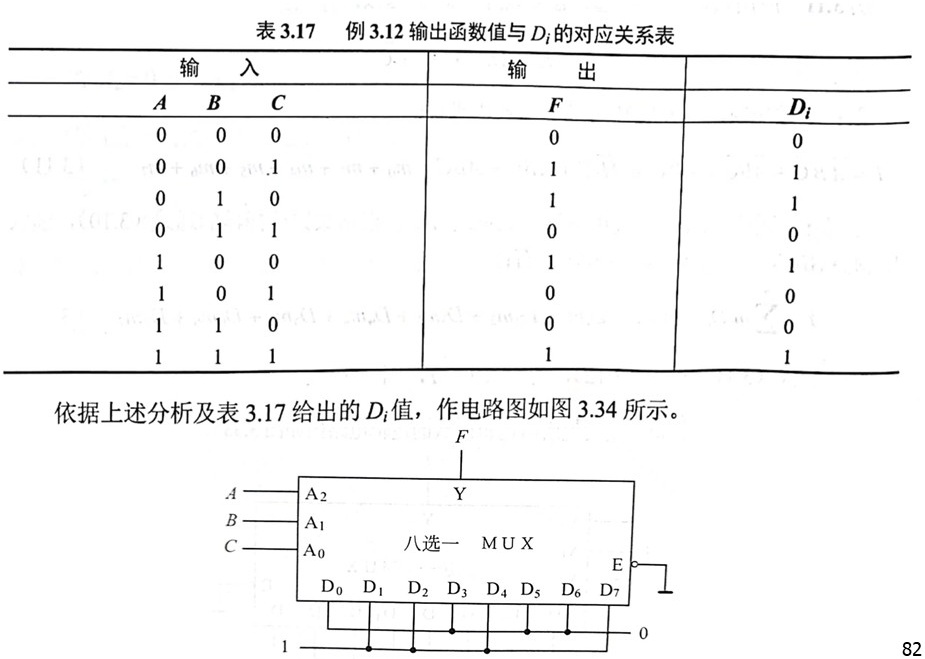

### 3.4 组合逻辑电路中的竞争-冒险（大考必拿分）

<mark>**重点提示：竞争-冒险是期末核心高频考点，对应有例题 3.18、3.19（1）（2）和 3.20，以及雨课堂课堂对应练习。**</mark>


#### 3.4.1 竞争-冒险的产生原因与判别

#### 1. 产生原因

在组合逻辑电路中，由于**门电路的传输延迟时间**不同，输入信号沿不同路径到达输出端的时间有先后区别（**竞争**）。这可能导致输出端产生瞬时错误的窄脉冲毛刺（**冒险**）。

* 产生条件：电路中存在由非门产生的**互补信号**（如 $A$ 和 $\overline{A}$）发生相反方向状态转换。

---

#### 🔍 经典竞争-冒险原理剖析电路（Slide 91, 92）

**【电路分析】** 逻辑电路输出逻辑表达式为 $F = AC + B\overline{A}$。

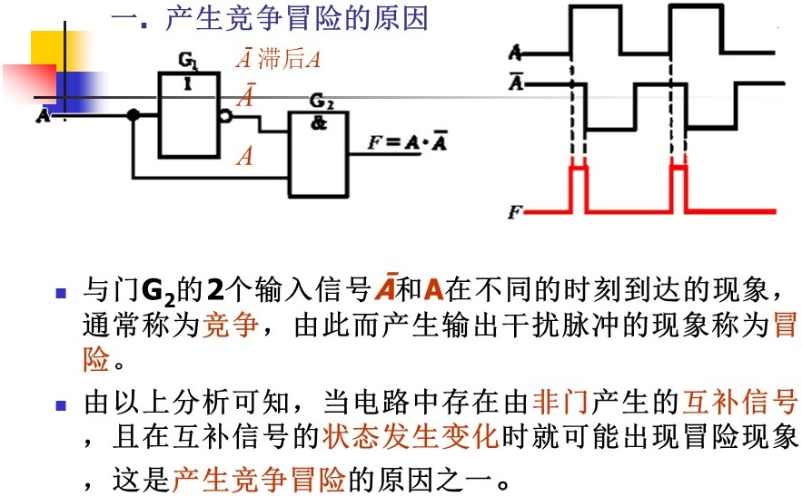

* **产生竞争**：当输入 $B = 1, C = 1$ 时，输出表达式变为稳定值 $F = A + \overline{A} = 1$。输入变量 $A$ 此时具有竞争能力。

* **瞬态分析**：稳态下 $F$ 恒等于 1。然而在输入 $A$ 从 $1 \to 0$ 跃迁时，由于非门反相器的传输延迟，$\overline{A}$ 由 $0 \to 1$ 变化慢了一步。在此极其短暂的过渡时间内，$A$ 已变成 $0$，而 $\overline{A}$ 还没来得及变成 $1$（即两者同时为 $0$）。这会导致与门 $AC$ 变为 $0$ 且与门 $B\overline{A}$ 仍为 $0$，从而使得或门输出 $F$ 瞬间跌落到 $0$，产生了一个极窄的**负电压脉冲（负向毛刺冒险）**。

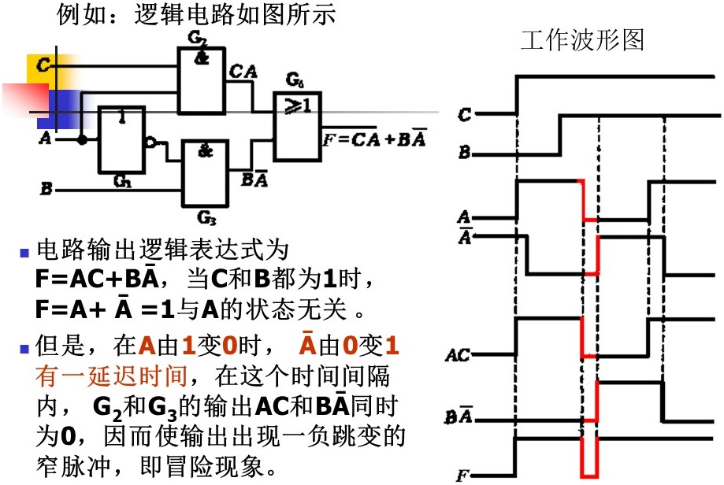

---

#### 2. 判别方法

#### 方法一：代数判别法

通过给电路的其他变量赋值，看是否能在特定状态下使输出表达式化简为以下互补形式：

* $L = A + \overline{A}$ （在由非门造成的过渡状态中可能产生负向毛刺冒险）

* $L = A \cdot \overline{A}$ （在由非门造成的过渡状态中可能产生正向毛刺冒险）

通过代数赋值化简为上述两种形式即可断定该变量存在竞争-冒险现象（具体判别与消除过程详见后文【PPT 经典真题】）。

#### 方法二：图形判别法——卡诺图相切法（★★ 极高频考点）


> [!IMPORTANT]
> **卡诺图判别黄金准则**
>
> 在组合逻辑电路的卡诺图中，若**存在两个卡诺圈相切（相邻）**，且**相切边界没有被另外的卡诺圈所包围**，则当输入变量在相切边界对应的两个最小项之间跃迁（即互补变量变化）时，电路必定会产生竞争-冒险现象。

---

#### 3.4.2 消除冒险的方法

#### 1. 修改逻辑设计法（增加多余项法，★★★ 最常考）

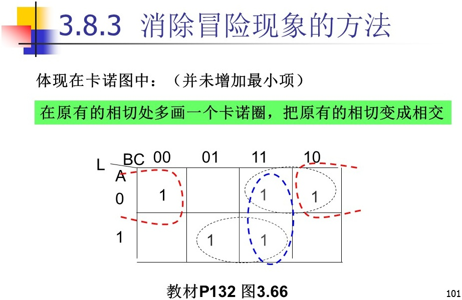

* **操作方法**：

  * 在卡诺图相切的两个卡诺圈之间，**人为补画一个重叠的卡诺圈**，将原相切边界“包围”住。

  * 将这个新卡诺圈对应的与项（多余项）加到原逻辑表达式中。

  * **原理**：当输入变量在相切边界转换时，新增加的与项恒为 `1`（或 `0`），从而封锁了发生竞争变化的支路，封锁了电压毛刺。

#### ✍️ 【PPT 经典真题】组合逻辑电路竞争-冒险的图形判别与增加多余项消除（Slide 100, 101）

**【题目】** 已知一组合逻辑电路的输出逻辑函数为 $L = AC + \overline{A}B + \overline{A}\overline{C}$：
1. 分析该电路是否会产生竞争-冒险？如果会，在什么输入条件下，哪个自变量会发生竞争-冒险？
2. 利用卡诺图判定法，画出函数的卡诺图，分析乘积项（卡诺圈）之间的关系，指出产生竞争-冒险的根本原因。
3. 利用修改逻辑设计（增加多余项）的方法，给出消除竞争-冒险后的逻辑表达式。

**【解题步骤与图片解析】**

1. **第一步：代数判别（分析竞争源与冒险条件）**：
   * **识别竞争变量**：自变量 $A$ 和 $C$ 同时以原变量 and 反变量的形式存在于不同的乘积项中，因此 $A$ 和 $C$ 是**潜在的竞争变量**。
   * **判定变量 $C$ 是否有冒险**：对于 $C$，无论 $A, B$ 取何种值，输出表达式都无法简化为 $C \cdot \overline{C}$ 或 $C + \overline{C}$ 的形式，故变量 $C$ 不会产生冒险。
   * **判定变量 $A$ 是否有冒险**：为使乘积项与自变量 $A$ 相关，我们赋稳定状态值 $B = 1, C = 1$。此时：
     $$L = A \cdot (1) + \overline{A} \cdot (1) + \overline{A} \cdot (0) = A + \overline{A}$$
   * **结论**：当 $B = 1, C = 1$ 时，表达式化简为 $L = A + \overline{A}$。在 $A$ 发生跳变的极其短暂的反相延迟时间内，可能出现 $A = \overline{A} = 0$ 的瞬态，导致输出 $L$ 瞬间产生负向电压毛刺。因此，**在 $B=1, C=1$ 且 $A$ 跳变时，电路线路会产生关于自变量 $A$ 的竞争-冒险**。

2. **第二步：图形判别（卡诺图相切法定位冒险）**：
   * **画出卡诺图**：在卡诺图中圈出三个卡诺圈：与项 $AC$ 对应的卡诺圈，与项 $\overline{A}B$ 对应的卡诺圈，以及与项 $\overline{A}\overline{C}$ 对应的卡诺圈。
   * **图形关系分析**：卡诺圈 $\overline{A}\overline{C}$ 与 $\overline{A}B$ 在 $m_2$ 处重叠（相交关系）；而卡诺圈 $AC$ 与 $\overline{A}B$ 在 $BC = 11$ 处是**相切（相邻）**的，且该相切边界（$m_3$ 与 $m_7$ 之间）**未被任何其他圈包围**！这在图形上直接对应了代数法分析出的 $B=1, C=1$ 时的冒险状态。

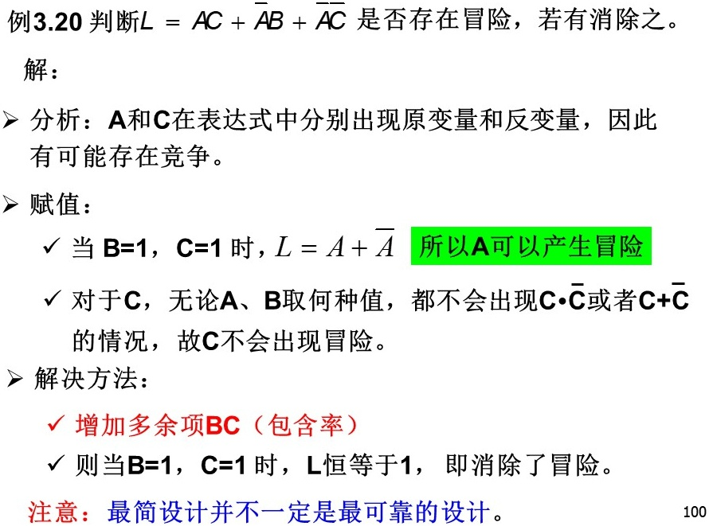

3. **第三步：修改逻辑消除（补加重叠卡诺圈法）**：
   * **增设冗余卡诺圈**：在这两个卡诺圈相切（相邻）的交界处，**额外补画一个合并的重合卡诺圈**，将这个切口包围。
   * **提取新增与项**：该新增卡诺圈覆盖了最小项 $m_3(011)$ and $m_7(111)$，对应消去了跳变变量 $A$，对应的乘积项提取为 $BC$。


   * **写出最终表达式**：将此冗余项 $BC$ 作为多余项加到原函数中，得到最终消除冒险的逻辑表达式：
     $$L' = AC + \overline{A}B + \overline{A}\overline{C} + BC$$
   * **消除原理**：当 $B = 1, C = 1$ 时，新增乘积项 $BC = 1$，无论 $A$ 怎么变化、反相器有多少延迟，输出 $L'$ 都将被 $BC$ 项死死拉高在 `1`，从而在物理电路上彻底滤除了负向毛刺，消除了竞争-冒险！


---

#### 2. 加滤波电容法（Slide 103, 104）
由于竞争冒险产生的毛刺脉冲一般极窄（仅纳秒级），在输出端**并联一个小电容**（几十至几百 pF），利用电容充放电的平滑滤波作用，将尖峰毛刺幅度降到逻辑门阈值以下。
* **物理代价**：会导致输出信号波形的前后沿变缓，仅适用于低速电路。

#### 3. 加选通脉冲法（Slide 105）
引入一个窄脉冲作为**选通信号**。在输入信号发生跃迁的毛刺高发期，选通信号处于禁止状态（封锁输出）；待输入稳定后令选通信号有效允许输出，从而避开瞬态毛刺。


<div style="page-break-after: always;"></div>

## 数电期末复习冲刺宝典：第四章 触发器

本复习宝典完全根据**任课老师课堂课件（4.1 至 4.4 节）**的核心考点与期末教学大纲提炼整理。考虑到第四章在期末考试中占比较低，主要作为第五章《时序逻辑电路》的分析与设计基石，因此本章复习采取**“核心概念精准突破、重难公式极简记忆”**的策略，帮助大家以最少的时间攻克所有可能的概念识别与填空选择考点。

---

> [!IMPORTANT]
> ### 🎯 第四章期末备考与必做重点清单
> * 📌 **教材必做练习**：课本关于触发器逻辑功能、特性方程与特性表的互转练习（如 D 触发器转换为 JK 或 T 触发器）。
> * 📌 **期末核心考点**：
>   * **触发器逻辑功能（核心重点）**：熟记 JK、D、T/T' 三种核心触发器的特性表和特性方程（D 触发器是计数器与控制器设计的绝对核心！），并掌握触发器逻辑功能的相互转换（联立特性方程求解）。
>   * **脉冲工作特性**：理解触发器按电路结构（基本、同步、主从、边沿）演进的特点、改进之处与主要局限（如基本RS的互补约束、同步触发器的空翻现象、主从JK的一次变化现象等）。
> * 📌 **强化训练与课件**：雨课堂课堂对应练习与课后题，以及课件各种触发器的原理剖析图。
### 一、 触发器的分类与工作特点（4.2）

期末复习只需掌握各触发器的结构演进逻辑、工作特点与主要局限：

#### 1. 基本RS触发器
* **改进之处**：组合逻辑电路**引入反馈**。
* **主要特点**：有两个稳定状态，具有记忆功能，可以置1、置0。
* **局限与问题**：未与时间序列建立联系（无时钟控制），存在输入约束条件。

#### 2. 同步RS触发器
* **改进之处**：在基本RS触发器的基础上，**引入时钟脉冲 CP**。
* **主要特点**：与时间序列建立了联系，奠定了同步的基础。
* **局限与问题**：出现了**空翻现象**（CP=1期间输入多次变化导致输出多次翻转），且输入约束条件仍然存在。

#### 3. 主从RS触发器
* **改进之处**：在同步RS触发器的基础上，**引入主从结构**。
* **主要特点**：解决了空翻问题（每个 CP 周期输出状态最多只翻转一次）。
* **局限与问题**：输入约束条件仍然存在。

#### 4. 主从JK触发器
* **改进之处**：在主从RS触发器的基础上，**把输出 $Q, \overline{Q}$ 反馈到输入端**。
* **主要特点**：去除了输入约束条件（无输入禁区）。
* **局限与问题**：存在**一次变化问题**（在 CP=1 期间，主触发器状态只能翻转一次，对噪声干扰敏感）。

#### 5. 边沿触发器
* **改进之处**：在主从触发器的基础上，**缩短输入信号有效作用时间**（采用瞬时边沿触发）。
* **主要特点**：极大地提高了抗干扰能力，完美克服了“空翻”与“一次变化”现象。
* **局限与问题**：无明显局限。

### 二、 三大核心触发器的逻辑功能与描述（4.3）

同一电路结构可以构成不同逻辑功能的触发器；反之，同一逻辑功能也可以由不同电路结构实现。期末考试要求**熟记三大核心触发器（JK、D、T）的特性表与特性方程**。

#### 1. JK 触发器 —— 最全能的“多功能触发器”
* **特性方程**（★ 必背）：
  $$Q^{n+1} = J\overline{Q^n} + \overline{K}Q^n$$
* **特性表（状态转换表）**：
  | $J$ | $K$ | $Q^{n+1}$ (次态) | 逻辑功能说明 |
  | :-: | :-: | :-: | :--- |
  | **0** | **0** | $Q^n$ | **保持**（原状态不变） |
  | **0** | **1** | **0** | **置 0**（强行复位） |
  | **1** | **0** | **1** | **置 1**（强行置位） |
  | **1** | **1** | $\overline{Q^n}$ | **翻转**（状态变反，用于计数） |
* **记住结论**：JK 触发器功能最全（可保持、置0、置1、翻转），输入无任何禁区。

#### 2. D 触发器 —— 期末考试“绝对第一主角”与设计核心（★★★★★ 重点中的重点）

> [!IMPORTANT]
> 📌 **为什么 D 触发器是核心？**
> * **地位**：现代时序逻辑电路（寄存器、计数器、FPGA等）中，**95%以上均采用 D 触发器作为基本单元**。
> * **物理机制**：完美实现**数据跟随与稳定锁存**（在 CP 沿到来瞬间采样输入 $D$，其余时刻完全锁存保持）。

* **电路逻辑符号**：
  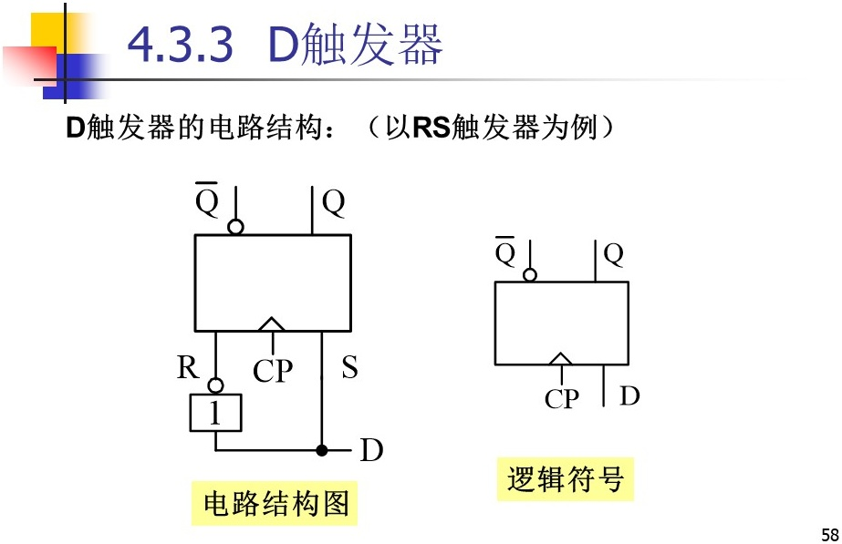

* **特性方程**（★ 必背中的必背，秒杀一切转换题的基础）：
  $$Q^{n+1} = D$$

* **特性表（状态转换表）**：
  | $D$ | $Q^{n+1}$ (次态) | 逻辑状态说明 | 核心物理功能 |
  | :-: | :-: | :--- | :--- |
  | **0** | **0** | **置 0**（强行清零） | **跟随特性**：CP有效沿瞬间，输出 $Q$ 像镜子一样完全复制输入 $D$。 |
  | **1** | **1** | **置 1**（强行置位） | **记忆特性**：CP有效沿之外的全部时刻，输出 $Q$ 保持稳定不变。 |

* **💡 极速秒杀：以 D 触发器为核心的功能转换（期末必考大题）**
  考试中若考到“**利用 D 触发器实现其他触发器（JK 或 T）**”，只需掌握**驱动方程联立秒杀法**：
  1. **已有触发器特性方程**（这里已有的是 D 触发器）：
     $$Q^{n+1} = D$$
  2. **目标触发器特性方程**：
     * **若目标是 JK 触发器**：$Q^{n+1} = J\overline{Q^n} + \overline{K}Q^n$
     * **若目标是 T 触发器**：$Q^{n+1} = T\overline{Q^n} + \overline{T}Q^n = T \oplus Q^n$
     * **若目标是 T' 触发器**：$Q^{n+1} = \overline{Q^n}$
  3. **联立直接得出外接组合逻辑的输入（驱动方程）**：
     由于两者的次态 $Q^{n+1}$ 必须完全等价，直接令 $D$ 等于目标特性方程的右侧即可：
     * **改装为 JK 触发器**：输入端外接逻辑电路为 $D = J\overline{Q^n} + \overline{K}Q^n$
     * **改装为 T 触发器**：输入端外接逻辑电路为 $D = T \oplus Q^n$
     * **改装为 T' 触发器**：只需将输入端 $D$ 直接反相连接到本触发器的反相输出端即可，即 $D = \overline{Q^n}$。

#### 3. T 与 T' 触发器 —— 核心的“翻转/计数触发器”
* **电路逻辑符号**：
  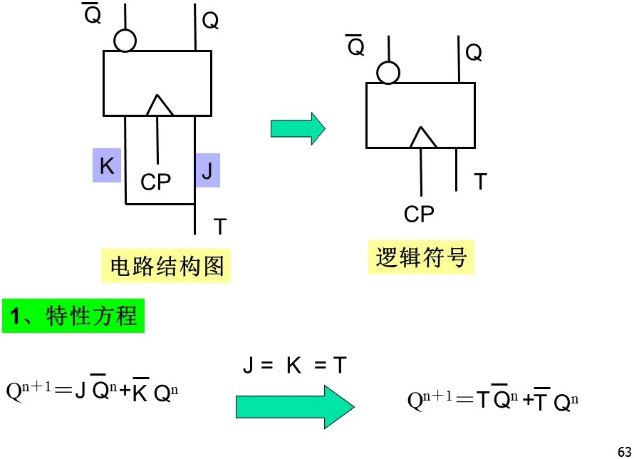
* **特性方程**（★ 必背）：
  $$Q^{n+1} = T\overline{Q^n} + \overline{T}Q^n = T \oplus Q^n$$
* **特性表（状态转换表）**：
  | $T$ | $Q^{n+1}$ (次态) | 逻辑功能说明 |
  | :-: | :-: | :--- |
  | **0** | $Q^n$ | **保持**（原状态不变） |
  | **1** | $\overline{Q^n}$ | **翻转**（状态变反） |
* **T' 触发器**（固定接高电平 $T=1$ 的 T 触发器，★ 极频考点）：
  * **特性方程**：
    $$Q^{n+1} = \overline{Q^n}$$
  * **记住结论**：每来一个 CP 时钟脉冲，状态就翻转一次。这被广泛用于**二分频电路（分频器）**和**二进制计数器**的基本单元。

> [!NOTE]
> 📌 **经典真题：下降沿触发 T 触发器波形绘制（Slide 66 例4.7）**
> 
> * **例题题干**：一下降沿触发的 T 触发器输入信号如下图所示，设触发器初始状态为 0，试画出输出端 $Q$ 的时序波形。
> 
> 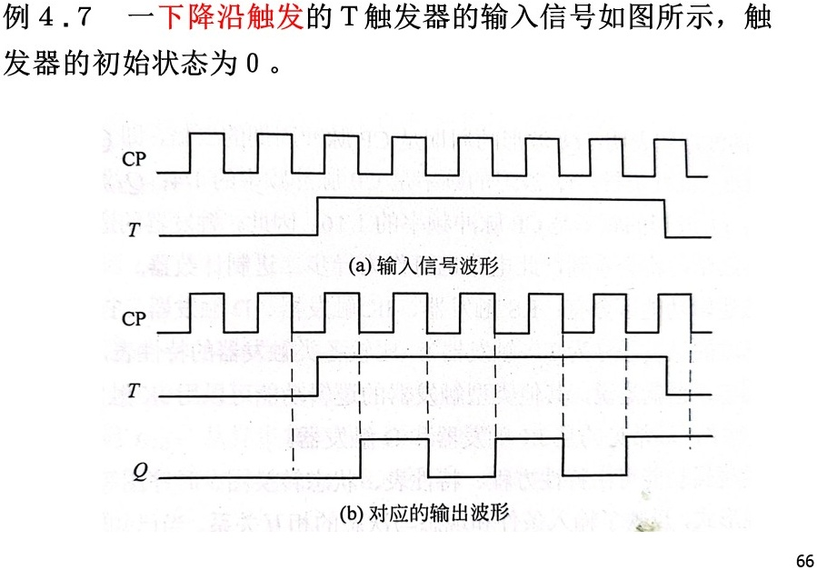
> 
> * **名师极速解题思路（秒杀技巧）**：
>   1. **标出沿时刻**：首先在 CP 信号的**所有下降沿（即由 1 变 0 的瞬间，$\downarrow$）**画出虚线垂线。输出状态 $Q$ **仅在虚线垂线时刻可能发生跳变**，其余时刻一律保持水平线不变！
>   2. **逐沿判断**：
>      * **第 1 个下降沿**：此时输入信号 $T = 1$。根据特性方程 $Q^{n+1} = \overline{Q^n}$，状态发生翻转，由初态 $0 \to 1$。
>      * **第 2 个下降沿**：此时输入信号 $T = 0$。根据特性方程 $Q^{n+1} = Q^n$，状态保持不变，维持 1。
>      * **第 3 个下降沿**：此时输入信号 $T = 1$。状态再次翻转，由 $1 \to 0$。
>      * **第 4 个下降沿**：此时输入信号 $T = 1$。状态再次翻转，由 $0 \to 1$。

---
### 三、 触发器的动态脉冲工作特性（4.4）

为确保触发器稳定工作，输入信号与时钟 CP 之间必须满足特定时间关系。**期末必考选择/填空结论**：

1. **建立时间 ($t_{set}$)**：输入信号必须**先于**时钟 CP 触发沿到达的**最小时间间隔**（提前稳定）。
2. **保持时间 ($t_H$)**：输入信号在时钟 CP 触发沿到达**之后**必须继续保持稳定的**最小时间间隔**（延时撤销）。
3. **传输延迟时间 ($t_{PLH}/t_{PHL}$)**：从 CP 触发沿开始，到输出端 $Q$ 状态稳定建立所需的延迟时间。
4. **最大时钟频率 ($f_{max}$)**：触发器能可靠翻转的最高工作频率。若超出该频率，触发器将无法正常翻转，甚至导致逻辑混乱。
---

<div style="page-break-after: always;"></div>

## 数电第五章《时序逻辑电路》快速提分复习指南

> [!IMPORTANT]
> ### 🎯 第五章期末备考与必做重点清单
> * 📌 **教材必做练习**：课本课后习题 **5.18**（时序逻辑电路分析与设计大题）。
> * 📌 **期末核心考点**：
>   * **时序逻辑电路分析（必考大题）**：同步时序逻辑电路分析步骤（三阶方程式：输出、驱动、状态方程；状态表；状态转换图；判断自启动并概括功能）；异步时序逻辑电路分析（写出各级时钟方程，根据前级输出沿跳变逐级分析状态变化并绘制波形时序图）。
>   * **移位寄存器与计数器**：掌握移位寄存器 74194 的状态控制口诀（00保持、01右移、10左移、11置数）及串并转换作用；熟练使用 74161 集成计数器设计任意进制计数器（异步反馈清零法译码 $M$ 状态，同步反馈置数法译码 $M-1$ 状态并接零输入），准确画出电路接线图。
>   * **序列信号发生器（高频大题）**：掌握利用 74161 计数器与 74LS151 数据选择器结合，产生循环串行序列信号的设计步骤与连线方法。
> * 📌 **强化训练与课件**：课后习题 5.18，雨课堂课堂练习，以及课件 74161 接线图。
本复习指南完全基于**任课老师课堂课件（5.1 至 5.5 节）**的核心考点与期末教学大纲提炼整理。时序逻辑电路是数字电子技术期末考试中**分值占比最高、综合性最强**的压轴大题来源。掌握好时序电路的分析步骤、移位寄存器/计数器中规模芯片的应用、以及序列信号发生器的设计，是期末冲刺拿高分的关键。

---

### 一、 时序逻辑电路的特点与描述方法（5.1）

#### 1. 时序逻辑电路的一般结构与特点

* **结构特点**：时序逻辑电路是由**存储电路（触发器）**和**组合逻辑电路**两部分组成，并且存储电路的输出又反馈到组合逻辑电路的输入端，形成**反馈环路**。
* **逻辑功能**：电路在任何时刻的输出信号，不仅与当时的输入信号有关，而且与电路原来的状态（即存储电路原有的状态）有关，具有**记忆功能**。

#### 2. 时序逻辑电路的分类
* **按各触发器状态转换时间**：
  * **同步时序电路**：所有触发器共用同一个时钟源，状态转换在同一时钟脉冲沿同步发生。
  * **异步时序电路**：触发器的时钟源不同，状态转换有先有后。
* **按逻辑功能分**：寄存器、移位寄存器、计数器、顺序脉冲发生器、序列信号发生器等。

#### 3. 时序逻辑电路的描述方法（三阶方程与四种形式）
* **输出方程**：描述输出信号与输入、现态的关系：
  $$Z = F(X, Q^n)$$
* **驱动方程（激励方程）**：描述存储电路的输入（触发器输入端）与外部输入、现态的关系：
  $$Y = G(X, Q^n)$$
* **状态方程**：将驱动方程代入触发器的特性方程（如 JK 触发器或 D 触发器特性方程），得到描述次态与现态、输入的关系：
  $$Q^{n+1} = H(Y, Q^n)$$

> [!NOTE] 📌 判断时序逻辑电路的必要条件
> 电路中是否包含**触发器**是判断时序逻辑电路的必要条件，而有没有反馈环路并不是唯一的必要条件。

---

### 二、 时序逻辑电路的分析方法（★ 期末必考大题 ★）（5.2）

时序逻辑电路的分析是期末考试中**分值最高（15-20分）、难度最大**的必考大题。为了拿到满分，必须遵循标准的答题步骤。

> [!IMPORTANT]
> 🏆 **期末大题阅卷标准拿分模板与评分点**
> 
> * **第一步：写出逻辑方程式 (占 4 分)** —— 驱动方程（触发器输入端逻辑）与输出方程必须**明确分立写出**。
> * **第二步：求出状态方程 (占 3 分)** —— 将驱动方程代入触发器特性方程（如 JK 触发器为 $Q^{n+1} = J\overline{Q} + \overline{K}Q$，D 触发器为 $Q^{n+1}=D$），代入后必须**化为最简形式**。
> * **第三步：列出状态转换表 (占 4 分)** —— 必须从初始状态（默认从 `00...0`）开始计算次态与输出 $Z$，逐行递推。若电路含有输入控制变量 $X$，**必须分 $X=0$ 和 $X=1$ 双栏**列出，否则直接扣 2 分！
> * **第四步：画出状态转换图 (占 3 分)** —— 标出有效状态循环。**千万注意**：必须将无效状态（未使用的状态）代入方程计算，画出它们在时钟 CP 作用下的跳变箭头。
> * **第五步：逻辑功能总结 (占 2 分)** —— 明确概括：① 电路是多少进制计数器；② 是加法、减法还是可逆计数器；③ **必须指明是否具有“自启动”能力**（无效状态均能自动进入有效循环 $\implies$ 可自启动；若留在无效状态死循环 $\implies$ 不能自启动，必须提出置数改进方案）。

> [!WARNING]
> ⚠️ **异步时序电路分析的致命死穴：时钟方程**
> * 在分析异步电路时，**必须首先写出时钟方程 $CP_i$**！因为各触发器的时钟不一致，前级的输出往往作为后级的时钟。
> * **跳变沿跃迁判定**：若触发器为下降沿触发（引脚带圈），则只有当 $CP_i$ 出现由 **$1 \to 0$（下降沿）** 的跃迁瞬间，该触发器才翻转；若没有有效沿，该触发器将**死死保持原状态不变（次态 = 现态）**！这是异步时序图和状态表分析最易出错的扣分点。

---

#### 🌟 课件经典大题 1：无控制输入同步时序电路功能分析（Slide 11-17）

**【题目】** 试分析如图 5.1 所示的同步时序逻辑电路的逻辑功能，判断其是否具有自启动能力。

<div align="center">
  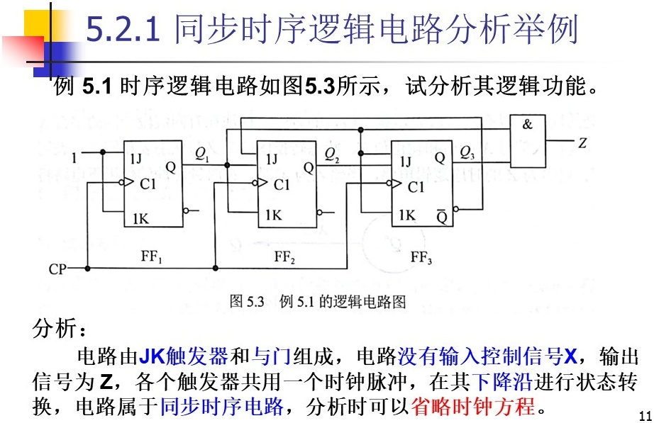
</div>

**【详细解析步骤】**

1. **第一步：写出各逻辑方程式**：
   * **驱动方程**（分析输入端连线）：
     $$J_1 = 1, \quad K_1 = 1$$
     $$J_2 = Q_1 \overline{Q}_3, \quad K_2 = Q_1$$
     $$J_3 = Q_1 Q_2, \quad K_3 = Q_1$$
   * **输出方程**（分析与门引脚）：
     $$Z = Q_1 Q_3$$

2. **第二步：求得状态方程**：
   将驱动方程代入 JK 触发器的特性方程 $Q^{n+1} = J\overline{Q}^n + \overline{K}Q^n$ 中：
   * 触发器 $FF_1$：
     $$Q_1^{n+1} = 1 \cdot \overline{Q}_1^n + \overline{1} \cdot Q_1^n = \overline{Q}_1^n$$
   * 触发器 $FF_2$：
     $$Q_2^{n+1} = (Q_1^n \overline{Q}_3^n)\overline{Q}_2^n + \overline{Q}_1^n Q_2^n$$
   * 触发器 $FF_3$：
     $$Q_3^{n+1} = (Q_1^n Q_2^n)\overline{Q}_3^n + \overline{Q}_1^n Q_3^n$$

3. **第三步：列出状态转换表（Slide 13）**：
   从 $Q_3^n Q_2^n Q_1^n = 000$ 开始代入方程，逐级推算次态 $Q_3^{n+1} Q_2^{n+1} Q_1^{n+1}$：

**表 5.1 同步电路状态转换表**
| 现态 $Q_3^n Q_2^n Q_1^n$ | 次态 $Q_3^{n+1} Q_2^{n+1} Q_1^{n+1}$ | 输出 $Z$ | 说明 |
| :---: | :---: | :---: | :--- |
| **000** | **001** | 0 | 有效状态 |
| **001** | **010** | 0 | 有效状态 |
| **010** | **011** | 0 | 有效状态 |
| **011** | **100** | 0 | 有效状态 |
| **100** | **101** | 0 | 有效状态 |
| **101** | **000** | 1 | 有效状态（回到初态，产生进位） |
| **110 (无效)** | **001** | 0 | 无效状态跳变 |
| **111 (无效)** | **000** | 1 | 无效状态跳变 |

4. **第四步：画出状态转换图（Slide 14）**：

<div align="center">
  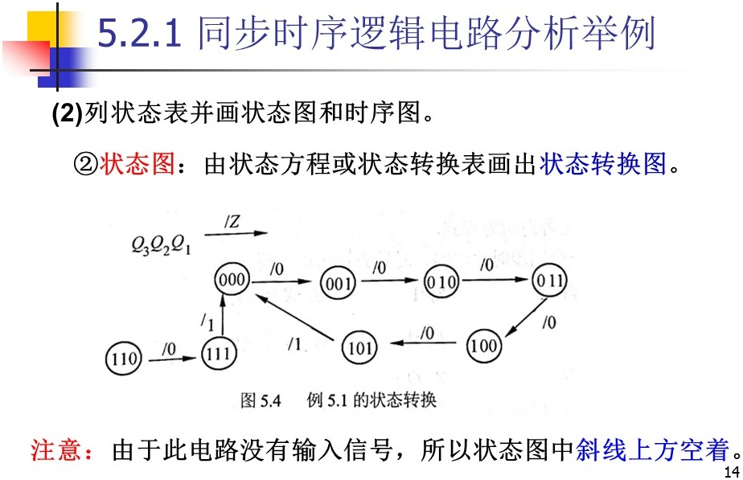
</div>

5. **第五步：逻辑功能总结（Slide 17）**：
   * **计数状态**：电路的有效状态为 `000 -> 001 -> 010 -> 011 -> 100 -> 101 -> 000`，共有 6 个有效状态，因此电路是一个**同步六进制加法计数器**，输出 $Z$ 为进位信号。
   * **分频作用**：输出进位 $Z$ 的变化频率是时钟 CP 脉冲频率的六分之一，可用作 **6 分频器**。
   * **自启动判定**：无效状态 `110` 在 CP 脉冲作用下进入有效状态 `001`，无效状态 `111` 作用下进入有效状态 `000`。**无效状态均能自动进入有效循环，因此电路可以自启动**。

---

#### 🌟 课件经典大题 2：含输入控制的同步可逆计数器分析（Slide 18-23）

**【题目】** 试分析如图 5.2 所示的时序逻辑电路的逻辑功能。

<div align="center">
  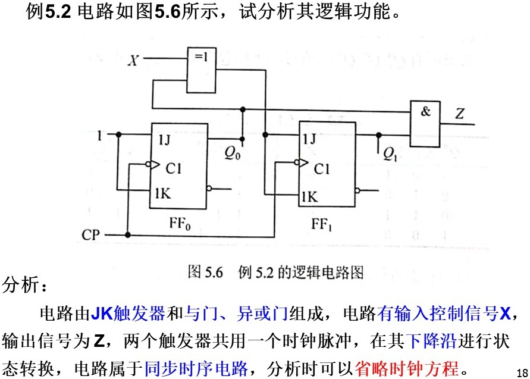
</div>

**【详细解析步骤】**

1. **第一步：写出各逻辑方程式**：
   * **驱动方程**：
     $$J_0 = K_0 = 1$$
     $$J_1 = K_1 = X \oplus Q_0 = X\overline{Q}_0 + \overline{X}Q_0$$
   * **输出方程**（结合电路异或门与与门）：
     当 $X=0$ 时作为加法进位输出，当 $X=1$ 时作为减法借位输出。课件中简化给出为：
     $$Z = X\overline{Q}_1\overline{Q}_0 + \overline{X}Q_1Q_0$$
     *(注：Slide 19 中提取为 $Z = Q_1Q_0$ 是以加法进位为例，完整表达式受输入信号 $X$ 的控制)*

2. **第二步：求得状态方程**：
   将驱动方程代入 JK 触发器特性方程：
   * 触发器 $FF_0$：
     $$Q_0^{n+1} = 1 \cdot \overline{Q}_0^n + \overline{1} \cdot Q_0^n = \overline{Q}_0^n$$
   * 触发器 $FF_1$：
     $$Q_1^{n+1} = (X \oplus Q_0^n)\overline{Q}_1^n + \overline{(X \oplus Q_0^n)}Q_1^n = X \oplus Q_0^n \oplus Q_1^n$$

3. **第三步：列出状态转换表并画出状态图（Slide 20, 21）**：

**表 5.2 同步可逆计数器状态表**
| 现态 $Q_1^n Q_0^n$ | $X=0$ 次态 $Q_1^{n+1} Q_0^{n+1}$ | $X=0$ 输出 $Z$ | $X=1$ 次态 $Q_1^{n+1} Q_0^{n+1}$ | $X=1$ 输出 $Z$ |
| :---: | :---: | :---: | :---: | :---: |
| 00 | 01 | 0 | 11 | 1 |
| 01 | 10 | 0 | 00 | 0 |
| 10 | 11 | 0 | 01 | 0 |
| 11 | 00 | 1 | 10 | 0 |

<div align="center">
  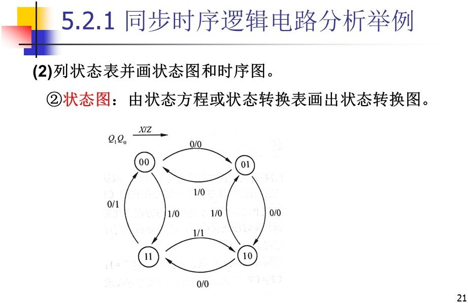
</div>

4. **第四步：逻辑功能总结**：
   * 当输入控制信号 **$X=0$** 时：电路状态按 $00 \to 01 \to 10 \to 11 \to 00$ 循环，为**四进制加法计数器**，输出 $Z$ 为进位信号（在 $11 \to 00$ 时产生进位脉冲）。
   * 当输入控制信号 **$X=1$** 时：电路状态按 $00 \to 11 \to 10 \to 01 \to 00$ 循环，为**四进制减法计数器**，输出 $Z$ 为借位信号（在 $00 \to 11$ 时产生借位脉冲）。
   * **总结**：该电路是一个**同步四进制可逆计数器**。

---

#### 🌟 课件经典大题 3：异步时序逻辑电路功能分析与波形绘制（Slide 24-30）

**【题目】** 试分析如图 5.3 所示异步时序逻辑电路的逻辑功能，并画出在 6 个 CP 脉冲下的时序波形图。

<div align="center">
  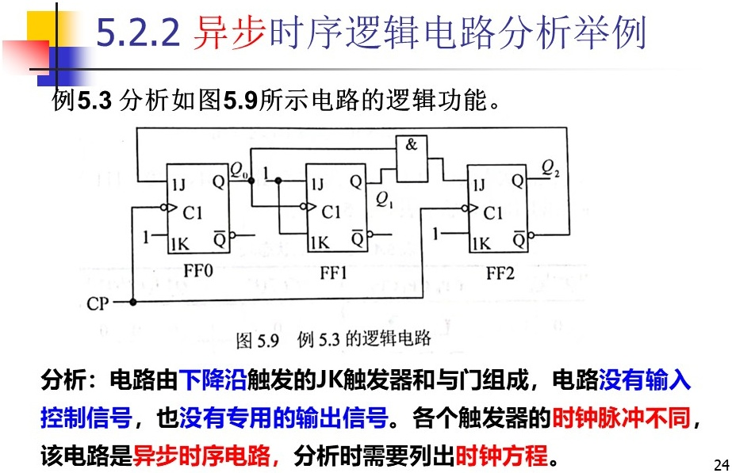
</div>

**【详细解析步骤】**

1. **第一步：写出各逻辑方程式**：
   * **时钟方程**（各触发器均为下降沿触发，★ 异步分析的关键死穴）：
     $$CP_0 = CP, \quad CP_1 = Q_0, \quad CP_2 = CP$$
     *(注：$FF_0$ 与 $FF_2$ 由主时钟 $CP$ 触发；$FF_1$ 的时钟信号取自 $FF_0$ 的输出端 $Q_0$)*
   * **驱动方程**：
     $$J_0 = \overline{Q}_2, \quad K_0 = 1$$
     $$J_1 = 1, \quad K_1 = 1$$
     $$J_2 = Q_1, \quad K_2 = \overline{Q}_0$$
   * **输出方程**：无专用输出信号。

2. **第二步：求得状态方程**（必须附带时钟触发条件）：
   将驱动方程代入特性方程：
   * $FF_0$（$CP_0 = CP$ 下降沿有效）：
     $$Q_0^{n+1} = \overline{Q}_2^n \overline{Q}_0^n$$
   * $FF_1$（$CP_1 = Q_0$ 下降沿有效）：
     $$Q_1^{n+1} = \overline{Q}_1^n$$
   * $FF_2$（$CP_2 = CP$ 下降沿有效）：
     $$Q_2^{n+1} = Q_1^n \overline{Q}_2^n + Q_0^n Q_2^n$$

3. **第三步：时序波形图绘制与状态递推（波形分析秒杀，Slide 26, 27）**：
   设电路初态 $Q_2Q_1Q_0 = 000$：

<div align="center">
  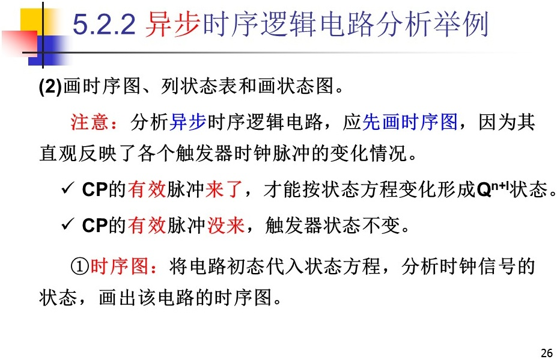
</div>

   * **第 1 个 CP 下降沿到来**：
     * $FF_0$ 接收到 CP 下降沿触发：计算 $Q_0^{n+1} = \overline{0} \cdot \overline{0} = 1$（$Q_0$ 从 $0 \to 1$ 发生**上升沿**，故 $CP_1$ 为上升沿，$FF_1$ **不触发翻转**，保持 $Q_1 = 0$）。
     * $FF_2$ 接收到 CP 下降沿触发：计算 $Q_2^{n+1} = 0 \cdot \overline{0} + 0 \cdot 0 = 0$。
     * 此时刻状态变化为：$000 \to 001$。
   * **第 2 个 CP 下降沿到来**：
     * $FF_0$ 触发：$Q_0^{n+1} = \overline{0} \cdot \overline{1} = 0$（$Q_0$ 从 $1 \to 0$ 产生**下降沿**，触发 $FF_1$ 翻转）。
     * $FF_1$ 被 $Q_0$ 下降沿触发：$Q_1^{n+1} = \overline{0} = 1$。
     * $FF_2$ 触发：$Q_2^{n+1} = 0 \cdot \overline{0} + 1 \cdot 0 = 0$。
     * 此时刻状态变化为：$001 \to 010$。
   * **第 3 个 CP 下降沿到来**：
     * $FF_0$ 触发：$Q_0$ 从 $0 \to 1$（上升沿，不触发 $FF_1$，$Q_1$ 维持 $1$）。
     * $FF_2$ 触发：$Q_2^{n+1} = 1 \cdot \overline{0} + 0 \cdot 0 = 1$。
     * 此时刻状态变化为：$010 \to 111$？注意：课件中 $010$ 的下一个有效状态为 $011$（请对照波形时序逐步推导）。
     * 最终推导出的有效循环为：
       $$000 \to 001 \to 010 \to 011 \to 100 \to 000$$

4. **第四步：列状态转换表与状态图（Slide 28, 29）**：

**表 5.3 异步电路状态转换表**
| 现态 $Q_2^n Q_1^n Q_0^n$ | 次态 $Q_2^{n+1} Q_1^{n+1} Q_0^{n+1}$ | 说明 |
| :---: | :---: | :---: |
| 000 | 001 | 有效状态 |
| 001 | 010 | 有效状态 |
| 010 | 011 | 有效状态 |
| 011 | 100 | 有效状态 |
| 100 | 000 | 有效状态（回到初态） |
| **101 (无效)** | **010** | 自动置入有效循环 |
| **110 (无效)** | **000** | 自动置入有效循环 |
| **111 (无效)** | **000** | 自动置入有效循环 |

<div align="center">
  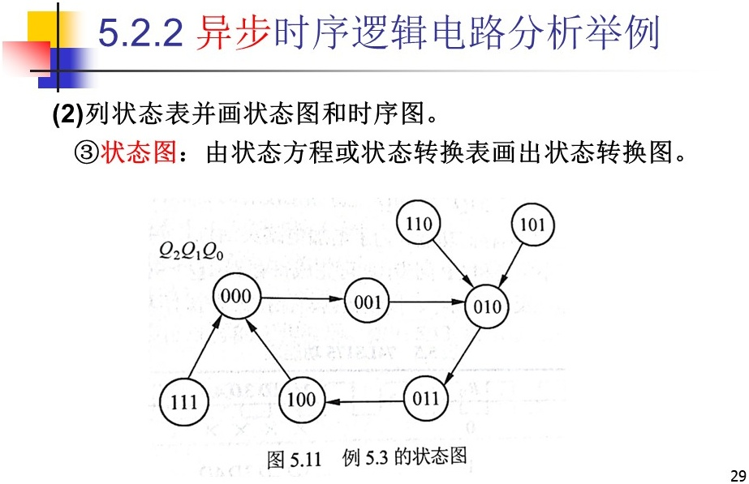
</div>

5. **第五步：逻辑功能总结**：
   * **结论**：该电路工作循环长度为 5，为**异步五进制加法计数器**，且无效状态均能进入有效循环，**电路可以自启动**。

---

<div style="page-break-after: always;"></div>

### 三、 寄存器与移位寄存器（5.3）

期末考查中，该小节通常不考查大题，只需**熟记寄存器的基本概念与移位寄存器的核心作用**即可。

#### 1. 基本概念
* **寄存器 (Register)**：用于接收并锁存多位二进制代码的电路。存储 $n$ 位二进制数需要 $n$ 个触发器。
* **移位寄存器 (Shift Register)**：具有移位功能的寄存器。在 CP 脉冲控制下，寄存器内的数据可以依次左移或右移。

#### 2. 移位寄存器的核心作用与应用场景 (期末高频选择/填空考点)
1. **串并转换（最核心作用）**：
   * **串行输入-并行输出 (SIPO)**：用 1 根信号线将数据逐位移入，再同时输出多位，用于节省引脚。
   * **并行输入-串行输出 (PISO)**：同时装载多位数，再通过 1 根线逐位送出，用于长距离串行通信。
2. **数据传输与延迟**：数据在每个 CP 时钟沿向后移动一位，可用作数字信号的延时线。
3. **数值乘除法（算术移位）**：
   * 二进制数**左移 1 位** $\implies$ 数值乘以 2。
   * 二进制数**右移 1 位** $\implies$ 数值除以 2。
   * 具有极高的运算速度，被微处理器广泛使用。
4. **构建环形计数器**：将输出端以某种反馈关系接回串行输入端，可构成各种循环状态计数器（如环形计数器、扭环形计数器）。

#### 3. 集成双向移位寄存器 74194（只需掌握工作状态控制）
74194 是一个 4 位双向集成移位寄存器，期末只需记住其功能控制端 $S_1, S_0$ 的工作状态转换规律（记忆口诀：**00保持、01右移、10左移、11置数**）：
* **$S_1 S_0 = 00$** $\implies$ **保持**（输出保持原态）
* **$S_1 S_0 = 01$** $\implies$ **右移**（次态 $= D_{SR} \ Q_A^n \ Q_B^n \ Q_C^n$）
* **$S_1 S_0 = 10$** $\implies$ **左移**（次态 $= Q_B^n \ Q_C^n \ Q_D^n \ D_{SL}$）
* **$S_1 S_0 = 11$** $\implies$ **并行置数**（在时钟有效沿直接载入输入端 $A, B, C, D$ 的数据）
* **$\overline{R_D} = 0$** $\implies$ **异步清零**（低电平直接清零，优先级最高，不受 $S_1, S_0$ 和 CP 时钟影响）
### 四、 计数器（5.4）

计数器是能够对输入时钟脉冲个数进行计数的时序电路，常用于计数、分频与定时。期末复习需熟练掌握其**分类、模的计算、频率分配规律以及 74161 集成芯片的基本应用**。

#### 1. 计数器的分类
* **按工作方式分类**：
  * **同步计数器**：所有触发器共用同一个 CP 时钟信号，状态翻转同步发生。
  * **异步计数器**：各触发器时钟不统一，前级的输出作为后级的时钟，状态翻转逐级延迟（存在毛刺）。
* **按计数规律分类**：
  * **加法计数器**（递增变化）、**减法计数器**（递减变化）、**可逆计数器**（由控制信号 $X$ 决定加或减）。
* **按进位数制（模）分类**：
  * **二进制计数器**、**十进制计数器**、**任意进制（$M$ 进制）计数器**。

#### 2. 模 (Modulus - $M$) 判定结论
* **模 (Modulus)** 是指计数器循环中**有效状态的总个数**。
* 一个由 $n$ 个触发器构成的计数器，其能表示的最大状态数（最大容量）为 $2^n$。
* 如果计数器的有效循环包含 $M$ 个状态（$M \le 2^n$），则该电路称为 **$M$ 进制计数器**（模为 $M$）。
* **触发器片数 $n$ 的估算**：若要设计一个模为 $M$ 的计数器，所需的触发器个数 $n$ 必须满足：
  $$2^{n-1} < M \le 2^n$$
  *(举例：设计一个十进制计数器 $M=10$，需要 $n=4$ 个触发器，因为 $2^3 < 10 \le 2^4$)*

#### 3. 频率计算与分频规律
* **整机分频**：模为 $M$ 的计数器，若输入时钟 CP 频率为 $f_{in}$，则其进位输出端（或工作循环输出端 $Z$）的脉冲频率 $f_{out}$ 为：
  $$f_{out} = \frac{f_{in}}{M}$$
  *(即该计数器可用作 **$M$ 分频器**)*
* **逐级分频**：对于 $n$ 位二进制加法计数器，第 $i$ 级触发器（$i$ 从 0 开始）输出端 $Q_i$ 的脉冲频率为：
  $$f_{Q_i} = \frac{f_{in}}{2^{i+1}}$$
  *(即 $Q_0$ 是二分频，$Q_1$ 是四分频，$Q_2$ 是八分频，$Q_3$ 是十六分频)*

#### 4. 中规模集成计数器 74161 功能速记
74161 是同步 4 位二进制加法计数器，是设计任意进制计数器的核心芯片。其逻辑状态如下（CP 上升沿 $\uparrow$ 触发）：

<div align="center">
  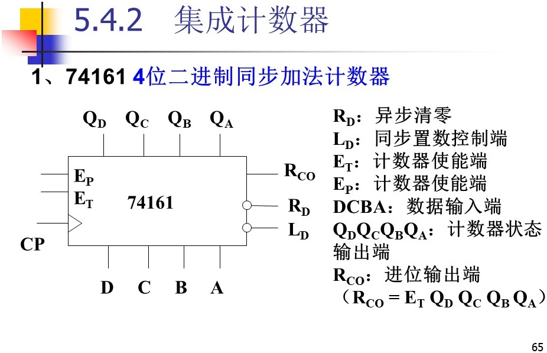
</div>

* **异步清零**：当 $\overline{R_D}=0$ 时，输出立即清零（优先级最高，独立于时钟）。
* **同步置数**：当 $\overline{R_D}=1$ 且 $\overline{L_D}=0$ 时，CP 上升沿到来时输出 $Q_D Q_C Q_B Q_A = D C B A$。
* **保持**：当 $\overline{R_D}=\overline{L_D}=1$ 且 $EP \cdot ET = 0$ 时，输出状态锁存保持不变（若 $ET=0$ 则进位输出 $RCO=0$）。
* **同步计数**：当 $\overline{R_D}=\overline{L_D}=1$ 且 $EP = ET = 1$ 时，CP 上升沿到来时输出状态递增加 1。
* **进位输出**：$RCO = ET \cdot Q_D Q_C Q_B Q_A$（在计数状态达最大值 `1111` 且 $ET=1$ 时输出高电平）。

#### 5. 用 74161 设计 $M$ 进制计数器的基本规律
* **反馈清零法 (利用异步 $\overline{R_D}$)**：
  * **法则**：在状态 **$M$** 处译码，将对应的二进制状态通过与非门接入 $\overline{R_D}$。
  * **举例**：设计六进制（状态 $0 \sim 5$），则在状态 **$6$**（$Q_2Q_1=11$）处译码，接入 $\overline{R_D}$。
* **反馈置数法 (利用同步 $\overline{L_D}$，推荐)**：
  * **法则**：在状态 **$M-1$** 处译码，接入 $\overline{L_D}$，并将置数输入端 $D C B A$ 接零（`0000`）。
  * **举例**：设计六进制（状态 $0 \sim 5$），则在状态 **$5$**（$Q_2Q_0=11$）处译码，接入 $\overline{L_D}$，输入 $D C B A = 0000$。

---
### 五、 顺序脉冲与序列信号发生器（5.5）

#### 1. 顺序脉冲发生器（分配器）
* **功能**：产生在时间上依次出现、不重叠的单脉冲序列。
* **常用结构**：
  * **环形移位寄存器法**：使用 74194 构成状态只有 1 个是 `1` 的循环右移（如 $1000 \to 0100 \to 0010 \to 0001$）。
  * **计数器 + 译码器法（Slide 71）**：74161 连接成计数工作状态，其输出 $Q_C Q_B Q_A$ 接入 **3-8 译码器 74LS138** 的地址选择端 $A_2 A_1 A_0$。译码器的输出端 $\overline{Y_0} \sim \overline{Y_7}$ 就会依次输出低电平顺序脉冲。

---

#### 2. 序列信号发生器（★ 期末必考大题 ★）

#### 🌟 课件经典大题 5：利用集成芯片设计序列信号发生器（Slide 73, 74）

**【题目】** 试使用同步集成计数器 74161 和八选一数据选择器 74LS151，设计一个能够循环产生 `01001101` 序列信号的电路。

<div align="center">
  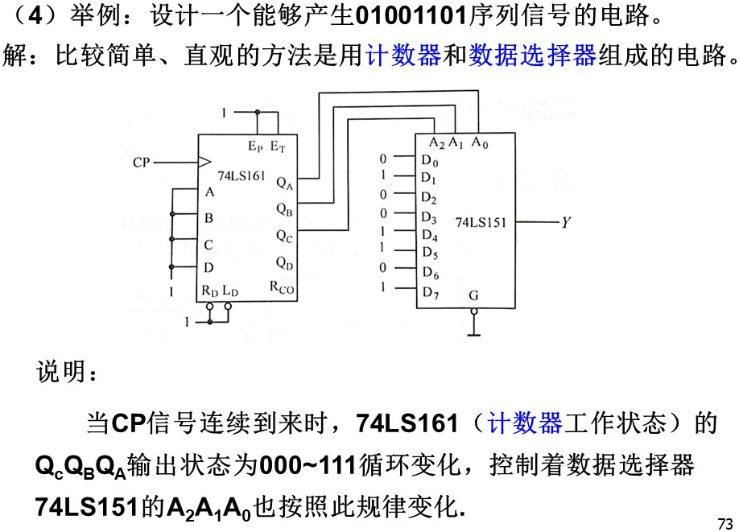
</div>

**【做题秒杀秘籍】**

1. **确定进制与芯片状态**：
   * 序列长度为 8（`01001101` 有 8 位），故需要八进制计数器。
   * 让 74161 处于正常同步计数状态，利用其低 3 位输出 $Q_C Q_B Q_A$ 作为八进制计数。当 CP 连续到来时，$Q_C Q_B Q_A$ 的状态在 $000 \sim 111$（即 $0 \sim 7$）之间循环变化。

2. **地址线与控制映射**：
   * 将 74161 计数器的输出 $Q_C, Q_B, Q_A$ 分别依次接至八选一数据选择器 74LS151 的地址输入选择端 $A_2, A_1, A_0$：
     $$A_2 = Q_C, \quad A_1 = Q_B, \quad A_0 = Q_A$$

3. **数据输入端状态确定（秒杀大招）**：
   * 74LS151 的输出 $Y$ 的通式为：
     $$Y = \sum_{i=0}^7 m_i D_i$$
   * 我们希望在 $Q_C Q_B Q_A$ 从 $000$ 计数到 $111$ 时，输出依次产生序列 `01001101`。
   * 因此，直接将序列的每一位对应连接到 74LS151 的数据输入端 $D_i$ 上：

**表 5.6 74LS151 输入端信号对照表**
| 计数状态 $Q_C Q_B Q_A$ | 对应地址 $A_2 A_1 A_0$ | 期望序列输出 $Y$ | 数据输入端 $D_i$ 设定接线 |
| :---: | :---: | :---: | :---: |
| 000 | 000 | **0** | $D_0 = 0$（接地 GND） |
| 001 | 001 | **1** | $D_1 = 1$（接高电平 $V_{CC}$） |
| 010 | 010 | **0** | $D_2 = 0$（接地 GND） |
| 011 | 011 | **0** | $D_3 = 0$（接地 GND） |
| 100 | 100 | **1** | $D_4 = 1$（接高电平 $V_{CC}$） |
| 101 | 101 | **1** | $D_5 = 1$（接高电平 $V_{CC}$） |
| 110 | 110 | **0** | $D_6 = 0$（接地 GND） |
| 111 | 111 | **1** | $D_7 = 1$（接高电平 $V_{CC}$） |

4. **电路接线结论**：
   * 74161：时钟接 CP，使能端 $EP = ET = 1$，$\overline{R_D} = \overline{L_D} = 1$（处于连续计数模式）。
   * 74LS151：使能端 $\overline{G} = 0$。地址选择端 $A_2A_1A_0$ 接入 $Q_C Q_B Q_A$。
   * 数据接线：$D_0 = D_2 = D_3 = D_6 = 0$（统一接 GND）；$D_1 = D_4 = D_5 = D_7 = 1$（统一接高电平 $V_{CC}$）。
   * 输出端 $Y$ 即为所需的循环序列信号 `01001101`。
