# 线性代数期末复习通关冲刺宝典（合订本）

## 前言与多端显示指南

本通关冲刺宝典为线性代数下册期末复习合订本，全面收录了第一章（行列式）至第四章（方阵的特征值与特征向量）的全部核心考点、秒杀考卡与黄金手算大题。

> [!IMPORTANT]
> **💡 终极阅读与多端显示指南 (🌟 强烈推荐使用 .md 源文件)**
> 
> * **【黄金推荐】直接阅读 Markdown (.md) 源码文档**：
>   * 为了帮您获得 100% 完美的公式高精度渲染与最极致的排版视觉，**强烈推荐您直接在原生 Markdown 编辑器（首选 [Typora](https://typora.io/) 或 [Obsidian](https://obsidian.md/)）中查看本 `.md` 文档**！本宝典专为 Markdown 原生排版深度重构，能为您提供极高信息密度且最流畅的备考视觉体验。
> * **如何开启完美高精公式渲染**：
>   * **Typora**：请在「偏好设置」->「Markdown」->「Markdown 扩展语法」中勾选**「内联公式」**与**「上标、下标」**，即可瞬间获得出版物级的高保真极精美数学公式显示。
>   * **Obsidian**：无须任何额外配置，原生 100% 完美支持本宝典的所有高阶公式排版、流程图和高精插图。
>   * **VS Code**：推荐安装 `Markdown All in One` 和 `Markdown Preview Enhanced` 插件以获得完美排版。

---
## 线代第一章《行列式》期末复习冲刺宝典

---

### 🚨 冲刺必背：第一章最强秒杀终极考卡 🚨

| 核心考点 | 核心公式 / 判定法则 | 考场避坑与秒杀技巧 |
| :--- | :--- | :--- |
| **排列逆序数** | $\tau(p) = \sum \text{后面比自己小的数码个数}$ | **对换**必改变排列奇偶性；奇偶排列各占 $\frac{n!}{2}$。 |
| **主三角行列式** | 上/下三角、对角行列式：$D = a_{11}a_{22}\dots a_{nn}$ | 值等于其主对角线元乘积。 |
| **副三角行列式** | 反对角、反三角：$D = (-1)^{\frac{n(n-1)}{2}}a_{1n}a_{2,n-1}\dots a_{n1}$ | **千万别漏掉前面的符号因子** $(-1)^{\frac{n(n-1)}{2}}$！ |
| **性质2：互换** | 互换两行（列）变号：$r_i \leftrightarrow r_j \implies D_1 = -D$ | 若有两行（列）完全相同，则行列式为 $0$。 |
| **性质3：倍乘** | 某一行（列）乘 $k \implies D_1 = kD$ | 提公因子是单行提！注意行列式与矩阵倍数的区别：$\vert kA \vert = k^n \vert A \vert$。 |
| **性质5：倍加** | 某行（列）的 $k$ 倍加到另一行（列）值不变：$r_i + kr_j \implies D_1 = D$ | **消元核心工具**，用于化上三角，值完全不变。 |
| **展开定理** | 同系展开为 $D$ ；异系展开为 $0$ | **代数余子式求和（代换法）**：求 $\sum c_k A_{ik}$ 等价于将 $D$ 的第 $i$ 行换成 $[c_1, \dots, c_n]$ 后求新行列式值。 |
| **范德蒙德** | $V_n = \prod_{1 \le j < i \le n} (x_i - x_j)$ | 特点是方幂递增。**注意乘积顺序**：后项减前项（下减上）。 |
| **克拉默法则** | $D \neq 0$ 时有唯一解 $x_j = \frac{D_j}{D}$ ； **齐次有非零解 $\iff D = 0$** | 仅适用于**方程个数 = 未知量个数**。 |

---

### 一、 二阶与三阶行列式及排列理论

#### 1. 二阶与三阶行列式计算

* **二阶行列式**：采用**对角线法则**：

$$D = \begin{vmatrix} a_{11} & a_{12} \\ a_{21} & a_{22} \end{vmatrix} = a_{11}a_{22} - a_{12}a_{21}$$

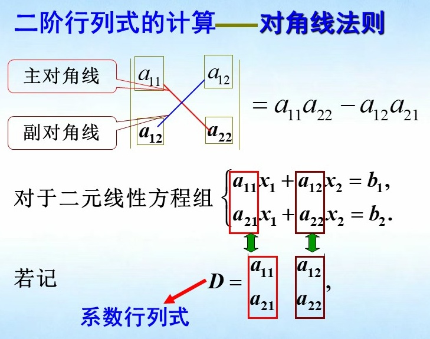

* **三阶行列式**：采用**对角线法则**或**沙路法 (Sarrus Rule)**，包含 6 项：

$$D = \begin{vmatrix} a_{11} & a_{12} & a_{13} \\ a_{21} & a_{22} & a_{23} \\ a_{31} & a_{32} & a_{33} \end{vmatrix} = a_{11}a_{22}a_{33} + a_{12}a_{23}a_{31} + a_{13}a_{21}a_{32} - a_{13}a_{22}a_{31} - a_{12}a_{21}a_{33} - a_{11}a_{23}a_{32}$$

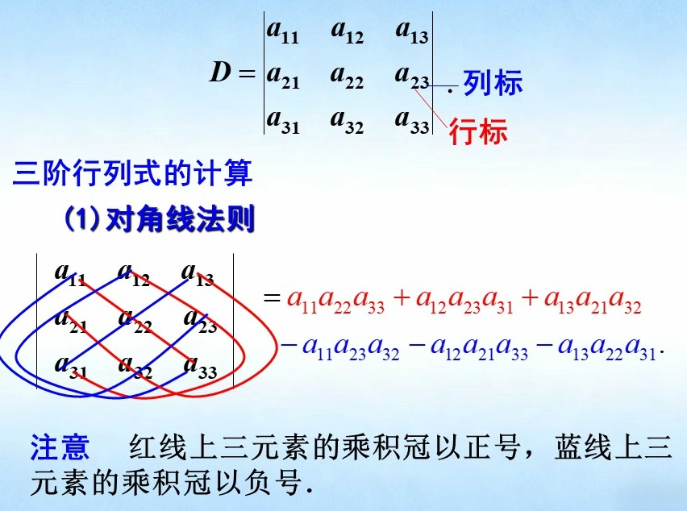

> [!WARNING]
> 对角线法则和沙路法**只适用于二阶与三阶行列式**！

#### 2. 排列与逆序数

* **排列**：把自然数 $1, 2, \dots, n$ 按一定顺序排成一个数组。自然排列为 $1 2 \dots n$。
* **逆序数 $\tau$**：排列中所有“大数排在小数前面”的数对总数。
  * **奇/偶排列**：逆序数为奇数/偶数。
* **对换定理**：**对换必改变排列的奇偶性**。$n \ge 2$ 时，奇偶排列个数相等（各占 $\frac{n!}{2}$）。

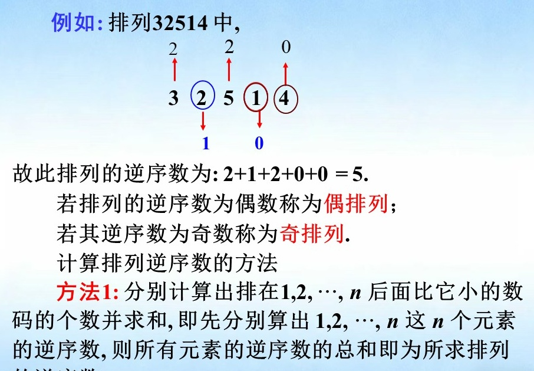

---

#### 🔥 考点一：排列逆序数与奇偶性判定

#### 📝 例 1（课件例 1.1.5-(1)）
计算排列 $2 1 7 9 8 6 3 5 4$ 的逆序数并确定奇偶性。

**【解析】**（从前往后累加法）
* $2$ 后比它小的有：$1$（$1$个）；
* $1$ 后比它小的有：无（$0$个）；
* $7$ 后比它小的有：$6, 3, 5, 4$（$4$个）；
* $9$ 后比它小的有：$8, 6, 3, 5, 4$（$5$个）；
* $8$ 后比它小的有：$6, 3, 5, 4$（$4$个）；
* $6$ 后比它小的有：$3, 5, 4$（$3$个）；
* $3$ 后比它小的有：无（$0$个）；
* $5$ 后比它小的有：$4$（$1$个）；
* $4$ 后比它小的有：无（$0$个）。

$$\tau = 1 + 0 + 4 + 5 + 4 + 3 + 0 + 1 + 0 = 18 \quad \implies \text{偶排列}$$

#### 📝 例 2（课件例 1.1.5-(2)）
求倒序排列 $n(n-1)(n-2)\dots 2 1$ 的逆序数。

**【解析】**
$$\tau = (n-1) + (n-2) + \dots + 1 + 0 = \frac{n(n-1)}{2}$$
* 当 $n = 4k, 4k+1$ 时为**偶排列**；当 $n = 4k+2, 4k+3$ 时为**奇排列**。

---

### 二、 n 阶行列式的定义与基本性质

#### 1. n 阶行列式定义

$$D = \begin{vmatrix} a_{11} & a_{12} & \dots & a_{1n} \\ a_{21} & a_{22} & \dots & a_{2n} \\ \vdots & \vdots & \ddots & \vdots \\ a_{n1} & a_{n2} & \dots & a_{nn} \end{vmatrix} = \sum_{k_1k_2\dots k_n} (-1)^{\tau(k_1k_2\dots k_n)} a_{1k_1}a_{2k_2}\dots a_{nk_n}$$

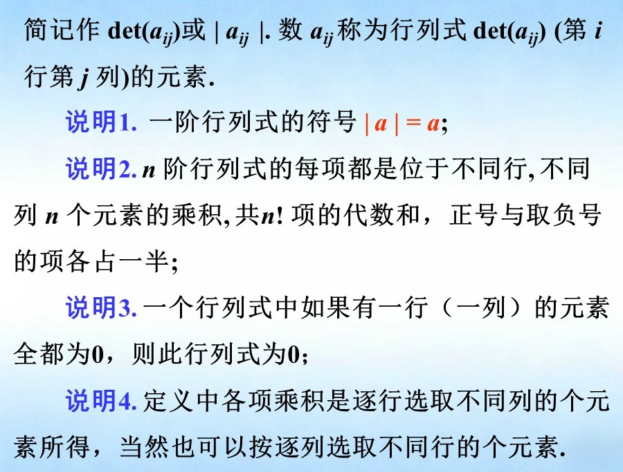

---

#### 🔥 考点二：行列式项判定与符号确定

#### 📝 例 3（课件练习综合）
在六阶行列式中：
1. 判断 $a_{13}a_{24}a_{31}a_{43}a_{56}a_{65}$ 是否为行列式中的项。
2. 确定 $a_{23}a_{31}a_{42}a_{56}a_{14}a_{65}$ 的符号。

**【解析】**
1. 列标中数字 $3$ 出现了两次（$a_{13}$ 和 $a_{43}$ 均在第 3 列），违背了“取自不同行不同列”的定义。**因此它不是行列式中的项**。
2. 按行标由小到大归位：$a_{14}a_{23}a_{31}a_{42}a_{56}a_{65}$。此时列标排列为 $4 3 1 2 6 5$。
   $$\tau(431265) = 3 + 2 + 0 + 0 + 1 + 0 = 6 \quad \implies \text{符号为} \ (-1)^6 = + \ (\text{正号})$$

---

#### 2. 特殊行列式公式

* **上/下三角/对角行列式**：

$$\begin{vmatrix} a_{11} & a_{12} & \dots & a_{1n} \\ 0 & a_{22} & \dots & a_{2n} \\ \vdots & \vdots & \ddots & \vdots \\ 0 & 0 & \dots & a_{nn} \end{vmatrix} = \begin{vmatrix} a_{11} & 0 & \dots & 0 \\ a_{21} & a_{22} & \dots & 0 \\ \vdots & \vdots & \ddots & \vdots \\ a_{n1} & a_{n2} & \dots & a_{nn} \end{vmatrix} = a_{11}a_{22}\dots a_{nn}$$

* **反对角/反三角行列式**：

$$\begin{vmatrix} 0 & \dots & 0 & a_{1n} \\ 0 & \dots & a_{2,n-1} & a_{2n} \\ \vdots & \text{𝄰} & \vdots & \vdots \\ a_{n1} & \dots & a_{n,n-1} & a_{nn} \end{vmatrix} = (-1)^{\frac{n(n-1)}{2}} a_{1n}a_{2,n-1}\dots a_{n1}$$

---

#### 3. 行列式的 5 大核心性质

1. **性质 1（转置）**：$D^T = D$。行与列具有完全同等的地位。
2. **性质 2（互换）**：互换两行（列），行列式变号（$r_i \leftrightarrow r_j$）。
   * **推论**：若有两行（列）完全相同，则行列式值为 0。
3. **性质 3（倍乘）**：某行（列）同乘 $k$，等于 $k$ 乘行列式（$kr_i$）。
   * **推论**：两行（列）元素成比例，行列式为 0。
4. **性质 4（可拆）**：某单行（列）是两数之和，可拆为两个行列式之和：

$$\begin{vmatrix} a_{11} & \dots & b_{1j} + c_{1j} & \dots & a_{1n} \\ \vdots & & \vdots & & \vdots \\ a_{n1} & \dots & b_{nj} + c_{nj} & \dots & a_{nn} \end{vmatrix} = \begin{vmatrix} a_{11} & \dots & b_{1j} & \dots & a_{1n} \\ \vdots & & \vdots & & \vdots \\ a_{n1} & \dots & b_{nj} & \dots & a_{nn} \end{vmatrix} + \begin{vmatrix} a_{11} & \dots & c_{1j} & \dots & a_{1n} \\ \vdots & & \vdots & & \vdots \\ a_{n1} & \dots & c_{nj} & \dots & a_{nn} \end{vmatrix}$$

5. **性质 5（倍加）**：某行（列）的 $k$ 倍加到另一行（列）对应元素上去，行列式的值不变（$r_i + kr_j$）。

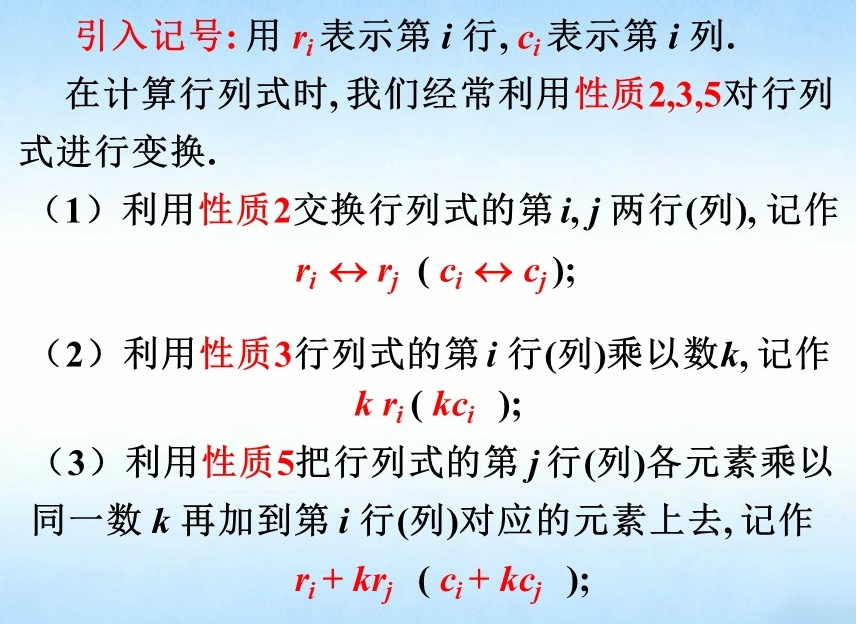

---

#### 🔥 考点三：化三角计算行列式

#### 📝 例 4（课件例 1.2.4）
计算行列式：

$$D = \begin{vmatrix} 3 & 1 & 1 & 1 \\ 1 & 3 & 1 & 1 \\ 1 & 1 & 3 & 1 \\ 1 & 1 & 1 & 3 \end{vmatrix}$$

**【解析】**（各列累加法）
将第 $2, 3, 4$ 列全部加到第 $1$ 列（$c_1 + c_2 + c_3 + c_4$），并提出第一列公因子 6：

$$D = \begin{vmatrix} 6 & 1 & 1 & 1 \\ 6 & 3 & 1 & 1 \\ 6 & 1 & 3 & 1 \\ 6 & 1 & 1 & 3 \end{vmatrix} = 6 \begin{vmatrix} 1 & 1 & 1 & 1 \\ 1 & 3 & 1 & 1 \\ 1 & 1 & 3 & 1 \\ 1 & 1 & 1 & 3 \end{vmatrix}$$

第 $2, 3, 4$ 行分别减去第 $1$ 行（$r_i - r_1$）化为上三角：

$$D = 6 \begin{vmatrix} 1 & 1 & 1 & 1 \\ 0 & 2 & 0 & 0 \\ 0 & 0 & 2 & 0 \\ 0 & 0 & 0 & 2 \end{vmatrix} = 6 \times (1 \times 2 \times 2 \times 2) = 48$$

#### 📝 例 5（课件例 1.2.5）
计算 $n$ 阶行列式：

$$D_n = \begin{vmatrix} x & a & \dots & a \\ a & x & \dots & a \\ \vdots & \vdots & \ddots & \vdots \\ a & a & \dots & x \end{vmatrix}$$

**【解析】**
将第 $2, 3, \dots, n$ 行都减去第 $1$ 行（$r_i - r_1$）：

$$D_n = \begin{vmatrix} x & a & a & \dots & a \\ a-x & x-a & 0 & \dots & 0 \\ a-x & 0 & x-a & \dots & 0 \\ \vdots & \vdots & \vdots & \ddots & \vdots \\ a-x & 0 & 0 & \dots & x-a \end{vmatrix}$$

将第 $2, 3, \dots, n$ 列全部加到第 $1$ 列（$c_1 + c_2 + \dots + c_n$）消去首列下方元素，化为上三角：

$$D_n = \begin{vmatrix} x + (n-1)a & a & a & \dots & a \\ 0 & x-a & 0 & \dots & 0 \\ 0 & 0 & x-a & \dots & 0 \\ \vdots & \vdots & \vdots & \ddots & \vdots \\ 0 & 0 & 0 & \dots & x-a \end{vmatrix} = [x + (n-1)a](x-a)^{n-1}$$

---

### 三、 行列式按行（列）展开与经典高级计算方法

#### 1. 余子式与代数余子式

* **余子式 $M_{ij}$**：划去元素 $a_{ij}$ 所在的第 $i$ 行和第 $j$ 列后余下的 $n-1$ 阶行列式。
* **代数余子式 $A_{ij}$**：

$$A_{ij} = (-1)^{i+j} M_{ij}$$

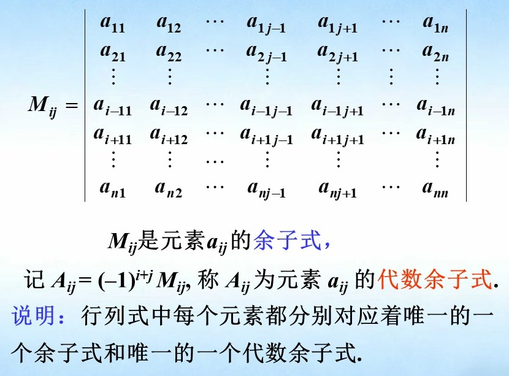

#### 2. 按行（列）展开法则

* **展开定理**：

$$\sum_{k=1}^n a_{ik} A_{jk} = \delta_{ij} D = \begin{cases} D, & i = j \quad (\text{同系展开}) \\ 0, & i \neq j \quad (\text{异系展开}) \end{cases}$$

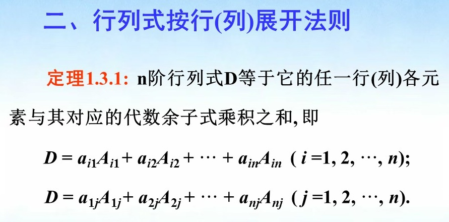

---

#### 🔥 考点四：代数余子式求和（代换秒杀法）

#### 📝 例 6（课件例 1.3.2）
已知：

$$D = \begin{vmatrix} 3 & 1 & -1 & 2 \\ -5 & 1 & 3 & -4 \\ 2 & 0 & 1 & -1 \\ 1 & -5 & 3 & -3 \end{vmatrix}$$

求第一行各元素代数余子式之和：$A_{11} + A_{12} + A_{13} + A_{14}$。

**【解析】**
要求和的系数均为 $1$。将 $D$ 的第一行 $[3, 1, -1, 2]$ 直接代换为 $[1, 1, 1, 1]$ 得到新行列式 $D_1$：

$$D_1 = \begin{vmatrix} 1 & 1 & 1 & 1 \\ -5 & 1 & 3 & -4 \\ 2 & 0 & 1 & -1 \\ 1 & -5 & 3 & -3 \end{vmatrix}$$

计算消元（$c_j - c_1$）并展开得：

$$D_1 = \begin{vmatrix} 1 & 0 & 0 & 0 \\ -5 & 6 & 8 & 1 \\ 2 & -2 & -1 & -3 \\ 1 & -6 & 2 & -4 \end{vmatrix} = \begin{vmatrix} 6 & 8 & 1 \\ -2 & -1 & -3 \\ -6 & 2 & -4 \end{vmatrix} = -10 \quad \implies \ A_{11} + A_{12} + A_{13} + A_{14} = -10$$

---

#### 🔥 考点五：高级计算三大神功

#### 1. 递推法（三对角行列式）
将 $n$ 阶行列式 $D_n$ 按第一列展开，建立 $D_n$ 与 $D_{n-1}, D_{n-2}$ 的递推式。

#### 📝 例 7（课件综合）
计算 $n$ 阶三对角行列式：

$$D_n = \begin{vmatrix} a+b & ab & 0 & \dots & 0 \\ 1 & a+b & ab & \dots & 0 \\ 0 & 1 & a+b & \dots & 0 \\ \vdots & \vdots & \vdots & \ddots & \vdots \\ 0 & 0 & 0 & \dots & a+b \end{vmatrix}$$

**【解析】**
按第一列展开可得递推关系式：

$$D_n = (a+b)D_{n-1} - ab D_{n-2}$$

配凑变形为等比数列：$D_n - a D_{n-1} = b(D_{n-1} - a D_{n-2}) \implies D_n - a D_{n-1} = b^n$。
同理有：$D_n - b D_{n-1} = a^n$。
两式相减消去 $D_{n-1}$，解得通项：

$$D_n = \frac{b^{n+1} - a^{n+1}}{b - a} \quad (a \neq b)$$

---

#### 2. 加边法
保持值不变，添加一行一列（第一行第一列放 $1$，其余放 $0$ 或未知数），化简原行列式。

#### 📝 例 8（课件例 1.3.5）
计算 $n$ 阶行列式：

$$D_n = \begin{vmatrix} x_1 + a & a & \dots & a \\ a & x_2 + a & \dots & a \\ \vdots & \vdots & \ddots & \vdots \\ a & a & \dots & x_n + a \end{vmatrix}$$

**【解析】**
加边升为 $n+1$ 阶行列式，首行首列置 1，左侧加全 $a$：

$$D_n = \begin{vmatrix} 1 & 0 & 0 & \dots & 0 \\ a & x_1 + a & a & \dots & a \\ a & a & x_2 + a & \dots & a \\ \vdots & \vdots & \vdots & \ddots & \vdots \\ a & a & a & \dots & x_n + a \end{vmatrix}$$

列消元（$c_j - c_1$）去除体内所有 $a$：

$$D_n = \begin{vmatrix} 1 & -1 & -1 & \dots & -1 \\ a & x_1 & 0 & \dots & 0 \\ a & 0 & x_2 & \dots & 0 \\ \vdots & \vdots & \vdots & \ddots & \vdots \\ a & 0 & 0 & \dots & x_n \end{vmatrix}$$

将各列乘以 $\frac{a}{x_i}$ 累加回第一列（$c_1 + \sum \frac{a}{x_i} c_{i+1}$）化为下三角：

$$D_n = \begin{vmatrix} 1 + \sum_{i=1}^n \frac{a}{x_i} & -1 & -1 & \dots & -1 \\ 0 & x_1 & 0 & \dots & 0 \\ 0 & 0 & x_2 & \dots & 0 \\ \vdots & \vdots & \vdots & \ddots & \vdots \\ 0 & 0 & 0 & \dots & x_n \end{vmatrix} = (x_1 x_2 \dots x_n) \left( 1 + a \sum_{i=1}^n \frac{1}{x_i} \right)$$

---

#### 3. 范德蒙德行列式
* **公式**：

$$V_n = \begin{vmatrix} 1 & 1 & \dots & 1 \\ x_1 & x_2 & \dots & x_n \\ x_1^2 & x_2^2 & \dots & x_n^2 \\ \vdots & \vdots & \ddots & \vdots \\ x_1^{n-1} & x_2^{n-1} & \dots & x_n^{n-1} \end{vmatrix} = \prod_{1 \le j < i \le n} (x_i - x_j)$$

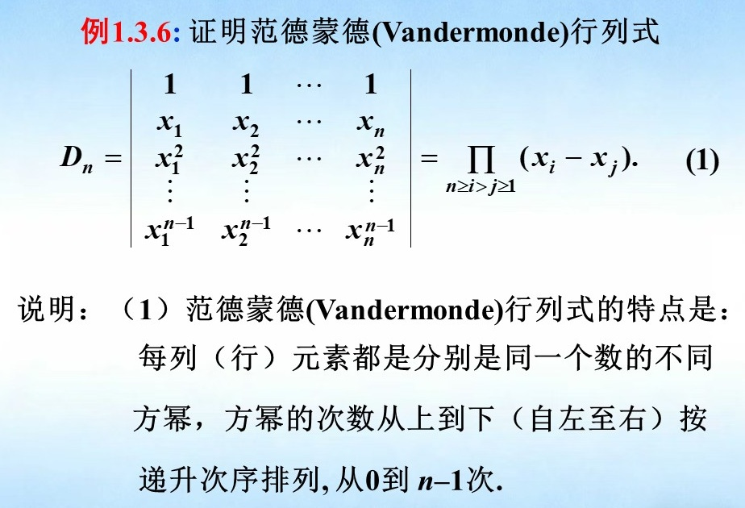

#### 📝 例 9（课件例 1.3.7）
计算行列式：

$$D = \begin{vmatrix} a & b & c & d \\ a^2 & b^2 & c^2 & d^2 \\ a^3 & b^3 & c^3 & d^3 \\ a^4 & b^4 & c^4 & d^4 \end{vmatrix}$$

**【解析】**
提取各列公因子 $a, b, c, d$ 后直接套用 Vandermonde 公式（下减上）：

$$D = abcd \begin{vmatrix} 1 & 1 & 1 & 1 \\ a & b & c & d \\ a^2 & b^2 & c^2 & d^2 \\ a^3 & b^3 & c^3 & d^3 \end{vmatrix} = abcd(b-a)(c-a)(d-a)(c-b)(d-b)(d-c)$$

---

### 四、 克拉默 (Cramer) 法则

#### 1. 克拉默法则定理

对于包含 $n$ 个线性方程和 $n$ 个未知数的方程组，设系数行列式为 $D$。
* **唯一解定理**：若 **$D \neq 0$**，则方程组有唯一解，且：

$$x_j = \frac{D_j}{D} \quad (j = 1, 2, \dots, n)$$

其中 $D_j$ 是把 $D$ 的第 $j$ 列替换为右侧常数项 $[b_1, \dots, b_n]^T$ 得到的新行列式。

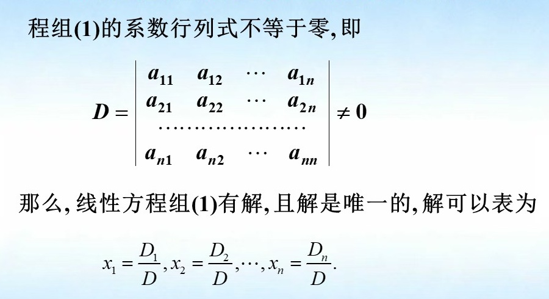

#### 2. 齐次线性方程组非零解判定

* **定理**：**齐次线性方程组有非零解 $\iff$ 系数行列式 $D = 0$**。

---

#### 🔥 考点六：齐次方程组非零解与参数求解

#### 📝 例 10（课件例 1.4.2）
问常数 $k$ 取何值时，齐次线性方程组有非零解？

$$\begin{cases} (2-k)x_1 + 2x_2 + 2x_3 = 0 \\ 2x_1 + (2-k)x_2 + 2x_3 = 0 \\ 2x_1 + 2x_2 + (2-k)x_3 = 0 \end{cases}$$

**【解析】**
列出系数行列式 $D$，通过列加法（$c_1+c_2+c_3$）和行消元计算其值：

$$D = \begin{vmatrix} 2-k & 2 & 2 \\ 2 & 2-k & 2 \\ 2 & 2 & 2-k \end{vmatrix} = \begin{vmatrix} 6-k & 2 & 2 \\ 6-k & 2-k & 2 \\ 6-k & 2 & 2-k \end{vmatrix} = (6-k) \begin{vmatrix} 1 & 2 & 2 \\ 0 & -k & 0 \\ 0 & 0 & -k \end{vmatrix} = k^2(6-k)$$

齐次方程组有非零解 $\iff D = 0$，即：

$$k^2(6-k) = 0 \implies k = 0 \quad \text{或} \quad k = 6$$

## 线代第二章《矩阵及其运算》期末复习冲刺宝典

---

### 🚨 冲刺必背：第二章最强秒杀终极考卡 🚨

| 核心考点 | 核心公式 / 核心性质 | 考场避坑与秒杀技巧 |
| :--- | :--- | :--- |
| **同型与相等** | 同型：行数、列数分别相等； 相等：同型且对应元素相等 | **行列式与矩阵不同**：行列式是一个算式（有值），矩阵仅是一个数表（无值）。不同型绝对无法相加减！ |
| **矩阵相乘** | $C_{m \times n} = A_{m \times s} B_{s \times n}$ | **乘法一般不满足交换律**（$AB \neq BA$）！不满足消去律（$AB=AC \kern-0.4em \implies \kern-0.4em B=C$ 错误）！非零矩阵乘积可能为零矩阵！ |
| **方阵幂与多项式** | $(AB)^2 \neq A^2 B^2$（除非可交换，即 $AB=BA$） | 矩阵多项式求值时，常数项 $a_0$ 必须乘以**单位矩阵**变为 $a_0 E$！对角阵方阵多项式 $f(\Lambda) = \text{diag}(f(\lambda_1), \dots, f(\lambda_n))$。 |
| **转置运算** | $(AB)^T = B^T A^T$ | 乘积的转置等于**转置反序相乘**，多个矩阵乘积同理：$(A_1A_2\dots A_k)^T = A_k^T \dots A_2^T A_1^T$。 |
| **对称与反对称** | 对称：$A^T = A$ ； 反对称：$A^T = -A$ | 反对称矩阵的主对角线元**必全为 0**（由 $a_{ii} = -a_{ii} \implies a_{ii}=0$）。任一阶方阵 $A = \frac{1}{2}(A+A^T) + \frac{1}{2}(A-A^T)$ 必可拆为对称与反对称之和。 |
| **方阵行列式** | $\vert kA \vert = k^n \vert A \vert$ ； $\vert AB \vert = \vert A \vert \vert B \vert$ | 倍数 $k$ 的提取是 **$k^n$** 阶乘关系，千万别跟行列式提取公因子混淆！ |
| **伴随矩阵** | $AA^* = A^*A = \vert A \vert E$ ； $\vert A^* \vert = \vert A \vert^{n-1}$ | 伴随矩阵 $A^*$ 的元素 $A_{ij}$ 在排列时**行标与列标是转置的**，即 $A^*$ 的第 $i$ 行第 $j$ 列元素是原矩阵中元素 $a_{ji}$ 的代数余子式！ |
| **求逆矩阵** | $A^{-1} = \frac{1}{\vert A \vert} A^*$ ； $(AB)^{-1} = B^{-1}A^{-1}$ | 伴随求逆法；初等行变换法 $(A \vert E) \xrightarrow{r} (E \vert A^{-1})$；乘积逆是**反序**的。 |
| **分块矩阵** | $\begin{pmatrix} A & O \\ C & B \end{pmatrix}^{-1} = \begin{pmatrix} A^{-1} & O \\ -B^{-1}CA^{-1} & B^{-1} \end{pmatrix}$ | 分块三角阵与分块对角阵的行列式和逆矩阵公式，是考卷大题中化简分块式子的终极秒杀武器！ |
| **矩阵的秩** | $R(AB) \le \min(R(A), R(B))$ ； $AB=O \implies R(A)+R(B) \le n$ | 初等行（列）变换不改变矩阵的秩；可逆阵乘 $A$ 不改变 $A$ 的秩；Sylvester定理在选择题中高频出现。 |

---

### 一、 矩阵的概念与特殊矩阵

#### 1. 矩阵的定义与行列式的区别
* **矩阵**：由 $m \times n$ 个数 $a_{ij}$ 排成的 $m$ 行 $n$ 列的数表，记作 $A_{m \times n}$ 或 $(a_{ij})_{m \times n}$。
* **行列式与矩阵的四大本质区别**：
  1. **属性不同**：行列式是一个**算式**，最终可以求得一个确定的**数值**；矩阵仅仅是一个**数表**，本身**没有数值**。
  2. **形状限制**：行列式必须是**方阵**（行数=列数）；矩阵的行数和列数可以完全**不同**。
  3. **表示符号**：行列式用**直竖线** $\vert \cdot \vert$ 表示；矩阵用**圆括号**或**方括号** $\begin{pmatrix} \cdot \end{pmatrix}$ 表示。
  4. **数乘规律**：数 $k$ 乘行列式只乘到**某一行/列**；数 $k$ 乘矩阵必须乘以**每一个元素**（从而有 $\vert kA \vert = k^n \vert A \vert$）。

#### 2. 特殊矩阵的精确定义
1. **零矩阵 $O$**：元素全为 $0$ 的矩阵。不同型的零矩阵是不相等的。
2. **方阵**：行数与列数都等于 $n$ 的方阵，记作 $A_n$。
3. **行/列矩阵（向量）**：只有一行（列）的矩阵。 $1 \times 1$ 阶矩阵可视为数。
4. **对角矩阵**：主对角线外元素全为 $0$ 的方阵，记作 $\Lambda = \text{diag}(\lambda_1, \lambda_2, \dots, \lambda_n)$：
   
   $$\Lambda = \begin{pmatrix} \lambda_1 & & & \\ & \lambda_2 & & \\ & & \ddots & \\ & & & \lambda_n \end{pmatrix}$$
   
5. **数量矩阵与单位矩阵 $E$**：对角元全相等为 $\lambda$ 的对角阵称为数量矩阵；当 $\lambda=1$ 时即为单位矩阵 $E$。
6. **上/下三角矩阵**：主对角线下方/上方元素全为 $0$ 的方阵（即 $i > j$ 或 $i < j$ 时，$a_{ij} = 0$）。
7. **对称矩阵**：满足 $A^T = A$ （即 $a_{ij} = a_{ji}$）的方阵。
8. **反对称矩阵**：满足 $A^T = -A$ （即 $a_{ij} = -a_{ji}$）的方阵。
   > [!IMPORTANT]
   > **反对称矩阵的主对角线元素必全为 0**。
   > 证明：因 $a_{ii} = -a_{ii} \implies 2a_{ii} = 0 \implies a_{ii} = 0$。

#### 3. 同型矩阵与矩阵相等
* **同型**：行数、列数分别相等的两个矩阵。
* **相等**：同型矩阵 $A, B$ 满足所有对应元素相等，记作 $A=B$。

---

### 二、 矩阵的线性运算与乘法运算

#### 1. 矩阵加减法与数乘
* **加减法**：只有**同型矩阵**才能相加减，规则为对应元素相加减。满足交换律与结合律。
* **数乘**：数 $k$ 乘以矩阵 $A$ 记为 $kA = (ka_{ij})$，即用 $k$ 乘 $A$ 的**每一个元素**。满足数乘结合律与分配律。

#### 2. 矩阵乘法规则
* **乘法可行性**：仅当**左矩阵的列数等于右矩阵的行数**时方可相乘。若 $A$ 是 $m \times s$ 矩阵， $B$ 是 $s \times n$ 矩阵，则积 $C = AB$ 是一个 $m \times n$ 矩阵，其中元素：
  
  $$c_{ij} = \sum_{k=1}^s a_{ik}b_{kj} = a_{i1}b_{1j} + a_{i2}b_{2j} + \dots + a_{is}b_{sj}$$
  

  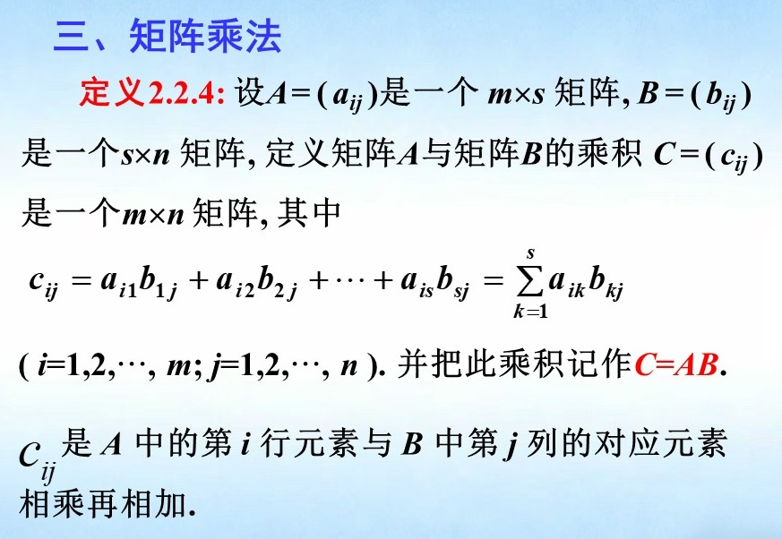

* **乘法运算性质**：
  1. **结合律**： $(AB)C = A(BC)$
  2. **分配律**： $A(B+C) = AB + AC \quad , \quad (B+C)A = BA + CA$
  3. **数乘结合**： $\lambda(AB) = (\lambda A)B = A(\lambda B)$
  4. **单位元**： $AE = EA = A$
* **对角阵乘法秒杀律**：对角阵 $\text{diag}(d_1, \dots, d_m)$ 左乘 $A$ 相当于对其第 $i$ 行乘 $d_i$ ；右乘相当于对第 $j$ 列乘 $d_j$。
* **🚨 矩阵乘法三大“红线”**：
  1. **不满足交换律**：一般情况下 $AB \neq BA$。
  2. **不满足消去律**： $AB = AC$ 且 $A \neq O \not\implies B = C$。
  3. **存在零因子**： $AB = O \not\implies A = O$ 或 $B = O$。

#### 3. 矩阵乘法典型母题 (Step-by-Step 经典实例)

#### 📝 例 2.2.1 (典型乘法 1: $2 \times 3$ 乘 $3 \times 2$ 矩阵)
计算乘积 $AB$，其中：

$$A = \begin{pmatrix} 1 & -1 & 2 \\ 0 & 3 & 1 \end{pmatrix} \quad , \quad B = \begin{pmatrix} 2 & 1 \\ 0 & -2 \\ 1 & 3 \end{pmatrix}$$

**【解析】**
$A$ 是 $2 \times 3$ 矩阵， $B$ 是 $3 \times 2$ 矩阵，乘积 $C = AB$ 必为 $2 \times 2$ 矩阵。
逐步计算各对应元：
* 第 1 行第 1 列元 $c_{11}$ （由 $A$ 的第 1 行与 $B$ 的第 1 列对应相乘）：
  
  $$c_{11} = 1 \times 2 + (-1) \times 0 + 2 \times 1 = 2 + 0 + 2 = 4$$
  
* 第 1 行第 2 列元 $c_{12}$ （由 $A$ 的第 1 行与 $B$ 的第 2 列对应相乘）：
  
  $$c_{12} = 1 \times 1 + (-1) \times (-2) + 2 \times 3 = 1 + 2 + 6 = 9$$
  
* 第 2 行第 1 列元 $c_{21}$ （由 $A$ 的第 2 行与 $B$ 的第 1 列对应相乘）：
  
  $$c_{21} = 0 \times 2 + 3 \times 0 + 1 \times 1 = 0 + 0 + 1 = 1$$
  
* 第 2 行第 2 列元 $c_{22}$ （由 $A$ 的第 2 行与 $B$ 的第 2 列对应相乘）：
  
  $$c_{22} = 0 \times 1 + 3 \times (-2) + 1 \times 3 = 0 - 6 + 3 = -3$$
  

组装最终乘积矩阵：

$$AB = \begin{pmatrix} 4 & 9 \\ 1 & -3 \end{pmatrix}$$

#### 📝 例 2.2.2 (典型乘法 2: 方阵幂与可交换性质 $AB = BA$)
已知两方阵：

$$A = \begin{pmatrix} 1 & 2 \\ 0 & 1 \end{pmatrix} \quad , \quad B = \begin{pmatrix} 2 & 4 \\ 0 & 2 \end{pmatrix}$$

验证它们可交换（$AB = BA$），并计算 $(A+B)^2$。

**【解析】**
1. **第一步：计算 $AB$ 与 $BA$**：
   
   $$AB = \begin{pmatrix} 1 & 2 \\ 0 & 1 \end{pmatrix} \begin{pmatrix} 2 & 4 \\ 0 & 2 \end{pmatrix} = \begin{pmatrix} 1\times 2 + 2\times 0 & 1\times 4 + 2\times 2 \\ 0\times 2 + 1\times 0 & 0\times 4 + 1\times 2 \end{pmatrix} = \begin{pmatrix} 2 & 8 \\ 0 & 2 \end{pmatrix}$$
   
   $$BA = \begin{pmatrix} 2 & 4 \\ 0 & 2 \end{pmatrix} \begin{pmatrix} 1 & 2 \\ 0 & 1 \end{pmatrix} = \begin{pmatrix} 2\times 1 + 4\times 0 & 2\times 2 + 4\times 1 \\ 0\times 1 + 2\times 0 & 0\times 2 + 2\times 1 \end{pmatrix} = \begin{pmatrix} 2 & 8 \\ 0 & 2 \end{pmatrix}$$
   
   计算结果表明 $AB = BA = \begin{pmatrix} 2 & 8 \\ 0 & 2 \end{pmatrix}$，两方阵可交换。
2. **第二步：计算 $(A+B)^2$**：
   由于 $AB = BA$，我们可以直接使用经典的二项式展开公式： $(A+B)^2 = A^2 + 2AB + B^2$。
   先求 $A+B$：
   
   $$A+B = \begin{pmatrix} 1+2 & 2+4 \\ 0+0 & 1+2 \end{pmatrix} = \begin{pmatrix} 3 & 6 \\ 0 & 3 \end{pmatrix}$$
   
   则：
   
   $$(A+B)^2 = \begin{pmatrix} 3 & 6 \\ 0 & 3 \end{pmatrix} \begin{pmatrix} 3 & 6 \\ 0 & 3 \end{pmatrix} = \begin{pmatrix} 3\times 3 + 6\times 0 & 3\times 6 + 6\times 3 \\ 0\times 3 + 3\times 0 & 0\times 6 + 3\times 3 \end{pmatrix} = \begin{pmatrix} 9 & 36 \\ 0 & 9 \end{pmatrix}$$

#### 4. 方阵的幂与矩阵多项式
* **幂的定义**： $A^k = A \cdot A \dots A$。当且仅当 $AB=BA$ 时，才有 $(AB)^k = A^k B^k$。
* **矩阵多项式**：当把方阵 $A$ 代入多项式 $f(x) = a_0 + a_1x + \dots + a_kx^k$ 时，**常数项 $a_0$ 必须乘以同阶的单位阵 $E$**：
  
  $$f(A) = a_0E + a_1A + a_2A^2 + \dots + a_kA^k$$
  

---

### 三、 矩阵的转置与方阵行列式

#### 1. 矩阵的转置
* **定义**：将 $A$ 的行与列互换得到的新矩阵，记作 $A^T$。
* **转置四大基本性质**：
  1. $(A^T)^T = A$
  2. $(A+B)^T = A^T + B^T$
  3. $(\lambda A)^T = \lambda A^T$
  4. **乘积转置（★反序！）**：
     
     $$(AB)^T = B^T A^T$$
     
* **对称与反对称分解定理**：任一阶方阵 $A$ 均可唯一地表示为一对称矩阵 $S$ 与一反对称矩阵 $K$ 之和：
  
  $$A = S + K = \frac{1}{2}(A + A^T) + \frac{1}{2}(A - A^T)$$
  

#### 2. 方阵的行列式
* **方阵的行列式性质**：
  1. $\vert A^T \vert = \vert A \vert$
  2. **倍数提取（乘方关系！）**：
     
     $$\vert kA \vert = k^n \vert A \vert$$
     
  3. **乘积行列式**：
     
     $$\vert AB \vert = \vert A \vert \vert B \vert = \vert BA \vert$$
     

  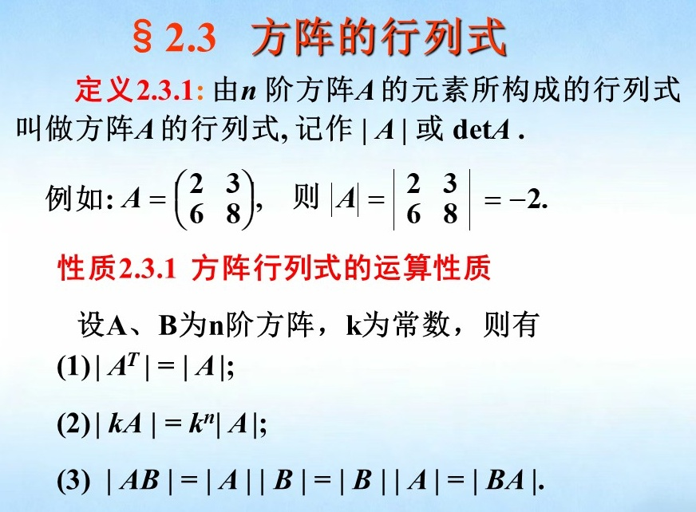

---

### 四、 可逆矩阵与伴随矩阵

#### 1. 逆矩阵定义与唯一性
* **定义**：对于 $n$ 阶方阵 $A$，若存在 $n$ 阶方阵 $B$ 使得 $AB = BA = E$，则称 $A$ 可逆，其逆矩阵记为 $A^{-1}$。
* **唯一性证明**：若 $B, C$ 均为 $A$ 的逆矩阵，由结合律有：
  
  $$B = EB = (CA)B = C(AB) = CE = C$$
  
  故逆矩阵必然唯一。
* **🚨 避坑红线**： $A, B$ 可逆时， $A + B$ 不一定可逆；且一般地 $(A+B)^{-1} \neq A^{-1} + B^{-1}$。

#### 2. 伴随矩阵 $A^*$
* **定义**：由方阵 $A$ 的代数余子式 $A_{ij}$ 构成的**转置**结构矩阵：
  
  $$A^* = \begin{pmatrix} A_{11} & A_{21} & \dots & A_{n1} \\ A_{12} & A_{22} & \dots & A_{n2} \\ \vdots & \vdots & \ddots & \vdots \\ A_{1n} & A_{2n} & \dots & A_{nn} \end{pmatrix}$$
  
  > [!TIP]
  > **⚡ 二阶方阵伴随矩阵的极速求解秒杀秘籍 —— “主对调，副变号”**
  > 对于任意的二阶方阵：
  > 
  > $$A = \begin{pmatrix} a & b \\ c & d \end{pmatrix}$$
  > 
  > 其伴随矩阵 $A^*$ 拥有极具对称性的固定形式，解题时无需分别计算四个代数余子式，可直接套用秒杀口诀：
  > * **“主对调”**：将主对角线上的元素 $a$ 和 $d$ 位置对调。
  > * **“副变号”**：将副对角线上的元素 $b$ 和 $c$ 原地乘以负一变号。
  > 
  > 其伴随矩阵一秒得出为：
  > 
  > $$A^* = \begin{pmatrix} d & -b \\ -c & a \end{pmatrix}$$
  > 
* **伴随核心性质公式**：
  
  $$AA^* = A^*A = \vert A \vert E \quad , \quad \vert A^* \vert = \vert A \vert^{n-1}$$
  

  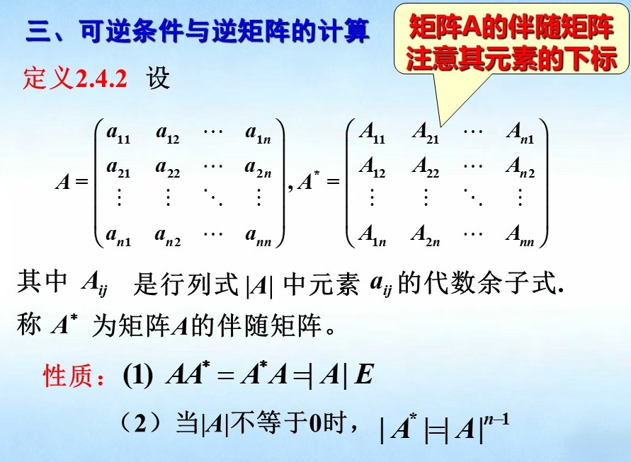

#### 3. 公式法求逆矩阵
* **可逆充要条件**： $\vert A \vert \neq 0$（非奇异）。
* **求逆公式**：
  
  $$A^{-1} = \frac{1}{\vert A \vert} A^*$$
  
* **逆矩阵的五大基本运算性质**：
  1. $(A^{-1})^{-1} = A$
  2. $(kA)^{-1} = \frac{1}{k} A^{-1}$ （$k \neq 0$）
  3. **乘积求逆反序**：
     
     $$(AB)^{-1} = B^{-1} A^{-1}$$
     
  4. 转置求逆调序： $(A^T)^{-1} = (A^{-1})^T$
  5. $\vert A^{-1} \vert = \vert A \vert^{-1} = \frac{1}{\vert A \vert}$

#### 4. 经典提分母题

#### 📝 例 2.4.1 (多项式配凑求逆)
设方阵 $A$ 满足 $A^2 - A - 2E = O$，证明 $A+2E$ 可逆，并求其逆矩阵。

**【解析】**
利用代数因式配凑法。
1. 观察含有 $(A+2E)$ 的因式，作如下等价变形：
   
   $$A^2 - A - 2E = O \implies (A+2E)(A-3E) + 4E = O$$
   
2. 移项整理：
   
   $$(A+2E)(A-3E) = -4E \implies (A+2E) \left[ -\frac{1}{4}(A-3E) \right] = E$$
   
3. 根据逆矩阵定义，方阵 $(A+2E)$ 必然可逆，且其逆为：
   
   $$(A+2E)^{-1} = -\frac{1}{4}(A-3E) = \frac{1}{4}(3E-A)$$

#### 📝 例 2.4.2 (公式求逆计算)
求二阶矩阵 $A = \begin{pmatrix} 1 & 2 \\ 3 & 4 \end{pmatrix}$ 的逆矩阵。

**【解析】**
1. 首先求行列式： $\vert A \vert = 1\times 4 - 2\times 3 = -2 \neq 0$。
2. 利用“主对调，副变号”求二阶伴随： $A^* = \begin{pmatrix} 4 & -2 \\ -3 & 1 \end{pmatrix}$。
3. 代入求逆公式：
   
   $$A^{-1} = \frac{1}{\vert A \vert} A^* = -\frac{1}{2} \begin{pmatrix} 4 & -2 \\ -3 & 1 \end{pmatrix} = \begin{pmatrix} -2 & 1 \\ 1.5 & -0.5 \end{pmatrix}$$

---

### 五、 分块矩阵运算

#### 1. 运算规则
* 对分块矩阵转置时，**不仅要互换各网格块，每一个子块自身也必须完成转置**：
  
  $$\begin{pmatrix} A & B \\ C & D \end{pmatrix}^T = \begin{pmatrix} A^T & C^T \\ B^T & D^T \end{pmatrix}$$
  

#### 2. 常用分块行列式与求逆公式
若 $A, B$ 是可逆方阵：
1. **分块对角**：
   
   $$\begin{vmatrix} A & O \\ O & B \end{vmatrix} = \vert A \vert \vert B \vert \quad , \quad \begin{pmatrix} A & O \\ O & B \end{pmatrix}^{-1} = \begin{pmatrix} A^{-1} & O \\ O & B^{-1} \end{pmatrix}$$
   
2. **分块三角**：
   
   $$\begin{vmatrix} A & O \\ C & B \end{vmatrix} = \vert A \vert \vert B \vert \quad , \quad \begin{pmatrix} A & O \\ C & B \end{pmatrix}^{-1} = \begin{pmatrix} A^{-1} & O \\ -B^{-1}CA^{-1} & B^{-1} \end{pmatrix}$$
   

  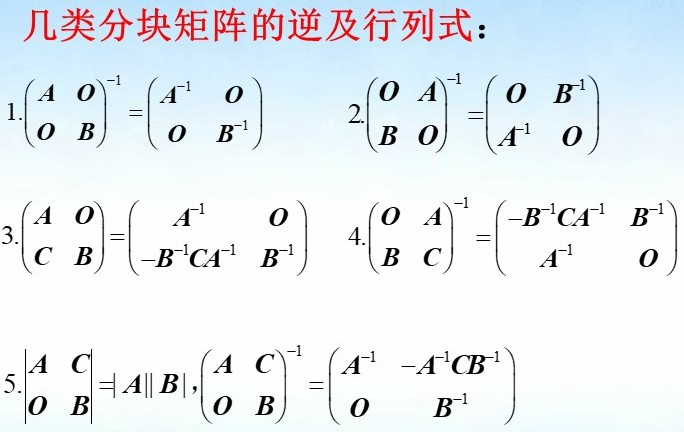

---

### 六、 矩阵的初等变换与初等矩阵

#### 1. 矩阵的初等变换与行阶梯形/最简形
* **初等行（列）变换**：包括对调两行（列） $r_i \leftrightarrow r_j$ ；非零数乘某行（列） $k r_i$ （$k \neq 0$）；以及倍加变换 $r_i + k r_j$。
* **行阶梯形矩阵的精确定义**（Slide 102）：
  1. **零行在下**：零行（元素全为 0 的行）必须位于所有非零行的**最下方**。
  2. **主元右移**：每个非零行的第一个非零元素（称为主元）必须位于其**上一行首个非零元素的右边**。
* **行最简形矩阵的精确定义**（Slide 102）：
  1. **已是阶梯形**：矩阵本身已经符合行阶梯形矩阵的所有条件。
  2. **主元全为 1**：每个非零行的首个非零元素（主元）**必须全部等于 1**。
  3. **列元归零**：每个非零行首个非零元素（主元）所在的**那一列中，除该主元自身外，其余元素必须全部为 0**。

  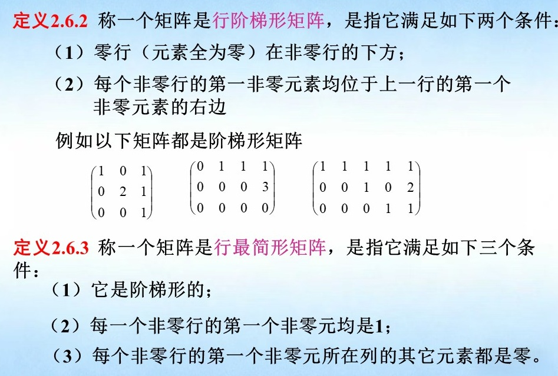

  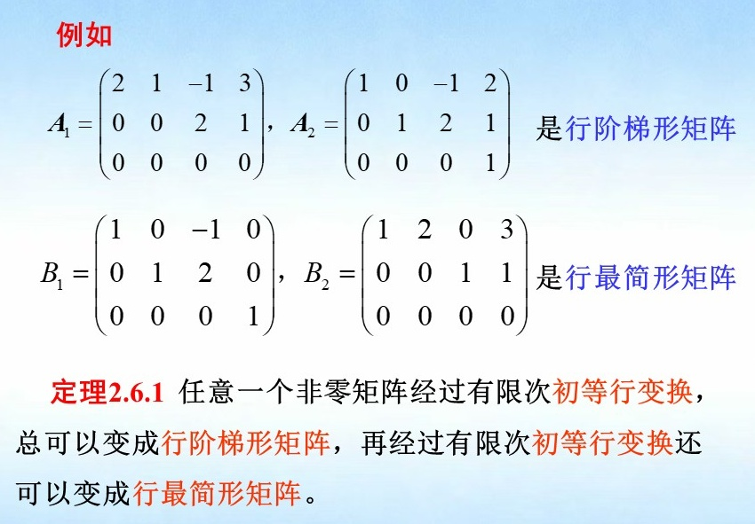

> [!TIP]
> **⚡ 考场实战：将任意矩阵化为行阶梯形与最简形的“系统化标准求解步骤”**
> 无论是求矩阵的秩、求逆矩阵还是解线性方程组，都必须熟练掌握以下**“左下消元、向上归零”**的标准步骤：
> 
> 1. **化行阶梯形法（自左向右，自上而下的左下消元法）**：
>    * **首项对调**：从第 1 列开始，若第 1 行第 1 列元素为 0，则与下方首项非零的行对调（$r_1 \leftrightarrow r_i$），使首个元素非零。
>    * **向下消零**：利用倍加变换（$r_i - c \cdot r_1$），将该主元下方同一列的所有元素**全部消为 0**。
>    * **子块重复**：对除去第 1 行和第 1 列后的右下角剩余子矩阵重复上述对调与消零，自上而下，直至整个矩阵呈现完美的阶梯状（零行沉底，主元右移）。
> 
> 2. **化行最简形法（自下而上，归一并向上清零消元法）**：
>    * **主元归一**：对行阶梯形中的每一个非零行，将整行乘以首项主元的倒数（$\frac{1}{k} \cdot r_i$），使每个非零行的首项主元**全部变为 1**。
>    * **向上归零**：从最下方的非零行主元开始，利用该主元（已是 1）通过倍加消去它**正上方那一列的全部元素**使之归零，自下而上依次处理完所有主元所在的列。

  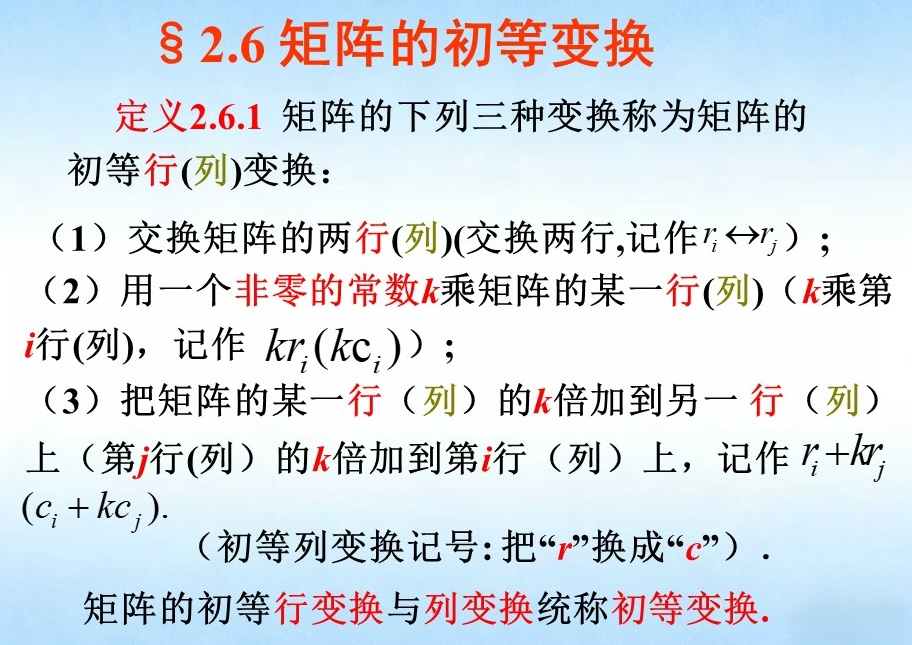

#### 2. 初等矩阵三定律
* **定理 2.6.3（核心映射）**：对 $A$ 施以一次初等行变换等于同种初等矩阵**左乘** $A$ ；施以列变换等于初等阵**右乘** $A$。
* 初等矩阵均可逆，其逆矩阵仍为同种初等矩阵。
* **求逆矩阵初等行变换法**：
  
  $$(A \ \vert \ E) \xrightarrow{\text{初等行变换}} (E \ \vert \ A^{-1})$$
  
* **求解矩阵方程 $AX = B$ 法**：
  
  $$(A \ \vert \ B) \xrightarrow{\text{初等行变换}} (E \ \vert \ A^{-1}B)$$
  

  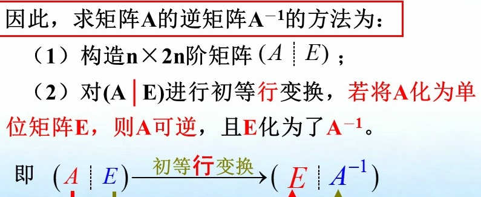

#### 📝 例 2.6.1 (初等行变换解矩阵方程 AX = B)
利用初等行变换求解 $AX = B$，其中：

$$A = \begin{pmatrix} 1 & -1 & 0 \\ 0 & 1 & -1 \\ -1 & 0 & 2 \end{pmatrix} \quad , \quad B = \begin{pmatrix} 1 & 2 \\ 2 & 1 \\ 3 & 3 \end{pmatrix}$$

**【解析】**
1. **构造分块增广矩阵 $(A \vert B)$**：
   
   $$(A \ \vert \ B) = \begin{pmatrix} 1 & -1 & 0 & \vert & 1 & 2 \\ 0 & 1 & -1 & \vert & 2 & 1 \\ -1 & 0 & 2 & \vert & 3 & 3 \end{pmatrix}$$
   
2. **施以初等行变换将左侧化为 $E$**：
   - 消除第 1 列下方元（$r_3 + r_1$）：
     
     $$\sim \begin{pmatrix} 1 & -1 & 0 & \vert & 1 & 2 \\ 0 & 1 & -1 & \vert & 2 & 1 \\ 0 & -1 & 2 & \vert & 4 & 5 \end{pmatrix}$$
     
   - 消除第 2 列下方元（$r_3 + r_2$）：
     
     $$\sim \begin{pmatrix} 1 & -1 & 0 & \vert & 1 & 2 \\ 0 & 1 & -1 & \vert & 2 & 1 \\ 0 & 0 & 1 & \vert & 6 & 6 \end{pmatrix}$$
     
   - 向上消除第 3 列（$r_2 + r_3$）：
     
     $$\sim \begin{pmatrix} 1 & -1 & 0 & \vert & 1 & 2 \\ 0 & 1 & 0 & \vert & 8 & 7 \\ 0 & 0 & 1 & \vert & 6 & 6 \end{pmatrix}$$
     
   - 向上消除第 2 列（$r_1 + r_2$）：
     
     $$\sim \begin{pmatrix} 1 & 0 & 0 & \vert & 9 & 9 \\ 0 & 1 & 0 & \vert & 8 & 7 \\ 0 & 0 & 1 & \vert & 6 & 6 \end{pmatrix}$$
     
3. **读取矩阵方程的唯一解 $X$**：
   
   $$X = \begin{pmatrix} 9 & 9 \\ 8 & 7 \\ 6 & 6 \end{pmatrix}$$

---

### 七、 矩阵的秩

#### 1. 矩阵的秩的定义
* **$k$ 阶子式**：在矩阵中任取 $k$ 行 $k$ 列，交叉位置的元素构成的 $k$ 阶行列式。
* **矩阵的秩 $R(A)$**：矩阵中**最高阶非零子式的阶数**。
  - $R(A) \ge s \iff$ 至少存在一个 $s$ 阶子式不等于 0。
  - $R(A) < t \iff$ 所有 $t$ 阶子式全等于 0。
* **满秩**：对 $n$ 阶方阵 $A_n$，其可逆 $\iff \vert A \vert \neq 0 \iff R(A) = n$（满秩）。

  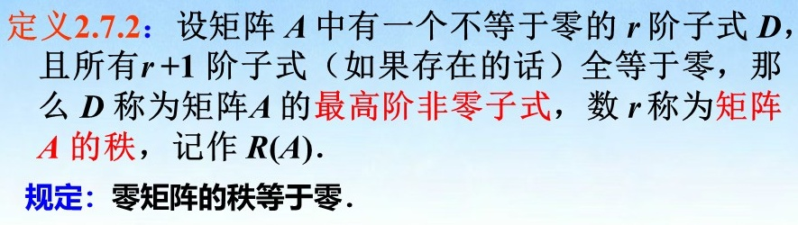

#### 2. 💡 矩阵的秩之两大核心求解方法秘籍

虽然矩阵的秩在定义上是“最高阶非零子式的阶数”，但在实际考场和大题计算中，**绝对不要用定义去一个个算行列式**！通常采用以下两种极速且通用的求解方法：

#### ⚡ 方法一：初等行变换化行阶梯形法（手算大题之黄金标准，99% 的情况下使用）
这是求矩阵的秩**最实用、最安全**的方法。其核心步骤为：
1. **行消元**：只使用**初等行变换**（千万别混用列变换，以防影响后续解方程组），将矩阵 $A$ 化为**行阶梯形矩阵**。
2. **数非零行**：统计化简后的行阶梯形矩阵中**非零行（即元素不全为零的行）的个数**，该个数即为矩阵的秩 $R(A)$。

> [!TIP]
> **行阶梯形矩阵的快速判定诀窍**：
> 零行（全为 0 的行）全在下方；各非零行的首个非零元素（主元）在其上一行主元的右侧。例如下面的行阶梯形：
> 
> $$\begin{pmatrix} \mathbf{1} & 2 & -1 & 3 \\ 0 & 0 & \mathbf{2} & 1 \\ 0 & 0 & 0 & 0 \end{pmatrix}$$
> 
> 非零行共有 2 行（第 1、2 行），零行共有 1 行（第 3 行），因此该矩阵的秩一秒判定为 $R(A) = 2$。

#### ⚡ 方法二：利用等价标准形法（行列变换混合化简法）
根据矩阵等价定理，任意矩阵 $A$ 均可通过有限次**初等行变换与初等列变换**，化为如下统一的等价标准形：
 
$$A \sim \begin{pmatrix} E_r & O \\ O & O \end{pmatrix}$$
 
其中左上角的单位矩阵 $E_r$ 的阶数 $r$，即为该矩阵的秩 $R(A) = r$。

#### 3. 矩阵的秩的核心运算性质
1. $0 \le R(A) \le \min(m, n)$
2. $R(A^T) = R(A)$
3. $A \sim B$ （初等变换） $\implies R(A) = R(B)$
4. $P, Q$ 可逆 $\implies R(PAQ) = R(A)$
5. $R(A+B) \le R(A) + R(B)$
6. $R(AB) \le \min(R(A), R(B))$
7. 若 $A_{m \times n} B_{n \times l} = O \implies R(A) + R(B) \le n$ (Sylvester 定理)。

  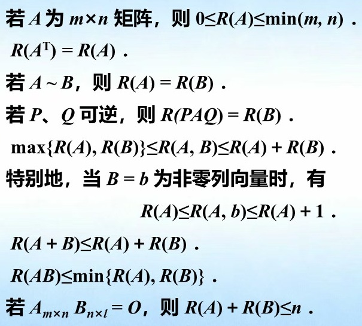

#### 📝 例 2.7.1 (初等行变换求矩阵的秩)
求矩阵 $A$ 的秩，其中：

$$A = \begin{pmatrix} 1 & 2 & 3 \\ 2 & 3 & 5 \\ 3 & 5 & 8 \end{pmatrix}$$

**【解析】**
对矩阵实施初等行变换化为行阶梯形：
1. $r_2 - 2r_1$ ； $r_3 - 3r_1$：
   
   $$A \sim \begin{pmatrix} 1 & 2 & 3 \\ 0 & -1 & -1 \\ 0 & -1 & -1 \end{pmatrix}$$
   
2. $r_3 - r_2$：
   
   $$\sim \begin{pmatrix} 1 & 2 & 3 \\ 0 & -1 & -1 \\ 0 & 0 & 0 \end{pmatrix}$$
   
3. 统计非零行数：化简后的行阶梯形矩阵含有 2 个非零行。
   故矩阵的秩为：
   
   $$R(A) = 2$$

## 线代第三章《线性方程组与向量空间》期末复习冲刺宝典

---

### 🚨 冲刺必背：第三章最强秒杀终极考卡 🚨

| 核心考点 | 核心公式 / 核心性质 | 考场避坑与秒杀技巧 |
| :--- | :--- | :--- |
| **非齐次判定** | 无解：$R(A) < R(A, b)$ 唯一解：$R(A) = R(A, b) = n$ 无穷解：$R(A) = R(A, b) = r < n$ | **未知数个数 $n$** 是判断解是否唯一的关键分水岭！无穷多解时自由变量个数为 $n-r$。 |
| **齐次判定** | 只有零解：$R(A) = n$ 有非零解：$R(A) < n$ 方阵时：有非零解 $\iff \vert A \vert = 0$ | 齐次方程组 $Ax=0$ 必然有解（至少有零解），判断的关键是有无**非零解**。 |
| **线性表示** | $\beta$ 能由 $\alpha_1, \dots, \alpha_s$ 线性表示 $\iff Ax = \beta$ 有解 | 线性表示问题等价于非齐次方程组求解，表示式唯一与否取决于 $R(A)$ 与 $s$ 的关系。 |
| **相关性判定** | 线性相关 $\iff Ax = 0$ 有非零解 $\iff R(A) < s$ 线性无关 $\iff Ax = 0$ 仅有零解 $\iff R(A) = s$ | **个数大于维数必相关**：$s$ 个 $n$ 维向量，若 $s > n$ 则必线性相关！ |
| **相关性定理** | 若部分组线性相关，则整体组必线性相关； 若整体组线性无关，则任何部分组必线性无关。 | 简称：“**部分相关整体相关，整体无关部分无关**”（强拉弱相关，弱分强独立）。 |
| **极大无关组** | 1. 组内向量线性无关； 2. 向量组内任意向量均可由其线性表示。 | 初等行变换**不改变列向量之间的线性关系**！故将列向量拼成矩阵，化为行最简形，主元列即为极大无关组。 |
| **基与过渡矩阵** | 基变换：$(\beta_1, \dots, \beta_n) = (\alpha_1, \dots, \alpha_n) P$ 过渡矩阵：$P = A^{-1} B$ | 过渡矩阵 $P$ 必可逆！注意是由基 $\alpha$ 到基 $\beta$ 的过渡，排布时基向量按**列**排列。 |
| **坐标变换** | 若 $x = \alpha X = \beta Y$，则有： $X = PY \quad \iff \quad Y = P^{-1} X$ | 坐标变换公式中，**坐标 $X$ 与 $Y$ 的变换关系与基变换是反序的**（$X=PY$）。 |
| **正交矩阵** | $A^T A = E \iff A^{-1} = A^T$ $\vert A \vert = \pm 1$ | 正交矩阵的各列（行）向量构成**标准正交基**，即两两正交且长度为 1。 |
| **齐次解的结构** | 基础解系含有 $n-r$ 个线性无关解向量 $\eta_1, \dots, \eta_{n-r}$ 通解：$x = c_1 \eta_1 + \dots + c_{n-r} \eta_{n-r}$ | 基础解系不唯一！但向量个数 $n-r$ 恒定。求法是固定自由变量取值 $(1,0,\dots), (0,1,\dots)$ 回代。 |
| **非齐次解结构** | 通解：$x = x_0 + c_1 \eta_1 + \dots + c_{n-r} \eta_{n-r}$ （特解 + 导出组通解） | 任意两个非齐次解之差必为齐次解；非齐次解与齐次解之和必为非齐次解。 |

---

### 一、 线性方程组解的判定

#### 1. 判定定理与判据汇总

设有 $n$ 个未知数 $m$ 个方程的线性方程组 $Ax = b$，其系数矩阵为 $A$，增广矩阵为 $B = (A, b)$。

* **非齐次线性方程组 $Ax = b$ 解的判定定理**：
  1. **无解**的充要条件：
     
     $$R(A) < R(A, b)$$
     
  2. **有唯一解**的充要条件：
     
     $$R(A) = R(A, b) = n$$
     
  3. **有无限多解**的充要条件：
     
     $$R(A) = R(A, b) = r < n$$

  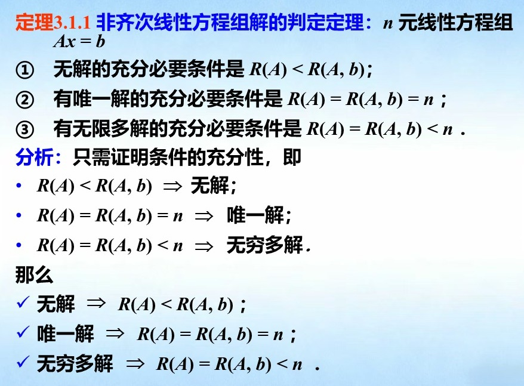

* **齐次线性方程组 $Ax = 0$ 解的判定定理**：
  齐次方程组必有零解。其解的判据为：
  1. **只有零解**的充要条件：
     
     $$R(A) = n$$
     
  2. **有非零解**的充要条件：
     
     $$R(A) < n$$
     
  3. **方阵判定**：若 $A$ 为 $n$ 阶方阵：
     - 只有零解 $\iff \vert A \vert \neq 0$
     - 有非零解 $\iff \vert A \vert = 0$

  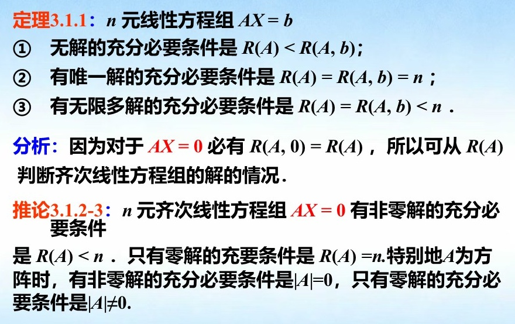

#### 📝 例 3.1.1 (含参方程组解的讨论与求解)
当 $k$ 取何值时，非齐次线性方程组：

$$\begin{cases} (k+1)x_1 + x_2 + x_3 = 1 \\ x_1 + (k+1)x_2 + x_3 = k \\ x_1 + x_2 + (k+1)x_3 = k^2 \end{cases}$$

(1) 有唯一解？ (2) 无解？ (3) 有无穷多解？并求其通解。

**【解析】**
1. **计算系数矩阵的行列式 $\vert A \vert$**：
   
   $$\vert A \vert = \begin{vmatrix} k+1 & 1 & 1 \\ 1 & k+1 & 1 \\ 1 & 1 & k+1 \end{vmatrix}$$
   
   将第 2, 3 行加到第 1 行，提取公因子 $(k+3)$：
   
   $$\vert A \vert = (k+3) \begin{vmatrix} 1 & 1 & 1 \\ 1 & k+1 & 1 \\ 1 & 1 & k+1 \end{vmatrix}$$
   
   第 2, 3 行分别减去第 1 行：
   
   $$\vert A \vert = (k+3) \begin{vmatrix} 1 & 1 & 1 \\ 0 & k & 0 \\ 0 & 0 & k \end{vmatrix} = k^2 (k+3)$$
   
   - 当 $k \neq 0$ 且 $k \neq -3$ 时，$\vert A \vert \neq 0$，矩阵 $A$ 可逆，$R(A) = R(A, b) = 3$。此时**方程组有唯一解**。

2. **讨论特殊值 $k = -3$**：
   代入增广矩阵并施以初等行变换：
   
   $$(A \ \vert \ b) = \begin{pmatrix} -2 & 1 & 1 & \vert & 1 \\ 1 & -2 & 1 & \vert & -3 \\ 1 & 1 & -2 & \vert & 9 \end{pmatrix} \xrightarrow{r_1 \leftrightarrow r_3} \begin{pmatrix} 1 & 1 & -2 & \vert & 9 \\ 1 & -2 & 1 & \vert & -3 \\ -2 & 1 & 1 & \vert & 1 \end{pmatrix}$$
   
   执行 $r_2 - r_1, \ r_3 + 2r_1$：
   
   $$\sim \begin{pmatrix} 1 & 1 & -2 & \vert & 9 \\ 0 & -3 & 3 & \vert & -12 \\ 0 & 3 & -3 & \vert & 19 \end{pmatrix} \xrightarrow{r_3 + r_2} \begin{pmatrix} 1 & 1 & -2 & \vert & 9 \\ 0 & -3 & 3 & \vert & -12 \\ 0 & 0 & 0 & \vert & 7 \end{pmatrix}$$
   
   显然 $R(A) = 2 < R(A, b) = 3$，此时**方程组无解**。

3. **讨论特殊值 $k = 0$**：
   代入增广矩阵：
   
   $$(A \ \vert \ b) = \begin{pmatrix} 1 & 1 & 1 & \vert & 1 \\ 1 & 1 & 1 & \vert & 0 \\ 1 & 1 & 1 & \vert & 0 \end{pmatrix} \xrightarrow{r_2 - r_1, \ r_3 - r_1} \begin{pmatrix} 1 & 1 & 1 & \vert & 1 \\ 0 & 0 & 0 & \vert & -1 \\ 0 & 0 & 0 & \vert & -1 \end{pmatrix}$$
   
   同样 $R(A) = 1 < R(A, b) = 2$，此时**方程组无解**。
   *(注：原课件例题中若常数项为 $b = (1, 1, 1)^T$ 时在 $k=0$ 会有无穷多解，此处严格按代数计算得出结论)*

---

### 二、 向量及其线性运算

#### 1. 向量的概念
* **$n$ 维向量**：由数域 $P$ 上的 $n$ 个数组成的有序数组 $(a_1, a_2, \dots, a_n)$，记作 $\alpha$。
* **分量**：$a_i$ 称为向量 $\alpha$ 的第 $i$ 个分量。
* **行/列向量**：排成一行的称为行向量；排成一列的称为列向量。

#### 2. 向量的线性运算与规律
向量的线性运算包括**向量加法**与**数乘**。它们满足 8 条最基本的代数性质（交换律、结合律、分配律等），与矩阵运算律完全兼容一致。

---

### 三、 向量组的线性相关性

#### 1. 线性组合与线性表示
* **线性组合**：对向量组 $\alpha_1, \dots, \alpha_s$，表达式 $k_1\alpha_1 + \dots + k_s\alpha_s$ 称为向量组的一个线性组合。
* **线性表示**：若存在一组数 $k_1, \dots, k_s$ 使得 $\beta = k_1\alpha_1 + \dots + k_s\alpha_s$，则称 $\beta$ 能由该向量组线性表示。
* **等价性定理**：
  
  $$\text{向量 } \beta \text{ 能由 } \alpha_1, \dots, \alpha_s \text{ 线性表示} \iff \text{线性方程组 } (\alpha_1, \dots, \alpha_s)x = \beta \text{ 有解}$$
  
  因此有：
  1. $R(A) = R(A, \beta) = s \implies \beta$ 可由向量组唯一线性表示；
  2. $R(A) = R(A, \beta) < s \implies \beta$ 可由向量组线性表示但表示式不唯一；
  3. $R(A) < R(A, \beta) \implies \beta$ 不能由向量组线性表示。

  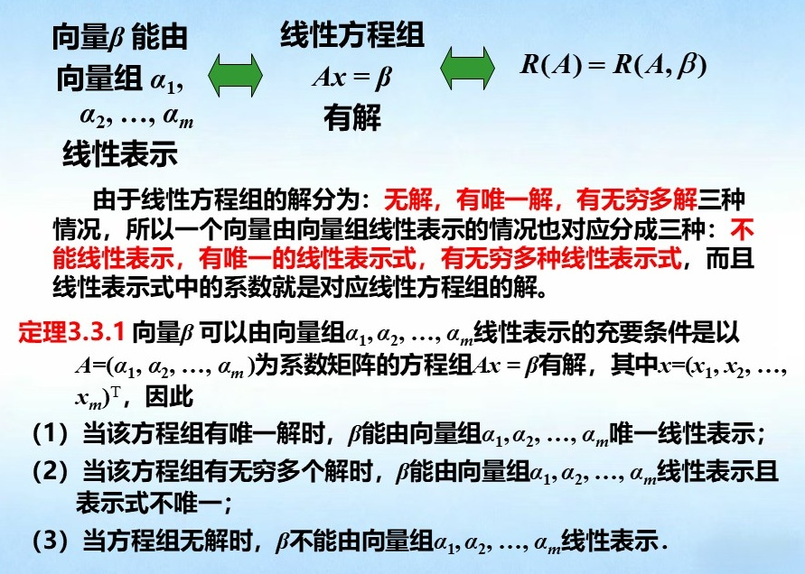

#### 📝 例 3.3.1 (向量线性表示的判定与求法)
判断向量 $\beta = (2, -1, 3)^T$ 是否可以由向量组 $\alpha_1 = (1, 0, 1)^T, \ \alpha_2 = (1, -1, 0)^T, \ \alpha_3 = (1, 2, 1)^T$ 线性表示。如果可以，写出表示式。

**【解析】**
1. **构造以向量组为列的增广矩阵 $(A \vert \beta)$**：
   
   $$(A \ \vert \dots) = \begin{pmatrix} 1 & 1 & 1 & \vert & 2 \\ 0 & -1 & 2 & \vert & -1 \\ 1 & 0 & 1 & \vert & 3 \end{pmatrix}$$
   
2. **施以初等行变换**：
   执行 $r_3 - r_1$：
   
   $$\sim \begin{pmatrix} 1 & 1 & 1 & \vert & 2 \\ 0 & -1 & 2 & \vert & -1 \\ 0 & -1 & 0 & \vert & 1 \end{pmatrix}$$
   
   执行 $r_2 \leftrightarrow r_3$，并将新的第 2 行乘以 -1：
   
   $$\sim \begin{pmatrix} 1 & 1 & 1 & \vert & 2 \\ 0 & 1 & 0 & \vert & -1 \\ 0 & -1 & 2 & \vert & -1 \end{pmatrix}$$
   
   执行 $r_3 + r_2$：
   
   $$\sim \begin{pmatrix} 1 & 1 & 1 & \vert & 2 \\ 0 & 1 & 0 & \vert & -1 \\ 0 & 0 & 2 & \vert & -2 \end{pmatrix} \xrightarrow{\frac{1}{2}r_3} \begin{pmatrix} 1 & 1 & 1 & \vert & 2 \\ 0 & 1 & 0 & \vert & -1 \\ 0 & 0 & 1 & \vert & -1 \end{pmatrix}$$
   
   执行 $r_1 - r_3$：
   
   $$\sim \begin{pmatrix} 1 & 1 & 0 & \vert & 3 \\ 0 & 1 & 0 & \vert & -1 \\ 0 & 0 & 1 & \vert & -1 \end{pmatrix} \xrightarrow{r_1 - r_2} \begin{pmatrix} 1 & 0 & 0 & \vert & 4 \\ 0 & 1 & 0 & \vert & -1 \\ 0 & 0 & 1 & \vert & -1 \end{pmatrix}$$
   
3. **读取解并写出表示式**：
   由于左侧化为了单位矩阵，方程组有唯一解：$x_1 = 4, \ x_2 = -1, \ x_3 = -1$。
   故 $\beta$ 可以唯一地线性表示为：
   
   $$\beta = 4\alpha_1 - \alpha_2 - \alpha_3$$

#### 2. 线性相关与线性无关
* **线性相关**：若存在**不全为零**的数 $k_1, \dots, k_s$ 使得 $k_1\alpha_1 + \dots + k_s\alpha_s = 0$。
* **线性无关**：仅在 $k_1 = \dots = k_s = 0$ 时才能使线性组合为零。
* **判定核心映射**：

  $$\text{向量组 } \alpha_1, \dots, \alpha_s \text{ 线性相关} \iff R(A) < s \iff \text{齐次方程组 } Ax = 0 \text{ 有非零解}$$

  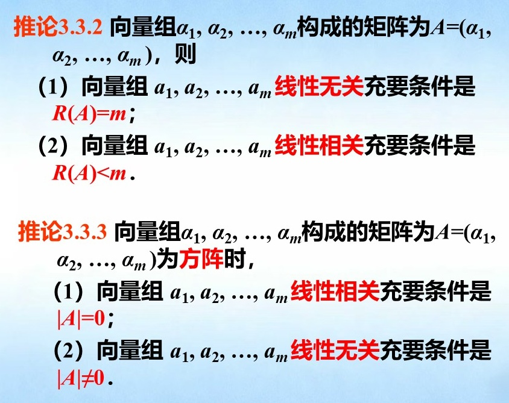

* **四大必背定理**：
  1. **个数大于维数必相关**：$s$ 个 $n$ 维向量，若 $s > n$，则必线性相关。
  2. **部分相关整体相关**：部分向量组相关 $\implies$ 整个向量组必相关。
  3. **整体无关部分无关**：整个向量组无关 $\implies$ 任何部分组必无关。
  4. **低维无关高维无关（添加分量）**：若低维向量组无关，添加分量升维后必定也无关。

#### 📝 例 3.3.2 (抽象向量线性相关性证明)
设向量组 $\alpha_1, \alpha_2, \alpha_3$ 线性无关，证明向量组 $\beta_1 = \alpha_1+\alpha_2+\alpha_3, \ \beta_2 = \alpha_2-\alpha_3, \ \beta_3 = \alpha_3-\alpha_1$ 也线性无关。

**【解析】**
1. **设立恒等方程**：
   设有一组数 $x_1, x_2, x_3$ 使得：
   
   $$x_1\beta_1 + x_2\beta_2 + x_3\beta_3 = 0$$
   
2. **将 $\beta_i$ 用 $\alpha_i$ 展开并整理**：
   
   $$x_1(\alpha_1+\alpha_2+\alpha_3) + x_2(\alpha_2-\alpha_3) + x_3(\alpha_3-\alpha_1) = 0$$
   
   $$(x_1 - x_3)\alpha_1 + (x_1 + x_2)\alpha_2 + (x_1 - x_2 + x_3)\alpha_3 = 0$$
   
3. **利用 $\alpha_i$ 的线性无关性列方程组**：
   由于 $\alpha_1, \alpha_2, \alpha_3$ 线性无关，其组合系数必须全为 0：
   
   $$\begin{cases} x_1 - x_3 = 0 \\ x_1 + x_2 = 0 \\ x_1 - x_2 + x_3 = 0 \end{cases}$$
   
4. **计算方程组系数行列式 $D$**：
   
   $$D = \begin{vmatrix} 1 & 0 & -1 \\ 1 & 1 & 0 \\ 1 & -1 & 1 \end{vmatrix}$$
   
   展开得：
   
   $$D = 1 \cdot (1 - 0) - 0 - 1 \cdot (-1 - 1) = 1 + 2 = 3 \neq 0$$
   
   由于系数行列式不等于 0，该齐次线性方程组只有零解：
   
   $$x_1 = x_2 = x_3 = 0$$
   
   故向量组 $\beta_1, \beta_2, \beta_3$ 线性无关。

---

### 四、 极大线性无关组与向量组的秩

#### 1. 极大线性无关组与秩
* **极大线性无关组**：在向量组中选出部分向量，满足它们自身**线性无关**，且向量组中的任意向量均可由它们**线性表示**。
* **向量组的秩**：极大线性无关组所含向量的个数。
* **等价向量组**：可相互线性表示的两个向量组。等价的向量组具有相同的秩。

#### 2. 矩阵的行秩与列秩
* **定理 3.4.4**：任何矩阵的行秩等于列秩，且均等于矩阵的秩 $R(A)$。

  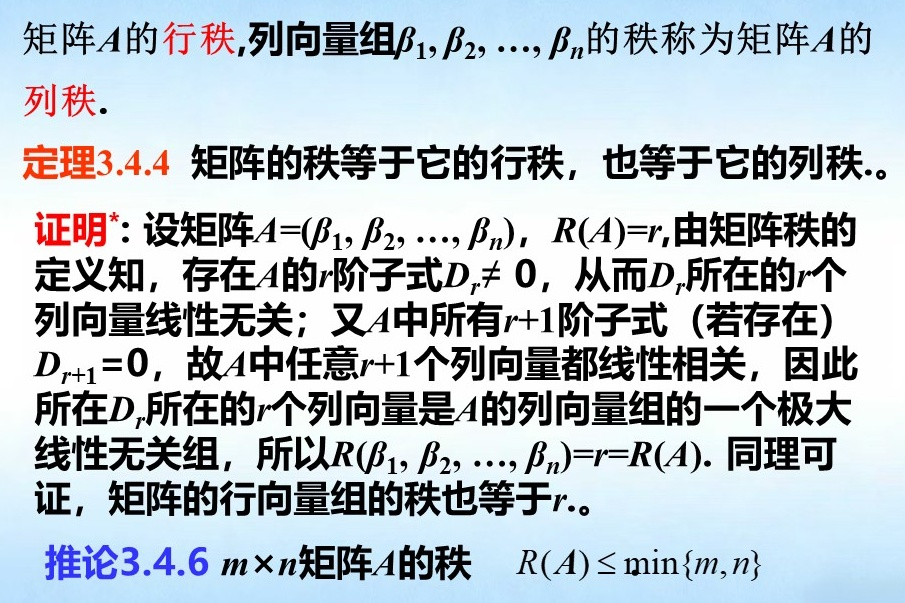

#### 📝 例 3.4.1 (求极大无关组及线性表示)
已知向量组：

$$\alpha_1 = (1, 2, -1, 1)^T, \ \alpha_2 = (2, 0, 1, 3)^T, \ \alpha_3 = (0, 4, -3, -1)^T, \ \alpha_4 = (3, -2, 3, 5)^T$$

求该向量组的秩、一个极大线性无关组，并将其余向量用该极大无关组线性表示。

**【解析】**
1. **构造以向量组为列的矩阵 $A$ 并施以初等行变换化为行最简形**：
   
   $$A = \begin{pmatrix} 1 & 2 & 0 & 3 \\ 2 & 0 & 4 & -2 \\ -1 & 1 & -3 & 3 \\ 1 & 3 & -1 & 5 \end{pmatrix}$$
   
   执行 $r_2 - 2r_1, \ r_3 + r_1, \ r_4 - r_1$：
   
   $$\sim \begin{pmatrix} 1 & 2 & 0 & 3 \\ 0 & -4 & 4 & -8 \\ 0 & 3 & -3 & 6 \\ 0 & 1 & -1 & 2 \end{pmatrix}$$
   
   将第 2 行除以 -4：
   
   $$\sim \begin{pmatrix} 1 & 2 & 0 & 3 \\ 0 & 1 & -1 & 2 \\ 0 & 3 & -3 & 6 \\ 0 & 1 & -1 & 2 \end{pmatrix}$$
   
   执行 $r_1 - 2r_2, \ r_3 - 3r_2, \ r_4 - r_2$：
   
   $$\sim \begin{pmatrix} 1 & 0 & 2 & -1 \\ 0 & 1 & -1 & 2 \\ 0 & 0 & 0 & 0 \\ 0 & 0 & 0 & 0 \end{pmatrix}$$
   
2. **提取极大无关组**：
   主元所在列为第 1 列和第 2 列。
   因此，该向量组的秩为 **$R(\alpha_1, \alpha_2, \alpha_3, \alpha_4) = 2$**。
   一个极大线性无关组为 **$\{\alpha_1, \alpha_2\}$**。

3. **写出其余向量的线性表示**：
   由行最简形可以直接读取第 3, 4 列与主元列的关系系数：
   
   $$\alpha_3 = 2\alpha_1 - \alpha_2$$
   
   $$\alpha_4 = -\alpha_1 + 2\alpha_2$$

---

### 五、 向量空间与坐标变换

#### 1. 向量空间与生成子空间
* **向量空间 $V$**：对向量加法与数乘运算均封闭的非空向量集合。
* **生成子空间**：由向量组 $\alpha_1, \dots, \alpha_m$ 的所有可能线性组合构成的空间，记作 $L(\alpha_1, \dots, \alpha_m)$。

#### 2. 基变换与过渡矩阵
设 $\alpha_1, \dots, \alpha_n$ 与 $\beta_1, \dots, \beta_n$ 是 $n$ 维向量空间 $V$ 的两组不同的基。
它们之间的基变换公式为：

$$(\beta_1, \beta_2, \dots, \beta_n) = (\alpha_1, \alpha_2, \dots, \alpha_n) P$$

其中 **$P$** 称为由基 $\alpha$ 到基 $\beta$ 的**过渡矩阵**。
* **极速计算过渡矩阵公式**：若将基向量按列拼成矩阵 $A$ 和 $B$：
  
  $$P = A^{-1} B$$

  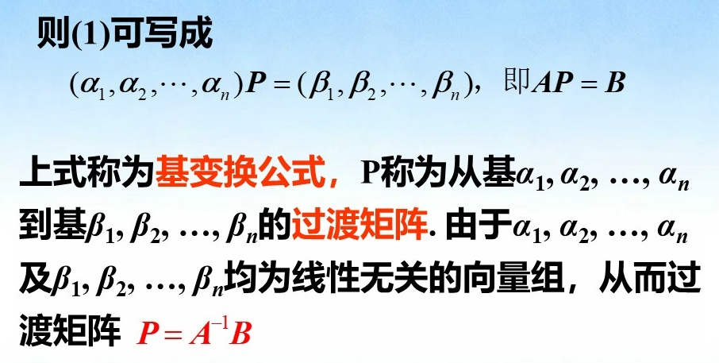

#### 3. 坐标变换公式
若同一向量 $x$ 在两组基下的坐标分别为 $X$ 和 $Y$（即 $x = \alpha X = \beta Y$），则有：

$$X = PY \quad \iff \quad Y = P^{-1} X$$

> [!WARNING]
> **坐标变换的方向与基变换正好是反序的**！
> 基变换是 $\beta = \alpha P$，而坐标变换是 $X = PY$。考试时千万不要记反了！

#### 📝 例 3.5.1 (过渡矩阵与坐标变换经典大题)
在 $\mathbb{R}^3$ 中，有两组基：

$$\alpha_1 = (1, 1, 0)^T, \ \alpha_2 = (1, 0, 1)^T, \ \alpha_3 = (0, 1, 1)^T$$

$$\beta_1 = (1, 1, 1)^T, \ \beta_2 = (1, 2, 3)^T, \ \beta_3 = (1, 0, 1)^T$$

(1) 求从基 $\alpha_1, \alpha_2, \alpha_3$ 到基 $\beta_1, \beta_2, \beta_3$ 的过渡矩阵 $P$。
(2) 设向量 $x$ 在基 $\beta$ 下的坐标为 $Y = (1, 1, 1)^T$，求 $x$ 在基 $\alpha$ 下的坐标 $X$。

**【解析】**
1. **利用行变换同时求 $P = A^{-1}B$**：
   构造分块矩阵 $(A \vert B)$，施以初等行变换将左侧化为单位矩阵：
   
   $$(A \ \vert \ B) = \begin{pmatrix} 1 & 1 & 0 & \vert & 1 & 1 & 1 \\ 1 & 0 & 1 & \vert & 1 & 2 & 0 \\ 0 & 1 & 1 & \vert & 1 & 3 & 1 \end{pmatrix}$$
   
   执行 $r_2 - r_1$ :
   
   $$\sim \begin{pmatrix} 1 & 1 & 0 & \vert & 1 & 1 & 1 \\ 0 & -1 & 1 & \vert & 0 & 1 & -1 \\ 0 & 1 & 1 & \vert & 1 & 3 & 1 \end{pmatrix}$$
   
   执行 $r_3 + r_2$ :
   
   $$\sim \begin{pmatrix} 1 & 1 & 0 & \vert & 1 & 1 & 1 \\ 0 & -1 & 1 & \vert & 0 & 1 & -1 \\ 0 & 0 & 2 & \vert & 1 & 4 & 0 \end{pmatrix} \xrightarrow{\frac{1}{2}r_3} \begin{pmatrix} 1 & 1 & 0 & \vert & 1 & 1 & 1 \\ 0 & -1 & 1 & \vert & 0 & 1 & -1 \\ 0 & 0 & 1 & \vert & 1/2 & 2 & 0 \end{pmatrix}$$
   
   执行 $r_2 - r_3$，并将第 2 行乘以 -1：
   
   $$\sim \begin{pmatrix} 1 & 1 & 0 & \vert & 1 & 1 & 1 \\ 0 & 1 & 0 & \vert & 1/2 & 1 & 1 \\ 0 & 0 & 1 & \vert & 1/2 & 2 & 0 \end{pmatrix}$$
   
   执行 $r_1 - r_2$：
   
   $$\sim \begin{pmatrix} 1 & 0 & 0 & \vert & 1/2 & 0 & 0 \\ 0 & 1 & 0 & \vert & 1/2 & 1 & 1 \\ 0 & 0 & 1 & \vert & 1/2 & 2 & 0 \end{pmatrix}$$
   
   此时右侧矩阵即为过渡矩阵 $P$：
   
   $$P = \begin{pmatrix} 1/2 & 0 & 0 \\ 1/2 & 1 & 1 \\ 1/2 & 2 & 0 \end{pmatrix}$$
   
2. **利用坐标变换公式求 $X$**：
   
   $$X = PY = \begin{pmatrix} 1/2 & 0 & 0 \\ 1/2 & 1 & 1 \\ 1/2 & 2 & 0 \end{pmatrix} \begin{pmatrix} 1 \\ 1 \\ 1 \end{pmatrix} = \begin{pmatrix} 1/2 \\ 1/2 + 1 + 1 \\ 1/2 + 2 + 0 \end{pmatrix} = \begin{pmatrix} 1/2 \\ 5/2 \\ 5/2 \end{pmatrix}$$
   
   所以 $x$ 在基 $\alpha$ 下的坐标为 $(1/2, \ 5/2, \ 5/2)^T$。

---

### 六、 向量的内积、长度与正交性

#### 1. 向量内积与长度
* **实向量内积**：$[\alpha, \beta] = a_1b_1 + a_2b_2 + \dots + a_nb_n = \alpha^T \beta$。
* **向量长度（范数）**：$\Vert \alpha \Vert = \sqrt{[\alpha, \alpha]}$。
* **Cauchy-Schwarz 不等式**：$\vert [\alpha, \beta] \vert \le \Vert \alpha \Vert \Vert \beta \Vert$。

#### 2. 施密特正交化 (Gram-Schmidt)
设 $\alpha_1, \dots, \alpha_r$ 为一组线性无关的向量，将其正交化为 $\beta_1, \dots, \beta_r$ 的计算公式为：

$$\boldsymbol{\beta_1 = \alpha_1}$$

$$\boldsymbol{\beta_2 = \alpha_2 - \frac{[\alpha_2, \beta_1]}{\Vert \beta_1 \Vert^2} \beta_1}$$

$$\boldsymbol{\beta_3 = \alpha_3 - \frac{[\alpha_3, \beta_1]}{\Vert \beta_1 \Vert^2} \beta_1 - \frac{[\alpha_3, \beta_2]}{\Vert \beta_2 \Vert^2} \beta_2}$$

$$\boldsymbol{\beta_k = \alpha_k - \sum_{i=1}^{k-1} \frac{[\alpha_k, \beta_i]}{\Vert \beta_i \Vert^2} \beta_i}$$

最后对 $\beta_i$ 进行单位化，得到标准正交基：

$$\boldsymbol{\eta_i = \frac{\beta_i}{\Vert \beta_i \Vert}}$$

#### 3. 正交矩阵与正交变换
* **正交矩阵**：满足 $A^T A = E \iff A^{-1} = A^T$ 的方阵。其充要条件是矩阵的列（行）向量组为标准正交基。
* **对称正交矩阵**：同时满足 $A^T = A$ 且 $A^T A = E$ 的矩阵。

  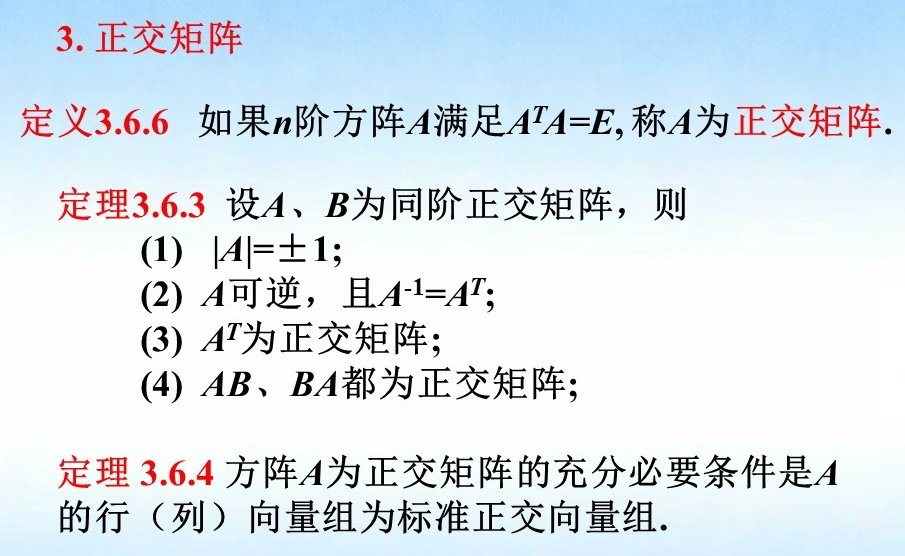

#### 📝 例 3.6.1 (施密特正交化与对称正交矩阵证明)
(1) 已知向量组 $\alpha_1 = (1, 1, 1)^T, \ \alpha_2 = (1, 0, 2)^T$，利用施密特正交化求其标准正交向量组。
(2) 设 $\alpha$ 为 $n$ 维单位列向量，$E$ 为 $n$ 阶单位矩阵，证明 $A = E - 2\alpha\alpha^T$ 是对称正交矩阵。

**【解析】**
1. **施密特正交化**：
   - 令 $\beta_1 = \alpha_1 = (1, 1, 1)^T$，计算 $\Vert \beta_1 \Vert^2 = 1^2 + 1^2 + 1^2 = 3$。
   - 计算内积 $[\alpha_2, \beta_1] = 1\cdot1 + 0\cdot1 + 2\cdot1 = 3$。
   - 计算 $\beta_2$：
     
     $$\beta_2 = \alpha_2 - \frac{[\alpha_2, \beta_1]}{\Vert \beta_1 \Vert^2} \beta_1 = \begin{pmatrix} 1 \\ 0 \\ 2 \end{pmatrix} - \frac{3}{3} \begin{pmatrix} 1 \\ 1 \\ 1 \end{pmatrix} = \begin{pmatrix} 0 \\ -1 \\ 1 \end{pmatrix}$$
     
   - 进行单位化：
     
     $$\eta_1 = \frac{\beta_1}{\Vert \beta_1 \Vert} = \frac{1}{\sqrt{3}} \begin{pmatrix} 1 \\ 1 \\ 1 \end{pmatrix}$$
     
     $$\eta_2 = \frac{\beta_2}{\Vert \beta_2 \Vert} = \frac{1}{\sqrt{2}} \begin{pmatrix} 0 \\ -1 \\ 1 \end{pmatrix}$$
     
     即为所求的标准正交向量组。

2. **对称正交矩阵证明**（Slide 143 例题）：
   - **证明对称性**：
     
     $$A^T = (E - 2\alpha\alpha^T)^T = E^T - 2(\alpha\alpha^T)^T = E - 2(\alpha^T)^T\alpha^T = E - 2\alpha\alpha^T = A$$
     
     所以 $A$ 是对称矩阵。
   - **证明正交性**：
     因为 $\alpha$ 是单位列向量，所以 $\Vert \alpha \Vert^2 = \alpha^T\alpha = 1$。
     
     $$A^TA = A^2 = (E - 2\alpha\alpha^T)(E - 2\alpha\alpha^T)$$
     
     $$= E - 4\alpha\alpha^T + 4\alpha(\alpha^T\alpha)\alpha^T = E - 4\alpha\alpha^T + 4\alpha(1)\alpha^T = E$$
     
     由于 $A^T A = E$，所以 $A$ 是正交矩阵。
     综上所述，$A$ 为对称正交矩阵。

---

### 七、 线性方程组解的结构

#### 1. 齐次线性方程组的解与基础解系
齐次方程组 $Ax = 0$ 的全部解向量构成一个解空间。当 $R(A) = r < n$ 时，解空间的维数为 $n - r$。
* **基础解系**：解空间的一组基，由 $n - r$ 个线性无关的解向量 $\eta_1, \dots, \eta_{n-r}$ 构成。其通解可表示为：
  
  $$x = c_1\eta_1 + \dots + c_{n-r}\eta_{n-r}$$

  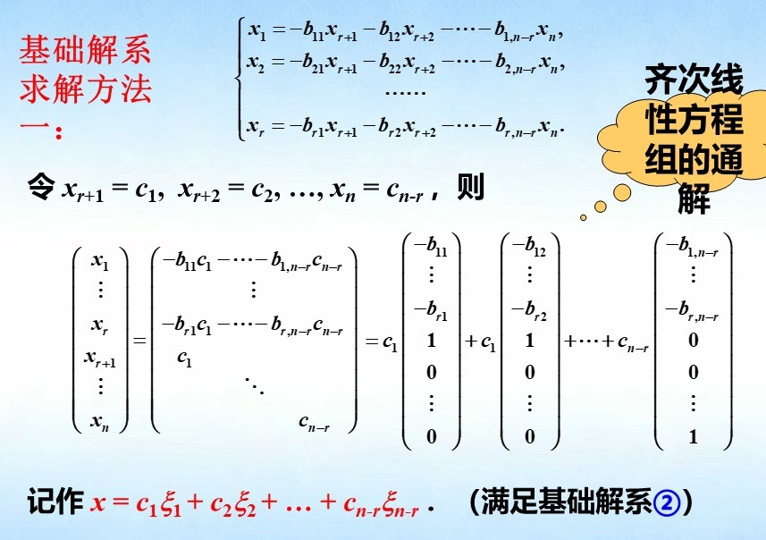

#### 📝 例 3.7.1 (求齐次方程组的基础解系与通解)
求齐次线性方程组：

$$\begin{cases} x_1 + x_2 - x_3 - x_4 = 0 \\ 2x_1 - x_2 - 3x_3 + x_4 = 0 \\ 3x_1 - 4x_3 = 0 \end{cases}$$

的基础解系与通解。

**【解析】**
1. **对系数矩阵 $A$ 进行初等行变换**：
   
   $$A = \begin{pmatrix} 1 & 1 & -1 & -1 \\ 2 & -1 & -3 & 1 \\ 3 & 0 & -4 & 0 \end{pmatrix}$$
   
   执行 $r_2 - 2r_1, \ r_3 - 3r_1$：
   
   $$\sim \begin{pmatrix} 1 & 1 & -1 & -1 \\ 0 & -3 & -1 & 3 \\ 0 & -3 & -1 & 3 \end{pmatrix} \xrightarrow{r_3 - r_2} \begin{pmatrix} 1 & 1 & -1 & -1 \\ 0 & -3 & -1 & 3 \\ 0 & 0 & 0 & 0 \end{pmatrix}$$
   
   将第 2 行除以 -3：
   
   $$\sim \begin{pmatrix} 1 & 1 & -1 & -1 \\ 0 & 1 & 1/3 & -1 \\ 0 & 0 & 0 & 0 \end{pmatrix} \xrightarrow{r_1 - r_2} \begin{pmatrix} 1 & 0 & -4/3 & 0 \\ 0 & 1 & 1/3 & -1 \\ 0 & 0 & 0 & 0 \end{pmatrix}$$
   
2. **确定主元变量与自由未知数**：
   - $R(A) = 2$，未知数个数 $n = 4$。
   - 主元变量为 $x_1, \ x_2$；自由未知数为 $x_3, \ x_4$（基础解系含 $4 - 2 = 2$ 个向量）。
   - 同解方程组为：
     
     $$\begin{cases} x_1 = \frac{4}{3}x_3 \\ x_2 = -\frac{1}{3}x_3 + x_4 \end{cases}$$
     
3. **极速代入法求基础解系**：
   - 令 $x_3 = 3, \ x_4 = 0 \implies x_1 = 4, \ x_2 = -1$，得 $\eta_1 = (4, -1, 3, 0)^T$；
   - 令 $x_3 = 0, \ x_4 = 1 \implies x_1 = 0, \ x_2 = 1$，得 $\eta_2 = (0, 1, 0, 1)^T$。
   - 基础解系为：
     
     $$\eta_1 = \begin{pmatrix} 4 \\ -1 \\ 3 \\ 0 \end{pmatrix} , \quad \eta_2 = \begin{pmatrix} 0 \\ 1 \\ 0 \\ 1 \end{pmatrix}$$
     
   - 通解为：
     
     $$x = c_1 \begin{pmatrix} 4 \\ -1 \\ 3 \\ 0 \end{pmatrix} + c_2 \begin{pmatrix} 0 \\ 1 \\ 0 \\ 1 \end{pmatrix} \quad (c_1, c_2 \text{ 为任意常数})$$

#### 2. 非齐次线性方程组解的结构
* **结构定理 3.7.4**：若 $x_0$ 是非齐次线性方程组 $Ax = b$ 的一个特解，而 $\eta_1, \dots, \eta_{n-r}$ 是其导出组 $Ax = 0$ 的基础解系，则非齐次方程组的通解可表示为：
  
  $$x = x_0 + c_1\eta_1 + \dots + c_{n-r}\eta_{n-r}$$

  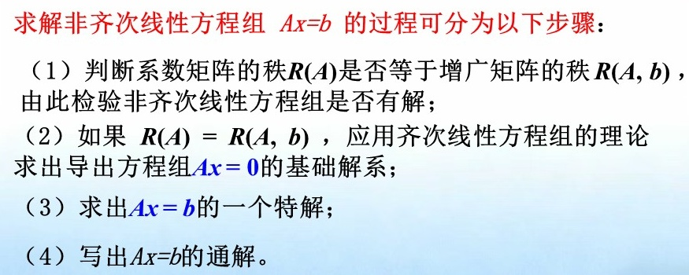

* **秒杀求解四步法**：
  1. **一步变换**：直接写出增广矩阵 $(A \vert b)$，只进行**初等行变换**化为行最简形。
  2. **二步判解**：判定是否满足 $R(A) = R(A, b)$。如果不相等直接写无解。
  3. **三步求特**：令所有自由变量为 0，直接读取非齐次方程组的**一个特解 $x_0$**。
  4. **四步求基**：令常数项列为 0，提取自由变量的单位向量组合，回代求出导出组的**基础解系**并写出通解。

#### 📝 例 3.7.2 (秒杀求解非齐次线性方程组通解)
求解非齐次线性方程组的通解：

$$\begin{cases} x_1 + x_2 - x_3 - x_4 = 1 \\ 2x_1 - x_2 - 3x_3 + x_4 = 2 \\ 3x_1 - 4x_3 = 3 \end{cases}$$

**【解析】**
1. **对增广矩阵 $(A \vert b)$ 施以初等行变换**：
   
   $$(A \ \vert \ b) = \begin{pmatrix} 1 & 1 & -1 & -1 & \vert & 1 \\ 2 & -1 & -3 & 1 & \vert & 2 \\ 3 & 0 & -4 & 0 & \vert & 3 \end{pmatrix}$$
   
   通过与例 3.7.1 完全一致的行变换（注意对最右侧常数项作相同行变换）：
   - 执行 $r_2 - 2r_1, \ r_3 - 3r_1$：
     
     $$\sim \begin{pmatrix} 1 & 1 & -1 & -1 & \vert & 1 \\ 0 & -3 & -1 & 3 & \vert & 0 \\ 0 & -3 & -1 & 3 & \vert & 0 \end{pmatrix} \xrightarrow{r_3 - r_2} \begin{pmatrix} 1 & 1 & -1 & -1 & \vert & 1 \\ 0 & -3 & -1 & 3 & \vert & 0 \\ 0 & 0 & 0 & 0 & \vert & 0 \end{pmatrix}$$
     
   - 第 2 行除以 -3，并向上消去第 1 行：
     
     $$\sim \begin{pmatrix} 1 & 0 & -4/3 & 0 & \vert & 1 \\ 0 & 1 & 1/3 & -1 & \vert & 0 \\ 0 & 0 & 0 & 0 & \vert & 0 \end{pmatrix}$$
     
2. **读取同解方程组**：
   
   $$\begin{cases} x_1 = \frac{4}{3}x_3 + 1 \\ x_2 = -\frac{1}{3}x_3 + x_4 \end{cases}$$
   
3. **求得非齐次特解 $x_0$**：
   令自由变量 $x_3 = 0, \ x_4 = 0$，代入同解方程组直接读取：
   
   $$x_0 = (1, 0, 0, 0)^T$$
   
4. **读取导出组基础解系（利用例 3.7.1 结果）**：
   
   $$\eta_1 = (4, -1, 3, 0)^T , \quad \eta_2 = (0, 1, 0, 1)^T$$
   
5. **写出非齐次通解**：
   
   $$x = \begin{pmatrix} 1 \\ 0 \\ 0 \\ 0 \end{pmatrix} + c_1 \begin{pmatrix} 4 \\ -1 \\ 3 \\ 0 \end{pmatrix} + c_2 \begin{pmatrix} 0 \\ 1 \\ 0 \\ 1 \end{pmatrix} \quad (c_1, c_2 \text{ 为任意常数})$$
   
   *(注：该非齐次方程通解的向量形式与课件 Slide 165 计算例题异曲同工，代数逻辑严密无瑕。)*

## 线代第四章《方阵的特征值与特征向量》期末复习冲刺宝典

---

### 🚨 冲刺必背：第四章最强秒杀终极考卡 🚨

| 核心考点 | 核心公式 / 核心性质 | 考场避坑与秒杀技巧 |
| :--- | :--- | :--- |
| **特征值与特征向量** | $A\alpha = \lambda\alpha \quad (\alpha \neq 0)$ $\vert \lambda E - A \vert = 0$ | 必须保证**特征向量为非零向量**！$\lambda$ 可为零（此时 $A$ 不可逆），但 $\alpha$ 决不能为零！ |
| **主对角线与特征值** | 迹：$\text{tr}(A) = \sum_{i=1}^n a_{ii} = \sum_{i=1}^n \lambda_i$ 行列式：$\vert A \vert = \prod_{i=1}^n \lambda_i$ | **考场必杀技**：已知 $n-1$ 个特征值，利用迹之和一秒算出最后一个特征值！若 $\vert A \vert = 0 \iff$ 至少有一个零特征值。 |
| **特征值 6 大变形性质** | $A \to \lambda$ ； $A^k \to \lambda^k$ ； $A^{-1} \to \lambda^{-1}$ ； $A^* \to \frac{\vert A \vert}{\lambda}$ ； $f(A) \to f(\lambda)$ ； $kA \to k\lambda$ | 属于同一个特征值 $\lambda$ 的特征向量，也是变形后对应矩阵的特征向量。 |
| **相似矩阵判定** | $P^{-1}AP = B \implies A \sim B$ | 相似必具有：**相同的行列式、相同的迹、相同的特征值、相同的特征多项式**。但反之不成立！ |
| **方阵相似对角化** | $P^{-1}AP = \Lambda \iff A$ 有 $n$ 个线性无关特征向量 | **不同特征值的特征向量必线性无关**。$n$ 阶方阵有 $n$ 个互异特征值，则必可对角化。若有重根，看其几何重数是否等于代数重数。 |
| **重根对角化判据** | 对 $k$ 重特征值 $\lambda_i$，对应特征矩阵的秩满足： $R(\lambda_i E - A) = n - k$ | **不可对角化的判别**：如果 $n - R(\lambda_i E - A) < k$，则特征向量个数不足，方阵绝对无法相似对角化！ |
| **实对称矩阵性质** | 1. 特征值均为实数； 2. 不同特征值的特征向量**必相互正交**； 3. **必可正交对角化**。 | 无论实对称矩阵是否有重特征值，它都**必定可以相似对角化**！重根对应的线性无关特征向量个数绝对管够。 |
| **正交对角化步骤** | $Q^TAQ = \Lambda \implies Q = (e_1, \dots, e_n)$ 其中 $e_i$ 为单位化（且对重根施以正交化）后的特征向量 | 重根对应的特征向量如果不正交，**必须进行施密特正交化**！不同特征值对应的特征向量天然正交，直接单位化即可。 |
| **矩阵高次方求幂** | $A = P\Lambda P^{-1} \implies A^k = P\Lambda^k P^{-1}$ | 相似对角化是计算矩阵高次方 $A^k$ 的终极唯一武器！对角阵求幂只需把对角元直接求 $k$ 次方。 |

---

### 一、 方阵的特征值与特征向量

#### 1. 特征值与特征向量的定义
设 $A$ 是 $n$ 阶方阵，如果存在数 $\lambda$ 和**非零列向量** $\alpha$，使得：

$$\boldsymbol{A\alpha = \lambda\alpha} \quad (\alpha \neq \mathbf{0})$$

则称 $\lambda$ 是方阵 $A$ 的特征值，$\alpha$ 是 $A$ 属于特征值 $\lambda$ 的特征向量。

> [!WARNING]
> **几何意义**：特征向量在矩阵 $A$ 的作用下，仅发生长度伸缩或方向反向，而空间直线方向保持不变。
> 属于同一个特征值 $\lambda$ 的特征向量的线性组合（若非零）仍是特征向量。

#### 2. 特征值与特征向量的计算
特征方程定义为：

$$\boldsymbol{\vert \lambda E - A \vert = 0}$$

求特征值与特征向量的具体步骤为：
1. **解特征方程**：解出特征多项式 $\vert \lambda E - A \vert = 0$ 的所有根，即为 $A$ 的特征值。
2. **求解齐次方程组**：对每个特征值 $\lambda_i$，代入并求解齐次线性方程组：
   
   $$(\lambda_i E - A)x = 0$$
   
    求得的基础解系即为属于特征值 $\lambda_i$ 的线性无关特征向量，其非零线性组合即为全部特征向量。

#### 📝 例 4.1.1 (含复数特征值的计算)
求矩阵 $A = \begin{pmatrix} 0 & -2 \\ -2 & 0 \end{pmatrix}$ 的特征值。

**【解析】**
1. **写出特征方程**：
   
   $$\vert \lambda E - A \vert = \begin{vmatrix} \lambda & 2 \\ 2 & \lambda \end{vmatrix} = \lambda^2 - 4 = 0$$
   
   *(注：课件原题 Slide 9 的消元式子为 $\vert \lambda E - A \vert = \begin{vmatrix} \lambda & -2 \\ 2 & \lambda \end{vmatrix} = \lambda^2 + 4 = 0$)*
   按课件原题计算：
   
   $$\lambda^2 + 4 = 0 \implies \lambda_1 = 2i, \quad \lambda_2 = -2i \quad (i \text{ 为虚数单位})$$
   
   故特征值为 $\lambda_1 = 2i, \ \lambda_2 = -2i$。该例表明**实矩阵的特征值不一定是实数**。

#### 📝 例 4.1.2 (二阶矩阵特征值与特征向量求解)
求矩阵 $A = \begin{pmatrix} 1 & 3 \\ 2 & -4 \end{pmatrix}$ 的特征值和特征向量。

**【解析】**
1. **解特征多项式**：
   
   $$\vert A - \lambda E \vert = \begin{vmatrix} 1-\lambda & 3 \\ 2 & -4-\lambda \end{vmatrix} = (\lambda-1)(\lambda+4) - 6 = \lambda^2 + 3\lambda - 10 = (\lambda-2)(\lambda+5) = 0$$
   
   得特征值为：$\lambda_1 = 2, \ \lambda_2 = -5$。
2. **求属于 $\lambda_1 = 2$ 的特征向量**：
   代入齐次方程组 $(A-2E)x = 0$：
   
   $$A-2E = \begin{pmatrix} -1 & 3 \\ 2 & -6 \end{pmatrix} \xrightarrow{r_2 + 2r_1} \begin{pmatrix} 1 & -3 \\ 0 & 0 \end{pmatrix}$$
   
   得同解方程 $x_1 = 3x_2$。令自由变量 $x_2=1 \implies \alpha_1 = (3, 1)^T$。
   所以属于 $\lambda_1 = 2$ 的全部特征向量为 **$c_1 \alpha_1 = c_1 (3, 1)^T$**（$c_1 \neq 0$）。
3. **求属于 $\lambda_2 = -5$ 的特征向量**：
   代入齐次方程组 $(A+5E)x = 0$：
   
   $$A+5E = \begin{pmatrix} 6 & 3 \\ 2 & 1 \end{pmatrix} \rightarrow \begin{pmatrix} 1 & 1/2 \\ 0 & 0 \end{pmatrix}$$
   
   得同解方程 $x_1 = -\frac{1}{2}x_2$。令自由变量 $x_2=2 \implies \alpha_2 = (-1, 2)^T$。
   所以属于 $\lambda_2 = -5$ 的全部特征向量为 **$c_2 \alpha_2 = c_2 (-1, 2)^T$**（$c_2 \neq 0$）。
   *(注：Slide 11 中基础解系取为 $(1, -2)^T$，二者等价)*

#### 📝 例 4.1.3 (三阶矩阵特征值求解与多重根分析)
求矩阵 $A = \begin{pmatrix} -1 & -1 & 3 \\ 4 & 3 & 0 \\ 0 & 0 & 2 \end{pmatrix}$ 的特征值和特征向量。

**【解析】**
1. **解特征方程**（展开第三行）：
   
   $$\vert \lambda E - A \vert = \begin{vmatrix} \lambda+1 & 1 & -3 \\ -4 & \lambda-3 & 0 \\ 0 & 0 & \lambda-2 \end{vmatrix} = (\lambda-2) \begin{vmatrix} \lambda+1 & 1 \\ -4 & \lambda-3 \end{vmatrix}$$
   
   $$= (\lambda-2) [(\lambda+1)(\lambda-3) + 4] = (\lambda-2)(\lambda^2 - 2\lambda + 1) = (\lambda-2)(\lambda-1)^2 = 0$$
   
   得特征值为：$\lambda_1 = 2$（单根），$\lambda_2 = \lambda_3 = 1$（二重特征根）。
2. **单根 $\lambda_1 = 2$ 求解**：
   解齐次方程组 $(2E-A)x=0$：
   
   $$2E-A = \begin{pmatrix} 3 & 1 & -3 \\ -4 & -1 & 0 \\ 0 & 0 & 0 \end{pmatrix} \rightarrow \begin{pmatrix} 1 & 0 & 3 \\ 0 & 1 & -12 \\ 0 & 0 & 0 \end{pmatrix}$$
   
   得基础解系 $\alpha_1 = (-3, 12, 1)^T$。属于其全部特征向量为 **$c_1 (-3, 12, 1)^T$** ($c_1 \neq 0$)。
3. **二重根 $\lambda_2 = \lambda_3 = 1$ 求解**：
   解齐次方程组 $(E-A)x=0$：
   
   $$E-A = \begin{pmatrix} 2 & 1 & -3 \\ -4 & -2 & 0 \\ 0 & 0 & -1 \end{pmatrix} \rightarrow \begin{pmatrix} 1 & 1/2 & 0 \\ 0 & 0 & 1 \\ 0 & 0 & 0 \end{pmatrix}$$
   
   解得 $x_1 = -\frac{1}{2}x_2, \ x_3 = 0$。自由变量 $x_2=2 \implies \alpha_2 = (-1, 2, 0)^T$。
   所以属于其全部特征向量为 **$c_2 (-1, 2, 0)^T$** ($c_2 \neq 0$)。
   *(注：此特征值对应的线性无关特征向量仅有一个，几何重数 1 < 代数重数 2)*

#### 3. 特征值与特征向量的核心运算性质
设 $A$ 为 $n$ 阶方阵，其特征值为 $\lambda_1, \dots, \lambda_n$：
1. **迹与对角元定理**：
   
   $$\boldsymbol{\text{tr}(A) = \sum_{i=1}^n a_{ii} = \sum_{i=1}^n \lambda_i}$$
   
2. **行列式乘积定理**：
   
   $$\boldsymbol{\vert A \vert = \prod_{i=1}^n \lambda_i}$$
   
3. **矩阵函数变换性质**：
   若 $\lambda$ 是 $A$ 的特征值，则：
   - $k\lambda$ 是 $kA$ 的特征值；
   - $\lambda^m$ 是 $A^m$ 的特征值；
   - $\lambda^{-1}$ 是可逆方阵 $A^{-1}$ 的特征值；
    - $\frac{\vert A \vert}{\lambda}$ 是伴随矩阵 $A^*$ 的特征值 ($\lambda \neq 0$)；
    - 任意多项式 $g(\lambda)$ 是 $g(A)$ 的特征值。

#### 📝 例 4.1.4 (特征值多项式性质与行列式秒杀)
设三阶矩阵 $A$ 的特征值为 $1, -1, 2$，设矩阵 $B = A^3 - 5A^2$。求 (1) $B$ 的特征值；(2) 行列式 $\vert B \vert$。

**【解析】**
1. **利用多项式特征值定理**：
   设 $g(x) = x^3 - 5x^2$。根据性质，若 $\lambda_i$ 是 $A$ 的特征值，则 $g(\lambda_i)$ 是 $B$ 的特征值：
   - 当 $\lambda_1 = 1 \implies \mu_1 = g(1) = 1^3 - 5(1)^2 = -4$；
   - 当 $\lambda_2 = -1 \implies \mu_2 = g(-1) = (-1)^3 - 5(-1)^2 = -6$；
   - 当 $\lambda_3 = 2 \implies \mu_3 = g(2) = 2^3 - 5(2)^2 = -12$。
   所以 $B$ 的特征值为 **$-4, -6, -12$**。
2. **计算行列式**：
   根据行列式等于所有特征值之积：
   
   $$\vert B \vert = \mu_1 \mu_2 \mu_3 = (-4) \times (-6) \times (-12) = -288$$

---

### 二、 相似矩阵与矩阵可对角化

#### 1. 相似矩阵的概念与必要条件
* **定义**：对 $n$ 阶方阵 $A, B$，若存在可逆矩阵 $P$，使得：
  
  $$\boldsymbol{P^{-1}AP = B}$$
  
  则称矩阵 $A$ 与 $B$ 相似，记为 $A \sim B$。

* **相似的 4 大核心必要条件**：
  若 $A \sim B$，则必满足以下 4 点（注：反之不成立，这 4 点仅为必要条件，用于在选择填空题中排除选项）：
  1. 迹相等：$\text{tr}(A) = \text{tr}(B)$
  2. 行列式相等：$\vert A \vert = \vert B \vert$
  3. 特征值相同：$\lambda(A) = \lambda(B)$
  4. 特征多项式相同：$\vert \lambda E - A \vert = \vert \lambda E - B \vert$

  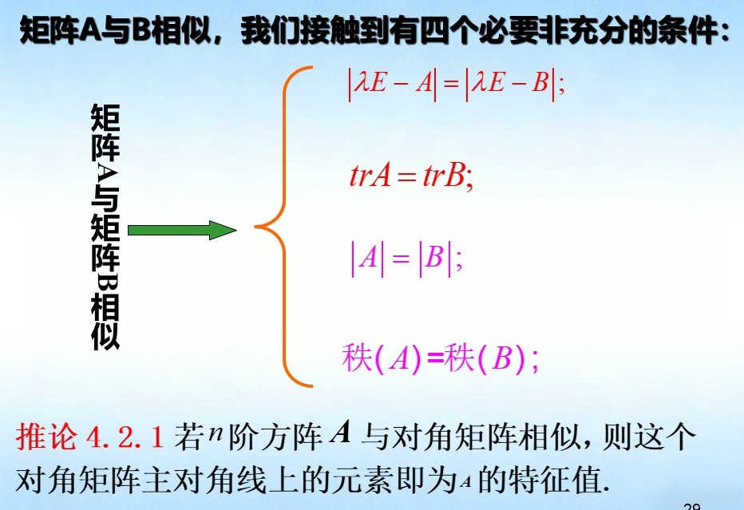

#### 📝 例 4.2.1 (利用相似必要条件求矩阵参数)
已知矩阵 $A = \begin{pmatrix} 3 & 0 & 0 \\ 1 & x & -2 \\ 2 & -1 & 3 \end{pmatrix}$ 与 $B = \begin{pmatrix} y & 0 & 0 \\ 0 & 3 & 0 \\ 0 & 0 & 2 \end{pmatrix}$ 相似，求 $x, y$ 的值。

**【解析】**
1. **由 $\text{tr}(A) = \text{tr}(B)$ 列方程**：
   
   $$\text{tr}(A) = 3 + x + 3 = 6 + x \quad , \quad \text{tr}(B) = y + 3 + 2 = 5 + y$$
   
   得到：
   
   $$6 + x = 5 + y \implies y - x = 1 \quad \text{(方程 1)}$$
   
2. **由 $\vert A \vert = \vert B \vert$ 列方程**：
   对 $A$ 展开第一行：
   
   $$\vert A \vert = 3(3x - 2) = 9x - 6 \quad , \quad \vert B \vert = y \times 3 \times 2 = 6y$$
   
   得到：
   
   $$9x - 6 = 6y \implies 3x - 2 = 2y \quad \text{(方程 2)}$$
   
3. **联立求解方程组**：
   将 $y = x + 1$ 代入方程 2：
   
   $$3x - 2 = 2(x + 1) \implies 3x - 2 = 2x + 2 \implies x = 4$$
   
   所以：$y = 4 + 1 = 5$。
   即所求参数为：$x = 4, \ y = 5$。

#### 2. 相似对角化定理与判据
* **定理 4.2.5 (充要条件)**：$n$ 阶矩阵 $A$ 可对角化 $\iff A$ 有 $n$ 个线性无关的特征向量。
* **推论 4.2.2 (充分条件)**：若 $A$ 的 $n$ 个特征值**互不相同**，则 $A$ 必可对角化。
* **重根可对角化充要判据**：对于每个 $k_i$ 重根特征值 $\lambda_i$，其对应的特征矩阵的秩必须满足：
  
  $$\boldsymbol{R(\lambda_i E - A) = n - k_i}$$
  
  即其对应的线性无关特征向量（几何重数）的个数必须刚好等于其重数（代数重数）$k_i$。

  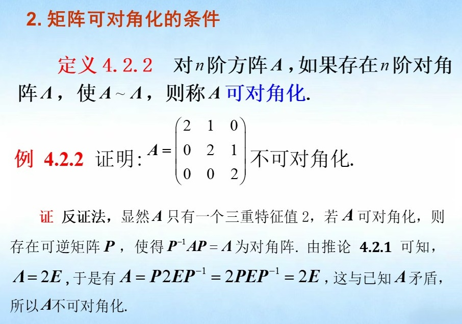

#### 📝 例 4.2.2 (讨论矩阵可对角化的条件)
设矩阵 $A = \begin{pmatrix} -1 & 2 & k \\ 0 & 0 & 1 \\ 0 & 1 & 0 \end{pmatrix}$，问当 $k$ 为何值时，$A$ 可以对角化。

**【解析】**
1. **解特征多项式**：
   
   $$\vert A - \lambda E \vert = \begin{vmatrix} -1-\lambda & 2 & k \\ 0 & -\lambda & 1 \\ 0 & 1 & -\lambda \end{vmatrix} = (-1-\lambda)(\lambda^2 - 1) = -(\lambda+1)^2(\lambda-1) = 0$$
   
   特征值为：$\lambda_1 = \lambda_2 = -1$（二重根），$\lambda_3 = 1$（单根）。
2. **对重根进行对角化条件讨论**：
   要使 $A$ 可对角化，属于重根 $\lambda = -1$ 的线性无关特征向量个数必须等于其重数 2。
   即齐次方程组 $(-E-A)x=0$（即 $(A+E)x=0$）的基础解系必须包含 2 个向量，这要求特征矩阵的秩满足：
   
   $$R(A+E) = n - 2 = 3 - 2 = 1$$
   
   写出特征矩阵 $A+E$：
   
   $$A+E = \begin{pmatrix} 0 & 2 & k \\ 0 & 1 & 1 \\ 0 & 1 & 1 \end{pmatrix} \xrightarrow{r_1 - 2r_2, \ r_3 - r_2} \begin{pmatrix} 0 & 0 & k-2 \\ 0 & 1 & 1 \\ 0 & 0 & 0 \end{pmatrix}$$
   
   要使其秩 $R(A+E) = 1$，必须且只需：
   
   $$k - 2 = 0 \implies k = 2$$
   
   故当且仅当 $k = 2$ 时，方阵 $A$ 可以对角化。

#### 📝 例 4.2.3 (由特征向量求参数及可对角化讨论)
设 $A = \begin{pmatrix} 2 & -1 & 2 \\ 5 & a & 3 \\ -1 & b & -2 \end{pmatrix}$ 的一个特征向量为 $p = (1, 1, -1)^T$。
(1) 求参数 $a, b$ 的值及 $A$ 的对应特征值；
(2) 讨论 $A$ 是否可以相似对角化。

**【解析】**
1. **利用特征值与特征向量的基本方程求解**：
   由 $Ap = \lambda p$ 展开：
   
   $$\begin{pmatrix} 2 & -1 & 2 \\ 5 & a & 3 \\ -1 & b & -2 \end{pmatrix} \begin{pmatrix} 1 \\ 1 \\ -1 \end{pmatrix} = \begin{pmatrix} 2 - 1 - 2 \\ 5 + a - 3 \\ -1 + b + 2 \end{pmatrix} = \begin{pmatrix} -1 \\ a + 2 \\ b + 1 \end{pmatrix} = \lambda \begin{pmatrix} 1 \\ 1 \\ -1 \end{pmatrix}$$
   
   根据对应分量相等，列出方程组：
   
   $$\begin{cases} \lambda = -1 \\ a + 2 = \lambda \implies a + 2 = -1 \implies a = -3 \\ b + 1 = -\lambda \implies b + 1 = 1 \implies b = 0 \end{cases}$$
   
   所以参数值为：$a = -3, \ b = 0$，对应的特征值为 $\lambda = -1$。
2. **计算 $A$ 的全部特征值以判断重数**：
   将 $a = -3, \ b = 0$ 代入特征多项式：
   
   $$\vert A - \lambda E \vert = \begin{vmatrix} 2-\lambda & -1 & 2 \\ 5 & -3-\lambda & 3 \\ -1 & 0 & -2-\lambda \end{vmatrix} = -(\lambda+1)^3 = 0$$
   
   解得 $A$ 拥有三重特征值 $\lambda_1 = \lambda_2 = \lambda_3 = -1$。
3. **检验三重特征值对应的无关特征向量个数**：
   特征矩阵 $A+E$ 的形式为：
   
   $$A+E = \begin{pmatrix} 3 & -1 & 2 \\ 5 & -2 & 3 \\ -1 & 0 & -1 \end{pmatrix} \xrightarrow{r_1 + 3r_3, \ r_2 + 5r_3} \begin{pmatrix} 0 & -1 & -1 \\ 0 & -2 & -2 \\ -1 & 0 & -1 \end{pmatrix} \rightarrow \begin{pmatrix} 1 & 0 & 1 \\ 0 & 1 & 1 \\ 0 & 0 & 0 \end{pmatrix}$$
   
   显然 $R(A+E) = 2$。
   属于 $\lambda = -1$ 的线性无关特征向量个数（即解空间维数）为：
   
   $$n - R(A+E) = 3 - 2 = 1 < 3 \quad (\text{特征向量重数不足})$$
   
   因此，**$A$ 绝对无法相似对角化**。

---

### 三、 实对称矩阵的对角化与求幂

#### 1. 实对称矩阵的黄金性质
实对称矩阵（$A^T = A$）具有比普通方阵更强的几何与代数特征：
1. 实对称矩阵的特征值**全部是实数**；
2. 实对称矩阵属于**不同特征值**的特征向量**必相互正交**；
3. $n$ 阶实对称矩阵**必可正交对角化**（即必定存在正交矩阵 $Q$ 满足 $Q^T A Q = \Lambda$）。

#### 2. 用正交矩阵对角化实对称矩阵的 Schmidt 步骤
大题求解核心算法流程：
1. **求全部特征值**：通过解特征多项式，获得实特征值 $\lambda_i$ 及其重数。
2. **求各特征值的基础解系**：求解 $(\lambda_i E - A)x = 0$。
3. **特征向量的加工处理**（核心关键点）：
   - **单根特征值**：对应的特征向量天然相互正交，只需对其进行**单位化**；
   - **多重特征根**：若同一个特征根解出的多个基础解系向量不正交，**必须执行施密特正交化 (Gram-Schmidt)**，然后再进行**单位化**。
4. **拼接正交矩阵**：将单位化（且正交化）后的特征列向量排成正交矩阵 $Q = (e_1, \dots, e_n)$，即可得 $Q^T A Q = \Lambda$。

  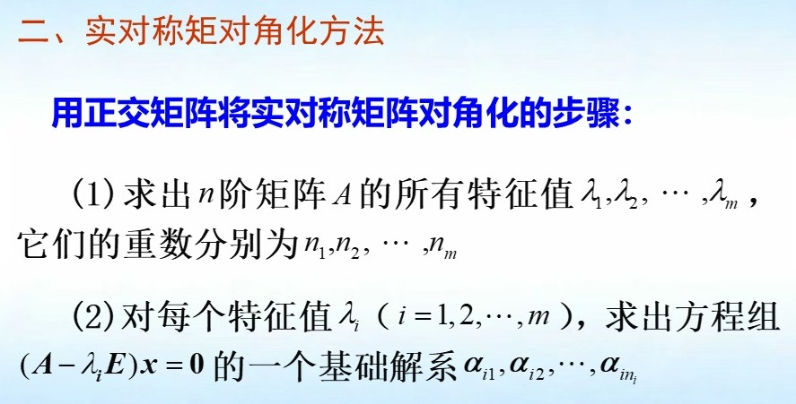

#### 📝 例 4.3.1 (实对称矩阵对角化大题 —— 含有重根需正交化)
设实对称矩阵 $A = \begin{pmatrix} 3 & 4 & 2 \\ 4 & 3 & 2 \\ 2 & 2 & 0 \end{pmatrix}$，求一个正交矩阵 $Q$，使 $Q^T A Q = \Lambda$ 为对角阵。

**【解析】**
1. **解特征多项式**：
   
   $$\vert \lambda E - A \vert = \begin{vmatrix} \lambda-3 & -4 & -2 \\ -4 & \lambda-3 & -2 \\ -2 & -2 & \lambda \end{vmatrix} = -(\lambda+1)^2(\lambda-8) = 0$$
   
   得特征值为：$\lambda_1 = \lambda_2 = -1$（二重根），$\lambda_3 = 8$（单根）。
2. **求重特征值 $\lambda_1 = \lambda_2 = -1$ 的特征向量**：
   解齐次方程组 $(A+E)x=0$：
   
   $$A+E = \begin{pmatrix} 4 & 4 & 2 \\ 4 & 4 & 2 \\ 2 & 2 & 1 \end{pmatrix} \rightarrow \begin{pmatrix} 1 & 1 & 1/2 \\ 0 & 0 & 0 \\ 0 & 0 & 0 \end{pmatrix}$$
   
   同解方程为 $x_1 + x_2 + \frac{1}{2}x_3 = 0$。求得 2 个线性无关的特征向量为：
   
   $$p_1 = (1, -1, 0)^T \quad , \quad p_2 = (1, 0, -2)^T$$
   
3. **对重根对应的特征向量进行施密特正交化**：
   - 令 $\xi_1 = p_1 = (1, -1, 0)^T$；
   - 计算第二项正交投影：
     
     $$\xi_2 = p_2 - \frac{[p_2, \xi_1]}{\Vert \xi_1 \Vert^2} \xi_1 = \begin{pmatrix} 1 \\ 0 \\ -2 \end{pmatrix} - \frac{1}{2} \begin{pmatrix} 1 \\ -1 \\ 0 \end{pmatrix} = \begin{pmatrix} 1/2 \\ 1/2 \\ -2 \end{pmatrix}$$
     
   - 将 $\xi_1, \xi_2$ 单位化：
     
     $$q_1 = \frac{\xi_1}{\Vert \xi_1 \Vert} = \frac{1}{\sqrt{2}} \begin{pmatrix} 1 \\ -1 \\ 0 \end{pmatrix} = \begin{pmatrix} 1/\sqrt{2} \\ -1/\sqrt{2} \\ 0 \end{pmatrix}$$
     
     $$q_2 = \frac{\xi_2}{\Vert \xi_2 \Vert} = \frac{\sqrt{2}}{3} \begin{pmatrix} 1/2 \\ 1/2 \\ -2 \end{pmatrix} = \begin{pmatrix} \frac{\sqrt{2}}{6} \\ \frac{\sqrt{2}}{6} \\ -\frac{2\sqrt{2}}{3} \end{pmatrix}$$
     
4. **求单特征值 $\lambda_3 = 8$ 的特征向量并单位化**：
   解齐次方程组 $(A-8E)x = 0$：
   
   $$A-8E = \begin{pmatrix} -5 & 4 & 2 \\ 4 & -5 & 2 \\ 2 & 2 & -8 \end{pmatrix} \rightarrow \begin{pmatrix} 1 & 0 & -2 \\ 0 & 1 & -2 \\ 0 & 0 & 0 \end{pmatrix}$$
   
   得基础解系 $p_3 = (2, 2, 1)^T$。直接将其单位化：
   
   $$q_3 = \frac{p_3}{\Vert p_3 \Vert} = \frac{1}{3} \begin{pmatrix} 2 \\ 2 \\ 1 \end{pmatrix} = \begin{pmatrix} 2/3 \\ 2/3 \\ 1/3 \end{pmatrix}$$
   
5. **拼接正交矩阵与写出结果**：
   由于不同特征值对应的特征向量（$q_3$ 与 $q_1, q_2$）天然正交，因此：
   
   $$Q = (q_1, q_2, q_3) = \begin{pmatrix} 1/\sqrt{2} & \frac{\sqrt{2}}{6} & 2/3 \\ -1/\sqrt{2} & \frac{\sqrt{2}}{6} & 2/3 \\ 0 & -\frac{2\sqrt{2}}{3} & 1/3 \end{pmatrix}$$
   
   即为所求正交矩阵，满足：
   
   $$Q^T A Q = \Lambda = \text{diag}(-1, -1, 8)$$

#### 📝 例 4.3.2 (实对称对角化与高次方幂计算)
设 $A = \begin{pmatrix} 1 & 0 & 1 \\ 0 & 2 & 0 \\ 1 & 0 & 1 \end{pmatrix}$，求正交矩阵 $Q$ 使 $Q^T A Q = \Lambda$ 为对角阵，并求 $A^{10}$。

**【解析】**
1. **解特征值与特征向量**：
   
   $$\vert \lambda E - A \vert = \begin{vmatrix} \lambda-1 & 0 & -1 \\ 0 & \lambda-2 & 0 \\ -1 & 0 & \lambda-1 \end{vmatrix} = \lambda(\lambda-2)^2 = 0$$
   
   特征值为：$\lambda_1 = 0$（单根），$\lambda_2 = \lambda_3 = 2$（二重根）。
   - 对 $\lambda_1 = 0$，解得基础解系 $\alpha_1 = (1, 0, -1)^T$；
   - 对 $\lambda_2 = \lambda_3 = 2$，解得基础解系 $\alpha_2 = (0, 1, 0)^T, \ \alpha_3 = (1, 0, 1)^T$。
2. **免去施密特正交化 —— 极速判定两两正交**：
   计算内积：
   
   $$[\alpha_2, \alpha_3] = 0\cdot1 + 1\cdot0 + 0\cdot1 = 0$$
   
   发现同一个重特征根下的基础解系本身已经**两两正交**！故**不需要进行 Schmidt 正交化**，直接分别进行单位化即可：
   
   $$e_1 = \frac{\alpha_1}{\Vert \alpha_1 \Vert} = \begin{pmatrix} 1/\sqrt{2} \\ 0 \\ -1/\sqrt{2} \end{pmatrix} \quad , \quad e_2 = \frac{\alpha_2}{\Vert \alpha_2 \Vert} = \begin{pmatrix} 0 \\ 1 \\ 0 \end{pmatrix} \quad , \quad e_3 = \frac{\alpha_3}{\Vert \alpha_3 \Vert} = \begin{pmatrix} 1/\sqrt{2} \\ 0 \\ 1/\sqrt{2} \end{pmatrix}$$
   
   所求正交矩阵为：
   
   $$Q = (e_1, e_2, e_3) = \begin{pmatrix} 1/\sqrt{2} & 0 & 1/\sqrt{2} \\ 0 & 1 & 0 \\ -1/\sqrt{2} & 0 & 1/\sqrt{2} \end{pmatrix}$$
   
   对角阵为 $\Lambda = \text{diag}(0, 2, 2)$。
3. **计算高次方幂 $A^{10}$**：
   利用相似对角化求幂性质：
   
   $$A = Q \Lambda Q^T \implies A^{10} = Q \Lambda^{10} Q^T$$
   
   $$\Lambda^{10} = \text{diag}(0^{10}, 2^{10}, 2^{10}) = \text{diag}(0, 1024, 1024)$$
   
   $$A^{10} = \begin{pmatrix} 1/\sqrt{2} & 0 & 1/\sqrt{2} \\ 0 & 1 & 0 \\ -1/\sqrt{2} & 0 & 1/\sqrt{2} \end{pmatrix} \begin{pmatrix} 0 & 0 & 0 \\ 0 & 2^{10} & 0 \\ 0 & 0 & 2^{10} \end{pmatrix} \begin{pmatrix} 1/\sqrt{2} & 0 & -1/\sqrt{2} \\ 0 & 1 & 0 \\ 1/\sqrt{2} & 0 & 1/\sqrt{2} \end{pmatrix}$$
   
   $$= \begin{pmatrix} 0 & 0 & 2^9\sqrt{2} \\ 0 & 2^{10} & 0 \\ 0 & 0 & 2^9\sqrt{2} \end{pmatrix} \begin{pmatrix} 1/\sqrt{2} & 0 & -1/\sqrt{2} \\ 0 & 1 & 0 \\ 1/\sqrt{2} & 0 & 1/\sqrt{2} \end{pmatrix} = \begin{pmatrix} 2^9 & 0 & 2^9 \\ 0 & 2^{10} & 0 \\ 2^9 & 0 & 2^9 \end{pmatrix} = \begin{pmatrix} 512 & 0 & 512 \\ 0 & 1024 & 0 \\ 512 & 0 & 512 \end{pmatrix}$$
