# 高等数学期末复习通关冲刺宝典（合订本）

## 前言与多端显示指南

本冲刺宝典为高等数学下册期末复习合订本，全面收录了第六章（定积分应用）至第十二章（无穷级数前三节）的全部核心考点、秒杀考卡与历年期末压轴大题。

> [!IMPORTANT]
> **💡 备考黄金建议：强烈推荐直接使用 Typora 或 Obsidian 阅读本 Markdown (.md) 源码文档！**
> 
> * **【黄金推荐】直接阅读极速秒杀原文件**：
>   * 为了帮您获得 100% 完美的公式高精度渲染与最极致的排版视觉，**强烈推荐您直接在原生 Markdown 编辑器中查看本 `.md` 文档**！本宝典专为 Markdown 原生高精渲染深度重构，能为您提供极高信息密度且最流畅的备考体验。
> * **如何开启完美高精公式渲染**：
>   * **Typora**：请在「偏好设置」->「Markdown」->「Markdown 扩展语法」中勾选**「内联公式」**，即可瞬间获得高保真极精美数学公式显示。
>   * **Obsidian**：原生 100% 完美支持本宝典的所有高阶公式排版、流程图和高精插图。
>   * **VS Code**：推荐安装 `Markdown All in One` 和 `Markdown Preview Enhanced` 插件以获得完美排版。

---

## 高数期末复习冲刺宝典：第六章 定积分的应用

#### 🎯 本章考点清单

* **计算题**：
  - [x] **求旋转体的体积** —— 确定旋转轴，利用直角坐标或参数方程确定积分限与被积函数（典型公式：绕 $x$ 轴旋转 $V_x = \pi \int_a^b y^2 dx$，绕 $y$ 轴旋转 $V_y = 2\pi \int_a^b x|y| dx$）。

### 一、 定积分的元素法（微元法）与基本思想（6.1）

定积分的定义源自“以直代弯、以常代变”的极限思想。当我们要求一个连续分布在区间 $[a, b]$ 上的总量 $U$ 时，若它满足**区间可加性**（即整体等于各部分之和），我们就可以用**元素法**将其表示为定积分。

#### 元素法“三步曲”标准建模流

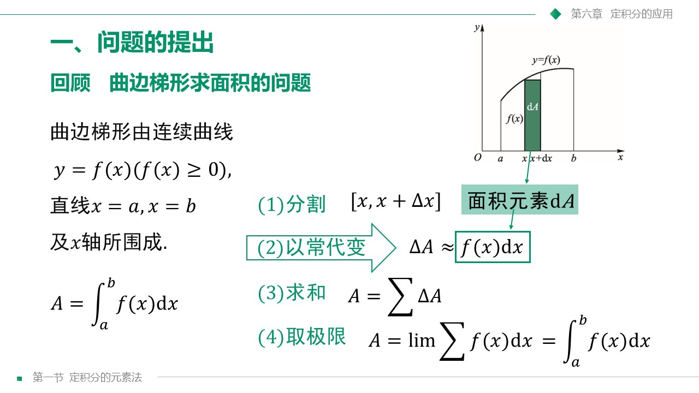

---

### 二、 定积分在几何学上的应用（6.2）

#### 1. 平面图形的面积
* **直角坐标系**：
  * 对于 $y_2(x) \ge y_1(x)$： $A = \int_a^b [y_2(x) - y_1(x)] dx$
  * 对于以 $y$ 为积分变量： $A = \int_c^d [x_2(y) - x_1(y)] dy$
* **极坐标系**：
  * 曲边扇形面积： $A = \frac{1}{2}\int_{\alpha}^{\beta} \rho^2(\theta)d\theta$
  * ⚠️ **致命雷区**：不要漏掉系数 $\frac{1}{2}$！
* **参数方程**：
  * 面积： $A = \int_{t_1}^{t_2} y(t) x'(t) dt$

#### 2. 旋转体与平行截面已知的立体体积

##### ① 旋转体的体积
旋转体是由一个平面图形绕该平面内一条定直线（旋转轴）旋转一周而成的立体。

##### 📌 绕 $x$ 轴旋转一周的体积

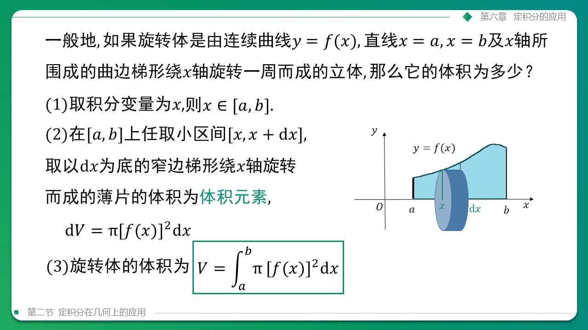

##### 📌 绕 $y$ 轴旋转一周的体积（★ 期末必考秒杀技巧 ★）

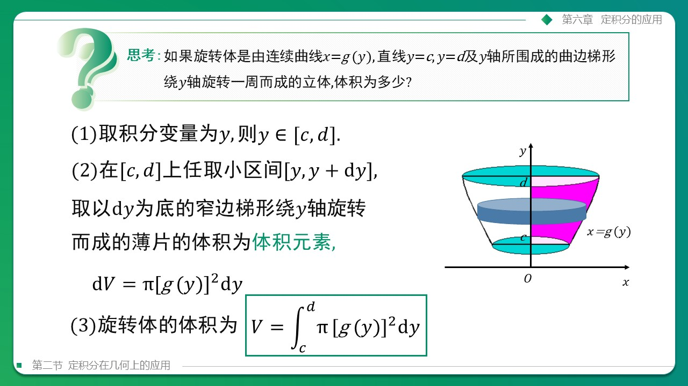

> [!IMPORTANT]
> **🌟 柱壳法（Cylindrical Shell Method）—— 绕 y 轴体积的秒杀绝招**
> 
> * **为什么用柱壳法**：绕 $y$ 轴旋转时，传统方法必须求反函数并对 $y$ 分段积分，这在考场上极易出错且计算极其痛苦（甚至无法求出反函数）。
> * **柱壳秒杀公式**：绕 $y$ 轴旋转的体积直接使用公式：
>   $$
>   V_y = 2\pi \int_a^b x \vert f(x) \vert dx
>   $$
>   此公式**直接以 $x$ 为积分变量**，不用求反函数，不用对 $y$ 分段，是期末考试绕 $y$ 轴旋转体积大题的极速秒杀王牌武器！

##### ② 平行截面面积为已知的立体体积

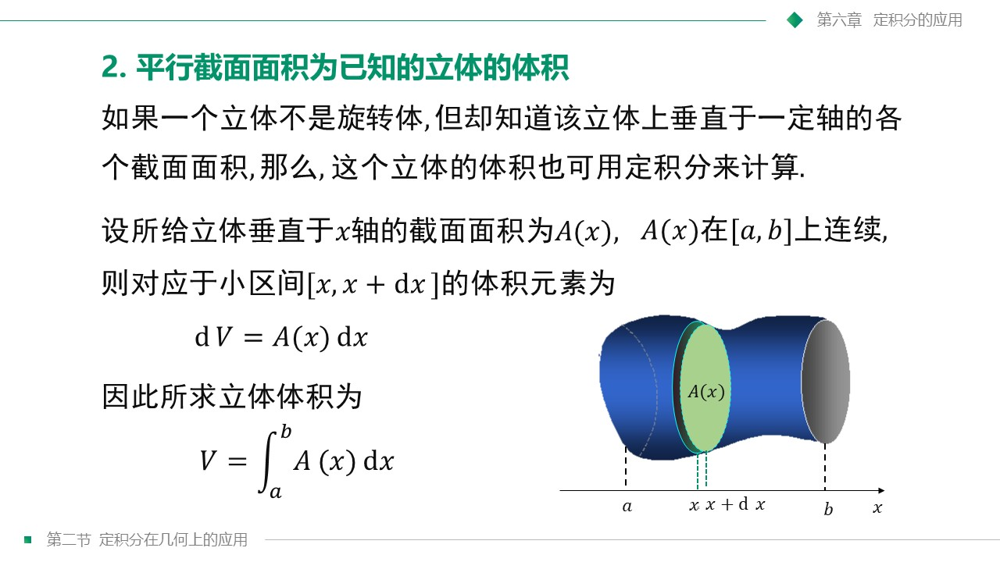

---

#### 3. 平面曲线的弧长
* **直角坐标系**： $s = \int_a^b \sqrt{1 + (y')^2} dx$
* **参数方程**： $s = \int_{t_1}^{t_2} \sqrt{(x')^2 + (y')^2} dt$
* **极坐标系**： $s = \int_{\alpha}^{\beta} \sqrt{\rho^2 + (\rho')^2} d\theta$

### 三、 经典期末真题极速秒杀剖析

#### 🔥 经典真题 1：两曲线围成图形旋转体积（卷1计算题1原题及高频拓展）

> [!NOTE]
> 📌 **期末真题重现**
> 
> * **原题（卷1计算题1）**：求曲线 $y = x^2$ 与 $y = x$ 围成的平面图形，绕 $x$ 轴旋转一周所得旋转体的体积 $V_x$。
> * **考点拓展（最高频考点）**：将该平面图形绕 $y$ 轴旋转一周所得旋转体的体积 $V_y$。
> * **核心分析（求交点）**：
>   联立方程：$\begin{cases} y = x^2 \\ y = x \end{cases} \implies x^2 = x \implies x(x-1) = 0$。
>   求得交点为 $(0,0)$ 和 $(1,1)$。积分区间在直角坐标系中为 $x \in [0, 1]$，对应 $y \in [0, 1]$。在此区间内，$x \ge x^2$。

##### 🚀 第一部分：绕 $x$ 轴旋转的体积 $V_x$（原题求解）

对于绕 $x$ 轴旋转，我们可以使用两种不同的积分方法进行求解，它们算出的物理结果完全一致：

##### 💡 方法一：垫圈法（以 $x$ 为积分变量，切片圆盘）
以 $x$ 为积分变量时，直线 $y=x$ 旋转形成的体积为外圆，抛物线 $y=x^2$ 旋转形成的体积为内圆。
* **体积微元**：
  $$
  dV_x = \pi [y_{\text{上}}^2 - y_{\text{下}}^2] dx = \pi [x^2 - (x^2)^2] dx = \pi (x^2 - x^4) dx
  $$
* **标准积分步骤**：
  $$
  V_x = \pi \int_0^1 (x^2 - x^4) dx = \pi \left[ \frac{x^3}{3} - \frac{x^5}{5} \right]_0^1 = \pi \left( \frac{1}{3} - \frac{1}{5} \right) = \frac{2}{15}\pi
  $$

##### 💡 方法二：柱壳法（以 $y$ 为积分变量，秒杀验证）
为了验证结果，我们改用柱壳法。此时绕 $x$ 轴旋转，应以 $y$ 为积分变量。柱壳的量度半径为 $y$，高度为右曲线减左曲线，即 $x_{\text{右}} - x_{\text{左}} = \sqrt{y} - y$。
* **体积微元**：
  $$
  dV_x = 2\pi y (x_{\text{右}} - x_{\text{左}}) dy = 2\pi y (\sqrt{y} - y) dy = 2\pi (y^{3/2} - y^2) dy
  $$
* **标准积分步骤**：
  $$
  V_x = 2\pi \int_0^1 (y^{3/2} - y^2) dy = 2\pi \left[ \frac{2}{5}y^{5/2} - \frac{y^3}{3} \right]_0^1 = 2\pi \left( \frac{2}{5} - \frac{1}{3} \right) = 2\pi \cdot \frac{1}{15} = \frac{2}{15}\pi
  $$
* **结论**：两种方法算出的绕 $x$ 轴旋转体积均为 $\frac{2}{15}\pi$，结果完全一致！

---

##### 🚀 第二部分：绕 $y$ 轴旋转的体积 $V_y$（核心拓展）

对于绕 $y$ 轴旋转，我们同样可以使用两种方法求解，通过对比可突显“柱壳秒杀法”的巨大优越性：

##### 💡 方法一：垫圈法（以 $y$ 为积分变量，切片圆盘）
此时必须将曲线改写为关于 $y$ 的函数，即右曲线为抛物线 $x_{\text{右}} = \sqrt{y}$，左曲线为直线 $x_{\text{左}} = y$。
* **体积微元**：
  $$
  dV_y = \pi [x_{\text{右}}^2 - x_{\text{左}}^2] dy = \pi [(\sqrt{y})^2 - y^2] dy = \pi (y - y^2) dy
  $$
* **标准积分步骤**：
  $$
  V_y = \pi \int_0^1 (y - y^2) dy = \pi \left[ \frac{y^2}{2} - \frac{y^3}{3} \right]_0^1 = \pi \left( \frac{1}{2} - \frac{1}{3} \right) = \frac{1}{6}\pi
  $$

##### 💡 方法二：柱壳秒杀法（以 $x$ 为积分变量，极速通关）
绕 $y$ 轴旋转时，直接以 $x$ 为积分变量，柱壳量度半径为 $x$，高度为 $y_{\text{上}} - y_{\text{下}} = x - x^2$。
* **体积微元**：
  $$
  dV_y = 2\pi x (y_{\text{上}} - y_{\text{下}}) dx = 2\pi x (x - x^2) dx = 2\pi (x^2 - x^3) dx
  $$
* **标准积分步骤**：
  $$
  V_y = 2\pi \int_0^1 (x^2 - x^3) dx = 2\pi \left[ \frac{x^3}{3} - \frac{x^4}{4} \right]_0^1 = 2\pi \left( \frac{1}{3} - \frac{1}{4} \right) = 2\pi \cdot \frac{1}{12} = \frac{1}{6}\pi
  $$
* **结论**：两种方法算出的绕 $y$ 轴旋转体积均为 $\frac{1}{6}\pi$，结果完全一致！在考场上，柱壳法由于省去了求反函数的过程，速度和准确度都远超垫圈法！

---

#### 🔥 经典真题 2：极坐标典型压轴曲线面积与弧长计算（心形线经典专题 - 简略参考）

> [!NOTE]
> 本部分在期末考试中不作为计算大题考查，仅保留核心结论作为选择/填空题参考。

* **心形线方程**： $\rho = a(1 + \cos\theta) \quad (a > 0)$
* **围成图形的面积**：
  $$A = \frac{1}{2}\int_0^{2\pi} \rho^2 d\theta = \frac{3}{2}\pi a^2$$
* **整个心形线的周长（弧长）**：
  $$s = \int_0^{2\pi} \sqrt{\rho^2 + (\rho')^2} d\theta = 8a$$

## 高数期末复习冲刺宝典：第七章 微分方程（前四节）

#### 🎯 本章考点清单

* **选择题**：
  - [x] **一阶微分方程的通解** —— 识别可分离变量方程、齐次方程、一阶线性微分方程，并掌握其标准通解的求解方法。

### 一、 微分方程的基本概念（7.1）

微分方程是联系未知函数、自变量以及未知函数导数之间的桥梁。在自然科学与工程技术中，我们常常无法直接写出变量之间的函数关系，但能通过物理或几何规律找出它们变化率之间的关系，这就是微分方程的来源。

#### 1. 核心定义剖析

* **微分方程**：含有未知函数、未知函数的导数（或微分）与自变量之间关系的方程。
  > [!NOTE]
  > **注意**：微分方程中**必须含有未知函数的导数或微分**，但自变量可以不显现。例如 $y' = 2x$ 和 $y'' + y = 0$ 都是微分方程，但 $x^2 + y^2 = 1$ 则不是。
* **常微分方程 (ODE)**：未知函数是**一元函数**的微分方程。
* **偏微分方程 (PDE)**：未知函数是**多元函数**（包含偏导数）的微分方程。*(本章仅讨论常微分方程)*
* **微分方程的阶**：方程中所出现的未知函数的**最高阶导数的阶数**。
  * $y' - 2xy = 0$ 为一阶微分方程；
  * $y'' + 3y' - y = \sin x$ 为二阶微分方程；
  * $\left(y'\right)^4 + y = x$ 依然是一阶微分方程（因为最高阶导数是一阶，4次幂仅代表方程的次数）。

#### 2. 微分方程的解与分类

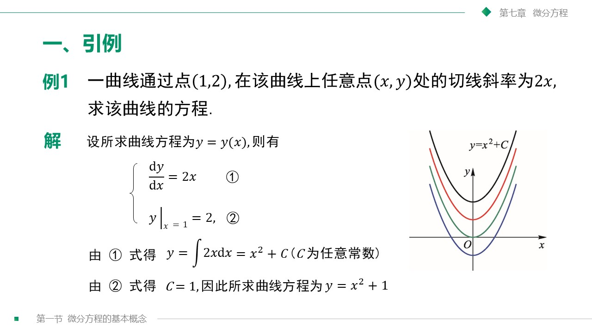

* **方程的解**：代入微分方程后能使方程成为恒等式的函数 $y = \varphi(x)$。
* **通解 (General Solution)**：如果微分方程的解中**含有任意常数 $C_1, C_2, \dots$**，且**任意常数的个数与微分方程的阶数完全相同**，则该解称为方程的通解。
* **特解 (Particular Solution)**：不含有任意常数的解。通常是通过给定的**初值条件**确定了通解中的任意常数后所得到的解。
* **初值条件与初值问题**：
  * 用来确定任意常数的条件称为**初值条件**。一阶方程通常需要 1 个初值条件 $y(x_0) = y_0$；二阶方程通常需要 2 个初值条件 $y(x_0) = y_0, y'(x_0) = y'_0$。
  * 求微分方程满足初值条件的特解的问题称为**初值问题**（或 **Cauchy 问题**）。
* **积分曲线**：微分方程的解在几何坐标系下的图形。通解在几何上对应一个**积分曲线族**，而特解对应曲线族中**通过特定点的一条具体曲线**。

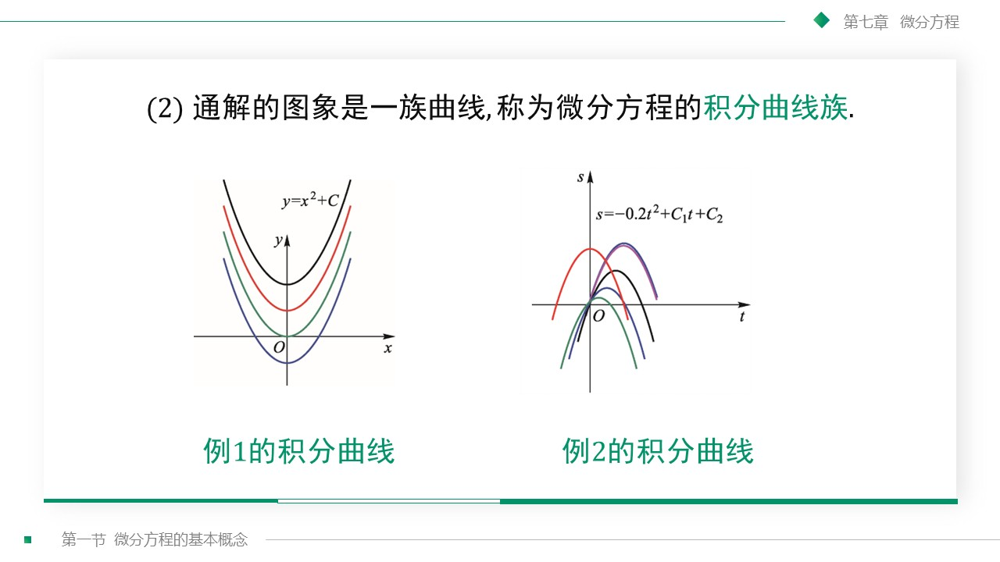

---

#### 💡 概念验证经典例题

> [!IMPORTANT]
> **【经典例题 7.1.3】验证特解问题**
> 
> 验证函数 $x = C_1 \cos kt + C_2 \sin kt$ （其中 $C_1, C_2$ 为任意常数）是二阶微分方程：
> $$
> \frac{d^2x}{dt^2} + k^2x = 0
> $$
> 的通解，并求满足初值条件 $$x\vert_{t=0} = A, \ \frac{dx}{dt}\bigg\vert_{t=0} = 0$$ 的特解。

* **验证过程**：
  1. 对未知函数求一阶导数：
     $$
     \frac{dx}{dt} = -k C_1 \sin kt + k C_2 \cos kt
     $$
  2. 求二阶导数：
     $$
     \frac{d^2x}{dt^2} = -k^2 C_1 \cos kt - k^2 C_2 \sin kt = -k^2 (C_1 \cos kt + C_2 \sin kt) = -k^2 x
     $$
  3. 代入原方程左边：
     $$
     \text{左边} = \frac{d^2x}{dt^2} + k^2 x = -k^2 x + k^2 x = 0 = \text{右边}
     $$
     因为代入后成为恒等式，且任意常数 $C_1, C_2$ 的个数（2个）与方程的阶数（2阶）完全一致，因此该函数是方程的**通解**。

* **确定特解**：
  将初值条件代入通解和一阶导数中：
  * 代入 $t=0, x=A$：
     $$
     A = C_1 \cos(0) + C_2 \sin(0) \implies C_1 = A
     $$
  * 代入 $t=0, \frac{dx}{dt}=0$：
     $$
     0 = -k C_1 \sin(0) + k C_2 \cos(0) \implies k C_2 = 0 \implies C_2 = 0 \quad (\text{因 } k \neq 0)
     $$
  将常数代回通解，得到满足初值条件的**特解**为：
  $$
  x = A \cos kt
  $$

---

### 二、 可分离变量的微分方程（7.2）

可分离变量微分方程是一阶微分方程中最基础、最重要的一种类型。它的核心思想是通过代数变形，将自变量与因变量强行“隔离”在等号的两侧，然后通过两端积分来求得解析解。

#### 1. 标准形式与解题两步法

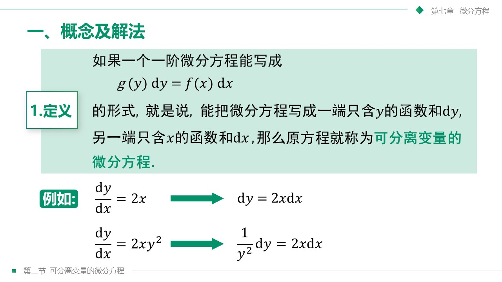

若一阶微分方程可以整理为以下形式：
$$
\frac{dy}{dx} = f(x) g(y) \quad \text{或} \quad M(x)N(y)dx + P(x)Q(y)dy = 0
$$
则称其为**可分离变量的微分方程**。

##### 🛠️ 标准解题两步流：

1. **分离变量**：将所有关于 $y$ 的项（包括 $dy$）移到等号左边，将所有关于 $x$ 的项（包括 $dx$）移到等号右边（假定 $g(y) \neq 0$）：
   $$
   \frac{1}{g(y)} dy = f(x) dx
   $$
2. **两端积分**：对等式两边分别求不定积分，并加上任意常数 $C$：
   $$
   \int \frac{1}{g(y)} dy = \int f(x) dx + C
   $$
   计算出积分后，即可得到方程的隐式通解。如果可以，应尽可能化简为显式通解 $y = \psi(x, C)$。

---

#### ⚠️ 考场致命雷区：不要漏掉“分母为 0 处的奇解”

> [!CAUTION]
> **“除以零”导致的解丢失**
> 
> 在进行“分离变量”这一步时，我们默许了除以 $g(y)$，即默认了 $g(y) \neq 0$。如果存在某个常数 $y = y^*$ 使得 $g(y^*) = 0$，那么常数函数 $y = y^*$ 显然也是原方程的一个特解（因为此时左边 $y' = 0$，右边 $f(x)g(y^*) = 0$，等式成立）。
> 
> 在做题时，必须**单独检验 $g(y) = 0$ 处的常数解**。如果该解不能通过将任意常数 $C$ 取某个特定值从通解公式中包含进来，那么它就是原方程的**奇解（丢失的解）**。

##### 💡 期末高频真题深度解剖

> [!IMPORTANT]
> **【期末原题】求微分方程 $$y' = 3y^{2/3}$$ 的所有解，并讨论其初值问题。**

* **解析步骤**：
  1. **分类讨论与分离变量**：
     当 $y \neq 0$ 时，方程可以两边同除以 $y^{2/3}$：
     $$
     \frac{dy}{3y^{2/3}} = dx \implies \frac{1}{3} y^{-2/3} dy = dx
     $$
  2. **两端积分**：
     $$
     \int \frac{1}{3} y^{-2/3} dy = \int dx \implies y^{1/3} = x + C
     $$
     两边同时立方，得到方程的**通解**：
     $$
     y = (x + C)^3 \quad (C \text{ 为任意常数})
     $$
  3. **奇解检验**：
     当 $y = 0$ 时，代入原方程：左边 $y' = 0$，右边 $3(0)^{2/3} = 0$，等式恒成立。
     因此，**常数函数 $$y = 0$$ 也是原微分方程的解**。
     我们观察通解公式 $y = (x+C)^3$，在任何有限实数 $C$ 下，均无法使该式在全体实数域上恒等于 0。因此， $y = 0$ 是分离变量时漏掉的**奇解**。

* **初值问题的唯一性陷阱**：
  如果给出初值条件 $y(0) = 0$，我们可以求出哪些特解？
  * 代入通解：$0 = (0+C)^3 \implies C = 0$，得到特解 $y = x^3$。
  * 同时，奇解 $y = 0$ 也完美满足初值条件 $y(0) = 0$。
  * 结论：初值问题 $\begin{cases} y' = 3y^{2/3} \\ y(0) = 0 \end{cases}$ 有**两个不同的特解**（$y = x^3$ 和 $y = 0$），该初值问题的解是**不唯一的**（在考场选择题中经常以此作为正确选项考查）。

---

### 三、 齐次方程（7.3）

齐次方程是无法直接进行变量分离的一类一阶方程，但它的自变量与因变量在方程中总是以比值 $\frac{y}{x}$ 的组合形式 appear。通过适当的引入新变量代换，我们可以将其化归为可分离变量的方程。

#### 1. 齐次方程的定义与标准求解代换步骤

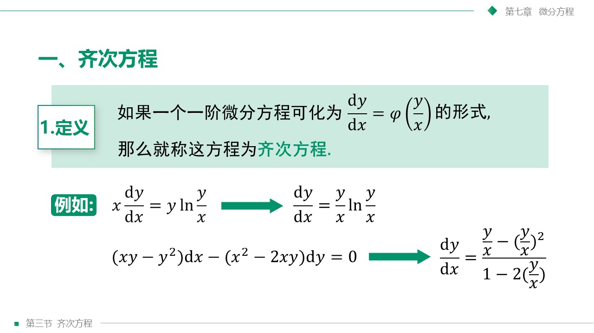

如果一阶微分方程可以写成如下形式：
$$
\frac{dy}{dx} = \varphi\left(\frac{y}{x}\right)
$$
则称其为**齐次微分方程**。

##### 🛠️ 标准代换求解步骤：

1. **引入代换变量**：令
   $$
   u = \frac{y}{x} \implies y = u x
   $$
2. **求导数替换式**：对两边关于 $x$ 求导（利用乘积求导法则）：
   $$
   \frac{dy}{dx} = u + x \frac{du}{dx}
   $$
3. **代入消元**：将替换式代入原齐次方程中：
   $$
   u + x \frac{du}{dx} = \varphi(u) \implies x \frac{du}{dx} = \varphi(u) - u
   $$
4. **分离变量与积分**：
   $$
   \frac{du}{\varphi(u) - u} = \frac{dx}{x} \implies \int \frac{du}{\varphi(u) - u} = \ln|x| + C
   $$
5. **反代回原变量**：求出积分后，将 $u = \frac{y}{x}$ 重新代入，整理得到原方程的通解。

---

#### 🌟 经典期末大题剖析：探照灯聚光镜的旋转曲线推导（几何应用 - 简略了解）
* **物理/几何背景**：利用反射定律建立微分方程，求解旋转抛物面。期末考试中对此类高难度的物理建模大题不做要求。

#### 2. 可化为齐次方程的形式（简略了解）
对于形如 $\frac{dy}{dx} = \frac{ax+by+c}{a'x+b'y+c'}$ 的方程，当 $c, c'$ 不全为 0 时，通过坐标平移 $x = X + h, y = Y + k$ 消去常数项，化为齐次方程求解。期末对此类复杂变换代换不作重点大题要求。

### 四、 一阶线性微分方程（7.4）

一阶线性微分方程的标准形式为：
$$
\frac{dy}{dx} + P(x) y = Q(x)
$$

其通解公式为：
$$
y = e^{-\int P(x) dx} \left[ \int Q(x) e^{\int P(x) dx} dx + C \right]
$$

## 高数期末复习冲刺宝典：第八章 向量代数与空间解析几何

#### 🎯 本章考点清单

* **填空题**：
  - [x] **向量的方向角与方向余弦** —— 掌握方向余弦的计算公式及平方和恒等于 1 的性质。
  - [x] **两向量的向量积（叉积）** —— 掌握叉积的行列式计算法以及几何意义（求垂直向量、三角形面积等）。

### 一, 向量代数及其线性运算（8.1）

空间几何的代数化求解完全建立在向量基础之上。

#### 1. 向量的基本概念
* **自由向量**：既有大小又有方向且与起点无关的向量，可自由平移。
* **模（长度）**：向量的大小，记作 $\vert\vec{a}\vert$。
* **单位向量**：模长为 1 的向量。
* **零向量**：模长为 0 的向量，方向任意，记作 $\vec{0}$。
* **相等与负向量**：大小相等且方向相同的向量为相等向量；大小相等且方向相反的向量为负向量（$-\vec{a}$）。
* **平行（共线）**：方向相同或相反的非零向量，零向量与任何向量平行。
* **共面**：平行于同一平面的向量。
* **【定理 1】**：设 $\vec{a} \neq \vec{0}$，则向量 $\vec{b}$ 平行于 $\vec{a}$ 的充要条件是：存在唯一实数 $\lambda$，使得：
  $$
  \vec{b} = \lambda \vec{a}
  $$

#### 2. 向量的线性运算
* **加减法**：几何上遵循**三角形法则**与**平行四边形法则**。代数上满足交换律、结合律。
* **数乘向量**：$\lambda \vec{a}$。当 $\lambda > 0$ 时与 $\vec{a}$ 同向， $\lambda < 0$ 时反向，模为 $\vert\lambda\vert\vert\vec{a}\vert$。满足结合律与分配律。

#### 3. 空间直角坐标系与坐标运算
* **空间坐标系**：由原点 $O$ 与三条互相垂直的右手系数轴 $x, y, z$ 构成。三个坐标面 $xOy, yOz, xOz$ 将空间划分为 8 个卦限。
* **坐标轴与坐标面上的特殊点**：
  * $x$ 轴上的点坐标为 $(x, 0, 0)$； $xOy$ 面上的点坐标为 $(x, y, 0)$。
* **坐标线性运算**：设 $\vec{a} = (a_x, a_y, a_z)$， $\vec{b} = (b_x, b_y, b_z)$，则：
  $$
  \vec{a} \pm \vec{b} = (a_x \pm b_x, a_y \pm b_y, a_z \pm b_z)
  $$
  $$
  \lambda \vec{a} = (\lambda a_x, \lambda a_y, \lambda a_z)
  $$
* **两向量平行的充要条件（坐标表示）**：对应坐标成比例：
  $$
  \vec{a} \parallel \vec{b} \iff \frac{a_x}{b_x} = \frac{a_y}{b_y} = \frac{a_z}{b_z} = \lambda
  $$
* **定比分点公式**：若 $M_1(x_1, y_1, z_1)$， $M_2(x_2, y_2, z_2)$，点 $M$ 满足 $\vec{M_1M} = \lambda \vec{MM_2}$，则 $M$ 的坐标为：
  $$
  x = \frac{x_1 + \lambda x_2}{1 + \lambda}, \quad y = \frac{y_1 + \lambda y_2}{1 + \lambda}, \quad z = \frac{z_1 + \lambda z_2}{1 + \lambda}
  $$
  （特别地，当 $\lambda = 1$ 时为中点公式）。

#### 4. 向量的模与方向余弦
* **向量模公式**： $\vert\vec{a}\vert = \sqrt{a_x^2 + a_y^2 + a_z^2}$。
* **两点间距离公式**：设 $A(x_1, y_1, z_1)$， $B(x_2, y_2, z_2)$，则：
  $$
  d = \vert\vec{AB}\vert = \sqrt{(x_2-x_1)^2 + (y_2-y_1)^2 + (z_2-z_1)^2}
  $$
* **方向角与方向余弦**：非零向量 $\vec{a}$ 与三个坐标轴正向的夹角 $\alpha, \beta, \gamma$ 满足**方向余弦恒等式**：
  $$
  \cos^2\alpha + \cos^2\beta + \cos^2\gamma = 1
  $$
  各方向余弦计算为：
  $$
  \cos\alpha = \frac{a_x}{\vert\vec{a}\vert}, \quad \cos\beta = \frac{a_y}{\vert\vec{a}\vert}, \quad \cos\gamma = \frac{a_z}{\vert\vec{a}\vert}
  $$
  非零向量 $\vec{a}$ 的**单位方向向量**为：
  $$
  \vec{e}_a = \frac{\vec{a}}{\vert\vec{a}\vert} = (\cos\alpha, \cos\beta, \cos\gamma)
  $$

#### 💡 【期末必考题型】两向量的夹角求解
* **夹角求解核心公式**：
  $$
  \cos\theta = \frac{\vec{a} \cdot \vec{b}}{\vert\vec{a}\vert \vert\vec{b}\vert} = \frac{a_x b_x + a_y b_y + a_z b_z}{\sqrt{a_x^2+a_y^2+a_z^2}\sqrt{b_x^2+b_y^2+b_z^2}}
  $$

**【期末经典真题】** 已知向量 $\vec{a} = (1, 0, 1)$， $\vec{b} = (1, 1, 0)$，求这两个向量的夹角 $\theta$。

**【解析步骤】**
1. **分别计算两个向量的模长**：
   $$
   \vert\vec{a}\vert = \sqrt{1^2 + 0^2 + 1^2} = \sqrt{2}
   $$
   $$
   \vert\vec{b}\vert = \sqrt{1^2 + 1^2 + 0^2} = \sqrt{2}
   $$
2. **计算两个向量的数量积（点积）**：
   $$
   \vec{a} \cdot \vec{b} = 1 \times 1 + 0 \times 1 + 1 \times 0 = 1
   $$
3. **代入夹角公式求 $\theta$**：
   $$
   \cos\theta = \frac{\vec{a} \cdot \vec{b}}{\vert\vec{a}\vert \vert\vec{b}\vert} = \frac{1}{\sqrt{2} \times \sqrt{2}} = \frac{1}{2}
   $$
   由于 $\theta \in [0, \pi]$，因此：
   $$
   \theta = \frac{\pi}{3} \quad (60^\circ)
   $$

#### 5. 向量在轴上的投影
* **投影定义**：设 $\theta$ 是向量 $\vec{a}$ 与轴 $u$ 的夹角，则 $\vec{a}$ 在轴 $u$ 上的投影为：
  $$
  \text{Prj}_{u}\vec{a} = \vert\vec{a}\vert \cos\theta
  $$
* **投影的代数性质**：
  1. 两个向量的和在轴上的投影等于两个向量在该轴上的投影之和：
     $$
     \text{Prj}_{u}(\vec{a} + \vec{b}) = \text{Prj}_{u}\vec{a} + \text{Prj}_{u}\vec{b}
     $$
  2. 数乘向量的投影可提取实数因子：
     $$
     \text{Prj}_{u}(\lambda \vec{a}) = \lambda \text{Prj}_{u}\vec{a}
     $$

---

### 二, 三大向量乘积：代数计算与几何本质（8.2）

#### 1. 数量积（点积 / 内积 / Dot Product）
* **代数与投影几何定义**：
  $$
  \vec{a} \cdot \vec{b} = \vert\vec{a}\vert \vert\vec{b}\vert \cos\theta = \vert\vec{a}\vert \text{Prj}_{\vec{a}}\vec{b} = \vert\vec{b}\vert \text{Prj}_{\vec{b}}\vec{a}
  $$
* **核心定理**：对于非零向量，垂直的充要条件是点积为 0：
  $$
  \vec{a} \perp \vec{b} \iff \vec{a} \cdot \vec{b} = 0
  $$
* **坐标公式**：
  $$
  \vec{a} \cdot \vec{b} = a_x b_x + a_y b_y + a_z b_z
  $$
* **夹角余弦公式**：
  $$
  \cos\theta = \frac{\vec{a} \cdot \vec{b}}{\vert\vec{a}\vert \vert\vec{b}\vert} = \frac{a_x b_x + a_y b_y + a_z b_z}{\sqrt{a_x^2+a_y^2+a_z^2}\sqrt{b_x^2+b_y^2+b_z^2}}
  $$

---

#### 2. 向量积（叉积 / 外积 / Cross Product）
* **代数与几何定义**： $\vec{c} = \vec{a} \times \vec{b}$ 是一个向量：
  1. 模长： $\vert\vec{c}\vert = \vert\vec{a}\vert \vert\vec{b}\vert \sin\theta$。几何上代表以 $\vec{a}, \vec{b}$ 为邻边的**平行四边形面积**。
  2. 方向：垂直于 $\vec{a}$ 且垂直于 $\vec{b}$，且 $\vec{a}, \vec{b}, \vec{c}$ 构成符合右手定则的三向系。
* **核心定理**：对于非零向量，平行的充要条件是叉积为零向量：
  $$
  \vec{a} \parallel \vec{b} \iff \vec{a} \times \vec{b} = \vec{0}
  $$
* **坐标计算公式（三阶行列式秒杀）**：
  $$
  \vec{a} \times \vec{b} = \begin{vmatrix} \vec{i} & \vec{j} & \vec{k} \\ a_x & a_y & a_z \\ b_x & b_y & b_z \end{vmatrix}
  $$

---

#### 💡 【🔥 难点突破·即时例题 1】（四面体体积求解）

> [!NOTE]
> 📌 **课件标准真题**
> 
> 已知不在同一平面上的四点 $A(1, 2, -1)$， $B(4, 1, 5)$， $C(2, -1, 1)$， $D(3, 3, 2)$。求以这四点为顶点的四面体 $ABCD$ 的体积。

* **解析步骤**：
  1. **构造棱向量**：
     以 $A$ 为起点，构造三个棱向量：
     $$
     \vec{AB} = B - A = (3, -1, 6)
     $$
     $$
     \vec{AC} = C - A = (1, -3, 2)
     $$
     $$
     \vec{AD} = D - A = (2, 1, 3)
     $$
  2. **计算棱向量 $\vec{AB}$ 与 $\vec{AC}$ 的叉乘（法向量）**：
     $$
     \vec{n} = \vec{AB} \times \vec{AC} = \begin{vmatrix} \vec{i} & \vec{j} & \vec{k} \\ 3 & -1 & 6 \\ 1 & -3 & 2 \end{vmatrix}
     $$
     展开计算：
     $$
     = ((-1)\times 2 - 6\times (-3))\vec{i} - (3\times 2 - 6\times 1)\vec{j} + (3\times (-3) - (-1)\times 1)\vec{k}
     $$
     $$
     = 16\vec{i} - 0\vec{j} - 8\vec{k} = (16, 0, -8)
     $$
  3. **计算该法向量与第三个棱向量 $\vec{AD}$ 的点乘**：
     $$
     (\vec{AB} \times \vec{AC}) \cdot \vec{AD} = (16, 0, -8) \cdot (2, 1, 3) = 16\times 2 + 0\times 1 + (-8)\times 3 = 8
     $$
  4. **计算四面体体积**：
     四面体的体积等于以这三个向量为邻边的平行六面体体积的六分之一，其计算公式为：
     $$
     V_{\text{四面体}} = \frac{1}{6} \vert (\vec{AB} \times \vec{AC}) \cdot \vec{AD} \vert = \frac{1}{6} \times \vert 8 \vert = \frac{4}{3}
     $$
     所求四面体体积为 **$\frac{4}{3}$**。

---

### 三, 空间平面及其方程（8.3，非大题考点，简略了解）

#### 1. 平面的点法式方程与一般方程
* **点法式方程**：过点 $M_0(x_0, y_0, z_0)$，法向量为 $\vec{n} = \{A, B, C\}$：
  $$A(x - x_0) + B(y - y_0) + C(z - z_0) = 0$$
* **一般方程**：
  $$Ax + By + Cz + D = 0$$

#### 2. 两平面的夹角与位置关系
两平面法向量为 $\vec{n}_1 = \{A_1, B_1, C_1\}$， $\vec{n}_2 = \{A_2, B_2, C_2\}$：
* **垂直**： $\vec{n}_1 \cdot \vec{n}_2 = 0 \iff A_1A_2 + B_1B_2 + C_1C_2 = 0$
* **平行**： $\vec{n}_1 \parallel \vec{n}_2 \iff \frac{A_1}{A_2} = \frac{B_1}{B_2} = \frac{C_1}{C_2}$
* **点到平面的距离**：
  $$d = \frac{\vert Ax_0 + By_0 + Cz_0 + D \vert}{\sqrt{A^2 + B^2 + C^2}}$$

---

### 四, 空间直线及其方程（8.4，非大题考点，简略了解）

#### 1. 空间直线的方程形式
* **对称式（点向式）方程**：过点 $M_0(x_0, y_0, z_0)$，方向向量为 $\vec{s} = \{l, m, n\}$：
  $$\frac{x - x_0}{l} = \frac{y - y_0}{m} = \frac{z - z_0}{n}$$
* **一般式方程**（两平面交线）：
  $$\begin{cases} A_1x + B_1y + C_1z + D_1 = 0 \ A_2x + B_2y + C_2z + D_2 = 0 \end{cases}$$
* **两直线的夹角与位置关系**：直线的方向向量为 $\vec{s}_1, \vec{s}_2$，其夹角即为方向向量夹角，平行/垂直关系直接对应方向向量的平行/垂直关系。

---

### 五, 曲面及其方程（8.5，非大题考点，简略了解）

* **球面方程**： $(x - x_0)^2 + (y - y_0)^2 + (z - z_0)^2 = R^2$
* **旋转曲面**：曲线 $f(y, z) = 0$ 绕 $z$ 轴旋转一周得到的旋转曲面方程为 $f(\pm\sqrt{x^2+y^2}, z) = 0$。
* **柱面**：在三维空间中，只含有两个变量的方程（如 $x^2 + y^2 = R^2$）表示一个母线平行于未出现变量坐标轴的**柱面**。
* **标准二次曲面**：包括椭球面、单叶/双叶双曲面、椭圆抛物面（如 $z = x^2+y^2$ 旋转抛物面）、双曲抛物面（马鞍面 $z=xy$）和圆锥面（如 $z = \sqrt{x^2+y^2}$）等。

---

### 六, 空间曲线及其方程（8.6，非大题考点，简略了解）

* **一般方程**： $\begin{cases} F(x, y, z) = 0 \ G(x, y, z) = 0 \end{cases}$
* **参数方程**： $\begin{cases} x = x(t) \ y = y(t) \ z = z(t) \end{cases}$ （例如螺旋线）
* **空间曲线在坐标面上的投影**：消去方程组中的某个坐标变量。例如，消去 $z$ 得到关于 $x, y$ 的方程，其在 $xOy$ 面上的投影曲线方程为 $\begin{cases} H(x, y) = 0 \ z = 0 \end{cases}$。

## 高数期末复习冲刺宝典：第九章 多元函数微分法及其应用

#### 🎯 本章考点清单

* **选择题**：
  - [x] **求二阶连续偏导数** —— 二元函数直接求导与混合偏导数相等性的应用。
* **填空题**：
  - [x] **多元函数的极限** —— 极限的化简计算与不存在性判定（路径法）。
  - [x] **连续、可偏导、可微之间的判定关系** —— 深刻理解多元函数可微、连续及偏导存在性的严格包含与反例逻辑。
* **计算题**：
  - [x] **二元函数全微分** —— 全微分定义式 $dz = A dx + B dy$ 的求解。
  - [x] **偏导数计算** —— 多元复合函数的链式法则与高阶偏导数的解析计算。
  - [x] **隐函数求导** —— 单个方程或方程组确定的隐函数一阶及高阶求导。
  - [x] **方向导数与梯度** —— 特定方向的方向导数计算，以及沿梯度方向变化率最大的极值应用。
  - [x] **多元函数的极值** —— 二元函数无条件极值的驻点充分条件判别法（$AC-B^2$），以及约束条件下的拉格朗日乘数法。
  - [x] **曲面的切平面与法线方程** —— 利用隐函数梯度作为曲面法向量，建立切平面及法线对称式方程。

### 一、 多元函数的基本概念与极限连续（9.1）

#### 1. 多元函数的定义与定义域
* **函数概念**：设 $D$ 是二维平面上的点集，若对每个点 $P(x,y) \in D$，变量 $z$ 按某种规律都有唯一确定的值与之对应，则称 $z$ 为 $x, y$ 的二元函数，记作 $z = f(x, y)$。点集 $D$ 称为定义域， $z$ 的集合为值域。

#### 2. 二元函数的极限（重极限）
* **重极限定义**：设二元函数 $z = f(x, y)$ 在点 $P_0(x_0, y_0)$ 的去心邻域内有定义。当点 $P(x,y)$ 以**任意方式**趋近于 $P_0$ 时，若 $f(x, y)$ 无限趋近于一个常数 $L$，则称 $L$ 为 $f(x, y)$ 当 $P \to P_0$ 时的极限（或二重极限），记作：
  $$
  \lim_{(x,y)\to(x_0,y_0)} f(x, y) = L \quad (\text{或 } \lim_{x\to x_0, y\to y_0} f(x, y) = L)
  $$
* **【重要考点】重极限存在性的“任意路径判定法”**：
  二重极限存在的充要条件是点 $P(x,y)$ 沿 **任何路径** 趋近于 $P_0$ 时极限都存在且相等。如果沿不同路径（例如沿直线 $y = kx$ 或抛物线 $y = kx^2$）趋近于原点得到的极限值与斜率 $k$ 相关，则说明重极限不存在。

---

#### 💡 【🔥 难点突破·即时例题 1】（多元函数重极限计算与判定）

##### 🛠️ 题型一：计算重极限（等价无穷小代换与消元化简）

多元函数极限计算的期末核心考点是**化简求极限**，特别是利用**等价无穷小代换**消去分子分母中的非零零因子。

**【期末经典真题 1】** 设 $f(x, y) = \frac{\ln(1+xy) + \sin(2y)}{y}$，求极限 $\lim_{(x,y)\to(3,0)} f(x,y)$。

**【解析步骤】**
1. **分析极限类型与等价代换**：
   当 $(x, y) \to (3, 0)$ 时，有 $xy \to 0$ 且 $2y \to 0$。根据一元等价无穷小公式：
   $$
   \ln(1+xy) \sim xy, \quad \sin(2y) \sim 2y
   $$
2. **代入极限并提取公因子化简**：
   将等价无穷小代入原极限式中：
   $$
   \lim_{(x,y)\to(3,0)} \frac{\ln(1+xy) + \sin(2y)}{y} = \lim_{(x,y)\to(3,0)} \frac{xy + 2y}{y}
   $$
   由于分子可以提取公因子 $y$，我们进行约分：
   $$
   = \lim_{(x,y)\to(3,0)} \frac{y(x + 2)}{y}
   $$
   因为 $y \to 0$ 且 $y \neq 0$，可以直接约去分子分母中的非零因子 $y$：
   $$
   = \lim_{(x,y)\to(3,0)} (x + 2) = 3 + 2 = 5
   $$

**【期末经典真题 2】** 求极限 $\lim_{(x,y)\to(1,0)} \left[ \frac{\arctan(xy) + \ln(1+xy)}{x} \right]$。

**【解析步骤】**
1. **分析趋近状态与等价代换**：
   当 $(x, y) \to (1, 0)$ 时， $xy \to 0$。根据等价无穷小关系：
   $$
   \arctan(xy) \sim xy, \quad \ln(1+xy) \sim xy
   $$
2. **代入化简计算**：
   将等价无穷小代入原式：
   $$
   \lim_{(x,y)\to(1,0)} \frac{\arctan(xy) + \ln(1+xy)}{x} = \lim_{(x,y)\to(1,0)} \frac{xy + xy}{x}
   $$
   $$
   = \lim_{(x,y)\to(1,0)} \frac{2xy}{x}
   $$
   约去分母中的非零因子 $x$ （因为 $x \to 1 \neq 0$）：
   $$
   = \lim_{(x,y)\to(1,0)} 2y = 2 \times 0 = 0
   $$

---

### 二、 偏导数及其代数计算（9.2）

#### 1. 偏导数的定义与几何意义
* **偏导数定义**：设函数 $z = f(x, y)$ 在点 $(x_0, y_0)$ 的邻域内有定义。若保持 $y$ 固定在 $y_0$，使 $x$ 在 $x_0$ 处有增量 $\Delta x$，如果极限存在，则称此极限为函数在点 $(x_0, y_0)$ 处关于 $x$ 的偏导数：
  $$
  f_x(x_0, y_0) = \lim_{\Delta x \to 0} \frac{f(x_0 + \Delta x, y_0) - f(x_0, y_0)}{\Delta x} = \left. \frac{\partial z}{\partial x} \right|_{(x_0, y_0)}
  $$
  （同理可定义关于 $y$ 的偏导数 $f_y(x_0, y_0)$）。
* **偏导数的几何意义**：偏导数 $f_x(x_0, y_0)$ 表示曲面被平面 $y = y_0$ 所截得的曲线在点 $P_0(x_0, y_0, f(x_0, y_0))$ 处的切线对 $x$ 轴的斜率。

#### 2. 高阶偏导数与混合偏导数相等定理
* **高阶偏导**：偏导数 $f_x, f_y$ 仍然是二元函数，它们关于 $x, y$ 的偏导数称为二阶偏导数，记作 $f_{xx}, f_{xy}, f_{yx}, f_{yy}$。其中 $f_{xy} = \frac{\partial^2 z}{\partial y \partial x}$。
* **【重要定理】混合偏导数相等定理**：若二阶混合偏导数 $f_{xy}$ 和 $f_{yx}$ 在区域 $D$ 内**连续**，则在该区域内它们必然相等，即：
  $$
  f_{xy}(x, y) = f_{yx}(x, y) \quad (\text{求导次序可交换})
  $$

---

#### 💡 【🔥 难点突破·即时例题 2】（指定点偏导数计算）

> [!NOTE]
> 📌 **课件标准例题**
> 
> 求函数 $z = x^2 + 3xy + y^2$ 在点 $(1, 2)$ 处的偏导数。

* **解析步骤**：
  1. **求出关于 $x$ 的偏导函数（将 $y$ 锁死为常数）**：
     $$
     \frac{\partial z}{\partial x} = \frac{\partial (x^2 + 3xy + y^2)}{\partial x} = 2x + 3y
     $$
  2. **求出关于 $y$ 的偏导函数（将 $x$ 锁死为常数）**：
     $$
     \frac{\partial z}{\partial y} = \frac{\partial (x^2 + 3xy + y^2)}{\partial y} = 3x + 2y
     $$
  3. **代入具体点 $(1, 2)$ 坐标**：
     $$
     \left. \frac{\partial z}{\partial x} \right|_{(1,2)} = 2(1) + 3(2) = 8
     $$
     $$
     \left. \frac{\partial z}{\partial y} \right|_{(1,2)} = 3(1) + 2(2) = 7
     $$
     所求偏导数分别为： $z_x(1,2) = 8$, $z_y(1,2) = 7$。

---

### 三、 全微分存在性与判定（9.3）

#### 1. 全微分的定义
若函数 $z = f(x, y)$ 在点 $(x, y)$ 处的全增量 $\Delta z = f(x+\Delta x, y+\Delta y) - f(x, y)$ 可表示为：
$$
\Delta z = A \Delta x + B \Delta y + o(\rho)
$$
其中 $A, B$ 是与 $\Delta x, \Delta y$ 无关的常数， $\rho = \sqrt{\Delta x^2 + \Delta y^2}$。则称函数在该点**可微**，其全微分为：
$$
dz = A dx + B dy = \frac{\partial z}{\partial x} dx + \frac{\partial z}{\partial y} dy
$$

#### 2. 连续、可偏导、可微之间的严格逻辑包含关系

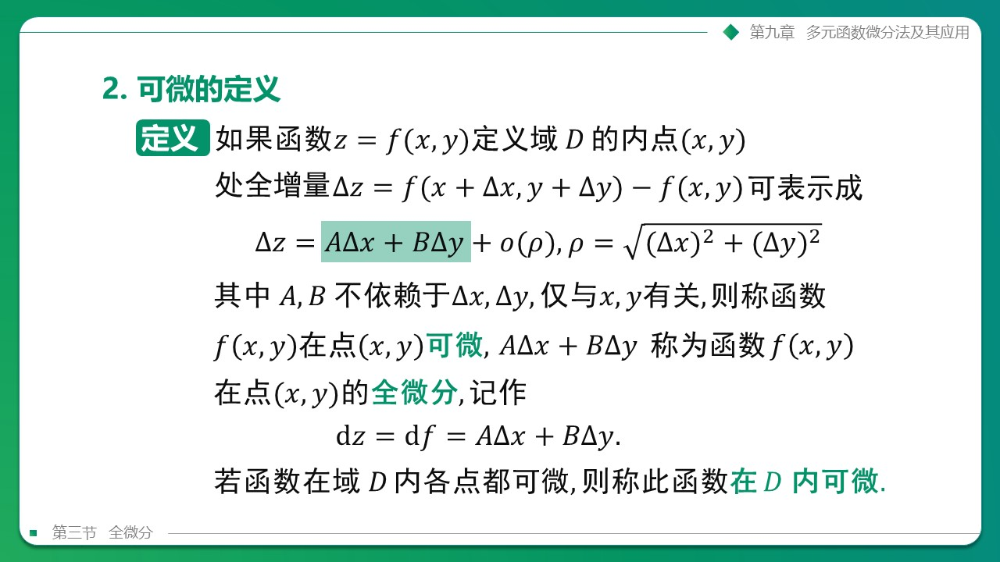

> [!IMPORTANT]
> 📌 **期末选择题的核心常考结论：**
> 
> * **可微 $\implies$ 连续**，且 **可微 $\implies$ 偏导数存在**。
> * **偏导数存在 $\not\implies$ 连续**（二元函数在某点可偏导，该函数甚至可能不连续！这是与一元函数的极大区别）。
> * **连续 $\not\implies$ 偏导数存在**，且 **偏导数存在 $\not\implies$ 可微**。
> * **偏导数连续 $\implies$ 可微**（可微的充分非必要条件）。

---

### 四、 多元复合函数的求导法则（9.4）

多元复合函数的链式法则是期末考大题的必考点，最重要的是：**“树状依赖分析”**。

#### 1. 链式求导法则
设 $z = f(u, v)$ 可微，且 $u = u(x, y), v = v(x, y)$ 具有偏导数，则复合函数关于 $x, y$ 的偏导数为：
$$
\frac{\partial z}{\partial x} = \frac{\partial z}{\partial u} \frac{\partial u}{\partial x} + \frac{\partial z}{\partial v} \frac{\partial v}{\partial x}
$$
$$
\frac{\partial z}{\partial y} = \frac{\partial z}{\partial u} \frac{\partial u}{\partial y} + \frac{\partial z}{\partial v} \frac{\partial v}{\partial y}
$$

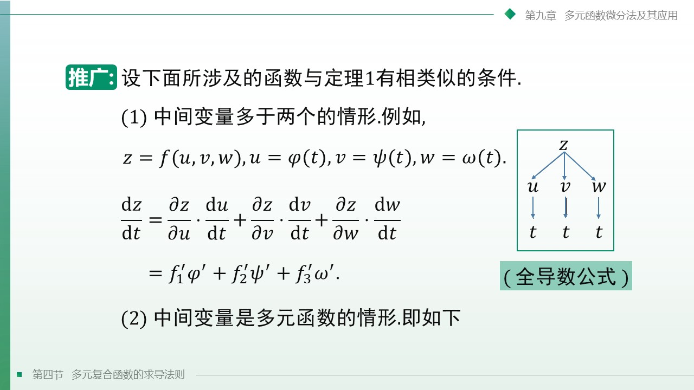

---

#### 💡 【🔥 难点突破·即时例题 3】（抽象二阶复合偏导数计算）

> [!NOTE]
> 📌 **课件标准真题**
> 
> 设 $z = f(x^2 - y^2, xy)$，其中 $f$ 具有二阶连续偏导数，求一阶偏导数 $\frac{\partial z}{\partial x}$ 以及二阶混合偏导数 $\frac{\partial^2 z}{\partial x \partial y}$。

* **解析步骤**：
  1. **引入中间变量建立依赖树**：
     令 $u = x^2 - y^2, v = xy$，则中间变量为 $u, v$，自变量为 $x, y$。
  2. **计算一阶偏导数**：
     $$
     \frac{\partial z}{\partial x} = f_1 \frac{\partial u}{\partial x} + f_2 \frac{\partial v}{\partial x} = f_1 \cdot (2x) + f_2 \cdot (y) = 2x f_1 + y f_2
     $$
  3. **关于 $y$ 再次求偏导（注意乘积求导与链式法则套用）**：
     $$
     \frac{\partial^2 z}{\partial x \partial y} = \frac{\partial}{\partial y} [2x f_1 + y f_2] = 2x \frac{\partial (f_1)}{\partial y} + \frac{\partial (y f_2)}{\partial y}
     $$
     $$
     = 2x \frac{\partial f_1}{\partial y} + f_2 + y \frac{\partial f_2}{\partial y}
     $$
     偏导项 $\frac{\partial f_1}{\partial y}$ 和 $\frac{\partial f_2}{\partial y}$ 必须重新视为复合函数求导：
     $$
     \frac{\partial f_1}{\partial y} = f_{11} \frac{\partial u}{\partial y} + f_{12} \frac{\partial v}{\partial y} = f_{11} \cdot (-2y) + f_{12} \cdot (x) = -2y f_{11} + x f_{12}
     $$
     $$
     \frac{\partial f_2}{\partial y} = f_{21} \frac{\partial u}{\partial y} + f_{22} \frac{\partial v}{\partial y} = f_{21} \cdot (-2y) + f_{22} \cdot (x) = -2y f_{21} + x f_{22}
     $$
  4. **代回方程组并合并同类项**：
     因 $f$ 二阶偏导连续，故 $f_{12} = f_{21}$。代回代数式：
     $$
     \frac{\partial^2 z}{\partial x \partial y} = 2x[-2y f_{11} + x f_{12}] + f_2 + y[-2y f_{12} + x f_{22}]
     $$
     $$
     = -4xy f_{11} + 2x^2 f_{12} + f_2 - 2y^2 f_{12} + xy f_{22}
     $$
     $$
     = -4xy f_{11} + 2(x^2 - y^2)f_{12} + xy f_{22} + f_2
     $$

---

### 五、 隐函数的求导公式（9.5）

#### 1. 隐函数存在定理与求导公式
* **一个方程的情形**：若方程 $F(x, y, z) = 0$ 在点 $P_0(x_0, y_0, z_0)$ 满足隐函数存在定理条件，其确定的隐函数 $z = z(x, y)$ 关于自变量的偏导数可由下式直接求得：
  $$
  \frac{\partial z}{\partial x} = -\frac{F_x}{F_z}, \quad \frac{\partial z}{\partial y} = -\frac{F_y}{F_z} \quad (F_z \neq 0)
  $$

---

#### 💡 【🔥 难点突破·即时例题 4】（隐函数的一阶与高阶求导）

> [!NOTE]
> 📌 **课件标准真题**
> 
> 已知隐方程 $x + y + z = e^z$，求一阶偏导数 $\frac{\partial z}{\partial x}$ 与二阶偏导数 $\frac{\partial^2 z}{\partial x^2}$。

* **解析步骤**：
  1. **一阶偏导公式法求解**：
     设隐函数方程为 $F(x, y, z) = x + y + z - e^z = 0$。
     求各变量偏导数： $F_x = 1, F_y = 1, F_z = 1 - e^z$。
     代入隐求导公式：
     $$
     \frac{\partial z}{\partial x} = -\frac{F_x}{F_z} = -\frac{1}{1 - e^z} = \frac{1}{e^z - 1}
     $$
  2. **二阶偏导微分代回求解**：
     对一阶偏导等式 $\frac{\partial z}{\partial x} = (e^z - 1)^{-1}$ 的两边关于 $x$ 再次求偏导数（注意此时 $z$ 依然是 $x$ 的函数）：
     $$
     \frac{\partial^2 z}{\partial x^2} = \frac{\partial}{\partial x} \left[ (e^z - 1)^{-1} \right] = -(e^z - 1)^{-2} \cdot \frac{\partial (e^z - 1)}{\partial x}
     $$
     $$
     = -\frac{1}{(e^z - 1)^2} \cdot e^z \frac{\partial z}{\partial x}
     $$
     代入已求得的一阶偏导数 $\frac{\partial z}{\partial x} = \frac{1}{e^z - 1}$：
     $$
     \frac{\partial^2 z}{\partial x^2} = -\frac{e^z}{(e^z - 1)^2} \cdot \frac{1}{e^z - 1} = -\frac{e^z}{(e^z - 1)^3}
     $$
     所求结果为： $\frac{\partial z}{\partial x} = \frac{1}{e^z - 1}$， $\frac{\partial^2 z}{\partial x^2} = -\frac{e^z}{(e^z - 1)^3}$。

---

### 六、 多元函数微分学的几何应用（9.6）

几何应用的核心思想是：**“求出空间曲面的法向量 $\vec{n}$，或空间曲线的切向量 $\vec{T}$”**。

#### 1. 空间曲面的切平面与法线
对于由三元方程 $F(x, y, z) = 0$ 确定的空间曲面，其在点 $P_0(x_0, y_0, z_0)$ 处的**法向量**即为该点的梯度向量：
$$
\vec{n} = \nabla F(P_0) = (F_x(P_0), F_y(P_0), F_z(P_0))
$$
* **切平面方程**（标准点法式）：
  $$
  F_x(P_0)(x - x_0) + F_y(P_0)(y - y_0) + F_z(P_0)(z - z_0) = 0
  $$
* **法线方程**（标准对称式）：
  $$
  \frac{x - x_0}{F_x(P_0)} = \frac{y - y_0}{F_y(P_0)} = \frac{z - z_0}{F_z(P_0)}
  $$

---

#### 💡 【🔥 难点突破·即时例题 5】（球面切平面与法线方程）

> [!NOTE]
> 📌 **课件标准真题**
> 
> 求球面 $x^2 + y^2 + z^2 = 14$ 在点 $(1, 2, 3)$ 处的切平面方程与法线方程。

* **解析步骤**：
  1. **确定隐函数表达式并求偏导**：
     令 $F(x, y, z) = x^2 + y^2 + z^2 - 14 = 0$。
     求各一阶偏导数： $F_x = 2x, F_y = 2y, F_z = 2z$。
  2. **计算指定点处的法向量分量**：
     将点 $(1, 2, 3)$ 代入一阶偏导中：
     $$
     F_x(1,2,3) = 2, \quad F_y(1,2,3) = 4, \quad F_z(1,2,3) = 6
     $$
     故法向量为 $\vec{n} = (2, 4, 6)$，可方向简化取为与之平行的 $\vec{n}_0 = (1, 2, 3)$。
  3. **写出切平面与法线方程**：
     * **切平面方程**：
       $$
       1(x - 1) + 2(y - 2) + 3(z - 3) = 0 \implies x + 2y + 3z - 14 = 0
       $$
     * **法线方程**：
       $$
       \frac{x - 1}{1} = \frac{y - 2}{2} = \frac{z - 3}{3}
       $$

---

### 七、 方向导数与梯度（9.7）

#### 1. 方向导数
* **代数公式**：设函数 $f(x, y)$ 在点 $P_0(x_0, y_0)$ 处可微，则沿任意方向向量 $\vec{l}$ （其方向余弦为 $\cos\alpha, \cos\beta$）的方向导数为：
  $$
  \frac{\partial f}{\partial l} = \frac{\partial f}{\partial x} \cos\alpha + \frac{\partial f}{\partial y} \cos\beta
  $$

#### 2. 梯度与方向导数的关系
* **梯度定义**：
  $$
  \text{grad}\, f(x, y) = \nabla f(x, y) = \left( \frac{\partial f}{\partial x}, \frac{\partial f}{\partial y} \right)
  $$
* **几何定理**：方向导数可以改写为梯度与方向向量的点积：
  $$
  \frac{\partial f}{\partial l} = \nabla f \cdot \vec{e}_l = \vert\text{grad}\, f\vert \cos\theta
  $$
  当方向 $\vec{e}_l$ **与梯度同向**（即 $\theta = 0$）时，方向导数取得**最大值**，最大值为梯度的模长 $\vert\text{grad}\, f\vert = \sqrt{f_x^2 + f_y^2}$。

---

#### 💡 【🔥 难点突破·即时例题 6】（特定方向方向导数计算）

> [!NOTE]
> 📌 **课件标准真题**
> 
> 求函数 $z = x^2 + y^2$ 在点 $(1, 2)$ 处，沿从点 $A(1, 2)$ 指向点 $B(2, 2 + \sqrt{3})$ 方向的方向导数。

* **解析步骤**：
  1. **计算逼近方向的单位向量（必须化为单位向量）**：
     构造由 $A$ 指向 $B$ 的方向向量：
     $$
     \vec{AB} = B - A = (2 - 1, 2 + \sqrt{3} - 2) = (1, \sqrt{3})
     $$
     其模长为 $\vert\vec{AB}\vert = \sqrt{1^2 + (\sqrt{3})^2} = 2$。
     化为单位方向向量 $\vec{e}_l$：
     $$
     \vec{e}_l = \left( \frac{1}{2}, \frac{\sqrt{3}}{2} \right) \implies \cos\alpha = \frac{1}{2}, \ \cos\beta = \frac{\sqrt{3}}{2}
     $$
  2. **求出点 $(1, 2)$ 处的两个偏导数值**：
     $$
     z_x = 2x \implies z_x(1, 2) = 2
     $$
     $$
     z_y = 2y \implies z_y(1, 2) = 4
     $$
  3. **代入方向导数计算公式**：
     $$
     \frac{\partial z}{\partial l} = z_x \cos\alpha + z_y \cos\beta = 2 \cdot \left( \frac{1}{2} \right) + 4 \cdot \left( \frac{\sqrt{3}}{2} \right) = 1 + 2\sqrt{3}
     $$
     所求方向导数为： **$1 + 2\sqrt{3}$**。
---

### 八、 多元函数的极值与最值（9.8）

#### 1. 二元函数的无条件极值
* **必要条件**：设 $f(x, y)$ 在点 $(x_0, y_0)$ 处具有极值，且在该点可导，则该点必为驻点，即：
  $$f_x(x_0, y_0) = 0, \quad f_y(x_0, y_0) = 0$$
* **充分条件（极值判别法）**：
  设 $(x_0, y_0)$ 为驻点，令：
  $$A = f_{xx}(x_0, y_0), \quad B = f_{xy}(x_0, y_0), \quad C = f_{yy}(x_0, y_0)$$
  计算判别式 $\Delta = AC - B^2$：
  * **当 $\Delta > 0$ 时**，函数在该点取得极值：
    * 若 $A < 0$，则取得**极大值**；
    * 若 $A > 0$，则取得**极小值**。
  * **当 $\Delta < 0$ 时**，函数在该点**无极值**。
  * **当 $\Delta = 0$ 时**，该方法失效，需要进一步分析（如定义法）。

#### 💡 【🔥 难点突破·即时例题 7】（最值的几何实际应用问题）

**【期末经典真题】** 在平面 $xOy$ 上求一点，使它到 $x$ 轴、 $y$ 轴以及直线 $x + y - 16 = 0$ 的距离平方之和为最小。

**【解析步骤】**
1. **建立目标函数（距离平方和）**：
   设所求点的坐标为 $P(x, y)$。
   * 该点到 $x$ 轴的距离为 $|y|$，其平方为 $y^2$；
   * 该点到 $y$ 轴的距离为 $|x|$，其平方为 $x^2$；
   * 该点到直线 $x + y - 16 = 0$ 的距离为 $d = \frac{|x + y - 16|}{\sqrt{1^2 + 1^2}} = \frac{|x + y - 16|}{\sqrt{2}}$，其平方为 $\frac{(x + y - 16)^2}{2}$。
   
   因此，目标函数（距离平方和）为：
   $$
   f(x, y) = x^2 + y^2 + \frac{1}{2}(x + y - 16)^2
   $$

2. **求一阶偏导数并确定驻点**：
   对 $f(x, y)$ 分别关于 $x$ 和 $y$ 求偏导数并令其为 0：
   $$
   f_x = 2x + (x + y - 16) = 3x + y - 16 = 0
   $$
   $$
   f_y = 2y + (x + y - 16) = x + 3y - 16 = 0
   $$
   
   联立方程组：
   $$
   \begin{cases} 
   3x + y = 16 \\ 
   x + 3y = 16 
   \end{cases}
   $$
   两式相减得： $2x - 2y = 0 \implies x = y$。
   代入第一式得： $4x = 16 \implies x = 4, y = 4$。
   故唯一驻点为 $P_0(4, 4)$。

3. **利用二阶偏导数判定最值**：
   求二阶偏导数：
   $$
   f_{xx} = 3, \quad f_{xy} = 1, \quad f_{yy} = 3
   $$
   
   在驻点 $P_0(4, 4)$ 处：
   * $A = f_{xx}(4, 4) = 3$
   * $B = f_{xy}(4, 4) = 1$
   * $C = f_{yy}(4, 4) = 3$
   
   计算判别式：
   $$
   \Delta = AC - B^2 = 3 \times 3 - 1^2 = 8 > 0
   $$
   
   由于 $\Delta > 0$ 且 $A = 3 > 0$，所以点 $P_0(4, 4)$ 为该函数的极小值点（也是全平面的全局最小值点）。
   
   最小距离平方和为：
   $$
   f(4, 4) = 4^2 + 4^2 + \frac{1}{2}(4 + 4 - 16)^2 = 16 + 16 + 32 = 64
   $$
   所求的点为 $(4, 4)$。

---
#### 2. 二元函数的条件极值与拉格朗日乘数法
在约束条件 $\varphi(x, y) = 0$ 下，求目标函数 $z = f(x, y)$ 的极值。
* **拉格朗日乘数法步骤**：
  1. 构造拉格朗日函数：
     $$L(x, y, \lambda) = f(x, y) + \lambda \varphi(x, y)$$
  2. 求一阶偏导数并建立方程组：
     $$\begin{cases} L_x = f_x + \lambda \varphi_x = 0 \\ L_y = f_y + \lambda \varphi_y = 0 \\ L_\lambda = \varphi(x, y) = 0 \end{cases}$$
  3. 解出驻点 $(x_0, y_0)$，代入目标函数计算极值。

#### 💡 【🔥 难点突破·即时例题 8】（条件极值与拉格朗日乘数法的实际应用）

**【经典实际应用题】** 要制作一个容积为 $V$ 的无盖长方体水箱，问长、宽、高各为多少时，能使其表面积最小？

**【解析步骤】**
1. **设立变量与数学建模**：
   设长方体水箱的长、宽、高分别为 $x, y, z$（单位均大于 0）。
   * 容积约束条件为： $xyz = V \implies xyz - V = 0$
   * 表面积（无盖）目标函数为： $S(x, y, z) = xy + 2xz + 2yz$
   这是一个求目标函数 $S$ 在约束条件 $\varphi(x, y, z) = xyz - V = 0$ 下的最小值问题。

2. **构建拉格朗日辅助函数**：
   $$
   L(x, y, z, \lambda) = xy + 2xz + 2yz + \lambda(xyz - V)
   $$

3. **求一阶偏导数并联立方程组**：
   $$
   \begin{cases}
   L_x = y + 2z + \lambda yz = 0 \quad \text{--- (1)} \\
   L_y = x + 2z + \lambda xz = 0 \quad \text{--- (2)} \\
   L_z = 2x + 2y + \lambda xy = 0 \quad \text{--- (3)} \\
   L_\lambda = xyz - V = 0 \quad \text{--- (4)}
   \end{cases}
   $$

4. **消元求解驻点**：
   由于 $x, y, z > 0$，由 (1) 和 (2) 式可得：
   $$
   \lambda = -\frac{y + 2z}{yz} = -\frac{1}{z} - \frac{2}{y}
   $$
   $$
   \lambda = -\frac{x + 2z}{xz} = -\frac{1}{z} - \frac{2}{x}
   $$
   由此可得： $-\frac{1}{z} - \frac{2}{y} = -\frac{1}{z} - \frac{2}{x} \implies x = y$。
   
   同理，由 (2) 和 (3) 式可得：
   $$
   \lambda = -\frac{x + 2z}{xz} = -\frac{1}{z} - \frac{2}{x}
   $$
   $$
   \lambda = -\frac{2x + 2y}{xy} = -\frac{2}{y} - \frac{2}{x}
   $$
   将 $x = y$ 代入：
   $$
   -\frac{1}{z} - \frac{2}{x} = -\frac{4}{x} \implies \frac{1}{z} = \frac{2}{x} \implies x = 2z
   $$
   
   因此，长宽高的比例关系为： $x = y = 2z$（即长与宽相等，且为高的 2 倍）。
   
   代入约束条件 (4) 中：
   $$
   (2z) \cdot (2z) \cdot z = V \implies 4z^3 = V \implies z = \sqrt[3]{\frac{V}{4}}
   $$
   从而求得：
   $$
   x = y = 2\sqrt[3]{\frac{V}{4}} = \sqrt[3]{2V}
   $$

5. **结论**：
   当长与宽均为 $\sqrt[3]{2V}$，高为 $\frac{1}{2}\sqrt[3]{2V}$ 时，制作的水箱表面积最小，最小表面积为 $S = 3\sqrt[3]{2V^2}$。

## 高数期末复习冲刺宝典：第十章 重积分

#### 🎯 本章考点清单

* **选择题**：
  - [x] **交换二重积分的积分次序** —— 能够将 X 型区域和 Y 型区域的累次积分限进行对换，特别是用于解决内层积不出式的问题。
* **填空题**：
  - [x] **二重积分直角坐标系转化为极坐标系计算** —— 掌握极坐标转换条件，利用极坐标方程描述圆域，并注意面积微元中不漏掉雅可比因子 $\rho$。
* **计算题**：
  - [x] **直角坐标系下的二重积分与三重积分计算** —— 熟练使用“穿线法”确定积分限；三重积分掌握投影法与截面法的计算。

### 一, 二重积分的性质与对称性秒杀（10.1）

在处理期末考试的二重积分时，**对称性简化**是首要考虑的策略，可以瞬间将复杂的计算化为零。

#### 1. 轮换对称性秒杀定理
若积分区域 $D$ 满足：将 $x$ 和 $y$ 互换后，区域方程保持不变（即关于直线 $y=x$ 对称），则被积函数中的 $x, y$ 互换，其重积分值完全相等：
$$
\iint_D f(x, y) dA = \iint_D f(y, x) dA
$$
* **秒杀大招**：此时可将两式相加除以 2，合并化简。

---

#### 💡 【🔥 难点突破·即时例题 1】（轮换对称性秒杀）

> [!NOTE]
> 📌 **课件标准真题（对称性秒杀）**
> 
> 计算二重积分 $I = \iint_D \frac{x^2}{x^2+y^2} dA$，其中积分区域 $D = \{(x, y) \vert x^2 + y^2 \le 1\}$ 为单位圆。

* **解析步骤**：
  1. **验证轮换对称性条件**：
     单位圆区域 $D: x^2 + y^2 \le 1$ 关于直线 $y=x$ 对称。
  2. **应用轮换对称性公式**：
     将 $x$ 与 $y$ 互换，积分值保持不变：
     $$
     I = \iint_D \frac{x^2}{x^2+y^2} dA = \iint_D \frac{y^2}{x^2+y^2} dA
     $$
  3. **两式相加化简**：
     $$
     2I = \iint_D \frac{x^2}{x^2+y^2} dA + \iint_D \frac{y^2}{x^2+y^2} dA = \iint_D \frac{x^2+y^2}{x^2+y^2} dA = \iint_D 1 dA
     $$
  4. **极速计算面积秒杀**：
     二重积分 $\iint_D 1 dA$ 代表区域 $D$ 的面积：
     $$
     \iint_D 1 dA = \text{Area}(D) = \pi \cdot 1^2 = \pi
     $$
     $$
     2I = \pi \implies I = \frac{\pi}{2}
     $$
     所求重积分为 **$\frac{\pi}{2}$**。

---

### 二, 二重积分直角坐标系下的计算（10.2）

#### 1. 直角坐标系累次积分与“穿线法”

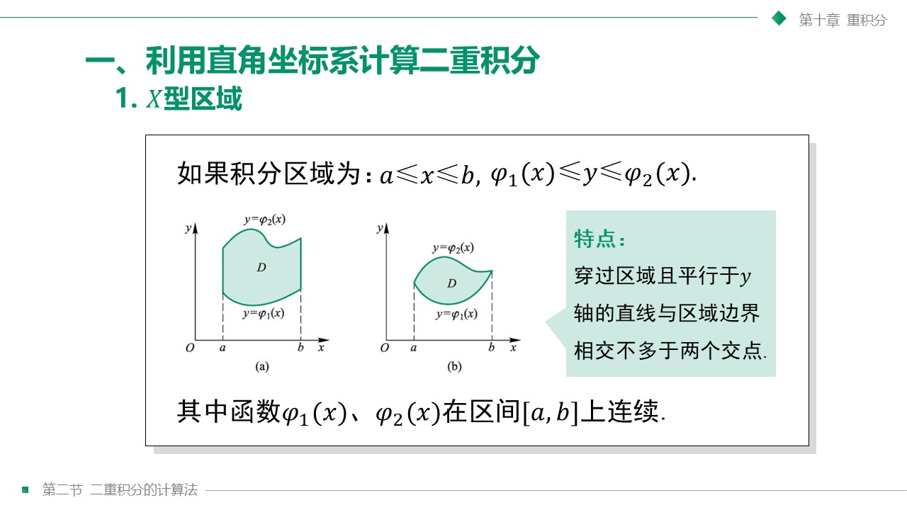

* **X 型区域**（左右是常数，上下是函数 $y_1(x) \le y \le y_2(x)$）：
  $$
  I = \int_a^b dx \int_{y_1(x)}^{y_2(x)} f(x, y) dy
  $$
* **Y 型区域**（上下是常数，左右是函数 $x_1(y) \le x \le x_2(y)$）：
  $$
  I = \int_c^d dy \int_{x_1(y)}^{x_2(y)} f(x, y) dx
  $$

> [!TIP]
> **🌟 积分限确定的“穿线口诀”**
> 
> 以 X 型积分为例：
> 1. 先定外层积分限 $x \in [a, b]$，这是积分区域在 $x$ 轴上的投影区间；
> 2. 在外层限内，沿 $y$ 轴正方向**穿一条射线（画一条竖线）**；
> 3. 射线与区域的**下边界**相交处的函数作为内层下限 $y_1(x)$；
> 4. 射线与区域的**上边界**相交处的函数作为内层上限 $y_2(x)$。

---

#### 💡 【🔥 难点突破·即时例题 2】（交换积分次序求解积不出式）

> [!NOTE]
> 📌 **课件标准真题（直角坐标系次序交换）**
> 
> 计算二重积分 $I = \iint_D e^{y^2} dxdy$，其中积分区域 $D$ 是由直线 $y=x$, $x=0$, $y=1$ 围成的三角形闭区域。

* **解析步骤**：
  1. **分析被积函数与求导障碍**：
     被积函数为 $e^{y^2}$。如果在 $y$ 方向上先积分，由于其没有初等原函数，积分无法算下去，**必须交换积分次序**，即先对 $x$ 积分。
  2. **写出当前区域的 Y型 不等式描述**：
     $$
     D = \{(x, y) \vert 0 \le y \le 1, \ 0 \le x \le y\}
     $$
  3. **交换为 X型 描述（外层关于 $x$ 积分）**：
     * 画出直线 $y=x, x=0, y=1$。
     * $x$ 的投影范围为 $x \in [0, 1]$；
     * 沿 $y$ 轴正向穿一条线，下边界为 $y=x$，上边界为 $y=1$。
     * 如果写为先对 $y$ 积分的累次积分（X 型）：
       $$
       I = \int_0^1 dx \int_x^1 e^{y^2} dy
       $$
       由于被积函数 $e^{y^2}$ 关于 $y$ 的原函数非初等函数，此积分无法直接计算。因此，必须将区域 $D$ 表示为 Y 型（先对 $x$ 积分）：外层积分限为 $y \in [0, 1]$，内层射线由左边界 $x=0$ 穿入，到右边界 $x=y$ 穿出。改写后的累次积分为：
       $$
       I = \int_0^1 dy \int_0^y e^{y^2} dx
       $$
  4. **计算积分**：
     先计算内层关于 $x$ 的积分：
     $$
     \int_0^y e^{y^2} dx = e^{y^2} [x]_0^y = y e^{y^2}
     $$
     再计算外层关于 $y$ 的积分（凑微分法）：
     $$
     I = \int_0^1 y e^{y^2} dy = \frac{1}{2} \int_0^1 e^{y^2} d(y^2) = \frac{1}{2} \left[ e^{y^2} \right]_0^1 = \frac{1}{2}(e - 1)
     $$
     所求积分值为 **$\frac{1}{2}(e - 1)$**。

---

### 三, 二重积分极坐标系下的计算（10.2）

当积分区域 $D$ 是圆、圆环，或者被积函数中含有 $x^2+y^2$ 时，应果断改用极坐标。

#### 1. 极坐标代换与面积元素

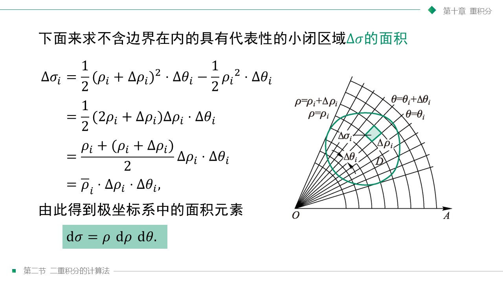

* **坐标代换**： $x = \rho \cos\theta, y = \rho \sin\theta$。
* **面积微元雅可比因子**： $dA = \rho d\rho d\theta$ （如上课件图示推导，**绝对不能漏掉 $\rho$**）。

#### 2. 偏心圆极坐标方程表示（期末最爱考点）
* 圆心在 $(R, 0)$，半径为 $R$ 的圆（$x^2+y^2 \le 2Rx$）：极坐标方程为 **$\rho = 2R \cos\theta$**，极角范围为 $\theta \in \left[-\frac{\pi}{2}, \frac{\pi}{2}\right]$。

---

#### 💡 【🔥 难点突破·即时例题 3】（直角坐标系转化为极坐标系计算）

**【期末经典真题】** 计算二重积分 $I = \iint_D \frac{1}{1+x^2+y^2} dxdy$，其中积分区域 $D = \{(x, y) \vert x^2 + y^2 \le 1\}$。

**【解析步骤】**
1. **分析并选择坐标系**：
   * 积分区域 $D$ 是圆域 $x^2 + y^2 \le 1$。
   * 被积函数中含有 $x^2 + y^2$。
   * 因此，直接在直角坐标系下计算非常困难，极适合转化为极坐标系计算。
2. **确定极坐标范围**：
   * 极坐标代换公式为： $x = \rho\cos\theta, y = \rho\sin\theta$。
   * 面积元素为： $dxdy = \rho d\rho d\theta$。
   * 圆域 $D$ 的极坐标描述为：
     $$
     0 \le \theta \le 2\pi, \quad 0 \le \rho \le 1
     $$
3. **代入公式转化为累次积分**：
   被积函数中的 $x^2 + y^2 = \rho^2$。将 $dxdy = \rho d\rho d\theta$ 代入，得到：
   $$
   I = \iint_D \frac{1}{1+x^2+y^2} dxdy = \int_0^{2\pi} d\theta \int_0^1 \frac{\rho}{1+\rho^2} d\rho
   $$
4. **分步计算累次积分**：
   * **第一步：计算内层关于 $\rho$ 的积分（使用凑微分法）**：
     $$
     \int_0^1 \frac{\rho}{1+\rho^2} d\rho = \frac{1}{2} \int_0^1 \frac{d(1+\rho^2)}{1+\rho^2} = \frac{1}{2} \left[ \ln(1+\rho^2) \right]_0^1
     $$
     $$
     = \frac{1}{2} (\ln 2 - \ln 1) = \frac{1}{2} \ln 2
     $$
   * **第二步：计算外层关于 $\theta$ 的积分**：
     $$
     I = \int_0^{2\pi} \frac{1}{2} \ln 2 \, d\theta = \frac{1}{2} \ln 2 \cdot [\theta]_0^{2\pi} = \frac{1}{2} \ln 2 \cdot 2\pi = \pi \ln 2
     $$
   所求积分值为 **$\pi \ln 2$**。

---

### 四, 三重积分直角坐标系下的计算（10.3）

三重积分是空间立体上的积分。根据立体的几何特征，主要有直角坐标系下的两种计算法：

#### 1. 投影法（先单后双法 / “先 z 后 x,y”）

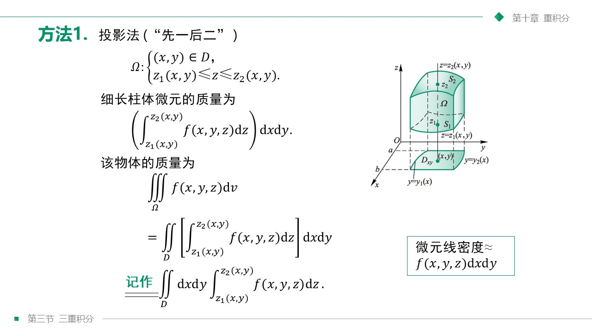

* **适用场景**：立体 $\Omega$ 具有明确的上曲面 $z=z_2(x, y)$ and 下曲面 $z=z_1(x, y)$，且在 $xOy$ 面上的投影区域 $D_{xy}$ 非常规整（如上课件图示所示）。
* **计算公式**：
  $$
  \iiint_{\Omega} f(x, y, z) dV = \iint_{D_{xy}} dxdy \int_{z_1(x, y)}^{z_2(x, y)} f(x, y, z) dz
  $$

#### 2. 截面法（先双后单法 / “先 x,y 后 z”）
* **适用场景**：立体 $\Omega$ 是绕 $z$ 轴的旋转体，或者被积函数只含有变量 $z$。用水平面 $z$ 去截立体得到的截面 $D_z$ 是规整的圆形或环形。
* **计算公式**：
  $$
  \iiint_{\Omega} f(x, y, z) dV = \int_{c}^{d} dz \iint_{D_z} f(x, y, z) dxdy
  $$

---

#### 💡 【🔥 难点突破·即时例题 4】（截面法旋转体的高效求解）

> [!NOTE]
> 📌 **课件标准真题（三重积分先双后单法）**
> 
> 计算三重积分 $I = \iiint_{\Omega} z^2 dV$，其中积分区域 $\Omega$ 是由圆锥 $x^2 + y^2 \le z^2$ 及平面 $z = 1$ 所围成的锥体区域。

* **解析步骤**：
  1. **选择最简积分方法**：
     由于被积函数为 $z^2$，且立体 $\Omega$ 绕 $z$ 轴对称旋转。我们若采用水平面 $z$ 对立体截片，其截面 $D_z$ 显然是一个圆盘。因此，采用**截面法（先双后单）**最简便。
  2. **确定 $z$ 的范围与截面 $D_z$ 方程**：
     * $z$ 轴方向上高度范围显然为 $z \in [0, 1]$。
     * 对于任意固定的 $z \in [0, 1]$，截面圆盘为 $D_z: x^2 + y^2 \le z^2$，其半径为 $z$。
  3. **列出累次积分并积分求解**：
     $$
     I = \int_0^1 dz \iint_{D_z} z^2 dxdy
     $$
     因为在 $D_z$ 截面上 $z^2$ 是常数，可直接提取到二重积分符号外：
     $$
     \iint_{D_z} z^2 dxdy = z^2 \iint_{D_z} 1 dxdy = z^2 \cdot \text{Area}(D_z)
     $$
     圆盘面积 $\text{Area}(D_z) = \pi R^2 = \pi z^2$。代入得：
     $$
     I = \int_0^1 z^2 \cdot \pi z^2 dz = \pi \int_0^1 z^4 dz = \pi \left[ \frac{z^5}{5} \right]_0^1 = \frac{\pi}{5}
     $$
     所求三重积分为 **$\frac{\pi}{5}$**。

---

### 五, 三重积分柱面与球面坐标系下的计算（10.3，非大题核心考点，简略了解）

#### 1. 柱面坐标系（直角坐标与空间极坐标的结合）
柱面坐标系实际上是在 $xOy$ 平面上使用极坐标，而在 $z$ 轴方向上仍保留直角坐标。
* **坐标代换关系**：
  $$
  x = \rho \cos\theta, \quad y = \rho \sin\theta, \quad z = z
  $$
  其中 $\rho \ge 0, \ 0 \le \theta \le 2\pi$。
* **体积元素**：
  $$
  dV = \rho d\rho d\theta dz
  $$
* **转化公式**：
  $$
  \iiint_{\Omega} f(x, y, z) dV = \iiint_{\Omega'} f(\rho \cos\theta, \rho \sin\theta, z) \rho dz d\rho d\theta
  $$
  若积分区域 $\Omega$ 在柱面坐标系下可表示为 $\{(\rho, \theta, z) \vert \alpha \le \theta \le \beta, \ g_1(\theta) \le \rho \le g_2(\theta), \ z_1(\rho, \theta) \le z \le z_2(\rho, \theta)\}$，则写为累次积分：
  $$
  \iiint_{\Omega} f(x, y, z) dV = \int_{\alpha}^{\beta} d\theta \int_{g_1(\theta)}^{g_2(\theta)} \rho d\rho \int_{z_1(\rho, \theta)}^{z_2(\rho, \theta)} f(\rho \cos\theta, \rho \sin\theta, z) dz
  $$

#### 2. 球面坐标系（空间极坐标系）
球面坐标系直接用点到原点的距离 $r$、与 $z$ 轴正向夹角 $\varphi$（极角）、在 $xOy$ 面投影的极角 $\theta$（方位角）来定位。
* **坐标代换关系**：
  $$
  x = r \sin\varphi \cos\theta, \quad y = r \sin\varphi \sin\theta, \quad z = r \cos\varphi
  $$
  其中 $r \ge 0, \ 0 \le \theta \le 2\pi, \ 0 \le \varphi \le \pi$。
* **体积元素**：
  $$
  dV = r^2 \sin\varphi \, dr d\theta d\varphi \quad (\text{注意含有雅可比因子 } r^2 \sin\varphi)
  $$
* **转化公式**：
  $$
  \iiint_{\Omega} f(x, y, z) dV = \iiint_{\Omega''} f(r \sin\varphi \cos\theta, r \sin\varphi \sin\theta, r \cos\varphi) r^2 \sin\varphi \, dr d\theta d\varphi
  $$
  若积分区域 $\Omega$ 在球面坐标系下可表示为 $\{(r, \theta, \varphi) \vert \alpha \le \theta \le \beta, \ \gamma \le \varphi \le \psi, \ r_1(\theta, \varphi) \le r \le r_2(\theta, \varphi)\}$，则写为累次积分：
  $$
  \iiint_{\Omega} f(x, y, z) dV = \int_{\alpha}^{\beta} d\theta \int_{\gamma}^{\psi} \sin\varphi d\varphi \int_{r_1(\theta, \varphi)}^{r_2(\theta, \varphi)} f(r \sin\varphi \cos\theta, r \sin\varphi \sin\theta, r \cos\varphi) r^2 dr
  $$

### 六, 重积分在几何学上的应用（10.4，非大题核心考点，简略了解）

#### 1. 空间光滑曲面的面积计算
设空间曲面由显式方程 $z = z(x, y)$ 给出，它在 $xOy$ 面上的投影区域为 $D_{xy}$：
* **面积公式**：
  $$S = \iint_{D_{xy}} \sqrt{1 + z_x^2 + z_y^2} dxdy$$

## 高数期末复习冲刺宝典：第十一章 曲线积分（第一、二节）

#### 🎯 本章考点清单

* **计算题**：
  - [x] **对坐标的曲线积分（第二类曲线积分）的计算** —— 掌握第二类曲线积分的代入法计算，注意曲线的方向性对积分值正负号的影响。

### 一, 对弧长的曲线积分（11.1，第一类曲线积分，非核心大题，简略了解）

#### 1. 概念与公式
* **对称性秒杀**：第一类曲线积分关于对称区间被积函数的奇偶性具有对称性（奇为0，偶为双倍）。
* **计算公式**：
  * **直角坐标** ($y = y(x)$): $I = \int_a^b f(x, y(x)) \sqrt{1 + (y')^2} dx$
  * **参数方程** ($x = x(t), y = y(t)$): $I = \int_{t_1}^{t_2} f(x(t), y(t)) \sqrt{(x')^2 + (y')^2} dt$
  * **极坐标** ($\rho = \rho(\theta)$): $I = \int_\alpha^\beta f(\rho\cos\theta, \rho\sin\theta) \sqrt{\rho^2 + (\rho')^2} d\theta$
  * **注意**：积分限方向**必须从小到大**，即 $a < b$, $t_1 < t_2$.

---

### 二, 对坐标的曲线积分（11.2，第二类曲线积分）

#### 1. 概念与有向方向性

对坐标的曲线积分，其物理背景是求一个**质点在变力场中沿有向曲线运动时力所做的功**。由于做功与方向有关，这类积分具有极强的**方向性**。

* **定义**：设 $L$ 为平面内从点 $A$ 到点 $B$ 的一条**有向**光滑曲线弧。函数 $P(x, y)$ 在 $L$ 上有界。将 $L$ 沿方向分成 $n$ 个有向小弧段。设第 $i$ 个小弧段在 $x$ 轴上的投影长度为 $\Delta x_i = x_i - x_{i-1}$。任取点 $(\xi_i, \eta_i)$，若极限
  $$
  \lim_{\lambda \to 0} \sum_{i=1}^n P(\xi_i, \eta_i) \Delta x_i
  $$
  存在，则称此极限为函数 $P(x, y)$ 在有向曲线弧 $L$ 上**对坐标 $x$ 的曲线积分**，记作：
  $$
  \int_L P(x, y) dx
  $$
  同理，对坐标 $y$ 的曲线积分为 $\int_L Q(x, y) dy$。
* **组合形式**：实际大题中，通常以组合形式出现：
  $$
  \int_L P(x, y) dx + Q(x, y) dy
  $$

---

#### 2. 核心性质：变号性与分段可加性（期末必考点）

第二类曲线积分具有以下两个极其重要的代数性质：

* **性质1（方向变号性）**：第二类曲线积分与积分路径的方向紧密相关。如果将积分弧段的方向反向（记为 $L^-$），则积分值必须变号：
  $$
  \int_{L^-} P dx + Q dy = -\int_L P dx + Q dy
  $$
* **性质2（分段可加性）**：若有向光滑曲线弧 $L$ 是由首尾相接的若干段有向光滑弧 $L_1, L_2, \dots, L_k$ 组成，则：
  $$
  \int_L P dx + Q dy = \sum_{j=1}^k \int_{L_j} P dx + Q dy
  $$
  *(例如，若积分路径为折线段或分段光滑曲线，可以直接分段求定积分后相加，这在多路径计算中极其常用！)*

---

#### 3. 计算方法公式汇总

第二类曲线积分的计算同样需要进行参数化，但有两点与第一类有本质区别：
1. **积分限方向**：积分限下限必须是**起点**参数，上限必须是**终点**参数。不要求下限小于上限！
2. **微分代换**：微分元素 $dx, dy$ 分别直接代换为 $x'(t)dt, y'(t)dt$，**不含有根号**！

##### (1) 参数方程形式
若有向曲线 $L$ 的参数方程为 $\begin{cases} x = x(t) \\ y = y(t) \end{cases}$，且当参数 $t$ 从起点值 $\alpha$ 变到终点值 $\beta$ 时，点 $(x(t), y(t))$ 正好描出曲线的方向，则：
$$
\int_L P(x, y) dx + Q(x, y) dy = \int_{\alpha}^{\beta} [P(x(t), y(t)) x'(t) + Q(x(t), y(t)) y'(t)] dt
$$

##### (2) 直角坐标方程形式
若有向曲线 $L$ 的直角坐标方程为 $y = y(x)$，且起点 $A$ 的横坐标为 $x_A$，终点 $B$ 的横坐标为 $x_B$，则 $dy = y'(x)dx$，计算公式为：
$$
\int_L P(x, y) dx + Q(x, y) dy = \int_{x_A}^{x_B} [P(x, y(x)) + Q(x, y(x)) y'(x)] dx
$$

##### (3) 空间曲线形式
若空间有向曲线 $\Gamma$ 的参数方程为 $\begin{cases} x = x(t) \\ y = y(t) \\ z = z(t) \end{cases}$，起点对应 $t=\alpha$，终点对应 $t=\beta$，则：
$$
\int_{\Gamma} P dx + Q dy + R dz = \int_{\alpha}^{\beta} [P x'(t) + Q y'(t) + R z'(t)] dt
$$

---

#### 💡 【🔥 难点突破·即时例题】

##### 📌 例题 4（被积函数相同，路径不同导致结果不同——路径依赖性剖析）
计算曲线积分 $I = \int_L y^2 dx + x^2 dy$，其中起点为 $A(0,0)$，终点为 $B(1,1)$。请分别沿以下三条不同的路径进行计算：
1. 路径 $L_1$：沿直线段 $y = x$。
2. 路径 $L_2$：沿抛物线 $y = x^2$。
3. 路径 $L_3$：沿折线段 $A(0,0) \to C(1,0) \to B(1,1)$。

* **解析步骤**：
  1. **沿路径 $L_1$ 计算**：
     曲线方程为 $y = x$，则 $dy = dx$。
     横坐标 $x$ 的起点为 $0$，终点为 $1$，故积分限为 $x \in [0, 1]$：
     $$
     I_1 = \int_0^1 [x^2 + x^2 (1)] dx = \int_0^1 2x^2 dx = \left[ \frac{2}{3}x^3 \right]_0^1 = \frac{2}{3}
     $$
  2. **沿路径 $L_2$ 计算**：
     曲线方程为 $y = x^2$，则 $dy = 2x dx$。
     代入积分式，积分限仍为 $x \in [0, 1]$：
     $$
     I_2 = \int_0^1 [(x^2)^2 + x^2 (2x)] dx = \int_0^1 (x^4 + 2x^3) dx = \left[ \frac{1}{5}x^5 + \frac{1}{2}x^4 \right]_0^1 = \frac{1}{5} + \frac{1}{2} = \frac{7}{10}
     $$
  3. **沿折线路径 $L_3$ 分段计算**：
     折线由两段直线构成，需分别积分后相加：
     * **段 $L_{AC}$**（从 $(0,0)$ 到 $(1,0)$）：
       此段上 $y = 0 \implies dy = 0$。 $x$ 从 $0$ 变到 $1$：
       $$
       \int_{L_{AC}} y^2 dx + x^2 dy = \int_0^1 (0^2 dx + x^2 \cdot 0) = 0
       $$
     * **段 $L_{CB}$**（从 $(1,0)$ 到 $(1,1)$）：
       此段上 $x = 1 \implies dx = 0$。 $y$ 从 $0$ 变到 $1$：
       $$
       \int_{L_{CB}} y^2 dx + x^2 dy = \int_0^1 (y^2 \cdot 0 + 1^2 dy) = \int_0^1 1 dy = 1
       $$
     * **求和**：
       $$
       I_3 = \int_{L_{AC}} + \int_{L_{CB}} = 0 + 1 = 1
       $$
  
  * **深度考点总结**：
    计算发现：$I_1 = \frac{2}{3}$， $I_2 = \frac{7}{10}$， $I_3 = 1$。这说明对于一般的被积函数，**第二类曲线积分的值不仅与起点和终点有关，还与积分所沿的路径密切相关**。*(只有在某些特殊条件下，积分才与路径无关，这将在后两节的格林公式与曲线积分与路径无关定理中重点考查)*。

---

### 三, 两类曲线积分之间的联系（非核心大题，简略了解）

#### 1. 联系定理
设 $L$ 是平面上的光滑有向曲线， $\vec{\tau} = (\cos\alpha, \cos\beta)$ 是 $L$ 的切向量单位方向，则：
$$\int_L P dx + Q dy = \int_L (P \cos\alpha + Q \cos\beta) ds$$

## 高数第十二章《无穷级数》前三节期末复习冲刺宝典

#### 🎯 本章考点清单

* **选择题**：
  - [x] **判断级数的敛散性** —— 掌握常数项级数的基本性质、交错级数的 Leibniz 判别法，以及绝对收敛与条件收敛的包含关系。
* **计算题**：
  - [x] **利用 p 级数进行比较审敛** —— 掌握正项级数的比较审敛法（特别是极限形式），利用展开形式的 $p$-级数作为基准级数进行判定。

### 一、 常数项级数的概念和性质（12.1）

#### 1. 常数项级数的概念
给定一个数列 $u_1, u_2, \dots, u_n, \dots$，将其依次相加：
$$\sum_{n=1}^{\infty} u_n = u_1 + u_2 + \dots + u_n + \dots$$
称其为**常数项无穷级数**，简称级数。其中 $u_n$ 称为级数的一般项。
* **部分和 (Partial Sum)**：级数前 $n$ 项的和记为 $S_n$：
  $$S_n = \sum_{i=1}^{n} u_i = u_1 + u_2 + \dots + u_n$$
* **敛散性定义**：若部分和数列 $\{S_n\}$ 的极限存在且为有限数 $S$，即 $\lim_{n\to\infty} S_n = S$，则称级数**收敛**，其和为 $S$，记作 $\sum_{n=1}^{\infty} u_n = S$；若极限不存在，则称级数**发散**。
* **余项 (Remainder)**：级数收敛时，前 $n$ 项和与总和的差值 $r_n = S - S_n = u_{n+1} + u_{n+2} + \dots$ 称为余项，且必有 $\lim_{n\to\infty} r_n = 0$。

---

##### 🌟 核心考点一：拆项相消求和法（Slide 11-13）

**【做题秘籍】**：如果级数的一般项分子为常数，分母可以因式分解为两项之积，通常采用**拆项相消法**，将中间的项消去，直接求出部分和 $S_n$ 的闭合表达式，进而求极限。

**【经典课件原题】** 判定级数 $\sum_{n=1}^{\infty} \frac{1}{n(n+2)}$ 的敛散性，若收敛求其和。

**【解析步骤】**
1. **拆分一般项**：
   $$u_n = \frac{1}{n(n+2)} = \frac{1}{2} \left( \frac{1}{n} - \frac{1}{n+2} \right)$$
2. **写出部分和 $S_n$ 展开式**（注意前后消去项的规律）：
   $$
   \begin{aligned}
   S_n &= \frac{1}{2} \left[ \left(1 - \frac{1}{3}\right) + \left(\frac{1}{2} - \frac{1}{4}\right) + \left(\frac{1}{3} - \frac{1}{5}\right) + \dots + \left(\frac{1}{n-1} - \frac{1}{n+1}\right) + \left(\frac{1}{n} - \frac{1}{n+2}\right) \right] \\
   &= \frac{1}{2} \left[ 1 + \frac{1}{2} - \frac{1}{n+1} - \frac{1}{n+2} \right]
   \end{aligned}
   $$
3. **求极限**：
   $$\lim_{n\to\infty} S_n = \lim_{n\to\infty} \frac{1}{2} \left( \frac{3}{2} - \frac{1}{n+1} - \frac{1}{n+2} \right) = \frac{3}{4}$$
   **【结论】** 级数收敛，其和为 $\frac{3}{4}$。

---

#### 2. 无穷级数的基本性质

* **性质 1（线性性）**：若级数 $\sum u_n$ 收敛于 $S$，则各项乘以常数 $c$ 的级数 $\sum c u_n$ 也收敛，且其和为 $c S$。
  > [!TIP] 💡 线性敛散不变性
  > 级数各项乘以一个非零常数后，其敛散性保持不变。
* **性质 2（逐项相加减）**：设 $\sum u_n = S_1$，$\sum v_n = S_2$ 均收敛，则级数 $\sum (u_n \pm v_n)$ 也收敛，且其和为 $S_1 \pm S_2$。
  > [!WARNING] ⚠️ 敛散叠加的经典雷区（期末填空极高频）
  > 1. **收敛 + 收敛 = 收敛**（成立，和可加）
  > 2. **收敛 + 发散 = 发散**（成立，可用反证法证明）
  > 3. **发散 + 发散 = 不确定**（例如：$\sum \frac{1}{n}$ 与 $\sum \left(-\frac{1}{n}\right)$ 均发散，但相加后为零级数，显然收敛）。
* **性质 3（有限项无关性）**：在级数中加上、去掉或改变有限项，**不会影响级数的敛散性**（但当级数收敛时，通常会改变其和）。
* **性质 4（加括号性质）**：
  * 若级数 $\sum u_n$ 收敛，则对其任意加括号后得到的新级数仍收敛，且和不变。
  * **逆否命题（秒杀推论）**：**若加括号后的新级数发散，则原级数必发散！**
  * ⚠️ **反向雷区**：收敛级数去括号后不一定收敛（例如：$(1-1)+(1-1)+\dots$ 收敛于 0，去括号后变成 $1-1+1-1+\dots$ 发散）。

---

#### 3. 级数收敛的必要条件（★ 极其重要）

$$\text{若级数 } \sum_{n=1}^{\infty} u_n \text{ 收敛} \implies \lim_{n\to\infty} u_n = 0$$

* **逆否命题（最实用判定法）**：**若 $\lim_{n\to\infty} u_n \neq 0$（或极限不存在），则级数必发散！**
  - 例如级数 $\sum_{n=1}^{\infty} \frac{n}{n+1}$，由于 $\lim_{n\to\infty} \frac{n}{n+1} = 1 \neq 0$，故该级数必定发散。
* **必要性雷区**：一般项趋于 0 **不是**级数收敛的充分条件。
  - **经典反例：调和级数 (Harmonic Series)**：
    $$\sum_{n=1}^{\infty} \frac{1}{n} = 1 + \frac{1}{2} + \frac{1}{3} + \dots$$
    虽然一般项极限 $\lim_{n\to\infty} \frac{1}{n} = 0$，但该级数是**发散**的。（课件 Slide 21 给出了完美的反证法证明，考试可直接引用调和级数发散的结论作为比较基准）。

---

### 二、 常数项级数的审敛法（12.2）

#### 1. 正项级数及其审敛法（一般项 $u_n \ge 0$）

> [!IMPORTANT] 🚨 正项级数收敛的充要条件
> 正项级数 $\sum u_n$ 收敛的充分必要条件是：其部分和数列 $\{S_n\}$ 有界（定理 1）。因为正项级数的部分和数列显然是单调递增的，根据单调有界原理即证。

---

##### 判定方法一：比较审敛法（定理 2）与极限形式（定理 3）
设 $\sum u_n$ 和 $\sum v_n$ 是两个正项级数：
* **代数比较法**：已知 $u_n \le v_n$ 对一切 $n$ 成立：
  - 若 $\sum v_n$ 收敛 $\implies \sum u_n$ 收敛（强收敛则弱收敛）；
  - 若 $\sum u_n$ 发散 $\implies \sum v_n$ 发散（弱发散则强发散）。
* **极限比较法（最常用，定理 3）**：设 $\lim_{n\to\infty} \frac{u_n}{v_n} = l$：
  - 当 $0 < l < \infty$ 时：两级数具有**完全相同的敛散性**（同收敛或同发散）。
  - 当 $l = 0$ 时：若 $\sum v_n$ 收敛 $\implies \sum u_n$ 收敛。
  - 当 $l = \infty$ 时：若 $\sum v_n$ 发散 $\implies \sum u_n$ 发散。

> [!TIP] 💡 极限比较法的本质
> 极限比较法实质上是比较两级数一般项作为 $n \to \infty$ 时**无穷小的同阶性**。若为同阶无穷小，则敛散性相同。
> **基准比较级数首选**：
> 1. **等比级数（几何级数）** $\sum q^n$（当 $\vert q \vert < 1$ 时收敛）。
> 2. **$p$-级数** $1 + \frac{1}{2^p} + \frac{1}{3^p} + \dots + \frac{1}{n^p} + \dots$（当 $p > 1$ 时收敛， $p \le 1$ 时发散）。

##### 🌟 核心考点二：利用 p 级数进行比较审敛（期末计算大题）

**【期末经典真题】** 判定级数 $\sum_{n=1}^{\infty} \frac{1}{2n^2 + n + 1}$ 的敛散性。

**【解析步骤】**
1. **分析一般项的渐近行为**：
   对于正项级数，其一般项为 $u_n = \frac{1}{2n^2 + n + 1} > 0$。
   当 $n \to \infty$ 时，分母的主导项为 $2n^2$，因此其无穷小阶数与 $\frac{1}{n^2}$ 相同。
2. **选择比较的基准 p 级数**：
   选择 $v_n = \frac{1}{n^2}$ 作为比较对象。
   已知 $p$-级数 $1 + \frac{1}{2^2} + \frac{1}{3^2} + \dots + \frac{1}{n^2} + \dots$ 的 $p = 2 > 1$，因而**收敛**。
3. **方法一：使用比较审敛法的极限形式（极限比较法，推荐）**：
   计算比值的极限：
   $$
   l = \lim_{n\to\infty} \frac{u_n}{v_n} = \lim_{n\to\infty} \frac{\frac{1}{2n^2 + n + 1}}{\frac{1}{n^2}} = \lim_{n\to\infty} \frac{n^2}{2n^2 + n + 1} = \frac{1}{2}
   $$
   由于 $l = \frac{1}{2}$ 是一个非零常数（$0 < l < \infty$），根据比较审敛法的极限形式，级数 $\sum_{n=1}^{\infty} \frac{1}{2n^2 + n + 1}$ 与 $\sum_{n=1}^{\infty} \frac{1}{n^2}$ 具有完全相同的敛散性。
   因为 $\sum_{n=1}^{\infty} \frac{1}{n^2}$ 收敛，故原级数**收敛**。
4. **方法二：使用比较审敛法的直接形式（直接比较法）**：
   对于一切 $n \ge 1$，分母满足：
   $$
   2n^2 + n + 1 > n^2 \implies 0 < \frac{1}{2n^2 + n + 1} < \frac{1}{n^2}
   $$
   因为比较的大级数 $\sum_{n=1}^{\infty} \frac{1}{n^2}$ 收敛，根据比较审敛法，较小的正项级数 $\sum_{n=1}^{\infty} \frac{1}{2n^2 + n + 1}$ 必**收敛**。

---

---

##### 判定方法二：比值审敛法（D'Alembert 达朗贝尔判别法，定理 4）
设 $\sum u_n$ 为正项级数，且 $\lim_{n\to\infty} \frac{u_{n+1}}{u_n} = \rho$：
* 当 $\rho < 1$ 时，级数收敛；
* 当 $\rho > 1$（或 $\rho = \infty$）时，级数发散；
* 当 $\rho = 1$ 时，失效（需要改用比较法）。例如 $p$-级数 $1 + \frac{1}{2^2} + \frac{1}{3^2} + \dots + \frac{1}{n^2} + \dots$ 与调和级数 $1 + \frac{1}{2} + \frac{1}{3} + \dots + \frac{1}{n} + \dots$ 的比值极限均为 1，但前者收敛，后者发散。

> [!TIP] 💡 比值法的首选场景
> 当一般项 $u_n$ 中含有**阶乘（如 $n!$）**或**指数函数（如 $a^n$）**时，比值法是绝对的第一首选，因为相邻项比值可以直接发生剧烈约分！

---

##### 🌟 核心考点三：比值审敛法与误差估计（Slide 21-23）

**【经典课件原题】** 讨论级数 $\sum_{n=1}^{\infty} \frac{n}{2^n}$ 的敛散性，并估计以级数的前 $n$ 项部分和 $S_n$ 近似代替总和 $S$ 时产生的误差。

**【详细解析步骤】**
1. **比值判定**：
   一般项 $u_n = \frac{n}{2^n} > 0$，为正项级数。
   $$\rho = \lim_{n\to\infty} \frac{u_{n+1}}{u_n} = \lim_{n\to\infty} \frac{n+1}{2^{n+1}} \cdot \frac{2^n}{n} = \lim_{n\to\infty} \frac{1}{2} \left( 1 + \frac{1}{n} \right) = \frac{1}{2}$$
   由于 $\rho = \frac{1}{2} < 1$，由比值审敛法可知**级数收敛**。

2. **误差估计（余项估计）**：
   用前 $n$ 项和 $S_n$ 代替总和 $S$ 的误差即为余项 $r_n$：
   $$r_n = S - S_n = u_{n+1} + u_{n+2} + u_{n+3} + \dots = \frac{n+1}{2^{n+1}} + \frac{n+2}{2^{n+2}} + \frac{n+3}{2^{n+3}} + \dots$$
   为了缩放求和，我们放大系数：对于所有 $k \ge 1$，有 $n+k \le n(k+1)$（或直接放大系数为几何级数）：
   $$
   \begin{aligned}
   r_n &= \frac{1}{2^n} \left[ \frac{n+1}{2^1} + \frac{n+2}{2^2} + \frac{n+3}{2^3} + \dots \right] \\
   &< \frac{1}{2^n} \left[ \frac{n+1}{2^1} + \frac{n+1}{2^2} \cdot 2 + \dots \right] \quad (\text{课件公式推导}) \\
   &= \frac{n+2}{2^n} \quad (\text{误差上限闭合式})
   \end{aligned}
   $$

---

##### 判定方法三：根值审敛法（Cauchy 柯西判别法，定理 5）
设 $\sum u_n$ 为正项级数，若 $\lim_{n\to\infty} \sqrt[n]{u_n} = \rho$：
* 当 $\rho < 1$ 时，级数收敛；
* 当 $\rho > 1$ 时，级数发散；
* 当 $\rho = 1$ 时，失效。
> [!TIP] 💡 根值法的首选场景
> 当一般项 $u_n$ 整体呈现为**整个式子的 $n$ 次幂**，如 $u_n = \left(\frac{n}{2n+1}\right)^n$ 时，根值法能够一瞬间脱去 $n$ 次方，极速化简。

---

#### 2. 交错级数及其审敛法（正负相间）

形如 $\sum_{n=1}^{\infty} (-1)^{n-1} u_n = u_1 - u_2 + u_3 - u_4 + \dots$ （其中 $u_n > 0$）的级数称为交错级数。

> [!IMPORTANT] 🚨 莱布尼茨定理 (Leibniz Test，定理 7)
> 若交错级数 $\sum_{n=1}^{\infty} (-1)^{n-1} u_n$ 满足以下两个条件：
> 1. **单调不增**：$u_n \ge u_{n+1}$ 对一切 $n$ 成立；
> 2. **一般项趋于 0**：$\lim_{n\to\infty} u_n = 0$。
> 
> 则该交错级数必**收敛**。且级数和 $S \le u_1$，其余项满足极其重要的误差估计：
> $$\vert r_n \vert = \vert S - S_n \vert \le u_{n+1}$$
> *(即：用前 $n$ 项近似代替时，所产生的误差绝对值不超过第一项被截去项的绝对值！)*

---

##### 🌟 核心考点四：交错级数收敛性判定（Slide 31）

**【经典课件原题】** 判定交错调和级数 $\sum_{n=1}^{\infty} (-1)^{n-1} \frac{1}{n}$ 的敛散性。

**【解析步骤】**
该级数为交错级数，其中 $u_n = \frac{1}{n}$：
1. **检验条件 1**：因为 $n < n+1$，所以 $u_n = \frac{1}{n} > \frac{1}{n+1} = u_{n+1}$，单调递减条件满足。
2. **检验条件 2**：$\lim_{n\to\infty} u_n = \lim_{n\to\infty} \frac{1}{n} = 0$，极限条件满足。
**【结论】** 根据莱布尼茨定理，该交错调和级数**收敛**。

---

#### 3. 绝对收敛与条件收敛

对于任意项级数 $\sum u_n$（项的符号任意）：
* **绝对收敛**：若将各项取绝对值后得到的正项级数 $\sum \vert u_n \vert$ 收敛，则称原级数 **绝对收敛**。
  - **定理 8**：若级数 $\sum \vert u_n \vert$ 收敛 $\implies$ 原级数 $\sum u_n$ 必收敛。
* **条件收敛**：若原级数 $\sum u_n$ 收敛，但取绝对值后的级数 $\sum \vert u_n \vert$ 发散，则称原级数 **条件收敛**。

> [!TIP] 💡 绝对与条件收敛判定黄金三步法
> 1. **第一步（绝对值检验）**：直接写出 $\sum \vert u_n \vert$。使用正项级数五大审敛法判定其是否收敛。若收敛，则原级数**绝对收敛**，做题结束。
> 2. **第二步（Leibniz 检验）**：若第一步判定发散，则原级数可能条件收敛或发散。使用莱布尼茨判别法验证原交错级数自身是否收敛。若收敛，则原级数**条件收敛**。
> 3. **第三步（必要条件检验）**：若 Leibniz 判别法中一般项极限不为 0，则原级数直接判定为**发散**。

---

### 三、 幂级数及其收敛性与运算简介（12.3，非期末大题核心考点，简略了解）

> [!NOTE]
> 本节内容在期末考试中不作为核心计算大题考查，仅需对幂级数的基本定义、收敛半径及性质做概念性了解。

#### 1. 幂级数及其收敛区间
* **形式**：形如 $\sum_{n=0}^{\infty} a_n x^n = a_0 + a_1 x + a_2 x^2 + \dots$ 的级数称为幂级数。
* **收敛半径 $R$ 的计算**：设 $\lim_{n\to\infty} \left\vert \frac{a_{n+1}}{a_n} \right\vert = \rho$：
  * $0 < \rho < \infty \implies R = \frac{1}{\rho}$
  * $\rho = 0 \implies R = +\infty$
  * $\rho = \infty \implies R = 0$
* **收敛区间**：开区间 $(-R, R)$。结合端点 $x = \pm R$ 的收敛性测试可得收敛域。

#### 2. 幂级数的分析运算性质
* **连续性**：和函数 $S(x)$ 在收敛域上连续。
* **逐项积分与逐项求导**：在其收敛区间 $(-R, R)$ 内可逐项求导和逐项积分，且积分与求导后新级数的收敛半径 $R$ 保持不变。
